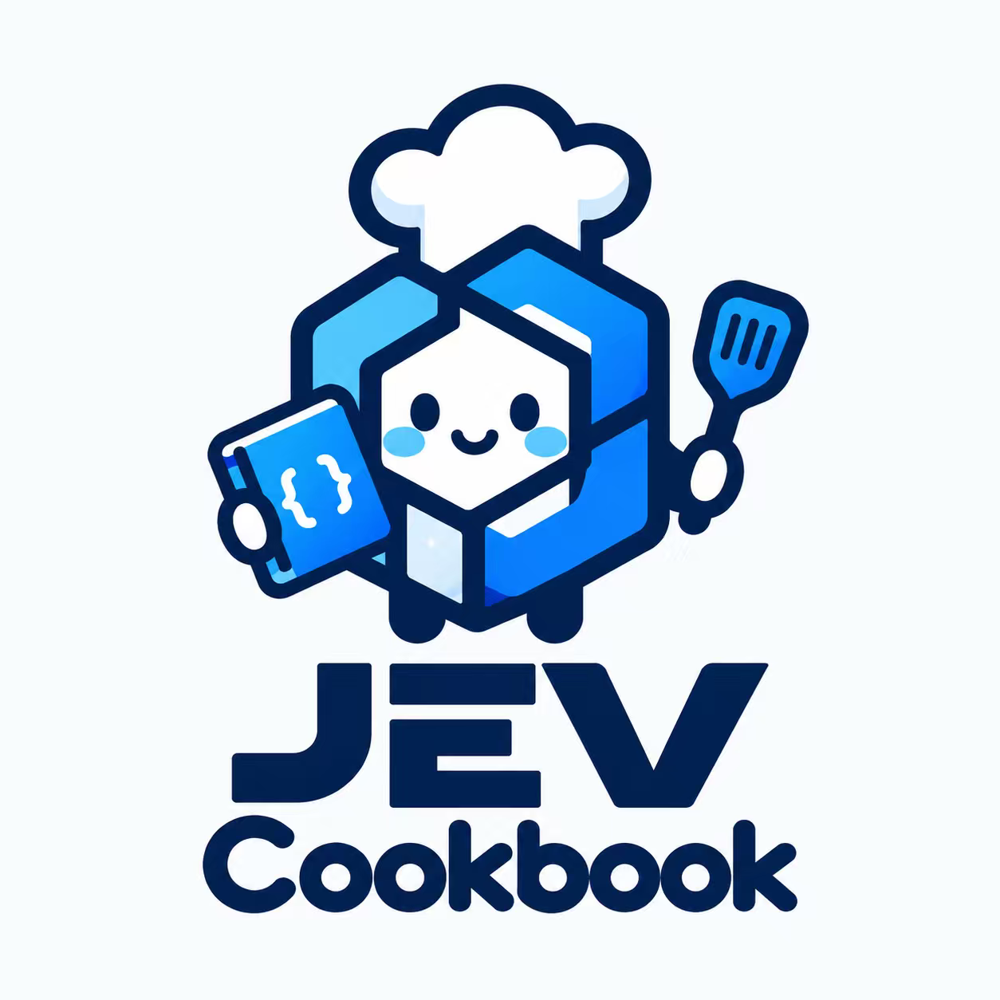

<div align="center">



# Jev Cookbook

### ⚡ 适合中国宝宝的 Jev 入门教程

手把手带你了解关于 Jev 的一切——Jupyter Notebook 轻松实验，从三种问题原语到 18 篇实战配方、语音智能家居、模型评测与本地微调，全面掌握 System One 判断模型的开发范式

[](https://github.com/datawhalechina/jev-cookbook/stargazers)
[](https://github.com/datawhalechina/jev-cookbook/network/members)
[](https://creativecommons.org/licenses/by-nc-sa/4.0/deed.zh-hans)
[](https://datawhalechina.github.io/jev-cookbook/)

</div>

## 🎯 项目介绍

大模型应用里最常见也最脆弱的一环，是把模型生成的文本**解析**回程序能用的决策——慢、贵、还会坏。System One 模型代表另一条路线：**原生输出类型化决策与校准概率**，分支、排序、路由直接交给代码。

Jev 是 TypeSafe AI 的旗舰 System One 模型：发送**状态（state）**与**类型化问题**（Choice / Score / Noul 三种原语），返回带**概率与置信度**的结构化答案——不做文本生成，无需解析。这条路线的中文教程此前几乎是空白，本项目把它补上：**十一章可运行的中文教程 + 全站文档翻译 + 500+ 文件知识库**，从入门一路打通到用 RLCD 微调一个开源同类模型（Laya）。学习愿景：从大模型的"使用者"，蜕变为判断驱动系统的"构建者"。

## 📚 快速开始

- **在线阅读**：[https://datawhalechina.github.io/jev-cookbook/](https://datawhalechina.github.io/jev-cookbook/)（官方文档中文翻译站）
- **动手学习**：克隆本仓库，进入 [`main/`](main/README.md) 运行各章 Notebook（`./setup_env.sh` 一键建环境）

**✨ 你将收获什么？**

- **零门槛入门** 不配置 API Key 也能用离线示例学完全部代码路径，配置 Key 后同一套代码直连真实模型
- **三种原语与原子问题** 掌握 Choice / Score / Noul 的提问纪律：一题只问一件事，组合交给代码
- **真实数据教学** 教程中的概率、延迟、token 与成本全部来自可复核的实测输出，人工演示数据明确标注
- **18 篇官方实战配方** 重排序、语义搜索、结构恢复、函数调用、引用核查、防护栏……每篇一本、篇尾附工程坑
- **完整应用实战** 语音驱动的 3D 智能家居（投机提示 + 串并行编排 + 成本统计）、12 个可运行游戏与应用项目
- **评测方法论** 231 道公开题四维对比（准确率/底线/Brier/ECE），无重试、无回退、预算记账的诚实评测纪律
- **本地微调全流程** 用 RLCD 微调开源同类模型 Laya：中文数据集构造 → 训练 → 本地 Jev 兼容服务
- **Agent 集成范式** 在 Pi 与 DSH 两个真实 Agent 框架里，让 Jev 在动手之前先做一次判断

## 📖 内容导航

| 章节 | 关键内容 | 状态 |
|---|---|---|
| **第一部分：入门与核心** | | |
| 第一章 认识 Jev | Jev 是什么、与 LLM 区别、三原语一次调用、场景地图、校准、赛事指挥台综合实验 | ✅ |
| 第二章 核心概念（5 册） | System One 机制、状态、原语、置信度、如何用 TypeSafe 构建 | ✅ |
| 第三章 架构模式 | 推测性扇出、置信度门控、复合评分、意图路由 | ✅ |
| **第二部分：实战与实验** | | |
| 第四章 实战指南（18 册） | 官方 Cookbook 逐篇复刻，篇尾「知识补充」 | ✅ |
| 第五章 智能家居实验 | 投机提示实测 + 内嵌 3D 应用（语音/成本统计） | ✅ |
| 第六章 模型评测 | Laya vs Jev 四维基准与评测纪律 | ✅ |
| **第三部分：研究与生态** | | |
| 第七章 实战应用 | 12 个可运行项目：游戏、闭环控制、网页智能体与应用工作流 | ✅ |
| 第八章 前沿研究 | Jev-Mem（记忆）与 JevHarness（控制流）研究快照 | ✅ |
| 第九章 Agent 集成 | Pi 工具调用 gate 判断 + DSH 决策协作复盘 | ✅ |
| 第十章 本地模型 | Laya 全流程：介绍对比、RLCD 微调、中文数据集、本地服务 | ✅ |
| 第十一章 知识库 | 21 板块快照：官方文档中译、JevBench、公众号长文 | ✅ |

### 社区贡献精选

欢迎通过 PR 投稿你的 Jev 实验与实践
### 配套资源

- **官方文档中文站**：[https://datawhalechina.github.io/jev-cookbook/](https://datawhalechina.github.io/jev-cookbook/)（非官方社区翻译，以[英文原版](https://docs.typesafe.ai)为准）
- **下一步规划**：视频讲解、WebSocket 双向流式语音、JevBench 中文扩展集

## 💡 如何学习

**目标人群**：具备基础 Python 能力、想入门「AI 对软件」开发范式的开发者、工程师与学生；不需要机器学习背景。

**前置要求**：Python ≥ 3.10、会用 Jupyter Notebook；一个 `TYPESAFE_API_KEY`（[免费注册可领](https://console.typesafe.ai/keys)，**可选**）。

**学习路径**：

- **第一部分（必修，建议按序）**：第 1→2→3 章建立原语、机制与模式的完整图景；
- **第二部分（动手）**：第 4 章挑感兴趣的配方逐篇跑，第 5 章在浏览器里说话指挥 3D 房间，第 6 章亲手跑一遍四维基准；
- **第三部分（按需深入）**：想嵌入自己的 Agent 看第 9 章；想微调本地模型看第 10 章；查证数字出处随时翻第 11 章。

各章 Notebook 均可独立运行，务必**亲手修改输入与问题措辞再重跑**——观察概率怎么变，是这套教程最有效的学法。运行细节见 [`main/README.md`](main/README.md)，维护约定见 [AGENT.md](AGENT.md)。

## 🤝 贡献与反馈

- 🐛 **报告 Bug**：[提交 Issue](https://github.com/datawhalechina/jev-cookbook/issues) 描述问题与复现步骤
- 💬 **提出建议**：新章节方向、实验选题、翻译勘误，欢迎开 Discussion / Issue 讨论
- ✍️ **完善内容**：欢迎 PR 投稿你的 Jev 实验（参考第 6 章社区投稿的完整范例），工作流见 [AGENT.md](AGENT.md)
- 🌟 **分享实践**：把你用 Jev 做出的应用投稿到第 7 章应用合集

## 🙏 致谢


| 成员 | GitHub | 负责内容 |
|---|---|---|
| 王熠明 | [Bald0Wang](https://github.com/Bald0Wang) | 项目负责人  · 基础教程 · laya部署及微调 · 部分应用实现 |
| 征达 | [lzdFeiFei](https://github.com/lzdFeiFei) | 教程作者 · 基础教程 · 部分应用实现 · pi jev应用 |
| 辅元 | [Fyuan0206](https://github.com/Fyuan0206) | 教程作者 · 基础教程 · 部分应用实现 · jev harness |
| 博辰 | [Micheal024](https://github.com/Micheal024) | 教程作者 · 基础教程 · 模型测评 |
| 荞麦 | [yeyeyeyeeeee](https://github.com/yeyeyeyeeeee) | 教程作者 · 基础教程  · jev dsh插件 |

**特别感谢** [TypeSafe AI](https://typesafe.ai) 提供优秀的官方文档与 Playground；感谢 [NanoJev](https://github.com/TianyuCodings/NanoJev)、[JevBench](https://github.com/fstandhartinger/jevbench)、[Jev-Mem](https://github.com/libingzheren/Jev-Mem) 等上游开源项目。

## ⭐ Star History

[](https://star-history.com/#datawhalechina/jev-cookbook&Date)

如果这个项目对你有帮助，欢迎点一个 Star ✨

## 📢 关注我们

<div align="left">
<a href="https://github.com/datawhalechina">

</a>
</div>

**Datawhale** 是一个专注于数据科学与 AI 领域的开源组织，汇集了众多领域院校和知名企业的优秀学习者，聚合了一群有开源精神和探索精神的团队成员。本项目将以 Datawhale 开源课程标准持续维护，欢迎加入一起学习成长。

## 🎓 引用

如果你在研究或项目中使用了本教程，欢迎引用：

```bibtex
@misc{jev_cookbook2026,
  title        = {Jev Cookbook: Jev 中文教程与知识库},
  author       = {Bald0Wang and Micheal024 and lzdFeiFei},
  year         = {2026},
  url          = {https://github.com/datawhalechina/jev-cookbook},
  note         = {TypeSafe System One 模型的中文开源教程}
}
```

## 📜 开源协议

<a rel="license" href="https://creativecommons.org/licenses/by-nc-sa/4.0/deed.zh-hans">

</a>

本仓库原创内容采用 [署名-非商业性使用-相同方式共享 4.0 国际许可协议](https://creativecommons.org/licenses/by-nc-sa/4.0/deed.zh-hans)；收录的第三方项目（jev-games、JevBench 题集、知识库快照等）版权归各自作者，按其原许可使用。
