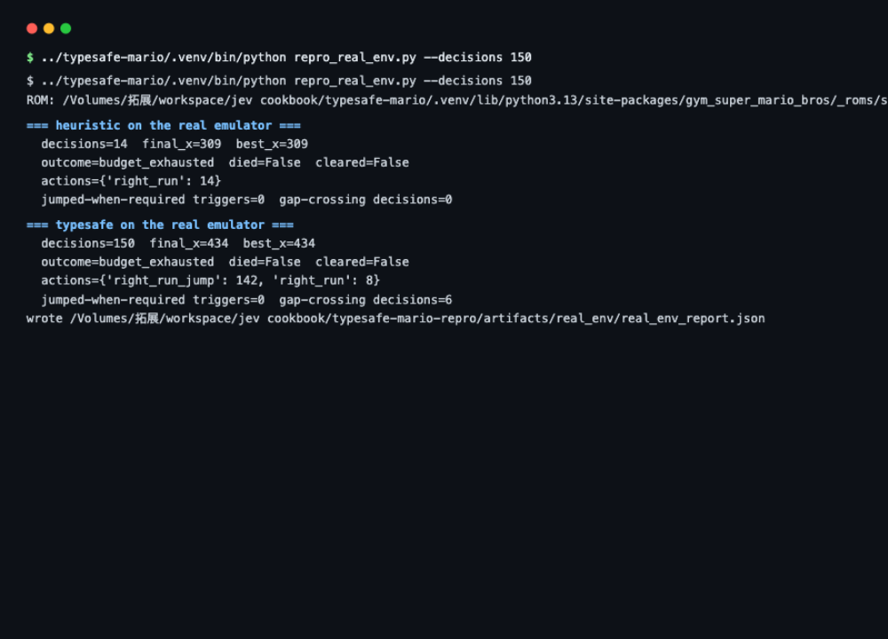

# 马里奥复现实验报告

> 这是结构版。完整的逐帧取证、所有踩过的坑和错误更正记录在
> [REPORT.md](REPORT.md)，想看细节去那边。

> **证据边界：** 本报告中的模拟器和按键执行实验在 NES 模拟器中运行，但策略判断均由本地 scripted pilot 替代，未调用真实 Jev。动作分布、置信度、胜负和距离只能说明模拟器、解析器、控制器与本地策略的行为，不能作为 Jev 能力评测。

## 1. 这是什么

上游项目 [typesafe-mario](https://github.com/fhshaik/typesafe-mario) 做的事是：
让 Jev 直接玩《超级马力欧兄弟》，但**不给它看画面**——只给它一堆从游戏内存里
读出来的数字（马力欧在哪、跑多快、前面有什么怪、地形什么样）。核心想法是：
**该算的代码算好，只让模型做判断。**

这个复现实验沿用上游模拟器闭环，并以本地 scripted pilot 替代模型请求，观察输入执行、地形解析和决策节奏如何影响闭环。这里验证的是工程链路和实验方法，不是模型本身“会不会玩”。

## 2. 实验意义

这是四个实验里唯一一个「实时系统 + 不完美信息 + 物理引擎」的环境。数独、
21 点、斗地主验证的是「事实质量 → 判断质量」；马里奥在这之上还压上两个
真实工程问题：**推理延迟**（模型想好了世界已经翻篇）和**输入执行**（模型选了
动作，模拟器不一定照做）。上游 README 声称"没有任何脚本化的兜底动作"——
本地实验检查动作宏能否被控制器执行；因为使用 scripted pilot，这里不评估 Jev 是否遵守上游的决策边界。

## 3. 要回答的问题

| # | 问题 |
|---|---|
| A | NES 模拟器与输入执行路径能否在本地环境跑通？ |
| B | 输入控制链是否可能让已选动作无法执行？ |
| C | 从碰撞网格推导出的地形 / 危险事实是否可靠？ |
| D | 本地规则 pilot 会不会对更丰富的状态说明作出不同响应？ |

## 4. 实验怎么做的

使用 NES 模拟器与其内存状态；复现层将模型传输替换为本地 scripted pilot，并加入 parser / harness 扩展。请求与应答经过 SDK 数据结构，但这不是一次真实 Jev API 调用，也不等同于未经扩展的上游执行路径。

### A. 模拟器闭环跑通 + 发现按键问题

此前记录的静态与定向检查曾通过；这些检查不等价于真实 Jev 验证。A/B 中由 pilot 重复发出的跳跃宏没有让 Mario 起跳，说明输入执行层需要单独检查。

但发现一个毛病：**`--display none`（无窗口模式）下，pilot 连按跳跃键跳不起来。**
原来超级马力欧的规则是「松开再按下 A 才算一次新跳跃」——可视化窗口模式处理
了这件事，无窗口模式忘了。结果 pilot 对着墙连下 269 次「起跳」命令，**一次都没
跳起来**，活活卡死在墙前。同一策略、同一 ROM 和随机种子，把按键问题修掉之后，从 x=594
（水管前）一路打到 x=1124：

```
NES 模拟器 A/B（ab_real_env.py，同 ROM、同策略、同种子）：
variant                   max_x  decisions_at_max_x  release_frames
baseline (as shipped)       594                 369               0
with release edge          1124                   1               5
```

### B. 你发现的「网格里没有坑」

分享页面上有人注意到：调试面板里的碰撞网格没有显示预期的坑，但 Mario 仍然反复失败。上游发送给 Jev 的是从网格推导出的结构化地形 / 危险字段，不包含原始 `local_grid`。检查解析链后发现：

模型读地形的方式有个错位——游戏的地形数据是跟着镜头滚动的，而上游代码按关卡
绝对坐标去读。**镜头位置凑巧时读对，不凑巧时整整错开一页**（256 像素）。错开
的时候调试网格会与预期地形错位；依赖这些数据推导的地形 / 危险事实也可能不可靠。

这说明该复现配置在部分相机位置存在地形解析问题。mock 实验可以定位输入事实质量问题，但不能推断真实 Jev 当时会如何处理这些事实。

修法（在我们这层包一层，上游没动）：按镜头位置重新读一遍。修完之后，死亡
分布从「全部堆在一个坑」变成 `[843×4, 1149, 1416]`——有一局越过了从来没能
通过的 1104 大坑。

### C. 决策节奏才是第一约束

实测出跳跃的完整数据：跑跳最高 68 像素、滞空 47 帧、水平跨度 82 像素。
World 1-1 第一根 4 格高的水管，**允许起跳的位置只有 28.6 像素宽**。而上游
默认 8 帧才做一次决定——一拍就跨过 21 像素，经常整拍错过窗口。

把决定频率调到 4 帧一次，同一个本地策略的最好成绩从 1124 变成 **3156**（2.8 倍）。这是当前控制器设置下的模拟器观察；真实 Jev 的收益仍需在线对照才能确定。



*图：本地 `repro_real_env.py --decisions 150` 输出——同一模拟器设置下比较启发式和 scripted pilot（不是 Jev）；每局决策数、最远距离和动作分布
落盘到 `artifacts/real_env/`。环境准备：在上游 `typesafe-mario/` 目录执行
`uv venv --python 3.13 .venv` + `pip install -e ".[mario,dev]"`。

模拟器实际生成的一帧画面（供读者观看）：


*图：这是 emulator frame，只供读者观看；上游 Jev 接收结构化 state，不接收这张截图。浏览器演示默认使用 mock pilot，完整的决策字段和调试状态可在运行页面中查看。*

### D. 学 JevHarness 重写信息层（负结果）

按 JevHarness 的三板斧重写了一遍信息层（`mario_harness_v2.py`）：把「能不能
跳过这个坑」提前算成一句话结论、每个动作的说明里带上当场的具体数字、把前几次
死亡蒸馏成教训注入下一次决策。NES 模拟器 A/B 的结果：**没打过 v1**
（900/1517 vs 1124/3156）。

为什么？本地 pilot 是规则程序，它不读我们精心写的解释性文字——六局的行为逐字节一样，
说明那些改进它一点没吸收。而原版的粗糙策略（3 格内就跳）在 4 帧粒度下歪打正
着，变成「高频连跳」，对连续水管段反而好用。

**这个负结果只说明当前规则 pilot 没有利用这些附加文字。** 它既不能证明改写无效，也不能证明真实 Jev 会受益。要比较模型策略，应按上游说明运行真实 Jev，并固定种子、模拟器参数和动作帧数。

## 5. 上游决策链与本地复现怎么对应

### 角色

上游每一拍用同一份结构化 state 回答**三个问题**（一次系统调用）：

1. `next_action`（choice，7 个手柄宏）——下一步按什么；
2. `jump_needed`（noul）——此刻前跳有没有用；
3. `danger`（score，0–2）——处境多危险，供页面可视化。

`Choice` 给出离散动作；控制器负责映射按键并推进模拟器，下一拍重新解析事实。模型不接收截图，也不直接驱动每一个模拟器帧。

### 请求包含什么（结构示意，不是线上报文复刻）

```json
{
  "state": {
    "objective": "Reach the flag in World 1-1 without dying.",
    "player": { "x": 172, "y": 79, "grounded": true, "jump_phase": "grounded" },
    "trajectory": { "airborne_frames": 0, "crossing_known_gap": false },
    "hazard": { "enemy_ahead": true, "nearest_enemy_kind": "goomba",
                "nearest_enemy_distance_pixels": 42,
                "jump_must_start_this_decision": false },
    "terrain": { "obstacle_distance_tiles": null, "gap_distance_tiles": 6,
                 "observation_reliability": "high" },
    "reaction_timing": { "action_horizon_frames": 8, "last_inference_delay_frames": 0 },
    "recent_control": { "action": "right", "frames_observed": 1, "outcome": "not_enough_evidence" },
    "episode": { "lives": 2, "time_left": 387, "progress": 172, "stalled_frames": 0 }
  },
  "model": "jev-latest",
  "questions": {
    "next_action": { "type": "choice",
      "instructions": "Which controller macro should Mario commit to next? …（8 组策略）",
      "criteria": { "noop": "Release the controls …", "right_run_jump": "Start a running jump when terrain or projected contact requires it …", "…": "共 7 个" } },
    "jump_needed": { "type": "noul",
      "instructions": "Do trusted terrain, projected hazard, trajectory … indicate that a forward jump should begin or remain held now?" },
    "danger": { "type": "score",
      "instructions": "How dangerous is Mario's immediate situation?",
      "criteria": ["Safe open movement", "Potential obstacle or enemy soon", "Immediate collision, fall, or enemy threat"] }
  }
}
```

本地 v2 harness 在上游字段之上增加 `takeoff_window`（起跳窗口判定，jump_now / wait /
too_late / regain_speed 四态）和 `prior_attempts`（跨局死亡蒸馏出的教训）。

### 回复结构示意（本地替身生成，不是 Jev 在线响应样例）

```json
{
  "model": "local-scripted-pilot (mock)",
  "answers": {
    "next_action": { "type": "choice", "choice": "right_run", "confidence": 0.88,
                     "probabilities": { "noop": 0.02, "right": 0.01,
                       "right_jump": 0.02, "right_run": 0.88,
                       "right_run_jump": 0.03, "jump": 0.01,
                       "left": 0.03 } },
    "jump_needed": { "type": "noul", "noul": 0.05 },
    "danger": { "type": "score", "score": 0.0, "confidence": 0.85,
                "legend": { "0": "Safe open movement", "1": "Potential obstacle or enemy soon", "2": "Immediate collision …" },
                "probabilities": { "0": 0.9, "1": 0.08, "2": 0.02 } }
  }
}
```

此片段仅用于说明页面展示的字段，不作为真实 API 请求 / 应答样例。上游三种原语各司其职：Choice 驱动动作，Noul 与 Score 提供辅助判断。

### 一次决策的运行路径

下列步骤中，`parser_fix.py`、`mario_harness_v2.py` 和 `AttemptMemory` 属于本地复现扩展；默认网页使用 mock transport。上游的核心主线是解析结构化状态 → `TypeSafePolicy` 提问 → 控制器执行动作。

```
① 模拟器推进 frames_per_decision 帧
② _unwrap_ram() 从层层包装里取出 2KB RAM
③ MarioStateParser 解析：敌人槽位、nametable 地形、位置/速度、上回合结果
   （parser_fix.py 在复现层修正相机页错位，即实验 B）
④ （v2）feasibility_features 算起跳窗口；AttemptMemory 蒸馏跨局教训
⑤ policy.choose() 构造 Choice/Noul/Score 三个问题对象
⑥ TypeSafeClient.system_one(state, questions) → POST /v1/systemone
⑦ SDK 用 Pydantic wire model 校验；_answer() 从 choices/nouls/scores 取回
⑧ Decision(action, confidence, probabilities, latency_ms, jump_needed, danger)
⑨ runner 把 action 映射到 SIMPLE_MOVEMENT 索引；dashboard 路径按需插入
   JUMP_RELEASE_ACTION 释放帧（实验 A 的那个修正），然后 env.step() 推进
```

代码位置：上游 `typesafe_mario/policy.py`（choose/_answer）、
`typesafe_mario/runner.py`（循环与释放帧）；复现层 `repro_run.py`（替身与客户端
补丁）、`mario_harness_v2.py`（v2 harness）、`parser_fix.py`（传感器修正）。

## 6. 实验结果与说明

四个实验连起来是一个完整的故事：

本地复现定位了输入按键边沿和地形解析两类需要检查的工程问题，并观察到决策粒度会影响当前 mock 策略的前进距离。由于没有真实 Jev 请求，这些实验不能得出模型在原始上游路径上的能力结论。

| 发现 | 影响 |
|---|---|
| 无窗口模式缺按键抬起沿：同一 pilot 594 卡住（269 拍原地、269 次下令起跳未起跳）vs 修好后 1124 | 说明动作宏需要匹配模拟器按键边沿协议；不代表 Jev 选对或选错 |
| 地形相机页错位：特定相机页位置的地形解析不可靠 | 可能污染派生的 terrain / hazard 字段；raw grid 只在调试面板展示 |
| 决策频率 8→4 帧使本地 pilot 的 best_x ×2.8（1124→3156） | 提示控制频率与起跳窗口存在取舍；真实模型效果需另行测量 |
| 精细化事实发布未胜过粗糙启发式（900/1517 vs 1124/3156） | 当前 pilot 不读取附加提示，不能评价真实 Jev 的信息利用能力 |

## 7. 成本与耗时

成本仅为估算：按报告记录的输入费率、序列化请求大小及假设的 260ms 往返延迟推算；本地 scripted pilot 实测延迟约 0.02ms，不发生真实 API 调用或费用。费率与延迟会变化，真实运行需以服务端 usage 和实测时延为准。

| 场景 | 决策次数 | 估算响应时间 | 输入 token 估算（v1） | 费用估算（v1） |
|---|---:|---:|---:|---:|
| 早死局（撞第一根水管） | 68 | 约 18 秒 | 7.9 万 | 约 $0.0033 |
| 长局（过第一根水管） | 317 | 约 82 秒 | 36.9 万 | 约 $0.0155 |
| 本实验累计（约 100 局） | 约 1.5 万 | 约 1 小时 | 约 1750 万 | 约 $0.73 |

四个实验里最贵的：一局动辄 300 拍（4 帧一拍），且请求带着完整地形和前方敌人的预测位置。
省钱办法是调大 `--frames-per-decision`（拍数变少，但错过起跳窗口的概率上升）。

## 8. 结论与后续

1. 本地复现走通了模拟器、状态解析、策略适配和按键执行的工程闭环；
2. 输入释放边沿、相机页解析和决策帧数都值得作为独立变量做控制实验；
3. 现有数据来自本地 pilot，不能说明 Jev 的游戏表现；
4. 要评价模型，需使用真实 Jev，并对齐上游 baseline 与本地扩展、随机种子、延迟和帧数后重复对照。
