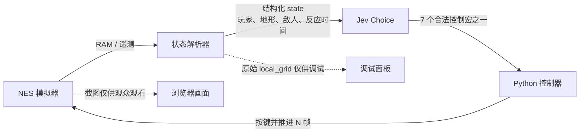

# Mario：让结构化判断走进实时控制闭环

本案例参考 [fhshaik/typesafe-mario](https://github.com/fhshaik/typesafe-mario)：Jev 不看游戏截图，而是读取由模拟器内存整理出的状态，选择一个有限的手柄动作；控制器执行若干帧后，再把新状态交回决策环。

**这章要看懂的不是“模型能不能打通马里奥”，而是判断如何接到真实的动作执行上。** 环境观测、模型选择、控制器执行和下一步反馈各司其职，任何一层出错都会影响最终表现。


> 当前截图与网页默认使用本地规则 pilot。模拟器与控制回路运行在真实 NES 模拟器上，但动作分布、置信度、Noul 和 Score 是 mock 演示值，**不是 Jev 的真实输出或评测结果**。

## 一拍决策是怎么完成的



这条闭环有三个重要边界：

1. **像素不是模型输入。** 网页会展示 NES 画面，但上游送给 Jev 的是结构化 JSON；原始 `local_grid` 只用于调试，地形和危险特征由解析器整理后进入 `state`。
2. **模型选的是控制宏，不是逐帧操作。** 例如 `right_run_jump` 表示向右跑并起跳。Python 把动作映射为模拟器的按钮组合，并让动作持续若干帧。
3. **环境反馈决定下一拍。** 执行后重新读位置、速度、敌人和地形，再判断是否继续、跳跃或调整动作。推理延迟和动作保持时间都会缩短可用的反应窗口。

可用一个近似量理解“为什么每拍推进几帧很重要”：

```text
反应地平线 H = 本次动作帧数 N + 推理延迟折算帧数 L
Mario 在反应期间前进距离 ≈ 水平速度 v × H
```

若可起跳窗口比这段距离还窄，决策频率就可能成为控制瓶颈。报告中的本地对照观察到，将动作间隔从 8 帧改为 4 帧后，pilot 的最远距离增加；这说明帧数是需要测量的系统变量，不说明 Jev 一定能因此玩得更好。

## Jev 在这里判断什么

上游在同一轮请求中针对同一份状态提出三类问题：

| 原语 | 问题 | 在案例中的用途 |
|---|---|---|
| `Choice` | 接下来执行哪个动作？ | 从 `noop`、`right`、`right_jump`、`right_run`、`right_run_jump`、`jump`、`left` 中选择一个 |
| `Noul` | 此刻开始或保持向前跳跃是否有利？ | 作为辅助判断，帮助观察跳跃时机 |
| `Score` | 当前即时危险程度如何？ | 提供危险等级，便于监控和分析 |

上游代码从 RAM 解析状态、构造问题、校验动作并推进模拟器；本地 v2 扩展额外计算起跳窗口，作为补充 state 字段。Jev 在给定状态和选项中做判断。这里的 `confidence` 或 Choice 分布是模型对候选项的输出，**不能单独当成正确率，也不能证明概率已经校准**。

## 上游项目与本地演示的区别

| 部分 | 上游 `typesafe-mario` | 本目录的可视化复现 |
|---|---|---|
| 决策器 | 可配置真实 Jev API | 默认用本地 scripted pilot 替代 HTTP 应答；不调用真实 API |
| 页面 | 单窗口展示游戏与决策遥测 | 浏览器展示游戏、状态、轨迹和调试信息 |
| 状态输入 | 结构化对象；截图与原始网格不发给模型 | 仍保留结构化对象；为演示增加页面遥测 |
| 本地扩展 | 上游基线策略 | 增加相机页解析修正、起跳窗口特征和跨局尝试记忆；这些是复现实验扩展，不代表上游默认行为 |

因此，下面的网页适合**看懂数据流与系统边界**；如果要观察 Jev 的真实动作、置信度、延迟或通关表现，请按上游 README 配置真实 API 并直接运行上游项目。当前本地 pilot 不能替代这类验证。

## 运行本地演示

需要 Python 3.13+、`uv`，以及本地可运行的上游仓库。先在工作区中获取并安装上游项目：

```bash
git clone https://github.com/fhshaik/typesafe-mario
cd typesafe-mario
uv venv --python 3.13 .venv
.venv/bin/pip install -e ".[mario,dev]"
```

再进入本目录启动浏览器演示。把 `/path/to/jev-cookbook` 替换为本仓库所在路径：

```bash
cd /path/to/jev-cookbook/main/07_实战应用/app/typesafe-mario-repro
/path/to/jev-cookbook/typesafe-mario/.venv/bin/python viz_server.py --host 127.0.0.1 --frames-per-decision 4
```

打开终端打印的本地地址（默认 `http://127.0.0.1:8770`）。页面工具栏可暂停、重开、调节播放速度和保存当前游戏帧。

想先查看上游真正发送的 state、又不启动游戏或请求 API，可在 `typesafe-mario` 目录运行：

```bash
.venv/bin/typesafe-mario state-demo
```

要运行真实 Jev，请按照 [上游项目说明](https://github.com/fhshaik/typesafe-mario#setup) 配置 `TYPESAFE_API_KEY`，并运行上游 CLI；不要把本目录的 mock 页面输出当成在线调用结果。

## 看实验时先问这四个问题

1. 解析出的玩家位置、障碍距离和敌人投影是否可信？状态错误时，后续判断无从补救。
2. 当前动作能持续多少帧？这一拍的动作结束前，Mario 是否已经越过起跳窗口？
3. 已选动作有没有真正执行？按钮按下与释放边沿、模拟器步进方式都可能改变结果。
4. 对照实验改变了什么？比较时要固定种子、环境、策略和决策帧数，否则不能把差异归因到单个修复。

本地复现实验得到的关键现象包括：无窗口输入路径需要处理跳跃键释放沿；地形网格解析受相机滚动影响；缩短每次决策的帧间隔在记录配置下改善了前进距离。**这些是当前模拟器与本地策略替身下的工程观察，不是 Jev 能力结论。** 方法、参数、原始结果与限制见 [实验报告](EXPERIMENT.md) 和 [完整研究记录](REPORT.md)。

## 项目文件

| 文件 | 用途 |
|---|---|
| `viz_server.py` | 浏览器观战服务与本地 mock pilot 入口 |
| `mario_harness_v2.py` | 本地实验扩展：起跳窗口特征与决策上下文 |
| `parser_fix.py` | 本地扩展：根据相机位置修正地形解析 |
| `attempt_memory.py` | 本地实验扩展：整理并注入跨局尝试记录 |
| `repro_real_env.py`、`ab_real_env.py`、`harness_ab.py` | 模拟器复现与对照实验脚本 |
| `EXPERIMENT.md` | 八节实验说明与结果边界 |
| `REPORT.md` | 逐步复现记录、排错过程和实现细节 |
