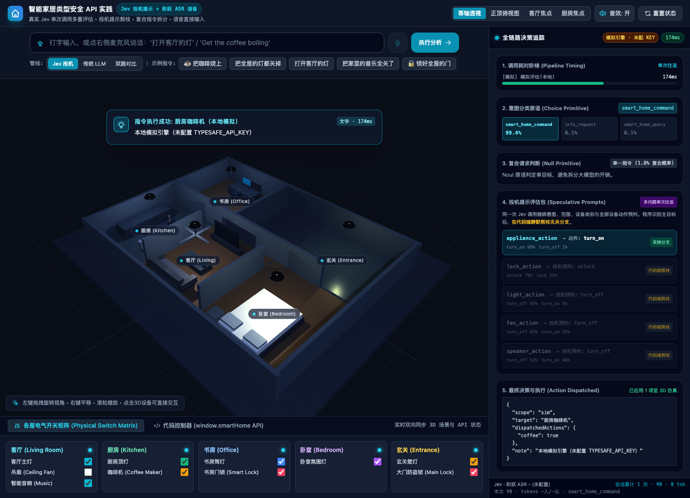
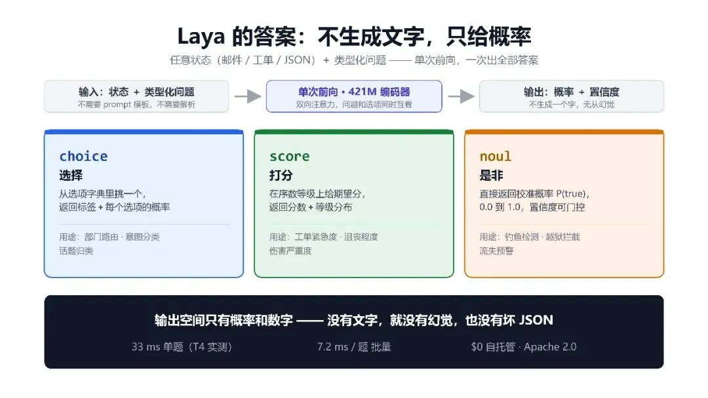
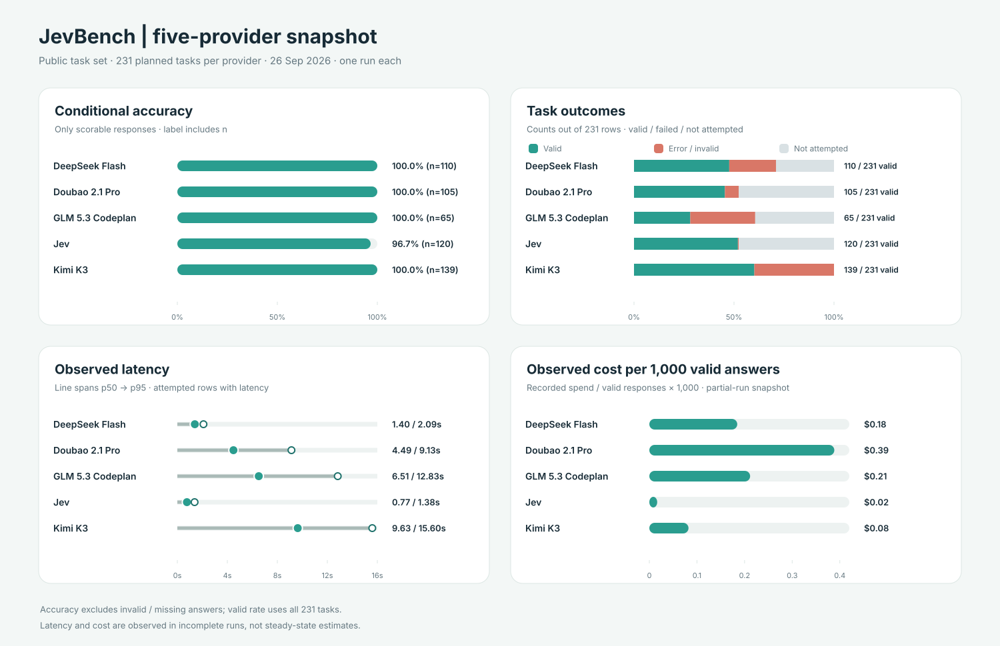
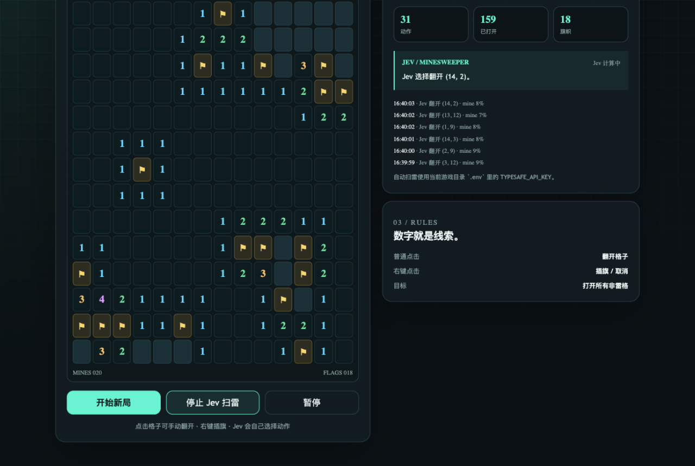
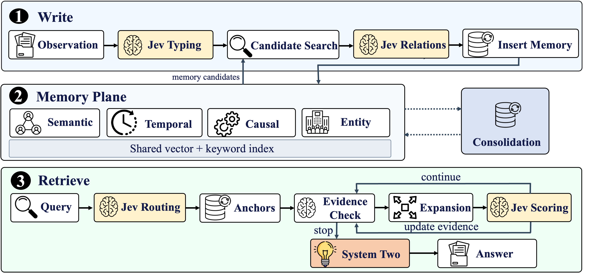
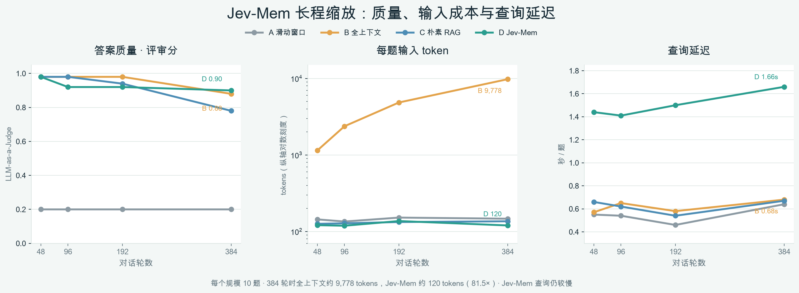
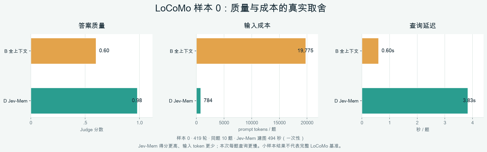

# ⚡ 适合中国宝宝的 Jev 入门教程：Jev Cookbook 开源了

**跟着 Jupyter Notebook 动手，从三种问题原语、18 篇实战配方，走到语音智能家居、模型评测、Agent 集成与本地微调，系统学习 System One 判断模型的开发方法。**

## 开源初心

哈喽，大家好！这次想和大家分享我们利用假期整理的开源教程——**Jev Cookbook**。

做这门课的起点很简单：我们想学 Jev 时，发现资料散落在文档、社交平台、项目仓库和论文里。看完一个演示，可能仍不知道从哪章入门、怎样复现实验，或者那个漂亮的结果是在什么题目、什么环境下得到的。我们希望把这些材料连成一条路，让第一次接触 Jev 的同学也能跟着 Notebook 一步步上手。

整理课程的过程，也让我们看到了 Jev 适合做什么，以及它会在哪些地方遇到限制。一个 Agent 要选择下一步工具；扫雷程序要在未知格子中选择落点；智能家居系统要把一句话变成设备动作。这些时刻，系统需要一个**能被程序理解、检查和执行的判断**。但模型判断并不自动等于正确动作：状态是否充分、概率是否可信、规则和权限由谁把关，都要在实验里讲清楚。

因此，我们不仅整理了入门概念和基础配方，也实际走访游戏、长期记忆、JevHarness、Agent 集成和本地模型等方向。每一个案例都尽量保留运行入口、观察方法和结果边界，让大家能自己动手，而不是只记住一张效果图。

在这里，模型负责理解状态并回答类型化问题；规则、权限、执行和反馈仍由程序管理。一轮判断可以写成：

```text
观察状态 → 提出有限候选的问题 → 获得选项与概率 → 程序检查并执行 → 观察新状态
```

生成式大模型依然适合写作、解释和开放式规划。Jev Cookbook 关注的是另一类高频环节：**当问题可以明确表达为一次选择或打分时，怎样让 System One 的判断进入可观察的应用闭环。**

## 项目简介

Jev Cookbook 是一套由 Datawhale 社区开源的 Jev 决策模型中文教程。全书 11 章，用中文解释 System One 的核心概念，并配上 Jupyter Notebook 和可运行项目：从 State、Noul、Choice、Score 出发，逐步走向 Cookbook 配方、模型评测、游戏应用、Agent 集成、前沿研究和 Laya 本地模型实践。

我们希望读者学完之后，既知道“Jev 可以放在哪里”，也知道“它在什么条件下有效、哪里还需要普通代码或生成式模型”。因此每章都会尽量回答：**这个实验在验证什么，观察到了什么，结果又能支持多大的结论？**

在这个项目中，你将获得：

- 🔍 **从零认识 System One：**用 State 和三种问题原语，把业务问题写成模型能回答、程序能处理的判断题。
- 🧪 **跟着 Notebook 做实验：**通过 18 篇实战配方，观察 RAG、工具选择、风险控制等场景里的模型输出。
- 🏠 **做一个会响应语音的智能家居演示：**把语音识别、意图判断、动作派发与 3D 模拟状态串起来。
- 📊 **自己读模型对比结果：**在固定任务中比较 Jev 与 DeepSeek、豆包、GLM、Kimi 等模型的有效回答、准确率、延迟和成本。
- 🎮 **体验 12 个游戏与应用项目：**从扫雷、贪吃蛇到浏览器操作，看决策怎样形成闭环，也看失败时如何复盘。
- 🧠 **接触前沿与工程集成：**阅读 Jev-Mem、JevHarness，尝试 Pi 扩展和 DeepSeek Harness 插件中的 Jev 判断。
- 🖥️ **探索本地模型：**了解 Laya 的本地服务、数据构建、SFT、LoRA 与 RLCD-style 训练实验。

开源地址：[datawhalechina/jev-cookbook](https://github.com/datawhalechina/jev-cookbook)。[十一章总目录](../../../README.md)可以作为你的学习导航。

## 项目受众

如果你会读基础 Python，知道如何调用一次模型 API，就可以从第一章开始。你可以是正在做 Agent 或 RAG 的开发者，想研究模型评测的同学，也可以只是好奇：“除了生成一段话，模型还能怎样参与应用决策？”教程提供中文讲解与国内常见模型的对照场景，方便大家结合自己的开发环境学习。

前几章不要求你有模型训练经验。遇到概率、校准、风险控制等概念时，教程会把它们放回具体问题和实验中解释；走到本地模型章节，再逐步接触数据、训练与部署。

## 学习指南

我们把 11 章整理成五个阶段，从“先认识 Jev”走到“自己评测、集成和训练”。这样学下来，不必在零散资料之间反复拼接前后文。

**第一部分：认识 Jev，学会提出判断题（第 1～3 章）。** 从 System One 与生成式模型的分工开始，认识 State 与 Noul、Choice、Score 三种问题原语；再看概率输出怎样进入程序控制流。读完这一部分，你应该能说清楚：模型究竟判断了什么，代码又负责什么。

**第二部分：边做实验，边理解应用方向（第 4～5 章）。** 第四章准备了 18 个 Cookbook Notebook，覆盖 RAG、风险控制和结构化处理等配方；第五章把判断接入智能家居，让文字或语音指令经过识别、意图判断、动作派发和模拟设备状态更新。语音演示还会拆开观察 ASR 与 Jev 各自的耗时。这里开始，你会看到一个模型调用怎样变成完整的应用流程。

**第三部分：与大模型对比，再看实际项目（第 6～7 章）。** 第六章用固定的公开任务比较 Jev 与 DeepSeek、豆包、GLM、Kimi 等模型：除了看答对多少，还会检查有多少题真正得到有效回答、概率是否可信、响应是否够快、token 和费用怎么计算。这是一份有运行范围的实验快照，不能直接读成通用排名。第七章再把判断放进 12 个游戏与应用项目：模型选动作，环境检查并反馈，下一轮从新状态出发。

**第四部分：探索记忆、Harness 和 Agent 集成（第 8～9 章）。** 读 Jev-Mem，看判断模型怎样参与长期记忆的写入与检索；读 JevHarness，理解为什么要区分开发阶段的设计与运行阶段的显式控制流。接着用 Pi 扩展和 DeepSeek Harness 插件案例，学习把 Jev 接在 Agent 的工具选择与语义门控位置。模型给出一个高分选项后，程序仍要检查权限、参数和执行结果。

**第五部分：尝试本地部署与微调（第 10～11 章）。** 第十章以开源权重模型 Laya 为例，从本地服务走到数据构建、Head-only SFT、LoRA-SFT 与 RLCD-style 训练，再学习校准和评测。Laya 与 Jev 都采用类型化判断接口，但模型和训练结果不能视为相同。第十一章回到知识库，核对资料来源、实验版本和结论范围。这样，当你展示自己的效果图时，也能讲清楚它所依据的实验。

你可以按顺序学习；如果想先获得直观印象，可以先从原语实验、模型评测、游戏案例和本地推理几组现成材料入手，再带着问题回到对应章节。

## 实战项目效果演示

### 智能家居：一句话怎样变成设备动作？

在智能家居实验中，你可以从 3D 房间看到设备状态，再顺着执行追踪查看指令怎样被理解、选择分支并派发动作。它把“判断”从一个抽象的模型输出，变成页面上能追踪的状态变化。



**图 1｜智能家居演练场。** 图中展示的是本地模拟引擎的交互流程，便于观察系统组成；它不代表在线 API 的性能测量。

### 第二章：用 Jupyter 看懂三种问题原语

同一段状态，可以问成三种不同形状的问题：`Choice` 从给定选项中选择，`Score` 按有序等级打分，`Noul` 判断是或否。原语决定模型回答的结构，也决定后续代码怎样检查和使用结果。



**图 2｜三种问题原语的输入与输出示意。** 这张图来自知识库已有的 Laya 原理配图，用于直观介绍三种共享的原语形状；完整课程实验请打开[第二章原语 Jupyter Notebook](../../../02_核心概念/03_原语.ipynb)。Notebook 会用同一条中文工单分别提出三种问题，再练习批量提问、分数归一化与阈值判断。真实 API 输出需要配置密钥；阅读 Notebook 本身不要求启动训练或服务。

### 第六章：把 Jev 放进同一组模型评测

模型对比不只看“答对率”。下面这张现成评测图同时展示条件准确率、有效回答覆盖、响应延迟和观测成本，能帮助读者区分“答得准”“实际产出多”“响应快”和“费用低”这几件事。



**图 3｜五个模型在 231 道计划题上的一次评测快照。** 本次记录中，Jev 有效回答 120/231（51.9%），有效回答子集上的条件准确率为 96.7%，p50 延迟为 0.77 秒；Kimi 有效回答最多，为 139/231（60.2%）。因此，这组数据呈现的是不同维度的取舍：Jev 在本轮响应延迟和观测成本上较低，Kimi 的有效产出覆盖更高；不能把条件准确率或单次综合分单独读成完整能力排名。样本只来自一次运行，且五个 provider 都未完成全部计划题，详细口径见[第六章模型评测](../../../06_模型评测/README.md)。

### 第七章：在游戏里看清一次决策

第七章收录了 12 个项目，涵盖贪吃蛇、扫雷、狼人杀、迷宫、Browser Use、Mario 和智能家居等不同场景。游戏尤其适合入门：状态会变，候选动作有限，动作是否有效又能由环境立即裁定。


**图 4｜Jev Games 统一入口。** 从一个界面进入不同游戏与对照实验，先看整体，再追踪单次判断。



**图 5｜扫雷决策界面。** 棋盘提供数字约束，模型在候选格子间做判断；动作记录让你看到它选了哪里，游戏规则则负责裁定这一步的结果。成功揭开一格，不等于模型已经掌握所有局面；下一步仍要根据新棋盘重新判断。

#### 马里奥：熟悉的游戏，也是一条可观察的决策闭环

马里奥案例把同一思路放进经典横版游戏：程序从模拟器状态整理玩家位置、地形和危险信息，Jev 在有限的控制动作中作出选择，控制器按动作推进若干帧，再读取新状态进入下一轮。


**图 6｜Mario 案例中的游戏画面。** 这张图用于让读者先认识任务环境；画面本身不是 Jev 的输入。模型读取的是程序从模拟器中整理出的结构化状态。仓库网页演示默认使用本地 mock pilot，因此这张静态游戏帧也不代表真实 Jev API 输出或通关成绩。可从[第七章案例说明](../../../07_实战应用/app/typesafe-mario-repro/README.md)继续查看数据流和结果边界。

如果你正在开发 Agent，可以把棋盘换成网页，把“揭开格子”换成“点击按钮”：状态、候选动作、程序检查和环境反馈，仍然是同一条链。[第七章项目总览](../../../07_实战应用/README.md)列出了全部案例与入口。

看到这里，你可能会问：**已经有大模型了，为什么还要 Jev？** 课程不会替你预设答案。第六章让不同模型在同一批计划任务上留下有效回答数、延迟与费用记录；第七章再把模型输出放进真实的动作流程。遇到开放式写作或长规划，可以继续用生成模型；遇到候选清楚、需要反复检查的判断题，则可以评估 Jev 是否合适。选哪条路线，最终要由任务效果和工程代价一起决定。

### 第八章：长期记忆不只是保存聊天记录

对话变长后，一个新的难题出现了：哪些信息值得记住？提问时又该取出哪一部分？Jev-Mem 把判断放进记忆写入、关系组织和检索路由，让生成模型在证据足够时再组织答案。



**图 7｜Jev-Mem 的写入、记忆与检索。** 这张架构图帮助你定位每次判断发生在何处，以及它怎样影响最终回答。图片来自 [Jev-Mem 上游项目](https://github.com/libingzheren/Jev-Mem)。

教程还保存了实验数据，方便你从“架构看起来合理”走到“结果究竟怎样”。在 48～384 轮的合成对话实验中，每个规模有 10 道题。全上下文方案的每题输入从约 1,144 增至 9,778 tokens；Jev-Mem 约为 120 tokens。到 384 轮时，两者本轮评审分分别为 0.88 和 0.90。输入减少了，但 Jev-Mem 的单题查询更慢，建立记忆也有一次性成本。



**图 8｜长对话变长时，质量、输入量和查询延迟如何变化。** 这是一轮本地实验，每个规模只有 10 道题；图表用于理解趋势和代价，不能当作多次重复后的稳定结论。

另一个 LoCoMo 样本包含 419 轮对话和 10 道题。本轮 Jev-Mem 与全上下文的评审分是 **0.98 对 0.60**，每题输入约 **784 对 19,775 tokens**；但查询延迟是 **3.83 秒对 0.60 秒**，Jev-Mem 建立记忆还需要约 **494 秒**。



**图 9｜同一小样本上的质量与代价对照。** 它显示了这组题目中筛选证据的潜力，也提醒我们把查询延迟和建图成本一起算进去。10 道题不足以代表完整 LoCoMo 结果，分数也受本轮 LLM 评审影响。[第八章 README](../../../08_前沿研究/README.md)提供了实验过程、Notebook 和更多图表。

### 从研究案例走向自己的 Agent 与本地模型

看完记忆与游戏，接下来可以试着把 Jev 放进自己的 Agent。[第九章](../../../09_Agent集成/README.md)从 Pi 扩展入门，再通过 DeepSeek Harness 的插件案例观察一条真实的协作链：主模型处理会话和工具流程，Jev 回答范围明确的判断题，插件代码组合结果并执行策略。你可以沿着记录逐步检查判断、授权与工具执行分别发生在哪里。

如果还想继续探索“能否在本地运行和调整这样的模型”，[第十章](../../../10_本地模型/README.md)以 Laya 为案例，介绍本地服务和几条微调路线。它提供了一条可动手研究的路径；训练实验的标签来源、评测切分与结果范围也会一起交代，方便你判断自己的复现结果是否可靠。


**图 10｜Laya 本地推理演示。** 这是知识库已有的本地 Snake 运行 GIF，画面同时显示当前动作、候选概率和推理耗时；它展示的是本地推理交互，不是微调结果图。想看 Jupyter 实验，可直接打开[Head-only 中文微调 Notebook](../../../10_本地模型/notebooks/zh_head_finetuning.ipynb)或[Head-only、LoRA-SFT、RLCD-style 对照 Notebook](../../../10_本地模型/notebooks/full_v2_finetuning.ipynb)。这两份 Notebook 源文件都在仓库中；其中全量对照 Notebook 默认关闭训练、下载和标注开关，实验过程与指标边界见[第十章说明](../../../10_本地模型/README.md)。

## 特别感谢

一套开源教程，最有价值的时刻是读者真的把案例跑起来，然后发现新的问题。感谢项目贡献者整理 Notebook、应用和实验资料，也感谢持续提出问题、复现结果和改进文档的社区伙伴。

如果你刚来到这里，可以从[第一章](../../../01_认识Jev/README.md)开始，亲手改一个 State、换一组候选答案，再看输出怎样变化；也可以先打开[第七章](../../../07_实战应用/README.md)体验游戏，或用[第八章](../../../08_前沿研究/README.md)的数据练习解读实验。遇到问题、做出新案例，欢迎在 [GitHub Issues](https://github.com/datawhalechina/jev-cookbook/issues) 中交流，或通过 Pull Request 一起完善教程。

希望 Jev Cookbook 能帮你从“让模型给出一个答案”，走到“知道怎样把一次判断放进可验证的系统”。

---

**图片说明：** 图 1 为仓库内的本地智能家居演练场；图 2 复用知识库中已有的三原语说明图，原语课程见对应 Notebook；图 3 复用第六章已保存的五模型评测面板；图 4、图 5 的游戏界面来自 [Jev Games 上游项目](https://github.com/lzdFeiFei/jev-games)；图 6 复用本仓库 Mario 案例中的游戏帧，案例说明了画面与模型输入的区别；图 7 引自 [Jev-Mem 上游项目](https://github.com/libingzheren/Jev-Mem)；图 8、图 9 根据本仓库 Notebook 的已保存实验数据重新绘制；图 10 复用知识库中已有的 Laya 本地 Snake 演示 GIF。图中的单次、小样本数据均按正文所述范围阅读。

<!-- 编辑备注：第七章说明 Jev Games 上游仓库未附 LICENSE。公众号外部发布前，请与上游确认截图转载授权及署名要求。 -->
