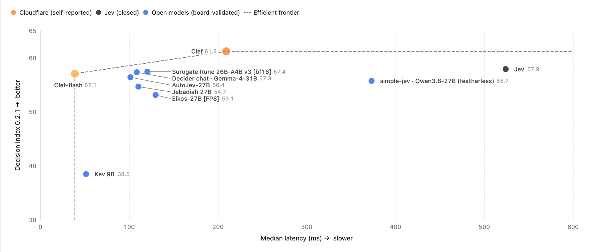
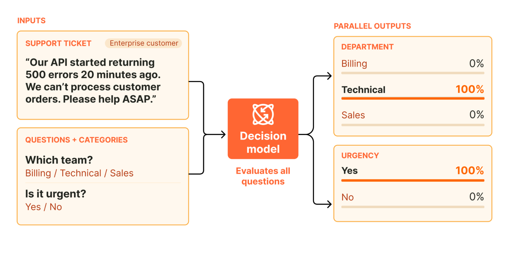
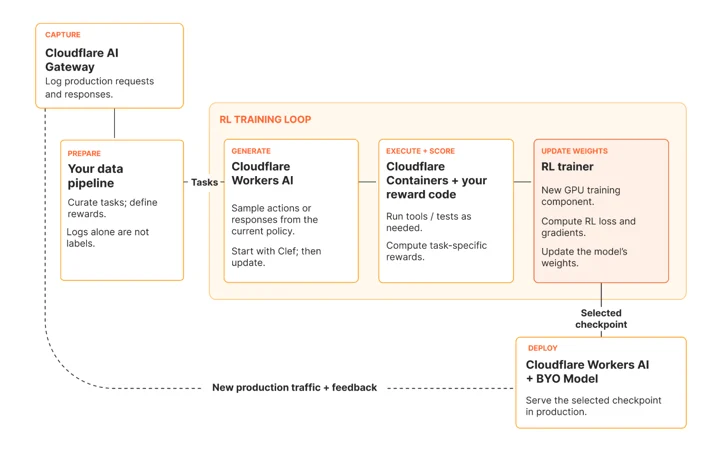

# Clef 发布：我们的开源决策模型与全新 RL 微调平台

> 原文：[Introducing Clef: our open-source decision models, and new RL fine-tuning platform](https://blog.cloudflare.com/clef-decision-models/) · Cloudflare Blog · 发布于 2026-10-01
>
> 译文为社区学习用途的非官方中文翻译，版权归原作者 Cloudflare 所有。


[Michelle Chen](https://blog.cloudflare.com/author/michelle/), [Alex Reneau](https://blog.cloudflare.com/author/alex-reneau/), and [Kevin Flansburg](https://blog.cloudflare.com/author/kevin-flansburg/)

（Cloudflare AI 平台团队）

近几周，以 [Typesafe AI 的 Jev](https://typesafe.ai/blog/introducing-system-one-models-and-jev) 等 System One 模型为代表的决策模型引发了广泛讨论。分类器模型其实已经存在了一段时间，而 Jev 为 AI 世界引入了一个全新的决策模型概念——这类模型能够以低成本、高速度、强一致性的方式产出有界的结构化输出，可以嵌入任何需要做出决策的工作流之中。它们的能力足以处理任意一组输入，无需为了纳入新的分类类别而不断重新训练模型。这与大语言模型（LLM）的世界形成了鲜明对比：LLM 在很大程度上是非确定性的，但又足够开放，能够进行推理，并为智能体式工作负载生成文本和工具调用。

今天，我们发布了两个由 Cloudflare 训练的决策模型：Clef 和 Clef-flash，[托管在 Workers AI 上](https://developers.cloudflare.com/workers-ai/models/clef)。在 [Jev Decision Index](https://huggingface.co/spaces/multimodalart/jev-decision-index) 评估中，Clef 目前名列第一，完整结果可以在[基准测试在线演示站点](https://clef-evals.workers-ai-mle.workers.dev)上查看。这些模型更聪明、更快速，并且完全兼容 Jev API，因此你可以轻松试用这些托管模型。我们还在 Apache 2.0 许可证下将这些模型[完整开源到了 Hugging Face](https://huggingface.co/Cloudflare/clef)，供你在本地运行、自行实验。



最后，我们也很高兴推出全新的强化学习（RL）产品，让客户同样能够微调 Clef 来适配自己的用例。

## 什么是决策模型？

决策模型基于一定的概率进行分类，帮助智能体决定如何行动。例如，你可以传入一条客户支持消息（输入），询问它是否紧急、应该由哪个团队来处理。决策模型会返回带有概率的类型化答案（输出），你的代码可以据此对工单进行路由、触发升级，或者转交人工处理。这意味着在智能体决策中，人类不再必须全程在场——智能体可以通过程序收集上下文、做出决策、对任务采取行动，并在需要时转交人工。



具体到 Cloudflare，我们的威胁情报团队一直在测试新的 Clef 模型，用它来帮助我们对网站域名进行分类。把一个域名交给 Clef（配合 Browser Run），它就能快速识别该域名所属的类别——例如，它可能判定某域名有 95% 的概率是时尚类网站、85% 是电商、不到 1% 是钓鱼网站，等等。这一次分类中，我们的 Clef 模型抓取、渲染并对该网站进行分类共耗时 2.2 秒；相比之下，我们最快的通用 LLM gpt-oss-120b 在同一工作流中耗时 4.7 秒，而且只返回了两个分类结果。作为使用者，你可以想象延迟减半、结果更优能够如何帮助我们改进威胁情报工作流，更快地识别恶意域名与合法域名。把这个思路推广到任何需要快速程序化决策的用例，你就能解锁强大的智能体式工作流，让它们自主决策、推理并执行。

在乐理中，谱号（clef）是置于五线谱开头的一种符号，用来为谱线与谱间赋予具体的音名。决策模型与谱号颇为相似：它帮助界定上下文所处的领域，以及随后跟随的音符（行动）。我们选择 Clef 作为决策模型家族的名字，正是因为它发挥着相似的作用，而其中的 CF 也让人联想到 Cloudflare。

## Clef 与其他决策模型有何不同？

尽管市面上的决策模型正日趋饱和，Clef 仍有一些独特的性质，让我们非常乐于将它公开发布。首先，它带有视觉编码器，能够接收图像并对视觉内容进行分类，这与目前仅支持文本分类的 Jev 不同。其次，我们的模型拥有 64k 上下文窗口（Jev 为 32k），用户可以放入更多的输入状态供模型进行分类。

第三，我们的模型准确而强大，在多项质量基准测试中与其他市售决策模型相比得分颇具竞争力。我们从 [Jev Decision Index](https://huggingface.co/spaces/multimodalart/jev-decision-index) 定义的对决策至关重要的评估中精选了一部分，并据此为市面上一些较为热门的模型打分。基准测试结果见下表，你也可以在[决策指数在线演示站点](https://clef-evals.workers-ai-mle.workers.dev)上查看得分：

| Benchmark | Clef | Clef-flash | Jev | DiffusionGemma Jev | Kev 9B | Laya |
|---|---|---|---|---|---|---|
| BFCL · case exact | 98.47 | 98.76 | 95.75 | 96.52 | 94.51 | 38.13 |
| ToolRet · nDCG@10 | 69.19 | 66.43 | 65.28 | 61.21 | 64.26 | 12.69 |
| API-Bank · accuracy | 91.93 | 93.11 | 88.19 | 83.66 | 56.30 | 11.41 |
| Home appliances · case exact | 82.95 | 97.73 | 52.27 | 42.05 | 25.00 | 0.00 |
| When2Call · accuracy | 72.37 | 65.58 | 80.97 | 75.44 | 49.62 | 11.94 |
| BANKING77 · macro-F1 | 94.20 | 90.93 | 79.74 | 74.28 | 84.83 | 14.29 |
| CLINC150+OOS · macro-F1 | 97.43 | 66.77 | 89.27 | 83.49 | 79.03 | 3.19 |
| BRIGHT · nDCG@10 | 45.91 | 39.26 | 47.52 | 42.94 | 38.53 | 19.90 |
| Amazon ESCI · macro-F1 | 57.48 | 57.39 | 55.21 | 53.37 | 49.22 | 24.40 |
| PhishNChips · accuracy | 79.60 | 75.05 | 62.55 | 85.35 | 50.75 | 50.15 |

我们还在 [Typesafe 自己的评估套件](https://huggingface.co/collections/typesafe/workflowevals)上运行了基准测试，我们的 Clef 模型表现出色，在 4 个领域中的 3 个击败了 Jev。尤其值得一提的是，考虑到 Clef-flash 的速度之快，它的表现格外出色。

| Workflow | Clef | Clef-flash | Jev |
|---|---|---|---|
| 发票处理 | 64.7 | 57.1 | 61.8 |
| 客户服务 | 76.3 | 77 | 76.0 |
| 安全事件 | 62.9 | 61.7 | 61.7 |
| 智能体轨迹可观测性 | 68.5 | 69.8 | 71.6 |

在全部 43 项评估基准中，我们的 Clef 模型在延迟上都胜过了其他决策模型（Laya 除外——它非常快，但在上表的基准中牺牲了质量）：

| Benchmark | [Clef](https://huggingface.co/Cloudflare/clef) | [Clef-flash](https://huggingface.co/Cloudflare/clef-flash) | [Jev](https://typesafe.ai/blog/introducing-system-one-models-and-jev) | DiffusionGemma Jev | [Kev-9B](https://huggingface.co/jaredpalmer/kev-9b) | [Laya](https://huggingface.co/convaiinnovations/laya) |
|---|---|---|---|---|---|---|
| 中位延迟 · 毫秒 | 209.3 | 38.8 | 524.1 | 84.4 | 51.4 | 5.8 |
| p95 延迟 · 毫秒 | 238.6 | 122.4 | 536.0 | 211.2 | 187.9 | 222.5 |

除了模型本身带来的延迟优势，我们的 Clef 模型还托管在 Workers AI 上。由于它们运行在 Cloudflare 的基础设施上，我们得以利用边缘侧的 GPU，从而带来更低的网络延迟和更快的决策。这意味着你可以把 Clef 放进智能体做决策的热路径（hot path），再结合 Workers AI 上的某个 LLM 来采取行动。

```
curl https://api.cloudflare.com/client/v4/accounts/$CLOUDFLARE_ACCOUNT_ID/ai/run/@cf/cloudflare/clef \\
  -X POST \\
  -H "Authorization: Bearer $CLOUDFLARE_AUTH_TOKEN" \\
  -d '{
    "model": "clef",
    "state": "Checkout has been failing for every customer for the last hour.",
    "questions": {
      "urgent": { "type": "noul", "instructions": "Is this support request urgent?" },
      "team": {
        "type": "choice",
        "instructions": "Which team should handle this request?",
        "criteria": {
          "billing": "Payments, invoices, and refunds",
          "technical": "Outages, errors, and configuration",
          "sales": "Plans and upgrades"
        }
      },
      "severity": {
        "type": "score",
        "instructions": "How severe is the customer impact?",
        "criteria": ["No impact", "Minor", "Major", "Critical"]
      }
    }
  }'
```

Clef 同样会产出严格类型化的输出，与 Jev 类似且完全 API 兼容，因此你可以非常轻松地完成替换。更大的 Clef 模型是你追求精度的强力选择，而 Clef-Flash 模型则非常适合对延迟敏感的决策场景。这些模型达到企业级可用标准，我们承诺不会读取、存储你的请求或响应，也不会用它们来训练（除非你愿意使用我们的微调产品，下文会详细介绍）。你现在就可以上手 Clef 模型：从我们的[开发者文档](https://developers.cloudflare.com/workers-ai/models/clef)开始，或者到 [Hugging Face 仓库体验开源模型。](https://huggingface.co/Cloudflare/clef)

如果你希望在特定工作负载上调优 Clef 时获得帮助，我们也提供微调服务——初期由我们的前置部署工程师（FDE）团队提供贴身的合作支持，后续则会推出自助式微调平台，供客户自行训练模型并重新部署到 Cloudflare。

### 我们如何训练 Clef

就在 Jev 发布的同一周，我们[发文介绍过](https://x.com/michellechen/status/2101091012559151480)基于自研决策模型开展的一些实验。我们的演示展示了如何改造 DiffusionGemma 模型：通过暴露大语言模型生成的 logprobs，让它输出确定性的概率。我们最初的方法建立在 [Matt Mastracci](https://x.com/mmastrac) 的独立研究之上——他一直活跃于机器学习（ML）社区，乐于分享新想法，并向 vLLM 推理引擎提交[pull request](https://github.com/vllm-project/vllm/pull/57250)，让 DiffusionGemma 的支持更加完善。

Clef 延续了这一概念，但采用了不同的基础模型作为骨干。我们目前使用 Qwen 作为基础模型，并对其进行后训练，以适配决策模型的用例。推理时，Clef 先用 Qwen 完成一次仅预填充（prefill-only）的前向计算，然后并行地对所有合法的 schema 选项打分。决策步骤是非自回归的，因而不存在需要逐 token 生成的中间文本，这让 Clef 比自回归 LLM 快得多。Clef 和 Clef-flash 并不通过生成中间文本来产生结构化答案，而是直接从骨干模型的内部表示中推导 schema 选项。这一方法依赖一个专门的两阶段注意力路由过程：每个合法选项先提取与提示词相关的上下文，使各个字段的参数既能与其他字段进行交叉注意力计算，也能在打分前回看原始载荷（payload）。借助词法先验（lexical prior），模型得以在不同选项之间保持语义意图。最终，这套架构将选项级证据路由、跨字段联合注意力与受 schema 约束的打分融为一体。

我们冻结了 Clef 所用的 Qwen3.8-27B 与 Clef-flash 所用的 Qwen3.5-9B，同时联合优化路由头和 rank-256 低秩适配器。后训练阶段对合法 schema 输出采用标签平滑交叉熵，并配合 Brier 损失来精调概率校准。训练使用了我们自建的内部合成数据集，其中对字段顺序、提示词和 schema 结构做了排列组合。我们还开发了面向校准决策的强化学习（Reinforcement Learning for Calibrated Decisions，RLCD）作为次要优化目标：对相邻的有序选项给予部分得分，奖励完全精确的记录输出，并施加参考惩罚以防止分布偏移，从而获得更好的准确率与泛化能力。

这意味着我们在 Clef 上实现了几项新颖的成果：提升了模型分类的准确率，将其约束为只输出概率而非生成文本，并且让它比 Jev 和基础 Qwen 模型都更快。

### 微调如何扩展 Clef 的能力

在 Cloudflare 内部，我们听到了许多需要微调 Clef 模型、并将其嵌入智能体式工作流的用例。例如，内部团队希望有一个分类器模型来评估信任与安全（Trust & Safety）提交、帮助我们分诊 Cloudflare 支持请求，甚至内置到我们的 Bot 产品中，判断某个爬虫是 good bot（善意爬虫）还是 bad bot（恶意爬虫）。

这些用例极其具体，而我们多年来积累了大量带标注的决策数据，足以用来训练特定的分类器。微调模型时，你可能要放弃一些通用性能，以换取在特定领域内更高的准确率。由于 Cloudflare 拥有覆盖多个领域、超过 15 年的网络数据，我们可以微调出适配这些具体用例的模型，比通用的 Clef 模型更准确、更快速。我们已经在与内部团队合作，探索如何对 Clef 进行后训练，打造强大的 ML 模型，从而扩大我们的影响力并改进整个 Cloudflare 的工作流。这些内部团队和用例既是我们新组建的 FDE 微调团队接下来的职责所在，也是我们强化学习（RL）产品的基础。

### 全新的 RL 服务

我们正在提供一项服务，由亲力亲为的 FDE 团队帮助客户微调 Clef，使其适配客户的工作负载。在此基础上，我们会从这些一手经验中学习，构建一个自助服务平台，让客户能够在 Cloudflare 上完成数据采集、微调与模型重新部署的全流程。

这其实筹划已久——我们一直在构建 AI 平台的各项底层原语，正是为了让自定义 RL 产品的构建成为可能。Jev 引发的关注表明，市场需要一种快速、小巧、专精的分类器模型，我们选择以此作为切入点，开始试验 RL 环境。

为此，我们利用了 Cloudflare 平台上已经构建好的原语：

- Cloudflare AI Gateway——让你的所有 AI 流量都经过 AI Gateway，自动为你的用例创建请求数据集
- Cloudflare Workers AI——针对基础 Clef 模型生成 rollout（轨迹采样）
- Cloudflare Containers——用于对智能体动作进行打分与回放的 RL 沙箱
- [NEW] Trainer——更新微调后 Clef 模型的权重
- Cloudflare Workers AI + BYO Model——在 Workers AI 上重新部署微调后的模型

这整合了 AI 平台中几个仍在开发中的组件，包括：捕获你的 AI 流量、让你能够利用自己的请求/响应数据的 AI Gateway；用作 RL 沙箱的 Containers；以及 Workers AI 的自带模型（Bring Your Own Model，Cog）工作——这项工作自我们收购 Replicate 以来一直在推进。



### 立即试用

我们很高兴今天能发布 Workers AI 团队的首个由 Cloudflare 训练的 ML 模型。这里仍处于早期阶段，后续还有更多改进在路上，但它是 AI 平台团队辛勤工作的一次精彩首秀。我们相信，Clef 有能力革新我们使用智能体的方式，这与 Cloudflare 成为智能体云（agent cloud）的使命天然契合。

如果你有具体的使用场景，并且已经是这些产品的客户——[我们非常乐意与你交流，在这个领域中与你结为设计合作伙伴。](https://www.cloudflare.com/resource/clef-rl-interest)

欢迎试用托管在 Workers AI 上的 Clef 模型；如果你想亲自探索，可以下载 [Hugging Face 上的权重](https://huggingface.co/Cloudflare/clef)；如果你有希望我们协助的微调用例，也欢迎联系我们。

我们的 ML 团队影响力与日俱增，从模型优化到模型训练研究皆有建树。如果你有兴趣加入我们的事业，欢迎[查看我们的在招职位](https://www.cloudflare.com/careers/)。
