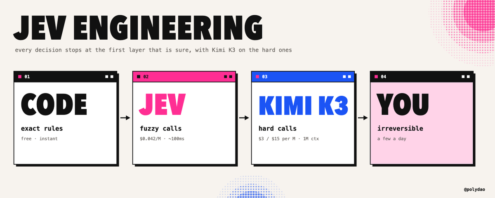
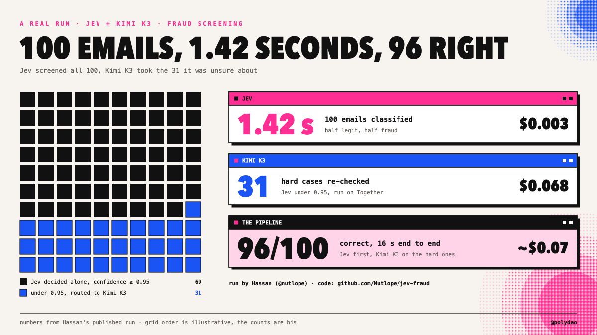
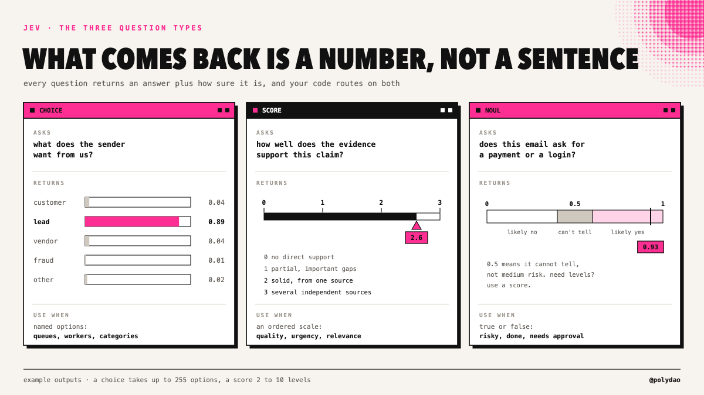
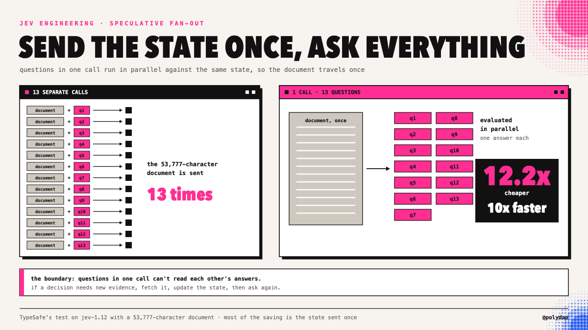
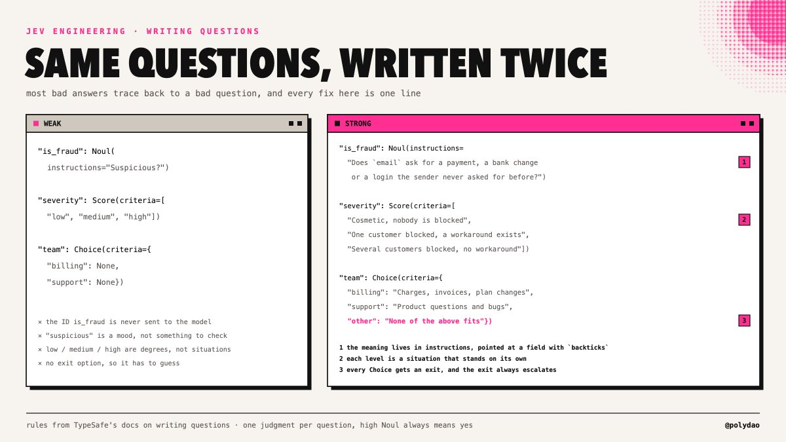
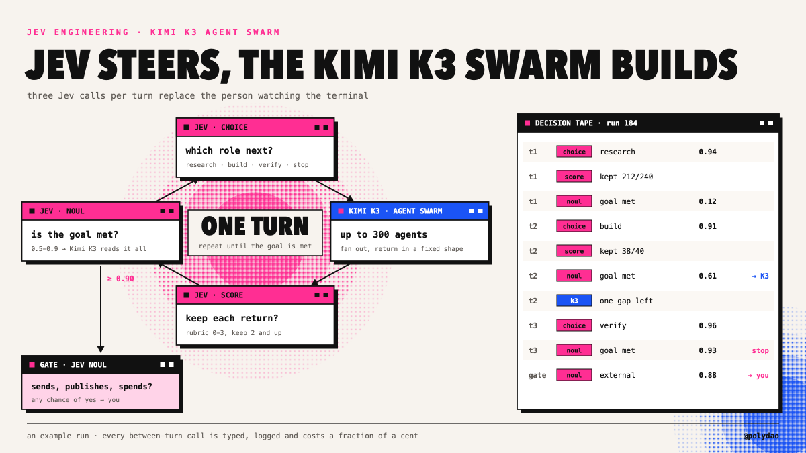
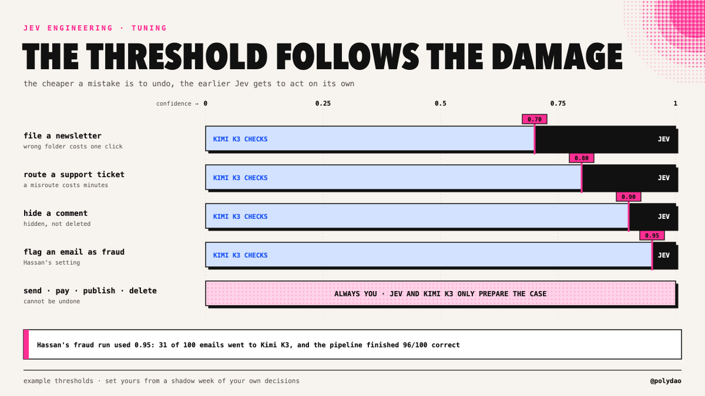

# 用 Jev 工程与 Kimi K3 把智能体账单砍掉 90%

> 原文：[How to Cut Your Agent Bill by 90% With Jev Engineering and Kimi K3](https://x.com/polydao/status/2104783226833186920) · X 长文 · @polydao（Mr. Buzzoni）· 2026-09-29
>
> 译文为社区学习用途的非官方中文翻译，版权归原作者所有。



*如何找出藏在智能体里的那些决策，写出 System One 模型答得好的问题，按校准过的置信度做路由，再把难啃的案子交给 Kimi K3。API、代码、薄弱点，还有这笔账怎么算，全都在这里。*

---

随便打开一份智能体运行记录，数一数模型没在创造任何东西的时刻。下一步该用哪个工具。这个来源相不相关。

测试过了没有。这条命令安不安全。任务完成了没有。在大多数循环里，这类小判断的数量远超真正的工作，而每一个都在按前沿模型的完整生成来计费。

9 月 15 日，TypeSafe AI 结束隐身，带来了一个专为这类调用打造的模型。Jev 从不写一个字。


你发给它状态和类型化的问题，它返回带概率的答案，通常 100 毫秒上下，价格是每百万输入 token $0.042，输出免费。

在 TypeSafe 自家的 workflow 评测里，它比用来对标的那些 LLM 快 193.6 倍、便宜 444.6 倍——连公司自己都说，这组数字是预期里的上限。

Jev 工程就是把它用好的那门手艺：找出藏在流程里的决策、写出模型答得了的问题、按它的置信度做路由，并清楚它会在哪里失灵。这篇是完整的实战手册，Kimi K3 则负责接下 Jev 拿不准的案子。

---

## 1/ 一个不会写作的模型为什么有用

Diogo Almeida 是 InstructGPT 的共同作者——正是那项把 GPT-3 变成 ChatGPT 的 RLHF 工作。他支持 Jev 的论证，恰恰从对自己这套技术的批评开始：为了讨好人类评审而训练出来的模型，学会的是“看起来对”，它们声称的置信度也就不再有任何含义。如果一个模型 95% 的时候能把任务做对，却说不出错的是哪 5%，这个任务就没法自动化。

Jev 用 TypeSafe 称为 RLCD 的方法训练——面向校准决策的强化学习。目标是诚实的概率：在你的数据上，标了 90% 的答案就该在大约 90% 的时候是对的。

> *单个答案仍然可能错——这恰恰是置信度数字重要的原因。它告诉你的代码，哪些答案可以直接执行，哪些该送到别处去。*

一个真实运行说明了这个思路。Hassan（@nutlope）筛了 100 封邮件，一半正常、一半欺诈。Jev 用 1.42 秒分完全部 100 封。置信度低于 95% 的 31 个答案送去 Kimi K3 完整读一遍。整条流水线 16 秒跑完，100 封对 96 封，成本约 $0.07，其中 Jev 的那份账单只有三分之一美分。



---

## 2/ 第一步：把智能体的每一步分拣归类

拿一份真实的运行记录过一遍，把每一步放进下面四个桶之一。

| 如果这一步……                               | 它属于 | 例子                                                          |
| ------------------------------------------ | ------------- | ------------------------------------------------------------- |
| 必须创造文本、代码或计划                   | 一个 LLM      | 草稿、修复、摘要、给人读的理由                                |
| 遵循一条精确规则                           | 代码          | 重试上限、预算、白名单、日期运算、计数                        |
| 从你能提前列出的答案里做选择               | Jev           | 路由、排序、留还是丢、安全与否、完成与否                      |
| 无法撤销                                   | 你自己        | 发送、付款、发布、删除、改权限                                |

第三个桶总是比人们预想的大，而它正是 Jev 工程能搬动的那一块。其余一切原样留在原地。

---

## 3/ 三种原语与 API

三种问题类型，正好覆盖第三个桶。

| 类型   | 问什么                   | 返回什么                                                    | 规则                                      |
| ------ | ------------------------ | ----------------------------------------------------------- | ----------------------------------------- |
| Choice | 从你的选项里挑一个       | choice、每个选项各自的概率、confidence                      | 最多 255 个选项，概率之和为 1             |
| Score  | 放到你的评分标尺上       | score，可以落在档位之间，外加整个分布                       | 2 到 10 个有序档位                        |
| Noul   | 是还是否                 | noul，回答“是”的概率                                        | 0.5 表示它判断不了，绝不会给“中等”        |



动手搭建时会用到的硬信息：

- **端点：** POST https://api.typesafe.ai/v1/systemone，请求体带 state、model 和 questions。Python SDK：pip install typesafe-sdk，然后 client.system_one(...)
- **模型：** 阈值调好之后锁定 jev-1.13.0。jev-latest 指向的版本会变。
- **体量：** state 字段加上所有问题共享约 64K token，而 state 字段加上最长的那单个问题必须装进约 32K（大致是 150,000 字符的英文）。
- **输入：** 只收文本。字符串、JSON 对象或数组，不支持图片。
- **速率限制：** jev-1.13 上是每秒 1,200 次请求、250,000 个 token，TypeSafe 说等产能到位，这些数字还会上调。
- **速度与价格：** 端到端 70 到 500 毫秒，每百万输入 token $0.042，输出免费。10,000 次决策、每次 1,000 token，一共 $0.42。
---

## 4/ 把所有问题塞进一次调用

同一个请求里的问题，对着同一份状态并行求值。

TypeSafe 管这叫 speculative fan-out（推测式扇出），它是你能掌控的最大一根成本杠杆。在他们的一次测试里，对着一份 53,777 字符的文档问 13 个问题，合成一次调用比拆成十三次便宜 12.2 倍、快 10 倍——主要因为状态只发了一次。

```
from typesafe_sdk import Choice, Noul, Score, TypeSafeClient

client = TypeSafeClient(model="jev-1.13.0")

r = client.system_one(
    state={"ticket": ticket_text, "customer": {"plan": "pro", "refunds_90d": 0}},
    questions={
        "department": Choice(
            instructions="Which team should own the problem described in `ticket`?",
            criteria={
                "billing": "Charges, invoices, plan changes",
                "bug": "Something in the product does not work as documented",
                "howto": "The customer asks how to do something that already works",
                "other": "None of the above fits",
            }),
        "frustration": Score(
            instructions="How frustrated is the customer, judged from `ticket` only?",
            criteria=[
                "Neutral or positive, no complaint about the experience",
                "Annoyed but polite, describes wasted time",
                "Angry, mentions cancelling, a public review or a chargeback",
            ]),
        "refund_requested": Noul(
            instructions="Does `ticket` ask for money back, a refund or a chargeback?"),
    },
)

dept = r.answers["department"]            # .choice  .probabilities  .confidence
mood = r.answers["frustration"].score     # can land between levels, e.g. 1.3
refund = r.answers["refund_requested"].noul
```

有两条边界要注意。同一次调用里的问题读不到彼此的答案，所以如果某个决策依赖新证据，先把证据取回来，再问一次。另外，只有问题共享同一份状态时，扇出才划算；互不相关的问题该拆进不同的调用



---

## 5/ 写问题才是真功夫

大多数糟糕的 Jev 答案，追根溯源都是一个糟糕的问题。下面这些规则来自 TypeSafe 的文档，也来自已经拿它上过生产的人。

- **问题的 ID 根本不会发给模型。** 给字段起名 is_fraud，对 Jev 毫无信息量。语义必须写进 instructions 和 criteria 里。
- **一个问题只问一个判断。** “这紧急吗、客户付没付过钱”是两个问题。拆开问，在代码里合并答案。
- **描述情境，不要描述程度。** “提到了取消订阅或拒付”是可以核对的；“非常沮丧”是一种情绪，拿光秃秃的数字当档位也一样。
- **每个档位都要写成能独立成立的句子。** 各档位是独立判定的，所以“比上一档更糟”对模型来说毫无意义。
- **每条 Noul 都要写成数值越高越代表“是”。** 一条“true 代表不安全”的 Noul，就是一个等着爆发的 bug。
- **永远留一个出口。** 每个 Choice 都要有 other 或 none，因为模型总得选点什么，而出口能给不确定性一个去处。
- **指明确切的字段。** 像 `order.charges` 这样带反引号的路径，能告诉 Jev 问题问的是状态的哪一部分。
- **把证据发过去，并且先在代码里过滤。** 无关状态堆得越多，准确率掉得越狠。七个来源各自带着主张，胜过一句“研究看起来差不多做完了”；搜索结果裁到只剩相关行，胜过整页塞进去。
- **把抽取变成选择。** 你的 schema 里没有的值，Jev 变不出来。如果你要从发票里抠出供应商名字，就把已知供应商的列表给它，让它挑一个。


---

## 6/ 知道它会在哪里失灵

TypeSafe 为 jev-1.13 公开了一个“jaggedness”（能力参差）页面。上面每一条，都有对应的脚手架修法。

| 薄弱点                    | 会发生什么                                          | 脚手架怎么接                                          |
| ------------------------- | --------------------------------------------------- | ----------------------------------------------------- |
| 按字面理解问题            | 措辞松散的问题会得到字面答案                        | 把问题当代码对待：版本化、测试、评审                  |
| 不是计算器                | 计数错误随规模变大                                  | 计数、求和、比较都放在代码里，把结果传进去            |
| 日期就是文本              | “3 月 3 日之后”不是一次有序比较                     | 日期逻辑在代码里算                                    |
| 上下文腐烂                | 无关状态拉低准确率                                  | 把状态裁到问题所需                                    |
| 无条件信任状态            | 状态里的对抗性文本能带偏答案                        | 确定性检查和权限控制留在代码里                        |
| 文本进，数字出            | 它解释不了自己，也读不了截图                        | 需要文字或视觉的活儿交给 LLM                          |
| 多跳推理                  | 推理链一长就退化                                    | 把链条拆成多次调用，中间更新状态                      |

对所有这些，最后一道防线都是同一句话：类型安全意味着 Jev 不会返回 schema 之外的值，但它仍可能返回一个“错误的合法值”。置信度阈值加上第二个模型，就是你抓住它们的办法。

---

## 7/ 级联：Jev 打头阵，难案交给 Kimi K3

组装到一起，每个决策就都会穿过四层，在第一层“有把握”的地方停下来。

| 层      | 负责什么                                                              | 速度              | 成本                               |
| ------- | --------------------------------------------------------------------- | ----------------- | ---------------------------------- |
| 代码    | 精确规则                                                              | 即时              | 免费                               |
| Jev     | 置信度过阈值的封闭选项判断                                            | ~100 ms           | 每百万输入 token $0.042            |
| Kimi K3 | 低于阈值的答案，以及任何需要书面理由的请求                            | 秒级              | 每百万 token 输入 $3 / 输出 $15    |
| 你自己  | 不可逆操作，以及两个模型都拿不准的案子                                | 取决于你什么时候看 | 你的时间                           |

Kimi K3 坐第二把交椅，是出于很实际的理由。升级上来的案子往往需要整条线程和历史记录，而 K3 的 1M token 上下文不论多长都是一个价。它能读 Jev 读不了的截图和扫描版 PDF。它的权重是开放的，所以同一份代码可以打 Moonshot 的 API、Together（Hassan 的方案），也可以打你自己的部署。

```
import json, os
from openai import OpenAI
from typesafe_sdk import Choice, TypeSafeClient

CRITERIA = {
    "customer": "A current customer asking about an order, a bill or their account",
    "lead": "Someone asking about prices, a demo or working together",
    "vendor": "Someone selling a product or service to us",
    "fraud": "Urgent payment request, changed bank details, spoofed sender or a login link",
    "other": "None of the above fits",
}
THRESHOLD = 0.95   # Hassan's setting for fraud, tune it per decision

jev = TypeSafeClient(model="jev-1.13.0")
kimi = OpenAI(api_key=os.environ["KIMI_API_KEY"],
              base_url=os.environ.get("KIMI_BASE_URL", "https://api.moonshot.ai/v1"))

def ask_kimi(email, jev_guess):
    reply = kimi.chat.completions.create(
        model="kimi-k3",
        response_format={"type": "json_object"},
        messages=[{"role": "user", "content":
            f"Classify this email as one of {list(CRITERIA)}. "
            f"A fast classifier guessed '{jev_guess}' with low confidence. "
            'Answer as JSON: {"category": "...", "reason": "...", "sure": true}\n\n' + email}],
    )
    return json.loads(reply.choices[0].message.content)

def route(email):
    r = jev.system_one(
        state={"email": email},
        questions={"category": Choice(
            instructions="What does the sender of `email` want?", criteria=CRITERIA)},
    )
    a = r.answers["category"]
    if a.confidence >= THRESHOLD and a.choice != "other":
        return {"category": a.choice, "by": "jev", "confidence": a.confidence}
    k = ask_kimi(email, a.choice)
    if k.get("sure"):
        return {"category": k["category"], "by": "kimi-k3", "reason": k["reason"]}
    return {"category": "review", "by": "you", "jev": a.choice, "kimi": k["category"]}
```

other 永远不会自己走完路由。K3 会拿到 Jev 的猜测作为上下文。而当两个模型都拿不准时，两个答案会并排摆到你面前——没有比这更快的审核方式了。

---

## 8/ 接进你已有的脚手架

你不需要新框架。Jev 已经内置在三个最常见的框架里。

**LangChain**（langchain-typesafe）带了两个中间件。ModelRouterMiddleware 让 Jev 按你写好的 criteria，挑出能处理某个请求的最便宜模型。

AutoModeMiddleware 会在每次工具调用执行前先做风险检查——就是那类编程脚手架一直闭源自用的危险动作分类器：

```
from langchain.agents import create_agent
from langchain_typesafe.experimental.middleware import AutoModeMiddleware

agent = create_agent(YOUR_MODEL, middleware=[AutoModeMiddleware(tools=["bash"])])
```

**Pydantic AI**（pydantic-ai-slim[typesafe]）把你的输出类型直接变成问题：Agent("typesafe:jev-latest", output_type=Triage)。

bool 变成一个是非题，Literal 变成一个 Choice，每个成员都带 docstring 的 IntEnum 变成一个 Score，X | None 则会加一个“以上都不是”的选项。它的 FallbackModel 模式把拿不准的答案兜底给一个 LLM——上面那套级联，两行代码就齐了。

**Vercel AI SDK** 通过 @ai-sdk/typesafe-ai provider 的 experimental_evaluate 暴露 Jev，也可以走 AI Gateway，名字是 typesafe-ai/jev，价格一样。

---

## 9/ 大家已经在跑的东西

| 项目                        | Jev 决定什么                                                             | 结果                                                                                     |
| --------------------------- | ------------------------------------------------------------------------ | ---------------------------------------------------------------------------------------- |
| Browser Use jev-ultrafast   | 下一步动作、操作哪个元素，每一步都从全新列表里选                         | 7.1 秒找到苏黎世飞伦敦的航班，只花 $0.0039                                               |
| 欺诈筛查（Hassan）          | 正常还是欺诈，拿不准的 31 封交给 Kimi K3                                 | 96/100 正确，16 秒，约 $0.07                                                             |
| 1kpapers.com                | 每篇论文属于 24 个主题中的哪一个                                         | 1,018 篇论文 $0.08，中位数 256 ms；换 LLM 总结这批要 $3.99                               |
| 收件箱分诊（Riley Brown）   | 每封邮件需要什么                                                         | 500 封邮件 3.5 美分                                                                      |
| Computer use（awlevin）     | 桌面任务的每一步                                                         | 每次决策 $0.0002，对比 Opus 5 的 $0.032；0.13 到 0.38 秒，对比 5.2 秒                    |
| 即时压缩（tamara）          | 会话里哪些工具调用仍然有效                                               | 一个 Claude 会话约一秒内从近 1M token 砍到 86K（Alex Volkov 的测试）                     |
| jev-trader（Jarrod Watts）  | 每个区块做一次交易决策                                                   | 模型延迟约 81 ms                                                                         |

模式在反复出现：选项菜单每一步都从实时状态重建，Jev 负责挑，剩下的交给代码或一个小模型。

---

## 10/ Jev 给 Kimi K3 集群掌舵

同样的思路还能放大。活儿够大的时候，Kimi K3 的 Agent Swarm 用最多 300 个子智能体来完成构建，Jev 则接手轮与轮之间的那些调用：下一个轮到哪个角色跑、哪些返回值要保留、目标达没达成。

每轮三次 Jev 调用只花美分的零头，所以循环可以在每轮结束都查一遍“完事了没”，然后自己叫停。当这个完成检查落在中间置信带，就由一次带着完整状态的 K3 调用来定夺。



---

## 11/ 阈值与上线

**阈值按动作设，不按模型设。** TypeSafe 的文档拿 0.5 当人工审核的下限、0.9 当任何破坏性动作之前的门槛，并明确说这些只是示例而非默认值。归档一封 newsletter，可以在比标记欺诈低得多的置信度上就放行自动化。



**跑一周影子模式。** 让 Jev 只打标，老路径继续拍板。然后按置信度分带对比：如果 0.9 以上的答案几乎每次都和你一致，这个带就最先转全自动。

**锁版本，全量记日志。** 模型 ID、完整概率分布、阈值、哪一层接的、接下来发生了什么。这些日志会变成你的评测集；版本锁定了，你的阈值到下个月也还是同一个含义。

**把问题当代码对待。** criteria 一改，生产行为就跟着变。给问题上版本管理，在标注集上测试，发现漂移就回滚。

---

## 12/ 算一笔账

每月 10,000 封邮件。假设：Jev 侧每封约 1,000 输入 token；一次完整模型调用 1,500 输入、300 输出；10% 走升级。

| 方案                                                    | 价格                         | 月成本       |
| ------------------------------------------------------- | ---------------------------- | ------------ |
| 一个前沿模型读每一封邮件                                | 每百万 token 输入 $10 / 输出 $50 | $300         |
| Kimi K3 读每一封邮件                                    | 每百万 token 输入 $3 / 输出 $15  | $90          |
| 全部先过 Jev，它拿不准的 10% 交给 Kimi K3               | Jev $0.42 + K3 $9.00         | $9.42        |

TypeSafe 自家的级联估算，在大规模下也落在同一个量级：一百万张客服工单，约 $6,480，而不是 $30,400。

---

## 13/ 它能怎么赚钱

| 渠道                                          | 能收到什么钱                                                                                | 动手前你需要什么                                            |
| --------------------------------------------- | ------------------------------------------------------------------------------------------- | ----------------------------------------------------------- |
| 给小企业搭分诊系统                            | 一笔搭建费加月度服务费，覆盖级联、审核队列和阈值检查                                        | 在你自己的收件箱上跑通一条级联，手里有一个月的日志          |
| 给财务团队做欺诈与发票筛查                    | 按邮箱收费；拦下一次冒充供应商的付款，就够抵上好几年的费用                                  | 用他们的真实邮件跑出影子模式结果                            |
| 智能体成本审计                                | 收一笔固定费用，帮团队摸清它的智能体循环，并把决策类调用迁到 Jev                            | 第 2 节的四桶分拣，先在你自己的智能体上做一遍               |

第三种最好卖。每个跑智能体的团队，都在用前沿模型的价格付决策的钱，而审计会告诉他们，具体哪些调用该搬走。

---

## 浓缩版

把智能体的每一步分进四类：创造、精确规则、从已知答案里挑、不可逆。第三个桶交给 Jev；相关的问题一次调用全问完；criteria 写成情境并留好出口；置信度路由按动作逐个设阈值。Jev 拿不准的送给 Kimi K3，不可逆的那几步留给自己。

从你的智能体每天要做五十次的那个决策开始。

---

**工具栈：**

📁 Jev，来自 TypeSafe AI
↳ [https://typesafe.ai](https://typesafe.ai/)

📁 Jev API 文档
↳ [https://docs.typesafe.ai/api](https://docs.typesafe.ai/api)

📁 Kimi K3 API
↳ [https://platform.kimi.ai](https://platform.kimi.ai/)

📁 Hassan 的 Jev + Kimi K3 欺诈流水线
↳ [https://github.com/Nutlope/jev-fraud](https://github.com/Nutlope/jev-fraud)


---

## **如果这篇文章对你有用：**

- 收藏这篇文章。链接会变，新仓库每周都在冒出来，你会需要它当参考
- 想每周深挖 AI 架构、量化交易和智能体经济，关注我：[@polydao](https://x.com/@polydao)
- - 这里我分享我的原始提示词、自定义 skills，还有那些放上 X 还太早的 alpha。加入 TG 频道：[Buzzoni Notes](https://t.me/+Wf8q84QkpyJhNjIy)
