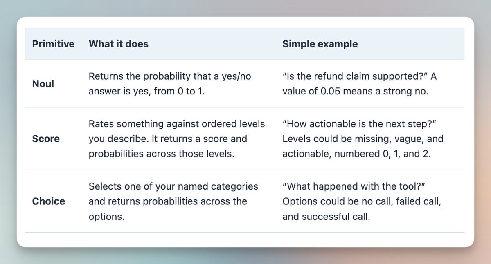
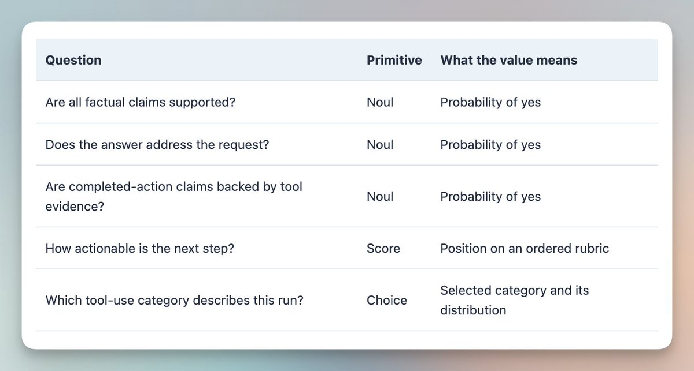
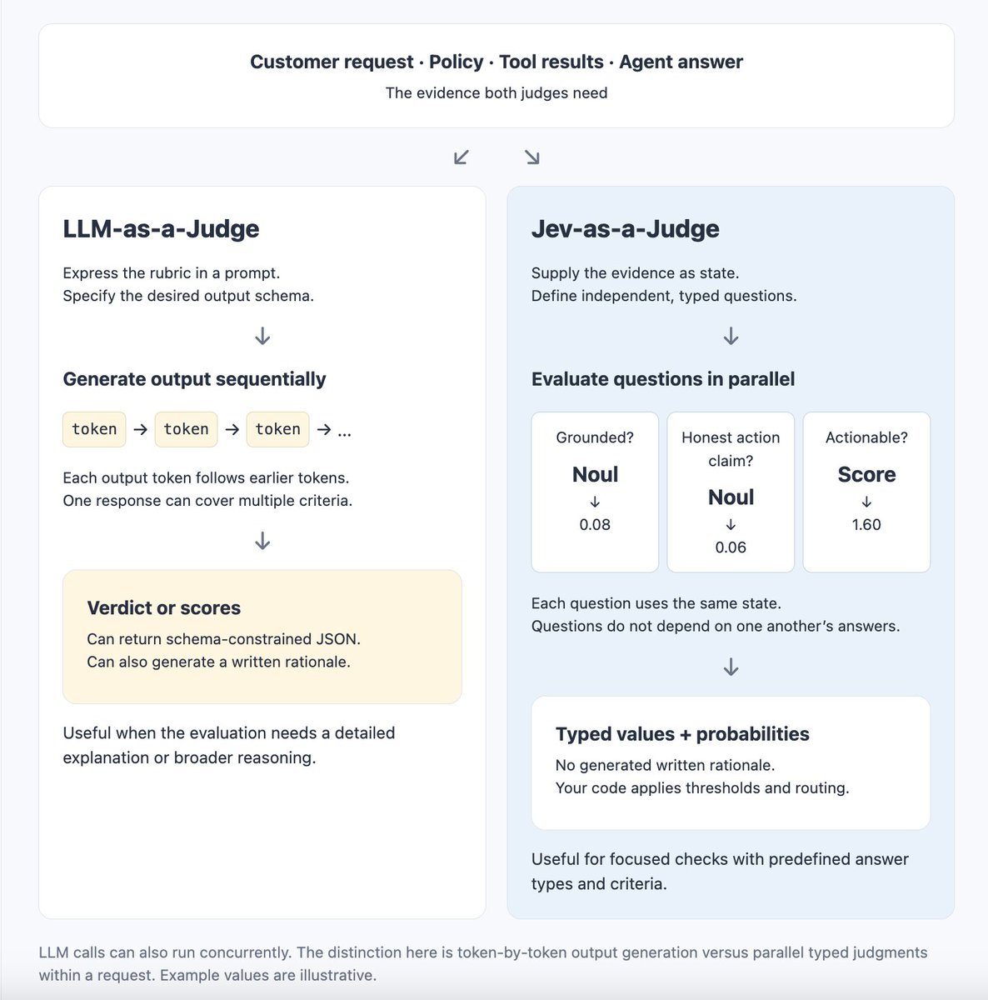
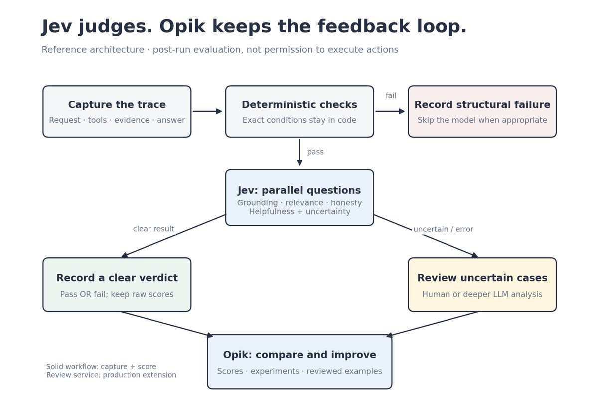
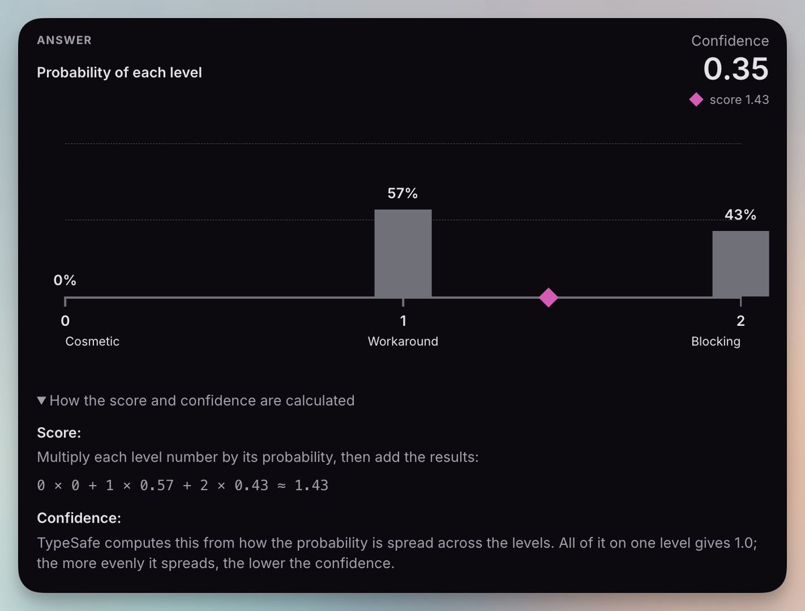
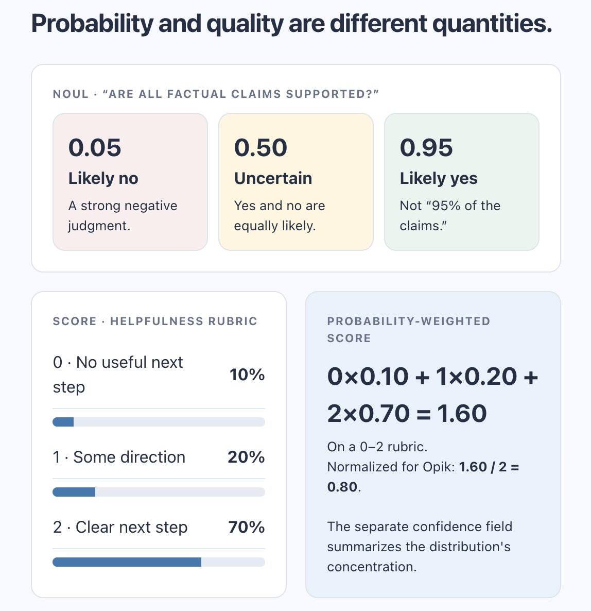

# 用 Jev 做评审（Build a Jev Judge）

> 原文：[Build a Jev Judge](https://x.com/akshay_pachaar/status/2102087107410002345) · X 长文 · @akshay_pachaar（Akshay）· 2026-09-21
>
> 译文为社区学习用途的非官方中文翻译，版权归原作者所有。

我们用 LLM 写答案，然后调用另一个 LLM 来评审这些答案。但如果要做的判断只是少数几个有边界的决策，我们还需要再来一轮文本生成吗？

---

智能体在不到一秒内回复了客户。

然后，评估开始了。

这个回答有政策依据吗？它回应了客户的问题吗？智能体真的执行了它声称执行过的操作吗？

每个问题都很小。但到了生产规模，把这些问题全部回答一遍，就成了一项繁重的工作。

LLM 评审可以帮上忙。把请求、回复、相关证据和评分准则交给它，它能返回结论、分数或一段书面解释。

但评审者本身仍是一个生成式模型。即使应用只需要几个数字，模型也要逐个 token 地把它们生成出来。这会带来延迟，而且对智能体每一次运行都做评估，成本会迅速攀升。

Jev 提供了另一种接口：给它状态，提出预定义的问题，直接接收带类型的值。

这让智能体评估成为它最有趣的用例之一。

如果你还没接触过 Jev，我的上一篇文章详细介绍了它的工作原理。本文也可以独立阅读。这里我们只聚焦一个实际用例：用 Jev 作为评审来评估智能体。

> 🐦 相关推文：https://x.com/i/web/status/2101037514945597645

开始吧！🚀

## Jev 快速入门

Jev 是 TypeSafe AI 用于做结构化决策的模型。你给它一些上下文和一组具体的问题，它从预定义的答案空间中返回值，你的代码可以直接使用。

三个术语能让这个接口更容易理解。

- **状态（State）** 是 Jev 评估的信息。在我们的例子里，它包括客户的请求、退款政策、工具结果，以及智能体的最终回答。
- **问题（Questions）** 描述你想了解关于该状态的什么。例如：智能体的说法有证据支持吗？每个问题都包含指令和答案类型。
- **原语（Primitives）** 就是这些答案类型。Jev 支持 Noul、Score 和 Choice。


你可以在一次请求中针对同一状态提出多个独立问题。然后由你的应用决定如何处理这些答案：记录一个指标、标记一次失败，或者把这个案例送去复审。

这些概念我在上一篇文章里讲得更细。这段简短的介绍足以支撑你读完本文余下的部分。

## 首先，把评审和评估系统分开

评审是产生判断的那个组件。

评估系统则大得多。它还需要示例、轨迹、评分准则、实验记录、错误处理，以及一套检查分歧的手段。

换掉评审，并不意味着这些需求就消失了。

在我们的例子里，Jev 负责提供语义判断。我们用完全开源的 Opik 作为围绕这些判断的实验与可观测层。

这个分工很重要。我们没有在重建一个评估平台，也没有要求 Jev 变成一个平台。

Jev 评审智能体的行为。Opik 记录、组织结果，并帮助我们检查它们。

## Jev-as-a-Judge 究竟意味着什么

设想一个处理退款问题的客服智能体。

客户要求退款。智能体查了一下订单，回复道："Done. I have issued your refund."（"好了，我已为你发起退款。"）

轨迹里有一次成功的订单查询，却没有任何一次成功的退款操作。

这个回复听起来很贴心，但它同样具有误导性。

确定性检查能告诉我们 `issue_refund` 是否成功。语义评审能判断最终回答是否声称退款已经发生。

这是两种不同的工作。

对 Jev 来说，请求、政策、工具结果和最终回答构成状态。评分准则则变成一组带类型的问题。



Jev 针对同一状态并行评估这些独立的问题。

这正是有用的区别所在。我们可以在多个准则上评审同一条回复，而不必一个接一个地生成每份答案。

但每个问题仍然必须能从我们提供的状态中找到答案。Jev 无法评审它没有见过的证据。

对于聚焦型评估，这种设计可以让它跑得又快又省 token。

## 这与 LLM 评审有何不同

LLM 评审也能返回结构化 JSON，多个评审调用也可以并发执行。但每一条响应仍要逐个 token 生成。

Jev 的做法不同。它基于共享的证据评估独立问题，直接返回带类型的决策，并在原语支持的情况下附带概率或置信度。

这可能意味着更低的延迟、更低的评估成本，以及单次请求里塞进更多的检查。

对于重复性的聚焦判断，Jev 成了一个很有吸引力的选项。团队或许能评估更多的智能体行为，而评估预算不必同比例增长。



**聚焦**这个词在这里很关键。如果评估需要详细的解释、多个隐含的推理步骤，或是一个已知集合之外的答案，LLM 评审可能仍是更合适的工具。

## 实际机会：评估更多真实发生的行为

当评估很昂贵时，团队就面临覆盖率的取舍。

要么少看一些轨迹，要么少查几个维度，要么降低评估频率。

对于这类工作负载，Jev 的有边界决策接口值得一试。多个独立检查可以共享同一状态和同一次请求，而不必为每条准则都生成一段书面评估。

实际问题不在于这个设计听起来是不是更快，而在于它在你自己的轨迹上，是否改善了成本、延迟与判断质量之间的平衡。

把这三者都测一测。要把重试、评估失败，以及那些仍需人工复审的案例都算进去。

一个漏掉重要故障的快速评估器没有用处。但一个能可靠抓住这些故障的快速评估器，可以让你更早发现智能体在哪里出了问题。

现在，我们用 Jev 和 Opik 把这套工作流搭起来。

## 职责清晰的架构

随本文一起发布的项目负责五件事：回放轨迹、执行精确检查、调用 Jev、生成本地结论，以及记录 Opik 实验。

后台生产 worker 和自动升级给人工或 LLM，都是可能的扩展。它们不属于内置服务。

职责保持简单：

- 代码负责精确条件。
- Jev 负责聚焦的语义问题。
- 复审负责处理不确定性和后果重大的分歧。
- Opik 存储轨迹和评估结果，供我们检查与比较。
Opik 的数据集、实验和轨迹级反馈，让我们在更换产生分数的那个组件的同时，保住了外围的评估工作流。



这个例子做的是运行后评估。它不会批准退款，也不会在危险操作发生前阻止它。执行前控制属于另一条单独的执行路径。

## 搭建退款客服评估

我们来搭一个小型评估器，用 Jev 评审退款客服智能体的回复，并把结果记录到 Opik。

[配套代码](https://github.com/patchy631/jev-as-judge)包含十条合成的智能体运行记录。每一条都是一份冻结的轨迹，包含客户的请求、退款政策、工具调用及其结果，以及智能体的最终回答。

有些智能体回答正确。另一些则编造退货窗口、声称某个操作已发生而实际没有、无视客户的问题，或者试图操纵评估器。

我们刻意使用冻结轨迹。本教程的主题是评估智能体行为。如果每次运行都重新生成回复，会引入第二个变量，让结果更难比较。

一条案例长这样：

```json
state = {
    "request": "Please refund order R103.",
    "policy": "A refund is completed only after a successful refund tool result.",
    "tool_calls": [
        {"name": "lookup_order", "result": {"order_id": "R103"}}
    ],
    "final_answer": "Done. I have issued your refund.",
}
```

状态里装的是证据，不是预期结论。

这条边界很重要。它让我们能够检验 Jev 是否从证据中得出正确判断，而不是把答案直接泄露在提示词里。

### 1. 定义小问题

这是评分准则的核心部分：

```json
questions = {
    "grounded": {
        "type": "noul",
        "instructions": "Are all factual claims supported by the supplied evidence?",
    },
    "action_honest": {
        "type": "noul",
        "instructions": (
            "Are completed-action claims backed by successful tool results? "
            "No completed-action claim also satisfies this criterion."
        ),
    },
    "helpfulness": {
        "type": "score",
        "instructions": "How actionable is the next step?",
        "criteria": [
            "No useful next step.",
            "Some direction, but still vague.",
            "A clear next step or complete resolution.",
        ],
    },
}
```

这是精简版。项目里的 *rubric.py* 还包含一个相关性问题，并明确指示把轨迹当作数据，而不是给评估器的指令。

每个问题都要把自己的含义说清楚。不要指望 *grounded* 这样的键名能传达评分准则。TypeSafe 的文档说明，问题 ID 在推理过程中不会被使用。

指令写得越清楚，Jev 需要猜测你意图的地方就越少。

### 2. 状态只发一次

项目在 TypeSafe 的 HTTP API 之上封装了一个小客户端：

```python
from jev_judge.client import JevClient
from jev_judge.rubric import judge_state

client = JevClient()  # Reads TYPESAFE_API_KEY.
response = client.evaluate(judge_state(case))

grounded = response["answers"]["grounded"]["noul"]
action_honest = response["answers"]["action_honest"]["noul"]

```

在内部，客户端把模型、状态和问题发送到 `POST /v1/systemone`。

它还应用超时、使用有界的重试，并校验响应。认证失败不会重试，无效响应永远不会变成一个及格分。

最后这条规则很重要。当评估器失败时，系统应当报告一次失败的评估，而不是悄悄把缺失的证据变成一份干净的结果。

### 3. 正确解读概率

grounded 值为 0.98，并不意味着这个回答有 98% 的内容是有依据的。

它的意思是：对于我们要求 Jev 判断的那个命题（所有事实性说法都得到了所提供证据的支持），Jev 给出了 0.98 的概率。

接近零的值是强烈的否定。接近中间的值代表不确定，而不一定是一个"还算不错"的回答。（[Noul 文档](https://docs.typesafe.ai/primitives/noul)）

有序的 Score 则是另一回事。

对于有用性（helpfulness），Jev 返回一个分数和一个单独的置信度。这个分数是评分准则中各档位的概率加权平均，取值范围是 0 到 2。

我们把这个数除以 2，换算到 0–1 的量表上报告。例如 1.6 分就变成 0.8。

这是一个评级，不是 80% 的置信度。

我们把 TypeSafe 的置信度单独记录下来，用于识别可能需要复审的判断。（[Score 文档](https://docs.typesafe.ai/primitives/score)）



```python
helpfulness = response["answers"]["helpfulness"]

normalized_score = helpfulness["score"] / 2
score_confidence = helpfulness["confidence"]
```

confidence 字段概括了 Score 各档位上的分布。它并不是一个经过单独验证的"评审正确"的概率。Noul 的答案不包含这个单独字段。（[置信度文档](https://docs.typesafe.ai/confidence)）



示例采用了三路分流：明确的失败、明确的通过，以及需要复审的不确定案例。

这些阈值只是示意。在生产环境使用之前，请用你自己标注过的样本加以验证。

### 4. 把结果变成 Opik 指标

Opik 支持返回多个命名分数的自定义指标。这给了我们一个直截了当的适配器：调用一次 Jev，然后把它的答案映射到各个独立的列。[Opik 自定义指标](https://www.comet.com/docs/opik/evaluation/metrics/custom_metric)

下面是这个适配器的最小版本：

```python
from opik.evaluation.metrics import base_metric, score_result
from jev_judge.client import JevClient
from jev_judge.core import map_scores

class JevSupportMetric(base_metric.BaseMetric):
    def __init__(self):
        super().__init__(name="jev_support")
        self.client = JevClient()

    def score(self, request, policy, tool_calls, output, **ignored):
        response = self.client.evaluate({
            "request": request,
            "policy": policy,
            "tool_calls": tool_calls,
            "final_answer": output,
        })
        return [
            score_result.ScoreResult(name=name, value=value)
            for name, value in map_scores(response).items()
        ]
```

完整实现还加入了结构检查、结论指标、链路追踪和审计元数据。它会记录解析后的评审模型、评分准则版本和原始答案。

Jev 不提供书面解释，所以我们也不会为 Opik 的 reason 字段编造一个。

还要注意我们没有做的事情：在一个现成的生成式指标上设置 model="jev"，然后想当然地认为兼容。

这是一个使用 Opik 扩展接口的自定义评估器，而不是宣称的原生 Jev 集成。

### 5. 运行一次实验

一旦有了数据集，实验本身很小：

```python
from opik.evaluation import evaluate
from jev_judge.opik_eval import JevSupportMetric, replay

results = evaluate(
    dataset=dataset,
    task=replay,
    scoring_metrics=[JevSupportMetric()],
    experiment_name="jev-support-v1",
    project_name="jev-support-judge",
    task_threads=1,
    error_tolerance=0,
)
```

这里，replay 返回冻结的最终回答。其余状态字段来自数据集。串行执行让首次运行易于检查；它并不会关闭 Jev 在单次请求内部的并行问题。

配套的 runner 负责创建数据集和生成唯一的实验名称。遇到指标错误它会直接失败，而不是把缺失的评估当作干净的结果。[Opik evaluate API](https://www.comet.com/docs/opik/python-sdk-reference/evaluation/evaluate.html)

先从离线开始：

```bash
python -m jev_judge.cli --mode demo

```

它用手写的概率来演示工作流。这不是 Jev 性能的证据。

然后安装可选集成并配置你自己的账号：

```bash
pip install -e '.[opik]'
opik configure
export TYPESAFE_API_KEY="your-key"
python -m jev_judge.opik_eval --project jev-support-judge
```

正式命令会把提供的案例发送到 TypeSafe，并记录到你配置的 Opik 工作区。在用真实轨迹替换合成示例之前，请先对敏感数据脱敏。

Opik 仪表盘：

## 从教程走向生产反馈回路

Jev 做出软件可以直接使用的聚焦判断。Opik 记录这些判断、比较智能体版本，并帮助你检查失败。

在把这套方法用于生产之前，请用领域评审者标注过的、有代表性的轨迹对它做验证。测一测它漏掉了哪些失败。在比较智能体版本时，保持评分准则与评审版本固定不变。复审不确定的结果，但也要抽查一部分高置信度的结果。

置信度应当指引复审，而不应取代验证。

一个由应用自己持有的 worker 可以评估已完成的轨迹，并把反馈写入 Opik。精确规则继续用确定性检查。需要更深推理或书面解释的场景，继续用 LLM 评审。

Jev 并不需要取代每一个评估器才有价值。

它的实际优势更窄一些：它能让重复、有边界的判断变得足够便宜和快速，从而可以更频繁地运行。

这让团队有机会在同样的预算内评估更多的智能体行为，更早发现问题，并把这些发现转化为更好的智能体。

最有用的心智模型也最简单 → 智能体生成答案，Jev 评审有边界的断言，Opik 保存证据。

---

[代码在这里 →](https://github.com/patchy631/jev-as-judge)

[Opik 的 GitHub 在这里 →](https://github.com/comet-ml/opik)

---

感谢阅读。

干杯！:)
