# 自己动手做一个 Jev（100% 本地）

> 原文：[Build your own Jev (100% local)](https://x.com/_avichawla/status/2101563610644496464) · X 长文 · @_avichawla（Avi Chawla）· 2026-09-20
>
> 译文为社区学习用途的非官方中文翻译，版权归原作者所有。

本文提供了把开源 LLM 变成一个快速、本地化决策引擎所需的全部知识，而且无需重新训练。内容涵盖下一 token 打分、带概率分布的固定选项、SGLang，以及在同一个模型上与标准文本生成所做的实测基准对比。

---

许多 LLM 调用并不需要新写的文本。应用程序已经知道可能的答案，只需要模型从中选一个。

假设一张客服工单上写着："I was charged twice for the same subscription."（同一份订阅被扣了两次费。）

应用程序需要把它派发给三个团队之一：billing（账单）、technical support（技术支持）或 account access（账号访问）。

普通的 LLM 调用会让模型写出一个答案。它可能返回一句话、一个标签或一个 JSON 对象。应用程序等待这段文本，解析它，再提取出被选中的团队。

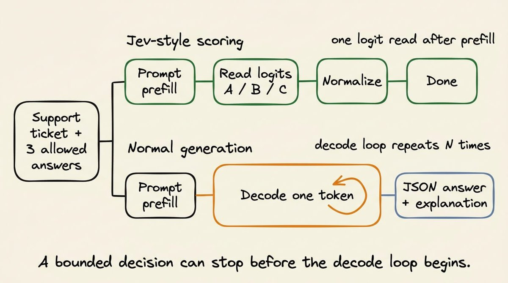

如果每一个合法答案都已知，这些步骤完全没有必要。

事实上，更好也更高效的做法，是把同一个请求当作一个决策来处理（这正是 Jev 的做法）。应用程序把工单/查询和三个允许的答案交给 Jev，模型随后一次性返回每个答案的分数（具体怎么做到，我们很快就会讲到）：

```plaintext
billing             0.91
technical support   0.06
account access      0.03
```

这里 billing 以最高概率被选中，而且应用代码能清楚看到它是以多大的优势胜出的。

这正是 Jev 所具备、而我们将要在本地复现的行为。

我们将提供输入查询和允许的答案。在一次打分请求中，模型就会返回一个决策和一份概率分布，而不生成任何句子或 JSON 对象。

虽然 Jev 是闭源的，但这一推理模式在多个开源语言模型中已经可用。

更具体地说，我们将用 SGLang（通过 /v1/score）实现它，用 Qwen 和 DeepSeek 模型进行测试，并与结构化输出和普通文本生成做对比。


先说清楚预期：本文复现的是推理路径，而不是完整的 Jev 系统。Jev 还包含打分端点所不提供的训练与校准工作。

---

## 固定答案打分与结构化输出不同

Jev 的机制很容易与结构化输出混淆，因为两种方法都会限制应用程序收到的内容，但它们在推理服务器内部所做的工作并不相同。

对于上面讨论的同一张客服工单，结构化输出可能会让模型给出如下输出：

```json
{"team": "billing"}
```

指定的 schema 可以防止出现非法对象，但它自己并不负责选出团队。

不过，这一点仍有改进空间，因为在底层，模型仍然要一个 token 一个 token 地生成左花括号、字段名、值和右花括号。生成结束后，应用程序才能读取 team 字段。下面的视频展示了这一过程：

采用打分（Jev 的做法）时，应用程序可以把这三个团队作为合法结果的完整列表提供出来。服务器为每个结果读取一个模型分数，并返回本文前面展示过的那份分布。它不会生成 JSON 对象。

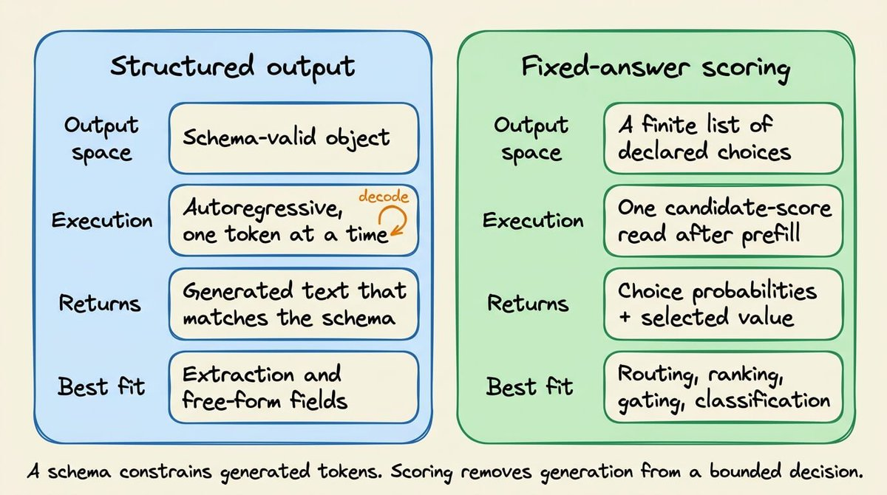

我们可以把三个值都返回，而不是只返回 billing，这样应用代码就能区别对待下面两种结果：

```plaintext
Result 1                          Result 2
billing       0.91                billing       0.46
technical     0.06                technical     0.44
account       0.03                account       0.10
```

例如，在上面这组结果里，两者都会选中 billing。

但第一个结果偏好非常明确，而第二个几乎打成平手。应用程序可以自动路由第一张工单，而把第二张按需送去人工复核。

另外，模型只会给出这些分数，如何下游使用则由应用代码制定规则。

例如，可以要求排名第一的答案超过 0.80，并且至少领先第二名 0.20。这些阈值写在代码里，可以被测试，也可以被修改。

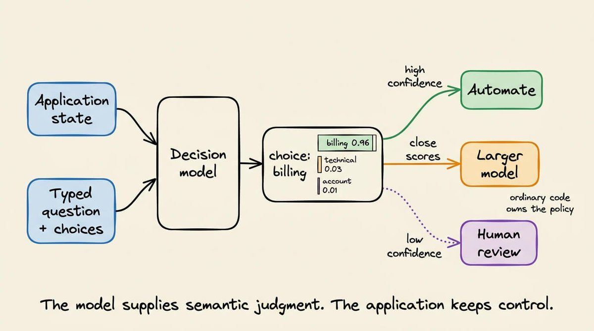

0.91 这个值的含义是：在这三个选择所分配的概率质量中，billing 拿到了 91%。它并不能证明模型在 91% 的情况下都是正确的。要度量这一点，我们需要带标注的样本。这就是我稍后会讨论的校准（calibration）问题。

不过眼下请记住：结构化输出生成的是一个合法对象；固定答案打分返回的是应用程序已知的那些答案上的分布。

---

## LLM 如何生成第一个输出 token

在讨论如何把一个因果 LLM 变成 Jev 式模型之前，最好先理解 LLM 常规的生成步骤。

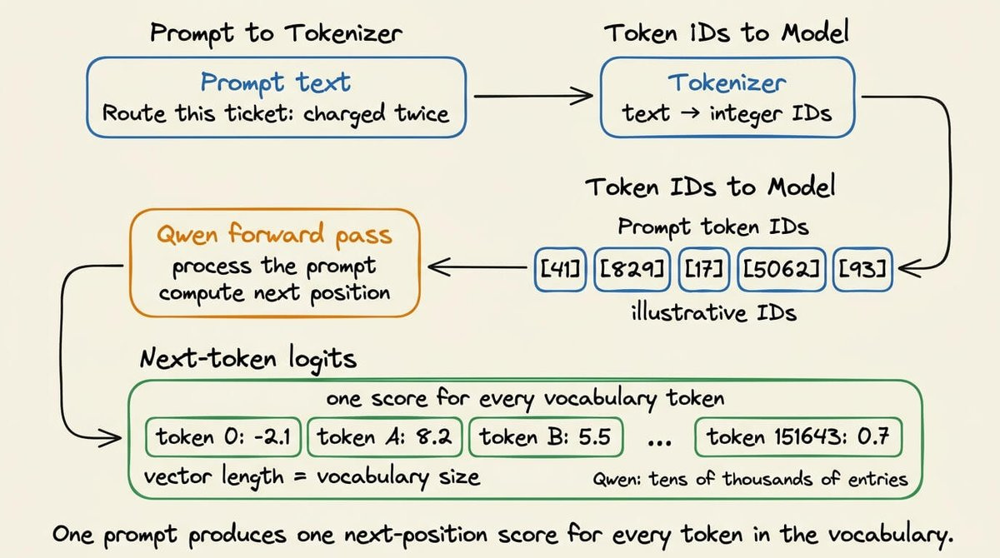

- 分词器（tokenizer）首先把提示词转换成 token ID。
- 模型处理这个序列，并为下一个位置产出一个向量。
- 这个向量中，模型词表里的每个 token 都对应一个数字。例如，Qwen 的词表包含几万个 token，因此这个向量包含几万个数字。
这些原始数字就是 logits。logit 越大，表示模型越倾向于选择该 token 作为接下来的延续。这些值还不是概率。

在正常生成过程中，服务器会对此向量应用模型的解码规则（temperature 等），选出一个 token，并把它追加到提示词后面。

随后模型再为下一个位置产出一个新的、词表大小的向量。生成/解码不断重复这个过程，直到遇到停止 token 或输出上限。

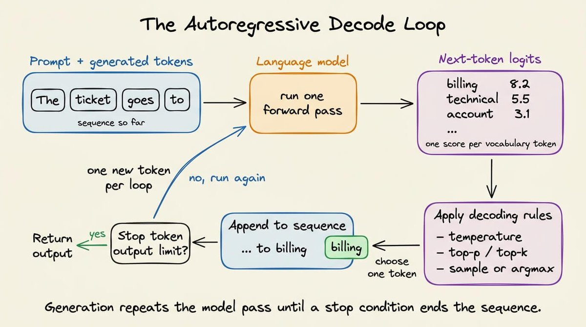

但当我们想做一个有边界的决策时，只需要关心第一个向量。

回想上面讨论的客服路由示例。应用程序接受三个答案：

```plaintext
billing
technical support
account access
```

在提示词中，我们可以给每个答案分配一个短标签：

```plaintext
A = billing
B = technical support
C = account access
```

提示词以要求返回一个标签收尾。

```plaintext
Route the support ticket into exactly one category.

Ticket:
I was charged twice for the same subscription.

Allowed labels:
A = billing
B = technical support
C = account access

Return only the label.

Label:
```

"Label:" 是提示词的最后一段文本。

因此，下一个位置正是模型在正常情况下会生成 A、B 或 C 的地方。

处理完这个提示词后，模型会照常为该位置产出一个词表大小的向量。这个向量将包含 token A 的 logit、B 和 C 的 logit，以及词表中其余每个 token 的 logit。

打分路径接下来可以执行四个操作：

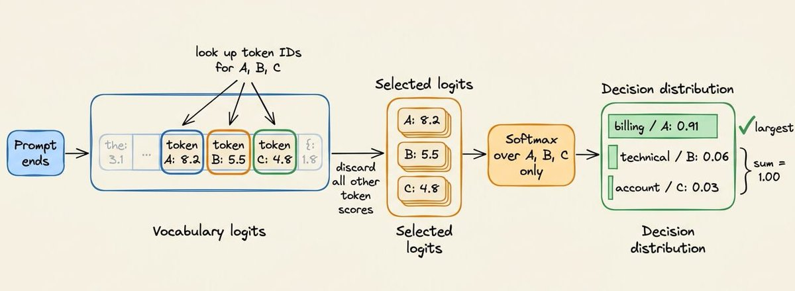

1. 找到 A、B、C 的 token ID。
1. 读取词表向量中这些位置上的三个 logits。
1. 忽略其余所有 logits。
1. 对选出的三个值应用 softmax。
如果选出的 logits 是 8.2、5.5 和 4.8，那么受限 softmax 会得到约 0.91、0.06 和 0.03。我们可以把这些位置映射回 billing、technical support 和 account access。

归一化只限于已声明的选项。我们问的不是 A 在整个词表上是否拥有 91% 的概率。

我们问的是：在应用程序排除了其他一切回答之后，模型如何把它的偏好分配到 A、B、C 之间。

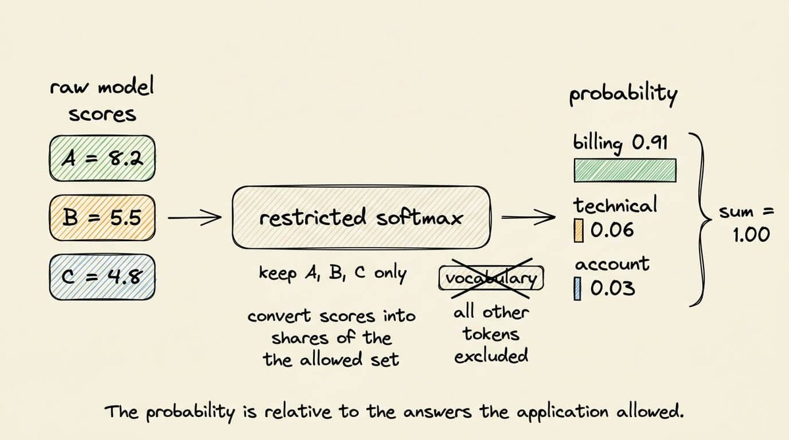

这正是 SGLang 已经在 /v1/score 中实现的操作。

它把提示词送进模型，读取指定的 token 位置，并返回它们的分数。这样我们就不用修改 Qwen 的实现、自己去提取最后的张量了。

顺便说一句，答案之所以使用 A、B、C，而不是直接给 "billing"、"technical support"、"account access" 这些词打分，是因为一个可见的词未必是单个 token。

例如：

- "billing" 在一个分词器下可能是单个 token，在另一个分词器下可能是多个 token。
- "technical support" 则必然跨越多个位置。
比较这些短语需要序列打分。模型必须先给第一个 token 打分、追加它，再给下一个 token 打分，然后把整条短语的值合并起来。长度也会成为比较的一部分。

而单 token 标签避开了这个问题。每个选项都由同一个输出位置上的一个词表条目表示，而语义含义仍然出现在提示词中：

```plaintext
A = billing questions and payment problems
B = product errors and technical failures
C = login, password, and account access problems
```

模型在处理提示词时会读到这些描述。标签只是我们事后检查其 logit 的那个 token。

我们仍然要验证每个标签确实是单个 token。

例如，分词器常常把前导空格编入 token。因此字符串 "A" 和 " A" 可能拥有不同的 token ID。

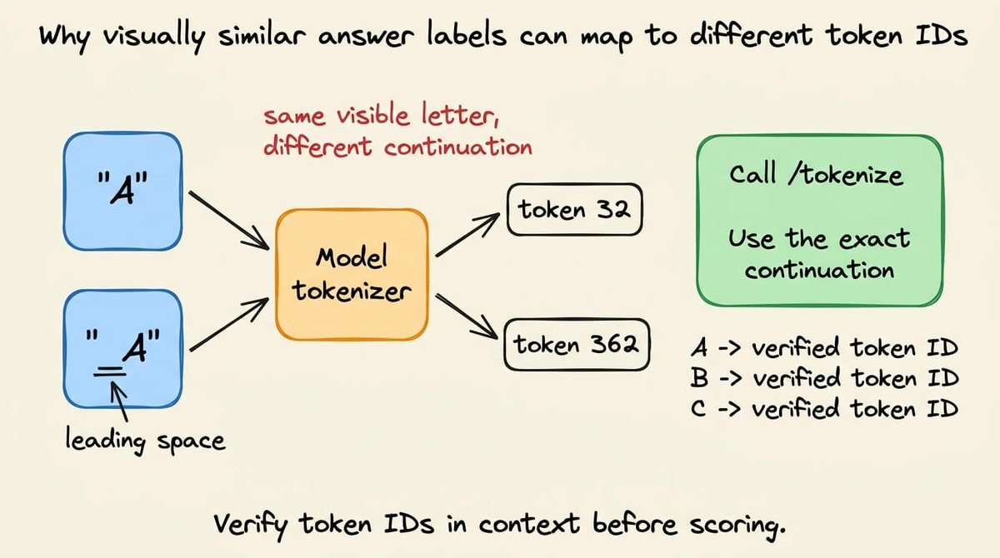

聊天模板也可能在答案位置之前紧挨着放置空白字符或控制 token。

为了避免这些问题，要用模型的聊天模板渲染完整提示词，确定答案位置处期望出现的精确延续文本，再把这个延续文本发送给 /tokenize。如果它产生的不是单个 token，就拒绝该标签。

这层标签映射只存在于打分客户端内部。应用程序发送的是 billing、technical_support 这类语义选项，从不发送 token ID，也永远不会收到 A、B 或 C。这就是"公共 API 与模型标签保持独立"的含义。

最后，当列出的选项并不完备时，答案列表还需要一条兜底出口。

例如，一个安全事件到达一个只提供 billing、technical support 和 account access 的路由时，受限 softmax 仍会把全部概率质量分配给这三个错误选项。

为避免这种情况，当所有具名选项都可能不正确时，请添加 OTHER 或 ESCALATE。

---

## 用 SGLang 实现本地打分端点

本地示例只需要一个推理服务器。SGLang 把 Qwen 加载进 GPU 显存，并暴露其原生 HTTP 端点。我们的 Python 脚本直接向这台服务器发送请求。

完整流程如下：

1. 用一个 Qwen 模型启动 SGLang。
1. 把决策写成带字母标签的提示词。
1. 让 SGLang 对这些标签做分词。
1. 向 /v1/score 发送一次请求。
1. 把返回的概率映射回各个选项。
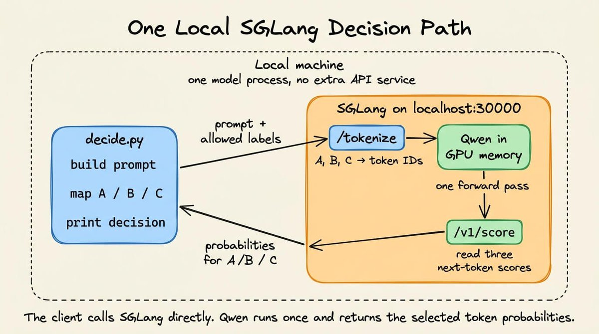

### 第 1 步：用 SGLang 启动 Qwen

创建一个 Python 环境，并安装本文用到的两个包：

```bash
python3 -m venv .venv
source .venv/bin/activate
pip install "sglang[all]==0.5.10.post1" "requests==2.34.2"
```

然后启动模型服务器：

```bash
python -m sglang.launch_server \
  --model-path Qwen/Qwen2.5-0.5B-Instruct \
  --host 127.0.0.1 \
  --port 30000
```

首次启动会从 Hugging Face 下载模型，之后的启动会复用本地缓存。加载完成后，Qwen 常驻内存，SGLang 监听 30000 端口。

这个 SGLang 进程就是推理服务。在运行下面的客户端时，请让它保持运行。

### 第 2 步：定义选项并构建提示词

创建 decide.py，代码如下：

```python
import json
import requests

BASE_URL = "http://127.0.0.1:30000"
MODEL = "Qwen/Qwen2.5-0.5B-Instruct"

choices = {
    "A": "billing and payments",
    "B": "technical support",
    "C": "account access",
}

ticket = "I was charged twice for the same subscription."
choice_lines = "\n".join(
    f"{label} = {meaning}" for label, meaning in choices.items()
)

prompt = f"""Ticket:
{ticket}

Question:
Which category matches the ticket?

Allowed labels:
{choice_lines}

Return only the label.
Label:
"""

print(prompt)
```

这个字典记录了每个答案的两种表示。

- A 是我们打分的 token。
- 而 "billing" 是返回给应用程序的含义。
- 在分词、打分和结果映射的整个过程中，两者的顺序必须保持不变。
这就是此处生成的确切提示词：

```plaintext
Ticket:
I was charged twice for the same subscription.

Question:
Which category matches the ticket?

Allowed labels:
A = billing and payments
B = technical support
C = account access

Return only the label.
Label:
```

提示词在 "Label:" 处结束。

我们要的是模型给下一个本该出现的 token 的分数。我们并不要求 SGLang 生成那个 token。

### 第 3 步：解析标签的 token ID

在提示词代码之后加上这段代码：

```python
label_token_ids = []

for label in choices:
    response = requests.post(
        f"{BASE_URL}/tokenize",
        json={
            "model": MODEL,
            "prompt": label,
            "add_special_tokens": False,
        },
        timeout=30,
    )
    response.raise_for_status()
    token_ids = response.json()["tokens"]

    if len(token_ids) != 1:
        raise ValueError(
            f"{label!r} is not a single token: {token_ids}"
        )

    print(f"{label!r} -> {token_ids}")
    label_token_ids.append(token_ids[0])
```

SGLang 的 /tokenize 端点返回 Qwen 分词器产出的整数 ID。任何会被拆成多个 token 的标签都会被拒绝。打分请求需要每个答案对应一个词表位置。

对于 Qwen/Qwen2.5-0.5B-Instruct，这会打印：

```plaintext
'A' -> [32]
'B' -> [33]
'C' -> [34]
```

每个列表都只包含一个整数。因此我们确知每个标签只占一个 token。后面的打分请求将读取词表的 32、33、34 号位置。

这项检查也让我们避免想当然地认为各模型的分词结果一致。在 Qwen 下可用的标签，换一个分词器就可能被拆开。

### 第 4 步：向 SGLang 请求三个概率

接着添加打分请求：

```python
response = requests.post(
    f"{BASE_URL}/v1/score",
    json={
        "model": MODEL,
        "query": prompt,
        "items": [""],
        "label_token_ids": label_token_ids,
        "apply_softmax": True,
    },
    timeout=120,
)
response.raise_for_status()
score_response = response.json()

print(json.dumps(score_response, indent=2))
scores = score_response["scores"][0]
```

- query 包含完整提示词。
- 空的 "items" 表示我们对紧随其后的那个位置打分。
- "label_token_ids" 告诉 SGLang 从 Qwen 那个词表大小的输出中读取哪三个条目。
- "apply_softmax" 把这些条目归一化成概率。
由于 items 只有一个条目，响应中也只有一个分数列表。我们用同一个 Qwen checkpoint 跑了这条一模一样的提示词，得到：

```json
{
  "scores": [
    [
      0.67776233,
      0.310878605,
      0.011359035
    ]
  ]
}
```

这三个位置分别对应 A、B、C。softmax 之前，选中的 logits 分别是 25.277620、24.498226 和 21.188837。在不同的硬件与精度设置下，可能出现细微的数值差异。

官方端点参考文档说明，每个返回的列表都遵循 label_token_ids 的顺序。因此第一个分数属于 A，第二个属于 B，第三个属于 C。

### 第 5 步：把模型标签转换回决策

最后加上映射代码，完成这个脚本：

```python
probabilities = {
    choices[label]: float(score)
    for label, score in zip(choices, scores, strict=True)
}

decision = max(probabilities, key=probabilities.get)

print(
    json.dumps(
        {
            "decision": decision,
            "probabilities": probabilities,
        },
        indent=2,
    )
)

```

现在，在第二个终端中运行这个脚本：

```json
// Output after running python decide.py

{
  "decision": "billing and payments",
  "probabilities": {
    "billing and payments": 0.6777623295783997,
    "technical support": 0.31087860465049744,
    "account access": 0.011359035037457943
  }
}
```

这些计算由 SGLang 在 /v1/score 背后完成。一个 SGLang 进程对标签分词、运行一次 Qwen、返回选中的概率。

在这个例子中，billing 获胜，但概率只有 0.678。如果策略要求 0.70，这张工单就会被送去复核，而不是自动路由。该阈值应当来自在带标注样本上进行的评估。

---

## 打分延迟与自回归生成的实测对比

上面的单请求示例展示了机制本身。我还构建了一个小应用，用来测试这个机制在大量决策下的表现。

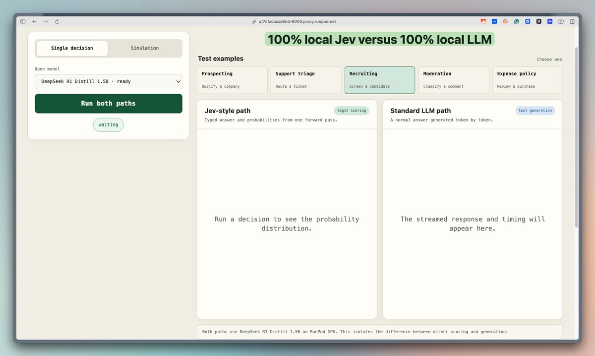

部署好的 demo 支持多个开源模型，例如 Qwen 3 4B、Qwen 2.5 0.5B 与 1.5B、SmolLM2 1.7B、TinyLlama 1.1B，以及 DeepSeek-R1-Distill-Qwen 1.5B。


Jev 式赛道调用决策方法：

```python
result = engine.decide(request)

answer = result["answers"]["decision"]

choice = answer["choice"]

probabilities = answer["probabilities"]
```

在 decide() 方法内部，SGLang 通过 /v1/score 接收提示词。请求中包含 A、B、C 的 token ID。

SGLang 跑一遍提示词，读出这三个下一 token 分数，将其归一化，然后停止。响应中不包含任何生成的 token。

标准赛道在同一个引擎上调用生成方法：

```python
result = engine.generate_response(
    case["state"],
    case["question"],
    list(case["criteria"].items()),
    max_tokens=32,
)
```

该方法把同样的状态、问题和选项发送给 /v1/chat/completions。

Qwen 生成一个答案和简短解释，最多 32 个 token。应用程序会在前 100 个字符中搜索允许的选项名称。当解析出的选项与存储的标签一致时，该案例被标记为正确。

下面的视频通过一些示例，对比了我们 100% 本地的 Jev 与 100% 本地的 LLM 生成器：

出于上文已经讨论过的原因，速度差距一目了然。

与此同时，我还基于固定的本地数据集构建了一个 100 个案例的仿真。

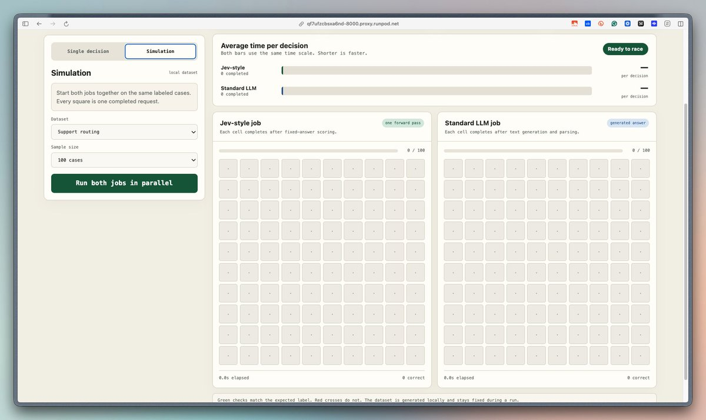

目前的数据集覆盖客服路由、候选人筛选和费用审核。它们自带的期望标签让界面能同时展示速度和正确性。

远端 SGLang 路径在一个 barrier 之后启动两个 worker：

```python
starting_line = threading.Barrier(2)

def worker(lane, runner):
    starting_line.wait()
    for case in cases:
        updates.put(runner(case))

workers = [
    threading.Thread(target=worker, args=("jev", run_jev)),
    threading.Thread(target=worker, args=("llm", run_llm)),
]

for worker_thread in workers:
    worker_thread.start()
```

barrier 会同时放行两个 worker。每条赛道按顺序处理自己的案例。Jev 式 worker 一旦上一个请求结束，就立刻发出下一个打分请求；标准 worker 对生成请求也是如此。

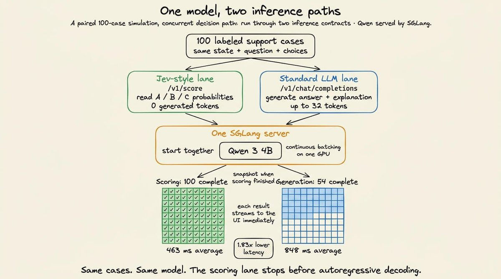

因此两条赛道始终保持同时活跃，但我们并不会一次性发出全部 200 个请求。SGLang 同时接收来自两条赛道的并发任务，并通过 continuous batching 进行调度。两类请求共享同一块 GPU、同样的显存带宽和同一个调度器。

下面的视频并排对比了 Jev 与一个 LLM：

两条赛道同时启动，并在同一台 SGLang 服务器上使用了 Qwen/Qwen3-4B-Instruct-2507。

---

## 如何选择合适的方法

打分并不能取代生成，因此 Jev 的方法只在应用程序于推理之前就定义好输出空间时才适用。

理想情况下，兼容的工作负载应该有一组有限且有意义的标签。每个标签都应映射到一个不同的下游动作。

而且调用方需要的仅仅是一个标签及其概率分布，而不是新的文本。

结构化输出则不同：它定义的是响应的语法，解码器仍要逐个 token 地生成字段名和值。

当这些值无法事先枚举时，请使用结构化生成；因为只有候选值已知时，打分才能真正省去解码。

下面这张图比较了常规 LLM 解码、结构化输出解码和 Jev 式打分：

一个不错的做法是：根据所需的输出选择推理路径。

- 当输出内容在推理之前未知时，选择生成。
- 当输出集合已知、且做出选择就足够时，选择打分。这种情况下，第一个下一 token 向量已经包含了排序。返回这个排序，就省掉了调用方并不需要的自回归循环。
再次强调：本文项目复现的是 Jev 式推理机制，但并未复现 Jev 的权重、RLCD 流程或评测体系。

这些背后的过程，我打算很快写给大家。

敬请期待！

---

就到这里！

如果你喜欢这篇教程：

找我 →  @_avichawla

我每天都在分享 DS、ML、LLM 和 RAG 方面的教程与洞见。
