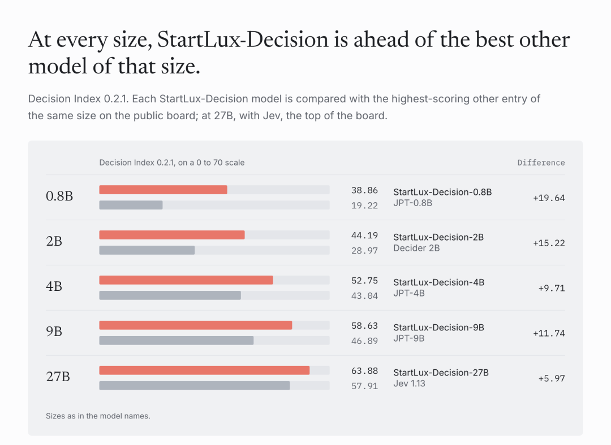
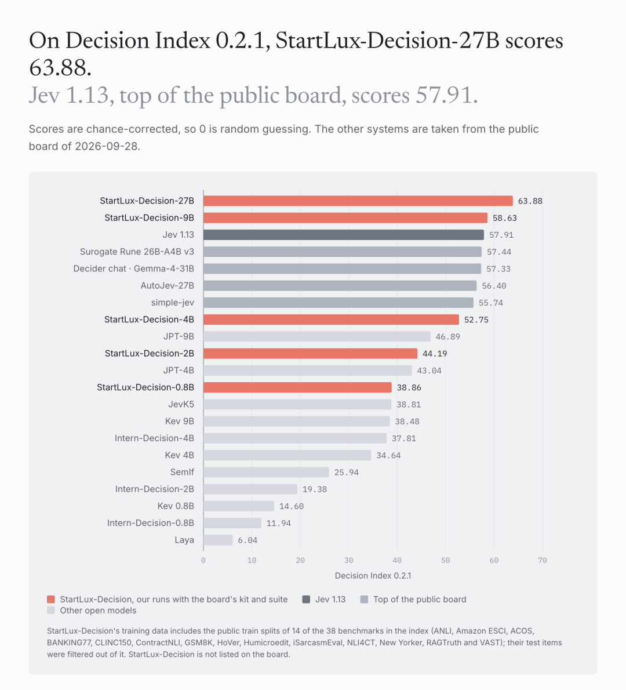
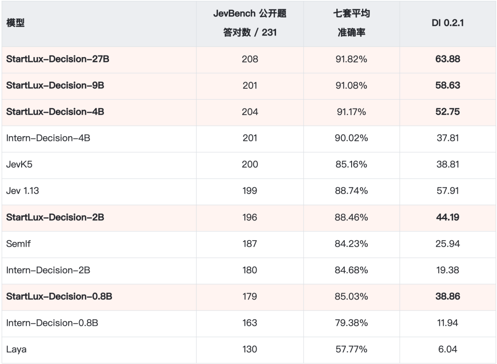
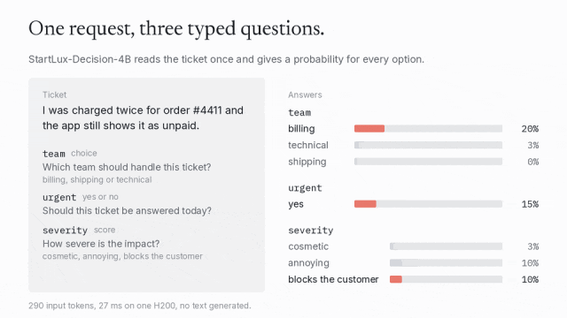
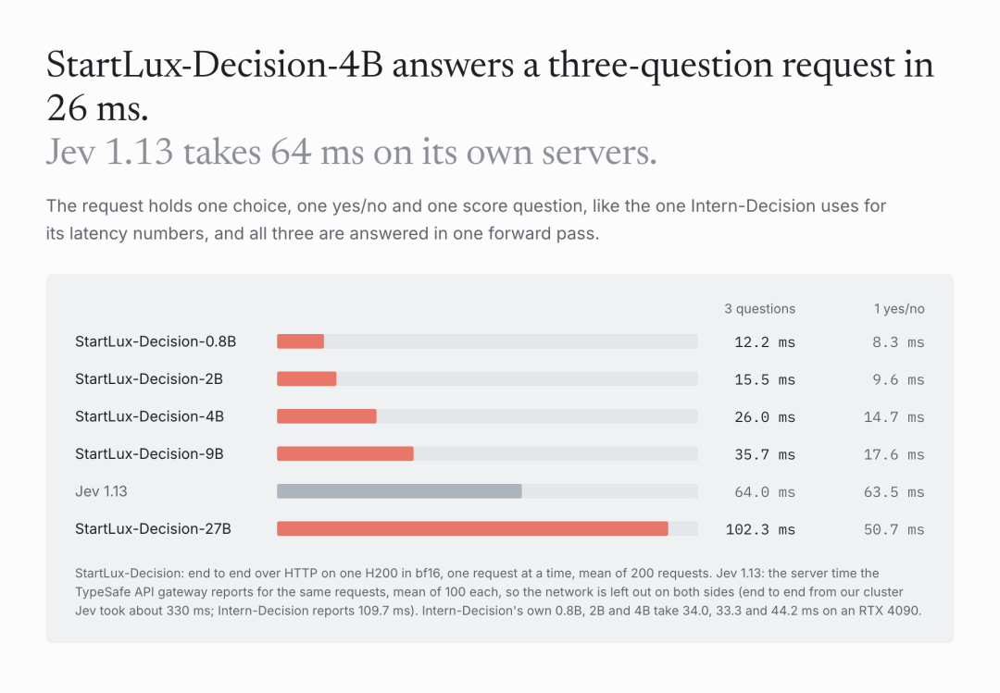
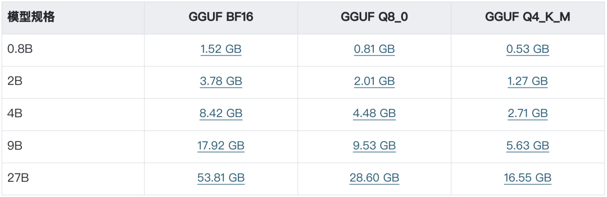
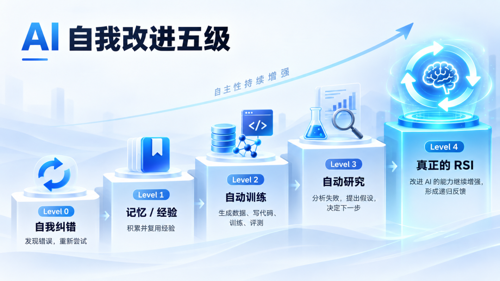

# Jev被请下王座，StartLux中国开源决策模型冲上第一

> 原文：[Jev被请下王座，StartLux中国开源决策模型冲上第一](https://mp.weixin.qq.com/s/finDwlosNkRSSstuKlwQbg) · 微信公众号「机器之心」 · 2026-10-03
>
> 中文原创报道，经非官方快照收录，仅作社区学习用途；版权归机器之心所有，转载请联系原公众号获得授权。

机器之心编辑部

9 月 30 日，一款决策模型正式发布，迅速引发巨大关注：在 Decision Index 0.2.1 的 38 项基准测试中，它有 31 项成绩超过当前最热门的 Jev，综合得分 63.88 对 57.91，领先公开榜首近 6 分；而且，它完全开源。

实战对比更能说明问题——在与 Jev 的国际象棋对弈中，它的响应速度与对手不相上下，却在 36 局中赢下 35 局。

拿出这款模型的公司，正是当下炙手可热的上海 AI 明星企业 StartLux（原点星辉）。这家成立不到 5 个月的公司，已经是第二次拿出震惊业界的成果：

上一次，StartLux-27B 的本地模型在工信部中国信通院测试中超过 284B 的 DeepSeek-V4-Flash；并以约 1/60 的参数量基本打平 DeepSeek-V4-Pro 。这一次，是完全开源的 StartLux-Decision——以公开评测的综合成绩而论，它已经是目前全球最强的决策模型。

超过 Jev

这次，StartLux 的 Decision 模型一口气推出 0.8B、2B、4B、9B 和 27B 五档版本，并提供支持本地部署的量化模型。

GitHub 链接：https://github.com/StartLuxLabs/Startlux-Decision

Hugging Face 模型合集下载：https://huggingface.co/collections/startlux-models/startlux-decision-6abba92b301b573fa154d493

实力如何？不妨先看一盘国际象棋。

对手是近期受到关注的 Jev 1.13。双方看到相同棋盘状态，不借助额外搜索，每一步都由模型直接选择。

最终，StartLux-Decision-27B 完成将死。在这次对局中，它的平均损失、最佳着法命中率和失误次数等指标也表现更好。这样的棋局，StartLux 在 36 局中赢下 35 局。

再来看下具体的测试情况。首先是 StartLux-Decision 的整体成绩，无需多言，直接看数字。

再来看 27B 版本的得分。

在独立的 Decision Index 0.2.1 中，StartLux-Decision 的 27B 版本得分 63.88，38 项基准里有 31 项高于 Jev 的最新版本 Jev 1.13；在另一套七项测试中，StartLux-Decision-27B 平均准确率达到 91.82%。需要说明的是，上述成绩为 StartLux 团队基于公开评测工具、对照 2026 年 9 月 28 日 Decision Index 公开榜单快照完成的自测结果；七项公开测试来自上海 AI Lab Intern-Decision 团队的评测集，与 Decision Index 是两套相互独立的口径。

为什么 Agent 需要

一种专门负责「判断」的模型？

Decision 模型最近热度攀升。那么，为什么 Agent 需要 Decision（决策）模型，要它来专门负责判断？

先来看 StartLux-Decision 实际在做什么。

在 StartLux 展示的一个客服工单 Demo 里，系统收到这样一条消息：「订单已经被重复扣款两次，但系统仍然显示未支付。」

传统生成式 AI 通常会先理解问题并生成一段分析，而 StartLux-Decision 可以在一次请求中同时完成三项明确判断：分流团队、处理时效及严重等级。

客服工单 Demo：一次请求完成团队分流、紧急程度判断和严重等级判断。

这里体现了 Decision Model 与普通生成模型最直观的区别：它不需要先生成自然语言再由程序解析，而是直接针对开发者提供的候选项进行选择、是非判断或等级评分。

这类能力放进 Agent 后，作用会更加明显。

比如下面这个购物 Demo。用户给 Agent 的要求是：购买「最便宜、免运费的 8 节装 AA 电池，并寄到家庭地址」。

系统综合考虑型号、数量、价格和配送条件。每轮由 StartLux-Decision 根据当前页面状态判断下一步操作及任务是否完成；执行操作后更新页面状态并继续判断，直至完成下单并通过任务条件检查。

购物 Demo：筛选满足 AA、8 节装、免运费和最低价等条件的商品，并完成下单。

类似的模式也出现在办公协作 Demo 中。任务是把指定成员邀请到 Design 团队，并设置为 Editor。模型需要依次选对团队、成员和角色，随后判断邀请流程是否已经完成。

团队管理 Demo：选择 Design 团队、邀请指定成员，并设置 Editor 权限。

这几个 Demo 的共同点在于，答案空间是相对明确的。浏览器控件、客服部门、工具列表均已提前定义。不同于 LLM 擅长的开放式内容生成（如写邮件、做规划），大量 Agent 步骤的需求非常短小（如 Yes/No、三选一、五级评分或工具选择）。

如果把时间往回拨，会发现这里发生了一个很有意思的循环。

传统软件时代，工程师会把业务拆成大量规则。金额大于多少进入哪条流程，出现某种状态触发什么操作，不同用户进入哪个权限分支。系统很精细，但大量逻辑需要人工提前写好。

LLM 出现以后，大量这种显式逻辑被模型吸收。开发者开始直接把自然语言和环境状态交给大模型，让同一个模型完成理解、分类、判断、规划和生成。系统变得更通用，也更灵活。

到了 Agent 阶段，AI 重新开始分工——确定性流程交给代码，搜索交给 Embedding，复杂规划交给 Reasoning Model，而高频选择则开始出现 Decision Model 这样的专用模型。

算力也随之开始更精细地分配。

StartLux 公布了一组速度测试。在单卡 H200、BF16、本地 HTTP 和短请求条件下，StartLux-Decision-4B 一次回答三个问题平均耗时 26 毫秒；0.8B 和 2B 分别为 12.2 毫秒和 15.5 毫秒。

团队还使用 CUDA Graph、快速线性注意力算子，并把多个问题合入一次前向计算，以降低重复计算和调用开销。

当一次 Agent 任务包含几十个判断节点时，每一步究竟需要多少计算，很快就会影响整个 Agent 的响应速度和运行成本。

这也解释了为什么 Decision Model 会在短时间内快速升温。它处理的很多事情看起来都很小：选择一个工具、判断任务有没有结束、检查某条信息应该进入哪条流程、决定页面下一步点击哪里。可一旦 Agent 开始长时间、规模化运行，这些「小判断」反而可能成为整个系统里调用最频繁的一层。

StartLux 的本地智能开始出现分层

今年 9 月，机器之心曾经和 StartLux 联合创始人兼 CTO 郭权玮聊过一次「本地 × RSI」（原文：《

本地该怎么做 RSI？我们与 StartLux CTO 聊了聊

》）。当时一个很重要的问题是：StartLux 所说的「本地 AI」究竟是什么？

郭权玮给出的边界很宽：包含模型、量化、推理系统、硬件适配，以及上层的 Agent Harness、工具、搜索和持续学习。团队的目标是将这些能力尽可能部署在用户本地设备上。

这与单纯在本地运行一个离线模型有着本质区别。一个长期运行的本地 Agent 必须面对诸多系统级挑战：显存与内存约束、模型精度选择、不同任务在 4B/9B/27B 之间的调度、长上下文管理、步骤中断后的恢复机制、Memory 的存取策略，以及高阶判断的开销平衡。

StartLux-Decision 正是为填充其中特定层级而推出的组件。

在 StartLux 的系统划分中，StartLux-27B 承担通用能力层，Decision Model 专注于高频决策，上层部署 Agent 与 Memory，底层则由量化、推理系统和硬件适配支撑。

这种架构设计始于现实的算力约束：个人电脑的硬件资源存在明确边界。

与云端可通过 GPU 集群扩展模型规模不同，本地系统必须在有限显存、内存、带宽及功耗下长期运转。因此，「单位算力如何高效率分配」成为核心问题。

此前 StartLux 在 27B 模型上的后训练实验已体现出这一逻辑。郭权玮将模型参数形容为一个高维空间，规模决定容量，而训练则是在重构容量中的能力分布。实验显示，针对 Agent 能力后训练后，GPQA 从 83.33 升至 90.40，DeepSearchQA 从 47.04 升至 59.39，Tau3-Banking 也有所提升；但与此同时，GAIA 从 57.57 降至 45.70，IFEval 亦出现下降。

这一现象表明：在固定参数量下，不同能力之间存在资源重新分配。训练过程本质上是在决定参数更倾向于处理何种任务。

Decision Model 则更进一步：将频繁调用且目标明确的特定任务，交由专用的轻量化模型处理。

这也是 StartLux 推出 0.8B、2B、4B、9B、27B 五种规格的原因，以覆盖不同设备与场景。同时提供 BF16、Q8_0 和 Q4_K_M 三种 GGUF 量化文件。

以 4B 规格为例，Q8_0 文件大小约 4.48GB。在团队公布的 231 道公开 JevBench 量化复测中，其与原始权重的决策一致率达 100%，均答对 204 题；压缩至约 2.71GB 的 Q4_K_M 版本后，决策一致率为 98.3%，答对 201 题。

在实际的本地 Agent 系统中，这种规格分化具备明确的工程意义。

一个长期运行的个人 AI 系统可能同时调度多种模型：低延迟判别由小型 Decision Model 完成，复杂推理交付大模型，检索由专业模块承载，长期记忆依赖 Memory，而跨应用操作则由 Agent Harness 协调。模型正逐步转变为计算系统中的不同处理单元。

此外，概率输出也是其关键特性。StartLux-Decision 可输出候选项的概率分布，使系统能够建立路由与分流策略。若模型在已知任务上的置信度达标，系统直接执行后续逻辑；若多个候选项概率接近，则可补充信息、转交更强模型或触发人工确认。

不过，概率本身仍需结合具体业务场景校准。对于支付、删除、权限修改等高风险操作，原有的授权确认机制不可或缺。

这标志着本地智能正从单纯的「模型迭代」演变为综合的「系统工程」。

StartLux 曾设定过明确目标：让用户愿意将文件、研究和办公任务长期托管给本地 AI，确保系统连续工作数小时并维持高任务成功率。

郭权玮指出，目前模型、量化与本地推理系统的推进较快，真正的难点在于长任务稳定性、异常恢复、上下文管理及整体体验。Decision Model 解决的正是这一链路中的特定环节，为高频、候选集明确的判断提供更高性价比的计算形式。

3 天跑通一次 Auto Research

我们再来聊聊这个非常引人注意的数字：3 天。根据团队公布的信息，这次从确定 Decision Model 方向到完成首轮模型研发与验证，大约用了 3 天。对于一个模型项目而言，这一周期相当紧凑。

这得益于 RSI 思路下，StartLux 长期构建的 Auto Research 研发体系：AI 已经进入数据构造、训练、评测和失败分析等研发环节，这在 StartLux 近期的两次模型研发中被连续证明。

在此前的机器之心专访中，郭权玮曾对「70% 实验执行由 AI 参与」这一数据作出解释：若仅统计配置生成、训练启动、Eval 运行与结果整理等机械性工程，自动化率已超 95%；而 70% 指的是在核心的研究与决策环节中，AI 模型参与的比例。

两者的技术难度存在本质差异。自动化启动训练已相对成熟，而难点在于训练结束后的分析与决策：模型为何失败？应补充何种数据？问题出在算法还是推理顺序？下一个实验需调整什么变量？该路线是否值得继续投入算力？

StartLux 将这种高阶决策流程定义为 Auto Research。

郭权玮曾经举过一个金融任务的例子。当系统发现模型在未回查原始数据即直接计算时，失败样本会被送入研究系统。多个 AI 模型协同分析原因并提出假说（如数据覆盖不足、推理链条缺陷或缺乏对应行为强化），系统随后评估方案价值，自动构造数据、启动训练、运行 Eval 并检测能力退化，最终将新结果反馈至下一轮迭代。

在此流程中，AI 已开始承担传统意义上的「科研决策」职能。

StartLux-Decision 即为该管线在新模型品类上的一次落地实践。决策模型确立后，团队需定义其接口规范，围绕动作选择、约束理解、结构化输出等能力构建数据集与评测体系。训练后的异常样本重新进入迭代循环，最终由实测数据决定保留哪些修改。

在基础模型快速更迭的背景下，单版权重的领先周期缩短，研发系统的迁移能力变得更为关键。郭权玮表示，在 StartLux 的实践中，同系列基础模型切换时，积累的数据与训练经验大部分可直接复用，而 Pipeline、Eval 及失败分析体系的迁移率更高。

因此，团队将长期积累的核心资产定义为：数据的有效性识别、失败样本的处理机制、实验评估体系，以及下一轮实验的自动生成能力。

在此基础上，StartLux 进一步提出了 Recursive Self-Improvement（RSI）的五级划分：

Level 0 是 Self-correction，模型发现错误后可以重新尝试；Level 1 开始积累 Memory 和 Experience；Level 2 是 Automated Training，AI 可以生成数据、写代码、启动训练和运行 Eval；Level 3 是 Auto Research，AI 根据上一轮实验分析失败、提出新假设，并参与决定下一步研究方向；Level 4 才进入他定义中的完整 RSI：被改进后的 AI 连「改进 AI 的能力」本身也继续增强，形成递归反馈。

目前，StartLux 将自身定位在 Level 3 阶段。

StartLux-Decision 既是 Auto Research 管线加速产出的成果，同时也是该管线未来可调用的基础组件。因为自动化研究本身包含大量离散决策：哪些失败值得深入分析？下一步调用什么工具？多个实验方案的优先级如何排序？何种情况下终止当前路线？

对于这些候选集明确的任务，让 Decision Model 参与其中是合理的设想，其具体收益仍需在后续的实际研究流程中验证。

这与 StartLux 对 Auto Research 的整体架构判断相吻合：研究系统采用多模型异构协作模式。不同参数量、训练范式以及功能的模型（预测、判别、算法等）在流程中分工协作，最终结合 Verifier 和算法决定实验存留。

AI 研发本身也开始经历和 Agent 类似的变化：问题逐渐从「调用哪个最强模型」转向「如何构建异构模型系统，使其在各自适宜的位置协作」。

结语：下一阶段，系统整合重于单一模型

从 9 月中旬 Jev 发布算起，短短两周多，OpenAI 在开发者日上推出 Decisions API，Cloudflare 发布开源决策模型 Clef，加上更早走红的 Laya 与持续升温的 Personal Agent，行业以一种少见的速度达成了一项共识：智能体系统里调用最频繁的，恰恰是那些高频、候选明确的小判断——它们值得一层专用、低成本、毫秒级响应的智能来承载，而不必每次都动用完整的大模型。

值得注意的是，这条今年下半年才被密集验证的路线，StartLux 走得更早。按照联合创始人兼 CTO 郭权玮此前在接受机器之心专访时透露的信息，StartLux 所说的「本地」从来「不是指做一个比较小、能够下载到电脑上的模型」，而是「一整套属于个人的 AI 系统」：底层是模型、量化与推理系统，中间是面向本地环境设计的 Agent Harness 与 Memory，上层才是用户看到的产品。StartLux-27B 与此次的 StartLux-Decision，分别对应其中通用能力与高频决策两层；除此之外，团队的基础架构研究、量化方案与推理系统也在同步推进。换句话说，StartLux-Decision 不是一次追着热点做的孤立发布，而是这张架构图里按计划补上的一块。

StartLux 团队推出 Decision 模型仅用了 3 天。「3 天」这个数字，同样应该放进这个坐标系里理解。它的意义不在于速度竞赛，而在于验证了团队在 RSI 思路下，其 Auto Research 研发体系的迁移能力：当数据构造、评测与失败分析体系可以跨品类复用时，一个新模型品类从立项到首轮验证的周期就会被系统性地压缩。在单版权重领先周期越来越短的当下，这种体系层面的复利，可能比任何一次发布的榜单成绩都更接近长期竞争力。

当然，一套系统的价值最终不体现在架构图上，而体现在能否长期、稳定地完成真实任务——长任务稳定性、失败恢复与整体体验，恰恰是郭权玮博士坦言的「比单纯把模型跑起来难得多」的部分。按照规划，基于备案进度，StartLux 首个面向公众的本地智能体验版本有望在年内推出，届时，这套设想将第一次接受完整检验。而对整个行业来说，这或许才是 Decision Model 热潮之后更值得持续关注的地方：当判断层的拼图逐渐补齐，本地智能的下一场竞赛——系统整合的竞赛——才刚刚开始。
