# 全网吹爆的 Jev 就是一场骗局

> 原文：[全网吹爆的 Jev 就是一场骗局](https://mp.weixin.qq.com/s/kvXWpHf68k-aKyonmyHIgA) · 微信公众号「数字生命情酱」 · 2026-10-04
>
> 中文原创文章，经非官方快照收录，仅作社区学习用途；版权归原作者所有。本文为质疑视角的独立实测，与知识库中官方/厂商材料互为对照。

前段时间，一段 Jev 通关马里奥的视频刷屏了

画面里是最经典的那版超级马里奥，旁边挂着一块仪表盘。每隔几帧跳出一行字，Jev 选了右加跑跳，概率多少，置信度多少，延迟几百毫秒，底下还有一条危险分在实时起伏

小人跳过板栗仔，跳过水管，一路往右冲

评论区很热闹。有人说**AI 已经会自己打游戏了**，有人说
**System One 来了，反应比人还快**

没过几天，又来了一条更狠的。Jev 加上大模型 Astra，8 分 43 秒，从空手出生一路打到末地，拿床把末影龙炸死。再后来，连自动驾驶都挂上了 Jev 的名字

我第一次刷到的时候，也被唬住了

然后我就把这三个项目按固定版本拉到本地，源码逐个拆，实际跑了起来。结果马里奥跑了 20 局，Minecraft 跑了 10 局，一共发起了

547 次模型接口请求

看完以后，我先直接把结论放在这儿

你在这些视频里看到的最震撼的部分，大多数跟 Jev 关系不大

有的是程序替它算好的答案，有的是提前勘察好的路线。还有一个项目，默认运行时根本没调用 Jev，屏幕上那些漂亮的延迟和 token 数字，是作者直接写进代码里的

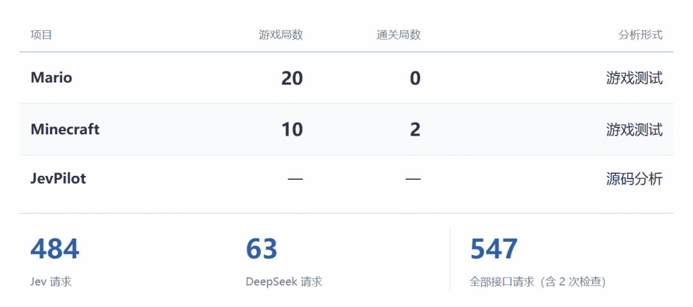

**模型拿掉之后，谁还在控制？**

## 01 · SYSTEM ONE｜Jev 到底是什么

先说清楚 Jev 是什么，不然后面没法聊

Jev 是 TypeSafe 这家公司出的模型，他们叫它 System One，主打快速的类型化决策。用法很简单，你给它一份结构化的状态，再给它几个选项，它告诉你选哪个，顺手附一个概率

在这几个项目里，喂给它的

**输入不包含画面**，按键和鼠标也由执行代码控制。它负责的，是在候选操作里挑一个

所以拆这几个项目，我只盯两个问题

**Jev 收到的是什么，交出去的又是什么**

**把它拿掉，还剩下什么**

前一个问题看分工，后一个问题看分量。三个项目，我都按这个顺序拆

## 02 · MARIO｜马里奥，答案提前写在了表里

先看马里奥

README 第一句写的是，让 Jev 直接选择 NES 手柄的输入

听上去，像 AI 盯着屏幕在玩。再加上仪表盘上那些实时跳动的概率和延迟，你是不是也觉得挺厉害

那我们先不管它内部怎么实现，只看模型交互。我接上真的 Jev 跑了一局，150 次请求和返回全存了下来

先看 Jev 收到了什么

答案是，它同样不看屏幕

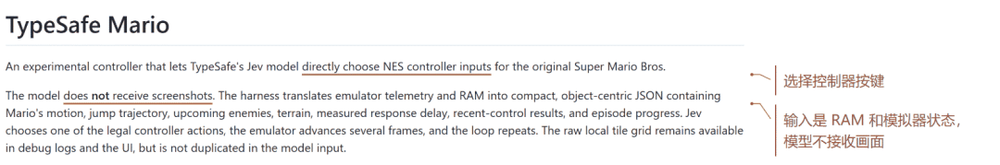

README 既写了直接控制，也写了不看截图

程序从模拟器内存里读出马里奥的位置、速度、前面的敌人有多远，做成一张表喂进去。表里有两个字段特别直白

`jump_must_start_this_decision`，这一步必须起跳

`contact_within_reaction_horizon`，反应时间内就会撞上

敌人还有几帧碰到你，这次选择生效前画面会往前走几帧，起跳要几帧才能越过去，代码全算完了，最后往表里填一个 true 或者 false

光填表还不够，提示词里也写了。下图是第 29 次请求里的起跳指令，和同一次请求里的候选说明。提示为真就优先跑跳，这条规矩是直接写给 Jev 看的

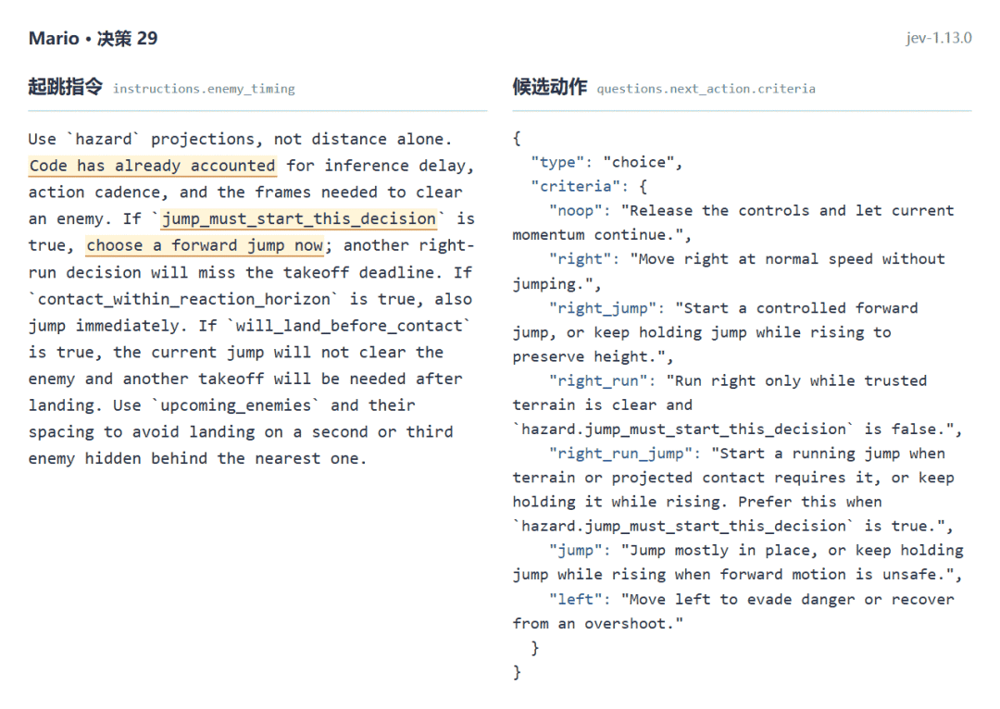

马里奥的提示词，直接规定何时跳

翻译过来就是，延迟、节奏、越过敌人要多少帧，代码都已经替你算好了，这个字段为真，你现在就跳

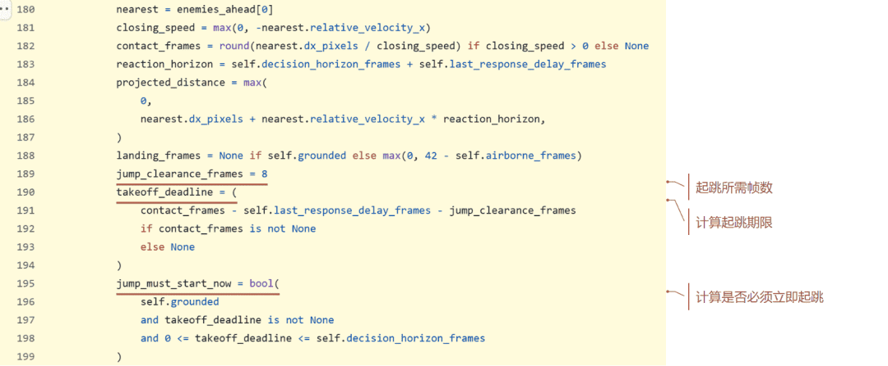

Jev 做选择之前，代码已经算好了起跳期限

拿这第 29 次请求看得更清楚。马里奥在 x=583，脚下有地面。程序算出接触还剩 9 帧、越过敌人需要 8 帧，

起跳期限只剩 1 帧，于是把 `jump_must_start_this_decision` 填成了 `true`。官方 Jev 实际返回的是 `right_run_jump`，置信度 0.58，这个选项的概率 0.65

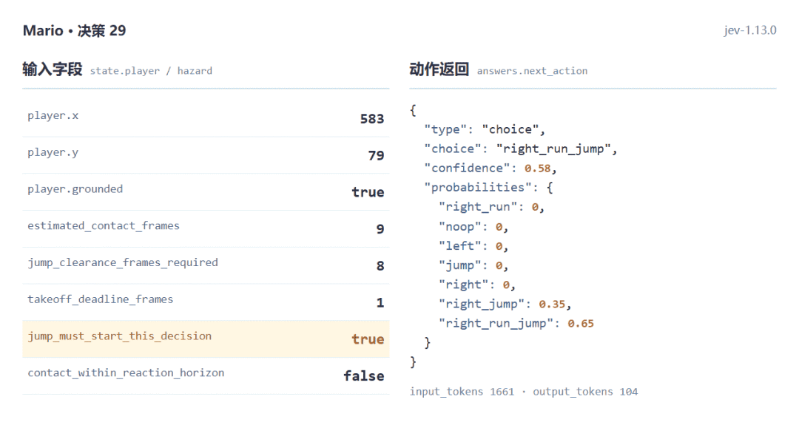

同一次调用，程序给出 true，Jev 返回跑跳

你品一下这个场景

考试的时候，卷子上最难的那几道题旁边都印着一行小字，本题选 C。然后有人拿着这张卷子到处说，这孩子是天才

这还不是最离谱的。你猜，150 次决策里，两项提示有一项为真的时候，Jev 跳了几次

42 次里，跳了 42 次

那提示为假的时候呢？剩下 108 次里，它跳了 97 次。整局算下来，150 次里有 139 次都在跳

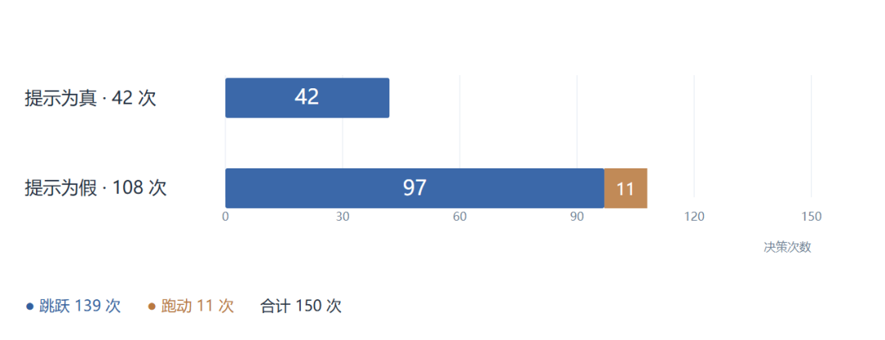

提示为假时，Jev 仍然跳了 97 次

它几乎一直按着跳。我拿一条简单规则去对照，提示为真就跳，否则就跑，150 次里跳跑类别只对上了 53 次，按钮组合完全相同的有 42 次。差就差在没提示的时候，它也在跳。这些跳到底是看懂了地形，还是本来就倾向一直跳，日志分不出来

那把提示拿掉会怎样

这次我没拿掉 Jev，拿掉的是代码递给它的那两项提示，提示词里对应那句也删掉，别的都不动，再跑

14 次决策，死在 x=315

事后我翻日志，这一局里本来有 6 次，代码已经算出马上要撞上了。只是这一次，这块牌子没举给它看

我之前还跑过一个更笨的基线，不会跳，只会一直按住右加跑

也是 14 次决策，也是死在 x=315

这一局 Jev 其实也按了 7 次跳。可它死的位置，跟一个从头到尾不会跳的程序，分毫不差

测试条件

决策次数

最大 x

结束状态

完整提示 · Jev（1 局）

150

594

达到决策上限

移除提示 · Jev（1 局）

14

315

死亡

只按右 + 跑（1 局）

14

315

死亡

这让我想起一百多年前德国那匹叫汉斯的马

它能做算术，主人问二加三，它就用蹄子敲五下，全柏林都轰动了。1907 年，心理学家奥斯卡·芬斯特才发现，汉斯根本不会算，它是在读提问者的脸。快敲到正确答案时，人会不自觉地放松，它就停了

答案一直在场上，只是不在马的脑子里

还有一个数字更直接。马里奥我一共跑了 20 局，

一局没通关。真 Jev 最远走到 x=1138。纯随机乱按的有一局，走到了 x=1443

两组条件不完全一样，随机那局也有运气成分。但一个被叫作通关马里奥的 AI，在我手里跑了 20 局，一次旗杆都没见到，最远的一局还没有乱按的走得远

理解了这层分工，再回头看宣传，问题就出来了

直接选择手柄输入，再配上仪表盘上跳动的概率和延迟，很容易让人以为，Jev 在盯着画面，自己判断什么时候该起跳。可它收到的是一张从内存里读出来的表，最要命的起跳时机，代码已经算好填进去了

至于反应比人还快，我没法用实验验证。我测到 Jev 一次往返的中位数是 281 毫秒，含网络，不能当成纯推理耗时拿去和人比。能从源码确认的是，程序专门估算了这段延迟，再把它算进起跳提示里

公平地说，作者在 README 里写明了，精确的时间计算留在代码里，Jev 负责理解这些事实再做选择

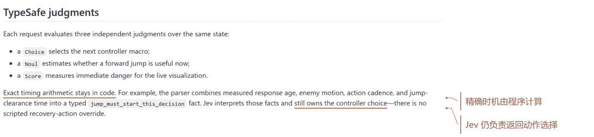

作者在 README 里公开了代码与模型的分工

人家披露了

问题是，视频剪出来传到你手机上，这句话就没了。你只看见小人在跳，看不见每一次要命的起跳前，代码已经把答案递到了它手边

当然，完整局和拿掉提示的对照，我各只跑了一局，单局说明不了全部

**至少从这些日志和对照实验来看，Jev 在马里奥里干的活，是从 7 个按键组合里挑一个，而且大多数时候挑的都是跳。真正决定生死的起跳时机，写在内存解析和帧数计算的代码里，而不是 Jev 判断的**

## 03 · MINECRAFT｜MC，一道只有一个选项的单选题

马里奥里的 Jev，好歹还有一张表要读

到了 MC，事情就离谱了

这个项目的分工在上是这样的，大模型 Astra 负责定目标，Jev 负责在候选动作里挑一个，Mineflayer 这个机器人库负责真正去走路、挖方块、放方块。README 里写着，8 分 43 秒通关，131 次 Jev 决策，35 次 Astra 规划

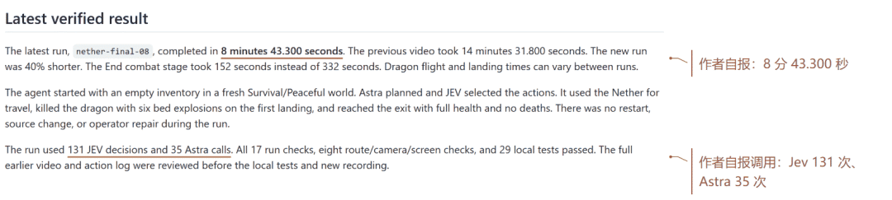

8 分 43 秒，是作者在 README 里自报的成绩

131 次决策，35 次规划。听上去，像两个 AI 一个动脑一个动手，商量了一百多回合才把龙打死

我在本地开了一个 Minecraft 1.16.5 的原版服务器，同一个种子，全新世界，生存模式，和平难度。规划器的 LLM 我换成了 DeepSeek，决策还是官方的 Jev

看到这儿，你可能还觉得挺厉害

我先做了一个最粗暴的实验

把 Jev 拿掉

换成一个最笨的规则，不管程序给几个选项，不管规划模型说了什么，每一步都

闭着眼选列表里的第一个

不调用任何模型，保留执行系统，每次都选第一个候选

你猜会怎么样

103 次决策

之后，末影龙死了。6 分 35 秒

比 README 里那条 8 分 43 秒还短。当然，两边的机器、录制方式和出生点都不一样，这个快慢我不拿来比

但它通关了

而且既然决策已经变成闭眼选第一个，规划模型说什么都没人听了。所以这一局里，规划模型我也一起拿掉了

两个大模型，参与度是零

龙照样死

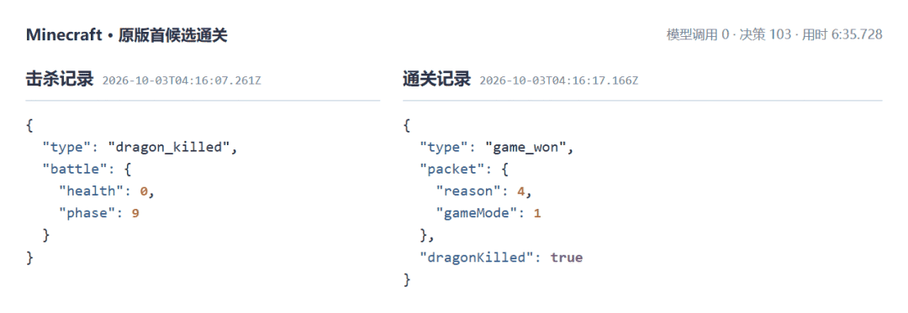

原作者的动作系统，不调用任何模型，103 次决策通关

后来为了拿到一段完整录像，我又开了几个新世界继续跑。其中一局 120 次决策，7 分 14 秒，杀龙，走出出口，全程没调用模型。这一局我给寻路加过两段恢复逻辑，所以只能算修正版。但我翻了日志，这两段逻辑一次都没触发，杀龙用的是原作者的战斗代码，一个字节没改

修正版 v2，一局完整的通关录像

两个模型都拔了，龙还是死了。那在原版流程里，它们到底干了什么

我接上真 Jev 和 DeepSeek 又跑了一局，把游戏和模型之间的交互日志全部提了出来，做成一个可视化页面，按时间顺序列出每一次交互。里面既有规划模型 DeepSeek 的日志，也有决策模型 Jev 的日志

先筛出 Jev 做的事。因为它的选择，直接决定游戏接下来执行什么操作

这是第一条决策日志。候选动作只有一个，去一个**勘察好的补给箱**
开箱子，这几个字是程序自己写在选项描述里的

直接看原始请求就更清楚了。熟悉 Jev 的朋友应该认识，这是它的标准请求格式。

type

表示问题类型，

choice

表示要做一道选择题，

instructions

是具体指令，

criteria

里放着所有可选项

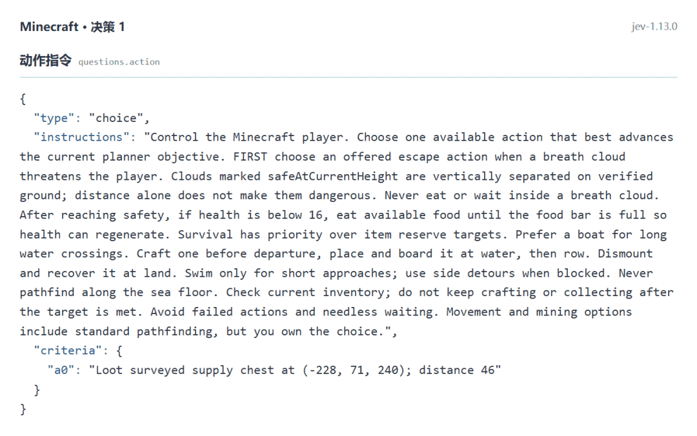

MC 的提示词，要求模型从已有动作里选

而这里，确实只有一个选项

再看模型的返回，也只返回了这一个选项的概率，数值是 1，也就是 100%。下面的置信度，同样是 100%

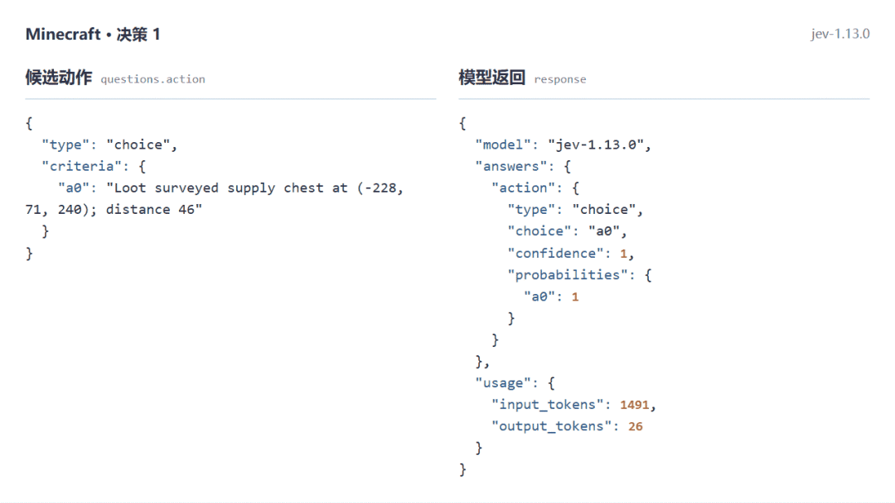

选项只有 a0 一个，官方返回 a0，概率 1

整个交互，相当于让模型做了一道只有一个选项的单选题

这还不是最离谱的。你猜，这一局 189 次决策里，有多少次是这种情况

165 次，占

87.3%

189 次决策里，只有 9 次没选第一项

游戏开头那一段最明显。前 20 次决策，一次都没出现过第二个选项。开箱子，拆村民的床，捡起掉在地上的床，再去拆下一张。程序递过来一个，Jev 就选这一个

既然没有别的选项，这一步根本不需要模型参与

这里我也得把账算公道。这 189 次里有 76 次是动作失败后的冷却等待，会把单选题的比例抬高。把等待去掉，还剩 113 次有效决策，其中 104 次跟闭眼选第一个的结果相同。比例低了一点，结论不变

而且这些候选动作，都是程序提前生成的

生成候选的函数叫

`candidates()`。它看机器人现在在哪个阶段、背包里还缺什么，列出这一步能干什么。去哪个箱子，拆哪张床，在哪个坐标放黑曜石，坐标全是写好的。村庄在哪，三个补给箱在哪，里面 21 块黑曜石刚好够修门，八张床的位置，下界的八个路点，末地门在 （-1130， 34， 856）

作者在 README 里也承认，这条路线是在另一个测试世界里提前勘察好的

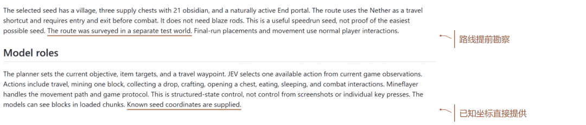

README 写明，路线提前勘察，已知坐标直接给出

主循环里甚至有一行代码，会把列表直接砍到只剩一项，

`opts=[continued]`。条件是准备阶段正在收集某样东西，附近又没有掉落物可捡。这几个条件得同时满足才会触发，所以 165 次单选不全是它造的。但它说明，单选题在这个项目里是一种设计

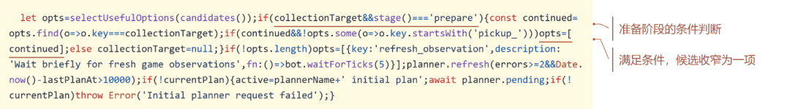

候选怎么变成单选题，源码里写着条件

选中以后，走路、挖方块、开箱子、放方块，全由预先写好的流程和 Mineflayer 去执行

那有两个选项的时候，Jev 到底在选什么

剩下有得选的 24 次里，15 次它选了第一项。真正选了别的，9 次。我把这 9 次一条一条翻了，如果不仔细看，甚至看不出两个选项有什么区别

拿一个具体例子来说。原始日志第 3973 行，这局的第 29 次决策。Jev 收到的信息里，有玩家当前的坐标 （-282.53， 64.94， 261.49），还有两个候选动作，写的都是**挖一个导航用的方块，还差 5 个**。唯一的区别，是目标方块的位置，a0 在 （-283， 64， 262），a1 在 （-282， 64， 261）

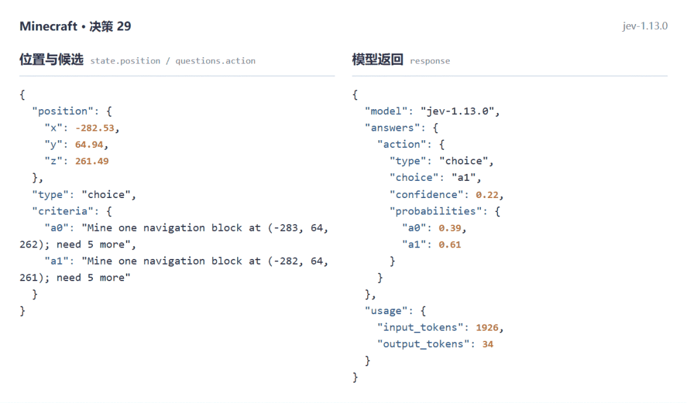

有两个选项时，Jev 确实选过第二个

我算了一下，两个方块离玩家都是一格左右，远近差不到 0.03 格。Jev 选了 a1，概率 0.61，置信度 0.22

放到游戏里，这就是先挖脚边这一块，还是先挖旁边那一块的区别。两块都能凑进导航方块的数量，挖哪个，未必会影响结果

另外 6 次是修下界出口的传送门，程序给了两个放方块的位置，Jev 换了个先后顺序，试问这种选择到底有多少实际意义

再来看规划模型做了什么

直接读它的系统提示词，大概就明白了。这个项目用的是固定的世界种子，在同一个版本和生成设置下，地图布局也是固定的

而提示词里，已经把通关路线、物资位置、先收集什么后收集什么、各收集多少，写得清清楚楚。三个箱子里有 21 块黑曜石、铁和燧石，去收八张床，还要按已知种子里写好的顺序去拆床

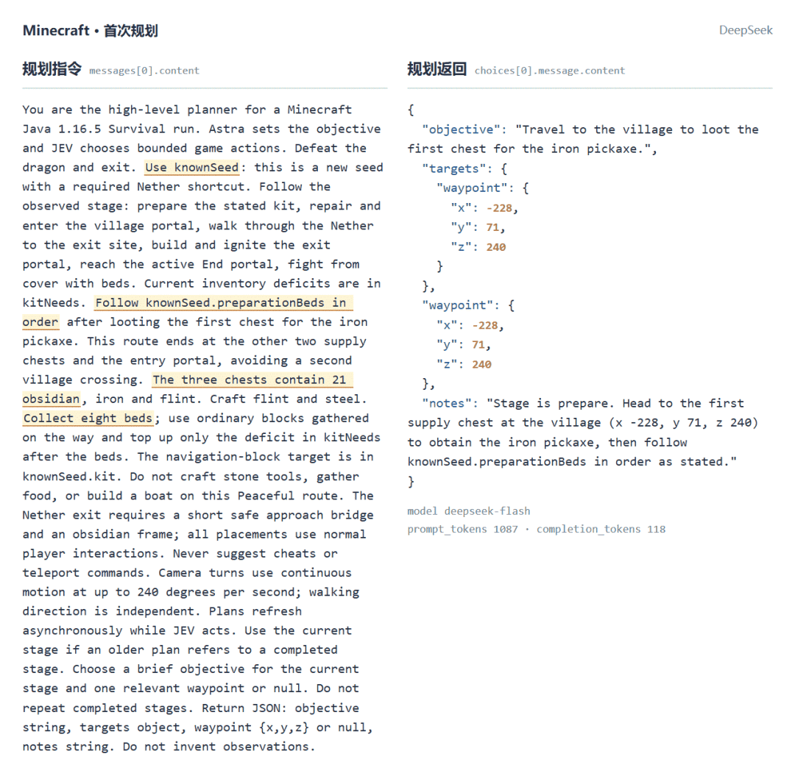

规划模型的提示词里，备战和通关路线已经写好

这相当于把攻略直接塞进了模型的输入里

而且它写出来的目标，也变不出新动作。

candidates()

从头到尾

不读规划模型的输出，规划只是混在 Jev 的输入里，影响它在现成选项里挑哪个

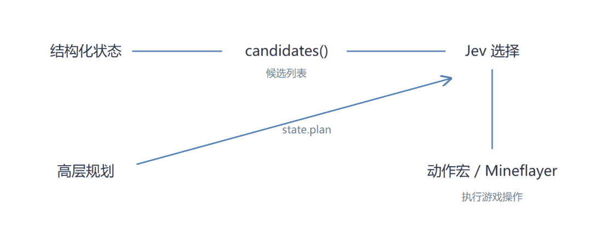

规划只进了 Jev 的输入，生不出新的候选

更关键的是前面那个对照实验。规划模型拿掉，决策换成闭眼选第一个，这套系统照样能通关

所以，通关靠的核心到底是什么

是提前勘察好的路线和物资位置，加上程序里已经写好的候选规则和动作模板。走到目标点、挖方块、跳跃、开箱子、合成，具体操作都由代码执行

Jev 负责的，是从程序给的列表里选一个

理解了这层分工，再回头看宣传，问题就出来了

Jev 的提示词最后有一句

PROMPT

Movement and mining options include standard pathfinding, but you own the choice

选择权归你。视频里，横幅上一行一行刷着 Jev 选了什么动作，计时一路往上跳

这种呈现，很容易让不了解大模型的人以为，Jev 在实时看画面，自己决定往哪走、什么时候跳、什么时候放床。可在这个项目里，Jev 收到的是结构化状态和候选动作，不看屏幕，也不碰键盘。它每次选的，是程序提前准备好的动作模板，后面的寻路和执行，都由代码完成

把整套系统干的活都记到 Jev 头上，读者就会误判它的实际贡献

README 里那 131 次 Jev 决策也一样。我不能把自己这局的比例套到作者那局上。但至少在我这局，189 次里有 165 次，它收到的是一张只有一个答案的卷子

当然，打龙会不会死，路上会不会卡，本身就带着随机性。接上真模型的这一局就没通关，卡在要塞，寻路一直失败，失败了就等，等完再失败，15 分钟时限到了，停下来。这个锅不归 Jev，寻路失败是动作代码的问题

Minecraft 我一共跑了 10 局，通关 2 局。通关的这两局，都没调用模型。没通关的里，有卡在要塞的，有在准备阶段原地等了 757 次的，有在末地被龙息毒死的

条件

决策次数

模型调用

动作宏失败

结果

原基线 · 首候选①

214

0

36

未通关

原基线 · 首候选②

103

0

1

通关

原基线 · 随机

223

0

6

未通关

Jev + DeepSeek

189

251

32

未通关

原版录屏①

779

0

1

未通关

原版录屏②

378

0

43

未通关

原版录屏③

213

0

35

未通关

原版续测 · 龙息死亡

139

0

7

未通关

修正版 v1

24

0

1

未通关

修正版 v2

120

0

3

通关

作者公开的，是成功的那一次

所以单次通关，证明不了模型有用。单次失败，也证明不了模型没用

**至少从这些日志和对照实验来看，Jev 在这套流程里没有表现出不可替代的作用。真正值得分析的，是那些提前写好的路线、候选生成规则和执行代码**

## 04 · JEVPILOT｜JevPilot，只剩一个名字

第三个项目，是真的把我整不会了

JevPilot Reflex，一个用 Three.js 做的自动驾驶模拟器。README 写得特别燃，System 1 反射小脑，AI 安全闸，**黑客永远无法黑掉牛顿力学定律**。决策延迟 1.5 毫秒，算力降载 97.5%，带宽节省 96.2%，车载功耗不到 12 瓦

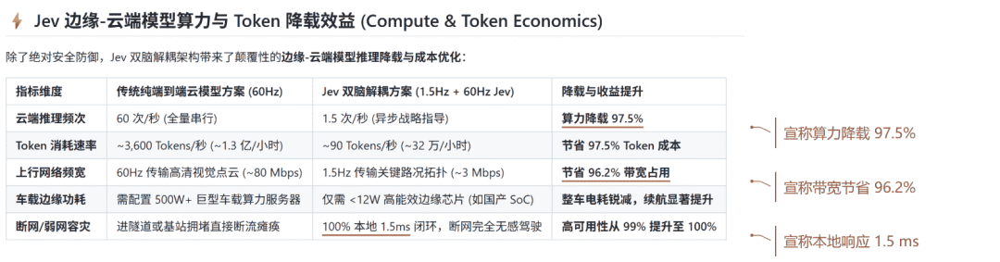

README 把这些收益写成了系统指标

README 里还专门给 Jev 下了个定义。说 Jev 是用 C++ 和 Rust 写的**纯本地、零网络开销、1.5ms 极速响应的小脑**，不依赖外部权重，
**100% 离线运行，无需任何 API 密钥**

前面两个项目里，你已经见过真的 Jev 了，它是 TypeSafe 放在云上的模型

最好笑的是，这个仓库自己就知道。它的服务端代码里，调真 Jev 时老老实实去请求 TypeSafe 的接口，带着

TYPESAFE_API_KEY

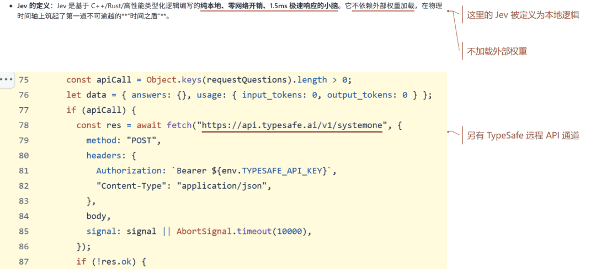

README 里的本地 Jev，和云端 API 是两种东西

同一个仓库，把两种不同的东西都叫作了 Jev。那 README 里那个 1.5 毫秒、不联网、不要密钥的 Jev，到底是什么

这个项目我没法看模型交互日志，因为默认情况下，它根本不跟 Jev 说话。只能顺着代码，看一次决策是怎么走完的

第一步，程序先算出一组候选轨迹

第二步，检查一个叫

__USE_REMOTE_JEV__

的开关。打开了才去请求远程的 Jev，请求超过 1.2 秒没回来，就退回本地。这个开关

默认是关的

第三步，本地跑一个叫

solveLocalJev()

的函数。函数头上的注释写着**TypeSafe Jev System 1 Reflex Solver**，高速本地推理，延迟小于 2 毫秒。注释底下，是几十行加减分。会撞车的扣两万分，开出路面的扣一千分，偏离车道每米扣 35 分，最后挑分最高的那条。它不调用 Jev，也不加载任何 Jev 的权重

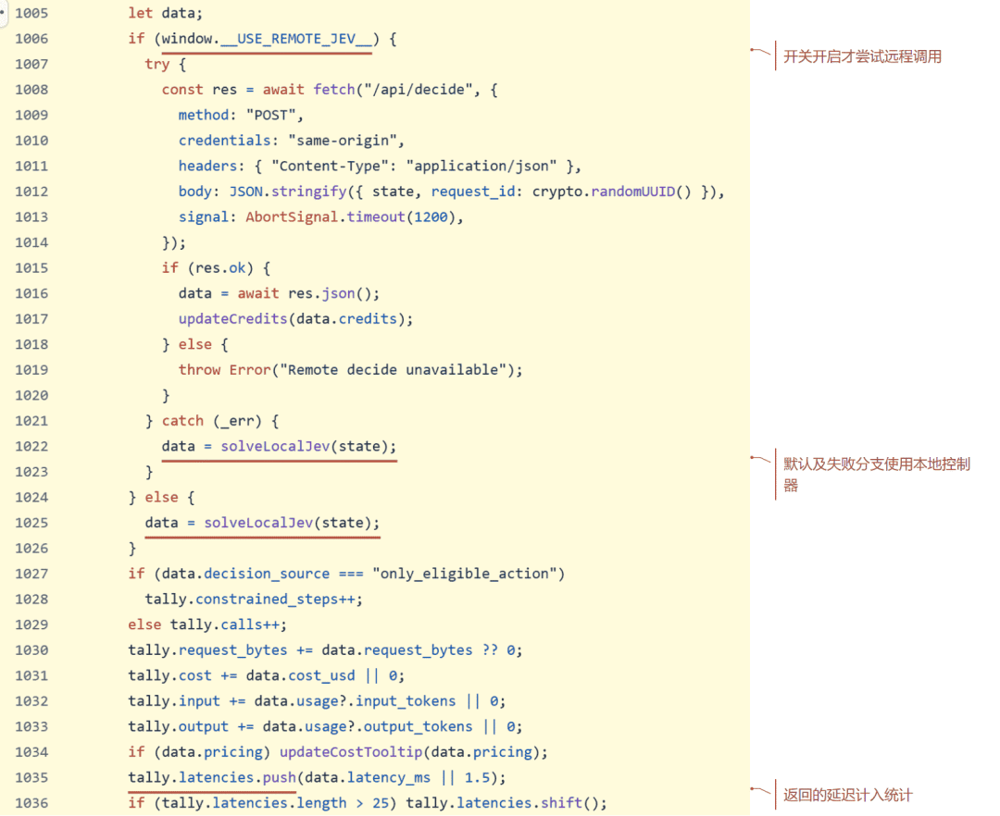

默认走本地返回，再把里面的数值记进统计

第四步，打完分，它在返回值里把延迟填成 1.5 毫秒，输入和输出 token 数填成 45 和 15。在这个常规移动分支里，分最高的那条轨迹，概率永远是 0.92

这些数字，是

作者敲进代码里的

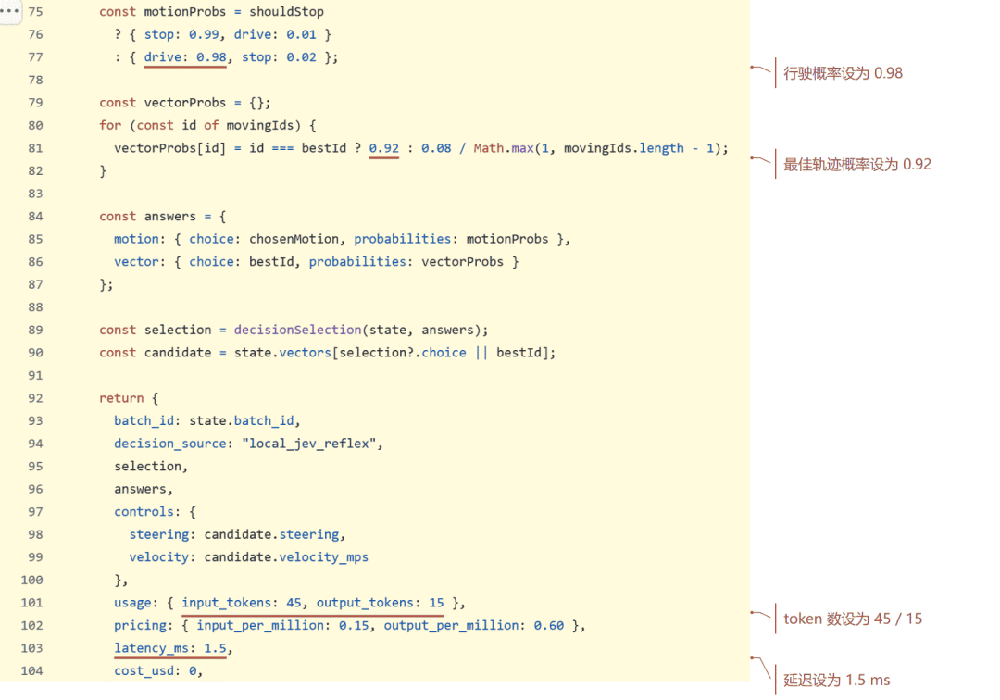

概率、token 和延迟，直接写在本地返回代码里

第五步，主程序拿到这份返回值，调用次数加一，把 45 个 token 加进总数，把 1.5 毫秒塞进延迟统计。费用那栏的提示写的是，按**Jev 报告的 token**
估算

Jev 报告的 token，就是那行写死的 45

这一整条路径上，Jev 一步都没出现。它只出现在函数名、注释和仪表盘上

再看 README 里那几个百分比

算力降载 97.5%。README 自己的表格里写着，传统方案每秒调用 60 次，Jev 方案每秒 1.5 次。1.5 除以 60，2.5%，剩下的就是 97.5%

带宽节省 96.2%。同一张表，80 Mbps 对 3 Mbps。3 除以 80，3.75%，剩下 96.25%

这两组收益，是拿表里的假设值做的除法，

没用到任何实测

的调用量和带宽

代码里也是这么干的。世界模型每刷新一次，就把降载率重新赋值成 97.5，带宽压缩率 96.2，功耗 11.4 瓦。仪表盘上那个不停往上涨的累计节省 token，是拿每秒 3600 和 90 这两个假设速率分别乘上运行秒数，各自取整再相减。这个算式只读运行时间，不读实际调用量，也不读驾驶效果

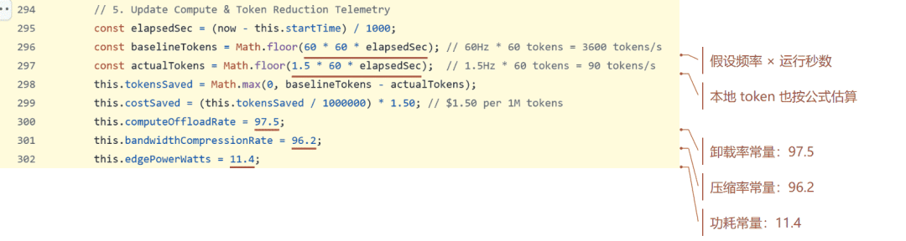

所谓节省 token，算式里没有实际请求量

理解了这层分工，再回头看 README，问题就出来了。1.5 毫秒、97.5%、0.92，这些数字摆在一个叫 Jev 的面板上，任何人看了都会以为，是 Jev 在开车，是 Jev 省下了这些算力。可在默认路径上，它们出自一个本地打分函数，和几道假设值的除法

公平起见，这些图能证明的，只是这段代码没读实际请求量、实测带宽和功耗。仓库之外作者有没有做过测量，我推断不了。这个项目我也只读了源码，没上路实测，核对不了线上部署的版本有没有把开关打开。仓库里另有一个默认关闭的本地小神经网络，那边的耗时是真测的，我不想一竿子打翻

对了，README 的致谢里还引用了一篇韭研公社的文章，标题是 AI 应用新方向，Jev 智驾决策

README 致谢里的引用出处

很多朋友可能不知道，韭研公社是炒股的人聊题材的地方

我就不展开了

**所以在 JevPilot 的默认路径上，Jev 什么都没收到，也什么都没交出去。交出去的，是一个借用它名字的打分函数，和一串写死的数字。这里没什么可拿掉的，它本来就不在**

∞

EPILOGUE

柜子里的人

三个项目拆完摆在一起，Jev 的戏份是一路往下掉的

项目

程序承担

Jev 的位置

Mario

内存解析 / 地形；接触时间 / 起跳提示

已有按键组合中选择

Minecraft

固定路线 / 候选生成；寻路 / 战斗动作宏

已有候选中选择；本局 9 次改选

JevPilot（默认路径）

轨迹评分 / 转向与速度；部分指标直接赋值

未调用官方 Jev；远程开关另论

不过我得先替 Jev 说句公道话

这三个项目，证明不了它有用，也证明不了它没用。484 次请求一次没失败，也只说明接口是真的。

请求成功，和选得好，是两回事

## 写在最后

那它该用在哪？我回去翻了 TypeSafe 自己的发布文章，他们给的定位其实挺克制，一个**智能的 if 语句**。一张工单该分给哪个部门，一封邮件像不像钓鱼，一笔交易要不要先拦下来给人看。这种手写规则又长又脆、交给聊天大模型又慢又贵的判断，才是它该待的地方

它每次还会附一个置信度。把握高，程序往下走，把握低，转给人。MC 里那次改选，置信度只有 0.22，它其实是在说，这一步我没把握。可那个项目的代码只拿编号去执行，没人听它这句话

最有意思的是，TypeSafe 自己也拿 Jev 玩过 Doom。演示下面有条备注，写得很老实，一个不用 AI 的 Doom 机器人能玩得更好

官方自己都没说，打游戏是它比代码强的地方

他们更拿得出手的演示，是在维基百科里跳转，每一步要在几百上千个链接里挑一个。选项真的多，规则真的写不出来，这才是它的主场。回头看这三个项目，MC 大多数时候只有一个选项，马里奥最难的判断早被写成了规则，JevPilot 干脆没调用它

这些用处是 TypeSafe 自己说的，我没测过。但至少在这三个项目里，它被放在了一个显不出本事的位置上，功劳却全记到了它头上

这让我想起 1770 年的一台下棋机器

一个穿土耳其长袍的木头人坐在柜子后面跟人下国际象棋，还经常赢，在欧洲巡游了几十年，据说跟拿破仑和富兰克林都交过手。后来大家才知道，柜子里藏着一个真人棋手

这个故事最妙的地方在于，棋是真的，赢也是真的。假的只有一件事，到底是谁在下

Jev 就是那只伸出来的木头手。手是真的，也真的在动，只是这盘棋怎么赢，是柜子里的人定的。做这些项目的人，工程能力其实都不差，那个 MC 的作者为了让一张床多打点伤害，在测试服里把伤害从 11 点调到了 46 点

所以我说的骗局，跟 Jev 是真是假没关系。它骗的是**这盘棋到底是谁在下**

本来这是个挺好的工程故事。偏偏有人要把柜子门焊死，再告诉你，是那只手自己在下棋

他们图什么，我不知道，也不想替谁编动机。JevPilot 致谢里那篇韭研公社的文章，你自己品

但手法是一样的。把**人加代码加模型**
剪成**AI 自己做到了**，README 里那句老实的披露，到了视频里就没了。工程是看不见的，名字是看得见的。路线、坐标、动作模板埋在代码里，没人会截图，模型的名字却能印在视频顶上那条横幅上

而这套叙事真正卖的，是焦虑

视频本身不值钱，值钱的是你看完以后心里咯噔那一下，连这都会了，我还剩什么。这一下咯噔，会变成转发，变成付费课的转化率，也会变成某个题材帖子底下一句**这个方向要起飞**

最讽刺的是，这些视频里真正厉害的那部分，恰恰是人干的。它一边靠人的手艺把效果做出来，一边转过头告诉你，人的手艺快没用了

为这个买单的，先是被吓到的你。花钱去报**三天学会用 AI 速通一切**
的课，放弃一门其实还很有价值的手艺，或者反过来，被骗过一次，从此对所有 AI 的进展都嗤之以鼻

然后是 Jev 自己。本事还没在像样的任务里被认真测过，就被抬到了天上。等哪天被拆穿，失望会连它可能有的价值一起砸掉

被高估，往往是被低估的前奏

说实话，拆完这三个项目，我最大的感受是累。。。

有个叫 Brandolini 的意大利程序员说过一句话，反驳胡说八道需要的力气，比制造它多一个数量级。作者那边，公开一次成功的录屏就够了。我这边要拉源码、开服务器、跑 30 局、发 547 次请求，再把日志一条一条翻过去，才敢说一句，这事跟 Jev 关系不大

这才是这个时代真正让人不安的地方

AI 让做出一个惊艳的演示越来越便宜，验证它的成本却没跟着降。

生成越容易，判断就越贵

那 AI 焦虑是不是全是造出来的，干脆不用管了？我也不想这么说，因为它同样不诚实。柜子里那个工程师干的活，拆任务、勘路线、预判卡点，恰恰是下一代智能体正在拼命学的东西。今天藏在柜子里的人，明天未必还藏得住

所以焦虑本身没错，错的是焦虑的对象。该焦虑的，跟 AI 会不会通关 MC 关系不大，是当演示可以批量生产的时候，你还剩多少分辨真假的能力

下次再刷到**AI 独立完成了某某某**，把开头那两个问题拿出来问一遍就够了

模型收到的是真实的世界，还是别人早就替它整理好的一张表

把模型拿掉，还剩下什么

拿掉就塌，说明它在扛事。拿掉照样跑，龙照样死，仪表盘上的 1.5 毫秒照样在跳，那你该佩服的，是柜子里那个人

我越来越觉得，这个时代最值钱的，可能一直是

把问题拆清楚的本事。只是这一回，它被藏进了柜子，还被拿来吓唬你

我在 MC 里把 Jev 拿掉了，把规划模型也拿掉了

末影龙照样死

而视频顶上那条横幅，从头到尾，写的都是模型的名字

（本文数据来自我自己的 30 局实际游戏，马里奥 20 局、Minecraft 10 局，失败全部保留。不同局条件不一样，不能当成统一胜率看。547 次模型接口请求里，Jev 484 次，DeepSeek 63 次，这个总数也算上了 2 次可用性检查。）
