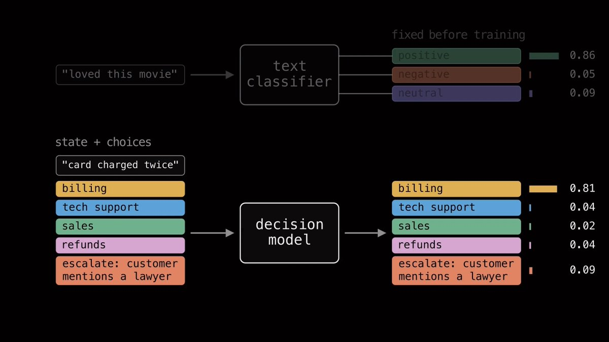
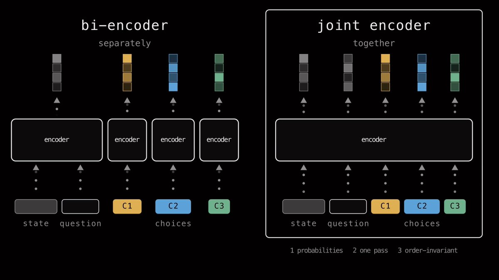
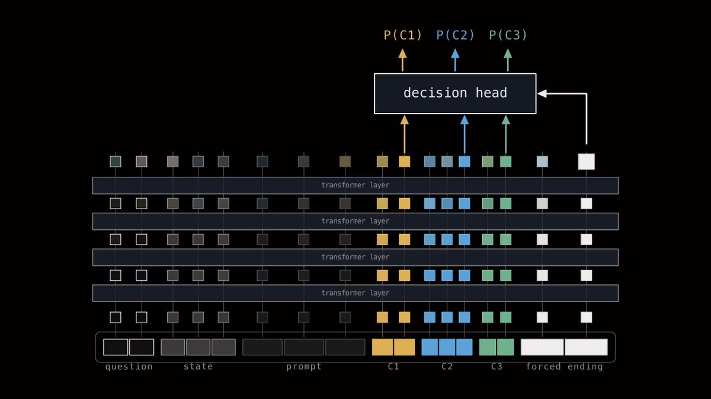
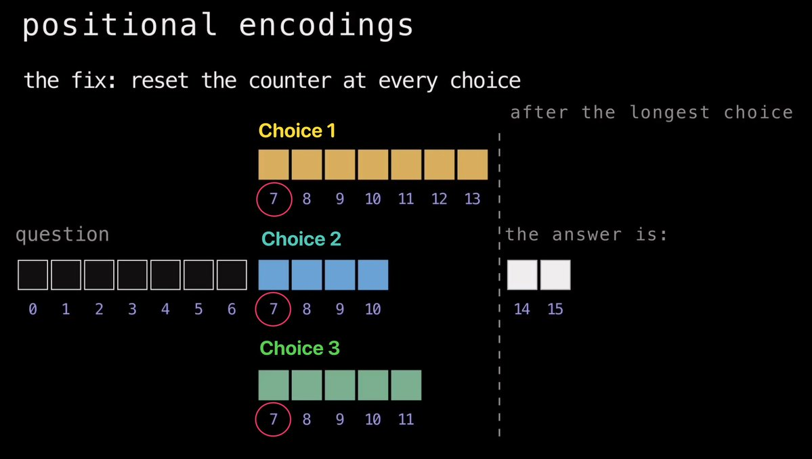
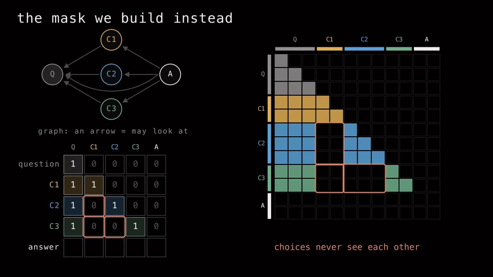

# 把选项顺序不变性训练进 JEV 模型

> 原文：[Training choice-order invariance into JEV models](https://x.com/neural_avb/status/2107173836273938662) · X 长文 · @neural_avb（AVB）· 2026-10-05
>
> 译文为社区学习用途的非官方中文翻译，版权归原作者所有。

过去两周，我一直在为新的 System One 模型构建数据集、训练模型。这份文档记录了我这一路学到的东西、一些半成品想法，以及在此过程中随手记下的笔记。

忙完这一切之后，我产出了一个包含 276K 条示例的新训练数据集、一个新的 0.4B 参数轻量级决策模型、一场 5 小时的 livecoding 直播，外加一支把一切都讲清楚的长篇 YouTube 视频。

> 🐦 相关推文：https://x.com/i/web/status/2103822851359027207

## System One 模型

我很喜欢用 Jev。我已经把它集成进了两个正在运行的生产系统，还做过几个教程。Typesafe AI 把通用分类器（universal classifier）这一理念重新带回了主流，我对他们感激不尽。

生成式语言模型接收你的输入，逐个 token 地生成文本，最终给出答案。而 System One 语言模型接收你的输入，在一次前向传播中处理完毕，直接返回一个决策，全程不产生任何中间 token。

给定一些上下文和一份候选选项列表，它会给你每个选项的概率——就像一个分类器。在普通的文本分类模型里，输出空间通常是固定的。比如你训练一个情感分类器，模型只能输出三种东西的概率：正面、负面或中性。决策模型没有这种固定的输出头——因为它们被训练成**通用分类器**。



## 关于选项顺序的问题

**我对 Jev 的主要不满之一**在于：不知为何，它的输出概率会随你输入的选项顺序而变化。看这两个例子——问题和选项完全相同，但左边是先给选项信息、再给 bug 报告……而右边把两者的位置对调了。把这两个输入分别喂给当前的 Jev 模型——它的答案会翻转。

> 🐦 相关推文：https://x.com/i/web/status/2101736546391244854

> 之所以会这样，*很可能*是因为 Jev 是在因果语言模型（Causal Language Model）的基础上微调而来的。

**什么是因果语言模型？**

它们就是我们平时用来做文本生成的那些普通 LLM。它们采用 transformer 架构，每个 token 都会对它过去的所有 token 施加注意力。

出现在位置 10 的 token 能「看到」0 到 9 的每一个 token。

这种因果性质是生成式语言建模的支柱——因为一个 token 的这种表示（基于过去出现的内容）正是被用来预测未来的——也就是所谓的 next token prediction（下一 token 预测）。

这对生成式语言模型固然很好，但当选项成为序列的一部分时，因果掩码（causal masking）却可能造成特权信息的泄露。

如果你把一个 prompt 按如下顺序排布：

*context choice-1 choice-2 choice-3*

然后把它们送进一个因果 LM，观察会发生什么：

- choice-1 看到的是 *context*
- choice-2 看到 *choice-1* 和 *context*
- choice-3 看到 *choice-1*、*choice-2* 和 *context*

现实的构造就这么乱了套：在序列里靠后的选项，会在上下文层面感知到排在它前面的那些选项。

从技术上讲，你可以用双向语言模型（比如 Bert 或 ModernBert）来缓解这个问题。在这类模型里，token 也能看到未来的 token，所以每个选项*的确*能看到其他所有选项。*然而*，仅仅改成双向，并不能强制实现选项顺序不变性（choice-order invariance）。为什么？因为即便是 BERT 模型，也要靠位置编码（positional encoding）来识别输入序列中 token 的先后。BERT 知道哪个词出现在哪个词之前，所以只要把一个选项挪到选项顺序里的不同位置，它的隐藏状态百分之百会变。

减少 LM 位置偏差（position bias）的一个办法，是用程序把选项的顺序打乱（shuffle），再在数据的多种排列（permutation）上训练，教会网络忽略选项的顺序。

通过数据增强（data augmentation）来施教是一条正路，也是被验证了多年的老办法。但它并不能从本质上让模型变得与选项顺序无关（choice-order-agnostic）。

万幸，还有一种办法能在使用因果 LM 的前提下实现选项顺序不变性：在让因果 LM 具备位置感知的两个根源上动点手脚——(a) 注意力掩码（attention mask），(b) 位置 ID（positional id）。

## 设计一个因果决策模型

你可以很轻松地把任何语言模型改造成决策模型。事实上，比起从零开始训练一个决策模型，更推荐的做法是用一个已经训练好的语言模型（最好是在预训练之后、任何 RL 之前）。我们需要这个 LM 做到三件事：

1. 输入一个状态（state）、一个问题和一组选项，为每个选项生成概率
2. 把这整个输入并行处理——没有自回归的逐 token 生成，而是一次前向传播一步到位
3. 第三条是额外的约束，也可以说是原版 Jev 没有的额外特性——选项顺序不变性。我们平等对待每一个选项——改变顺序，绝不能改变每个选项在网络隐藏表示中的内部表示

眼下，开源社区里正涌现出两派思路很酷的做法，用来训练决策模型。

「bi-encoder（双编码器）」和「joint-encoder（联合编码器）」。



在 bi-encoder 中，我们对状态和每个选项分别编码。然后用某种对比损失（contrastive loss），把正确选项的 embedding 拉向问题的 embedding，同时把错误选项推开。

在 joint-encoder 中，我们把它们全部一起编码：把*问题、选项、answer prompt*打包进同一条序列，在一次前向传播中处理完。这需要更多 GPU 显存（因为序列更长），但总体更快，架构也更灵活。在我的实验里，我主要玩的是 joint-encoder。

我选用的序列大致长这样（我还额外加了一个 prompt 来区分 Choice、Noul 和 Score 三类问题，不过在本文中，就假设我们只处理多选题）：

```
QUESTION
STATE
<opt> choice 1 </opt>
<opt> choice 2 </opt>
<opt> choice 3 </opt>
The answer:
```

接着，我们把这条完整序列送进 transformer。每一层的注意力让每个 token 都能审视它上下文里的其他 token，并把自己的 embedding 更新得更具上下文信息。

当 token 序列穿过整个网络之后，序列里的每个 token 都会得到一个 embedding。

从这些 embedding 出发，可以提取出几个我们关心的关键 embedding：

- 每个选项一个 embedding，取自该选项的最后一个内容 token
- 序列最终的 embedding

由于最终的 token embedding 已经看过了整条序列——再加上我们用 "The answer:" 给它做了 prompt——直觉上，我们正在微调的因果 LM（在我的例子里是 Qwen3-0.6B）会开始构建一种表示，能够输出序列中正确的下一个 token。这正是我们想要的。

拿到这些 embedding 之后，我们可以在上面加一个决策头（decision head），用损失函数在我们的数据集上训练模型。这个决策头会接收我们的选项 embedding 和答案 embedding——然后把它们转换成一列概率。



在我的实验中，我最终选定了额外的自注意力（Self-Attention）层，配上一个双线性（bilinear）网络头来做这个转换。我还向这个自注意力头传入了一个额外的任务 embedding（task-embedding），它会根据输入的问题是 Choice 问题、Noul 问题还是 Score 问题而变化——让模型更清楚自己到底在做什么。

在实验中，我最终是用 Qwen3-0.6B 来训练的。它有 28 层，但我只抽取了前 20 层。直觉上，transformer 的最后几层都忙着去生成下一个 token 了，所以我在中间某个位置切断，那里的 embedding 大概率最具通用性。

我还在这个 20 层网络的最后 12 层上做了 LoRA 微调。决策头本身非常轻量——只有 2 层自注意力、几层 MLP 和那个双线性头——总共追加了 7M 参数。

因此，绝大部分的学习都被交给了 LoRA 层和基座模型自带的初始智能。

接下来，我们通过操控掩码和位置编码，让它实现选项顺序不变性。

## 让它实现选项顺序不变性

就像前面说的，如果你用的是因果 transformer，就必须解决两个问题——位置编码，外加注意力掩码。

1. **位置编码**

注意力层本身并不理解顺序——对 transformer 来说，输入基本上就是一袋 token。所以在各类做序列学习的 transformer 里，我们还要额外传入位置 ID（position id）：第一个 token 是 0，第二个是 1，第三个是 2，依此类推。模型把这些位置 ID 嵌入进来，与 token embedding 相结合，由此才知道每个 token 在序列中处于什么位置。

修复办法其实相当简单。问题部分的每个 token 拿到正常的位置编号——0、1、2，依此类推直到问题结束。

但每当一个新的选项开始，我们就把计数器重置，让每个选项都从问题结束后的那个位置起步。所以如果问题在位置 5 结束，choice-1 从 6 开始，choice-2 从 6 开始，choice-3 也从 6 开始。

从每个选项的视角看，它永远紧挨在问题后面，无论它在列表中排在第几位。

最后，answer token 则在选项之后继续往下计数。在 answer token 看来，所有选项像是彼此重叠在一起。这可能会让网络非常*晕头转向*，但凭借 LoRA 微调的魔力，性能是可以恢复的。



**2. 注意力掩码**

因果 transformer 是用因果掩码训练出来的——一个下三角矩阵。

行 *i* 是正在看的 token，列 j 是被看的 token，1 表示「允许关注」。于是每个 token 只能看向过去，永远看不到未来。

这里有个理解注意力掩码的好视角——它本质上就是一张图（graph）。每个 token 是一个节点，只要一个 token 被允许看另一个 token，两者之间就有一条边。而没有什么能阻止我们把其中一些边剪掉。于是我们改成构建这样的掩码：

- 问题 token 按因果方式看问题，与普通 LLM 一模一样
- 每个选项按因果方式看它自己的 token，再加上整个问题——仅此而已
- answer token 看一切：问题，以及每一个选项



另一个很妙的地方在于：我们完全不需要脱离 Qwen3-0.6B 训练时所处的因果本质。每个 token 依然只向后看——我们只是把选项之间的边剪掉了。所以 Qwen 不必去学一套全新的注意力范式。

不过要先快速声明一点：以上所有内容都假设模型使用标准的全注意力（full attention），也就是你可以把自己的掩码直接交给它的那种。很多现代因果模型用上了更花哨的注意力机制——滑窗注意力（sliding window attention），或者各种形式的线性注意力与稀疏注意力。比如 Qwen3.5 就混入了 Gated DeltaNet（一种线性注意力架构），外加滑窗注意力。在这类模型里，要精确控制哪个 token 能看到哪个 token，要费多得多的功夫。

下面是一些我在过去两周里产出的成果链接。代码、模型、数据全部开源，欢迎随意把玩。

- 我制作的数据集，包含 276K 条示例（合成数据、程序化生成，外加改造现有的 LM 训练数据）
https://huggingface.co/datasets/avbiswas/bev-decision

- 我训练的模型：
https://huggingface.co/avbiswas/bev-decider-0.4B

- 用于训练的 GitHub 仓库：
https://github.com/avbiswas/bev-train

- 讲解全部原理的 YouTube 视频：
https://youtu.be/sF3CNPbWA8o

感谢阅读！
