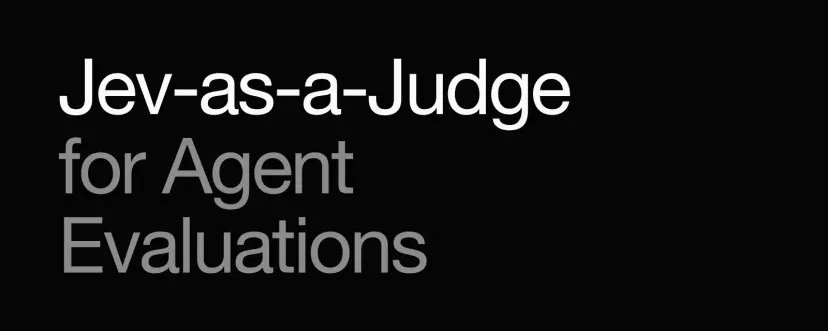
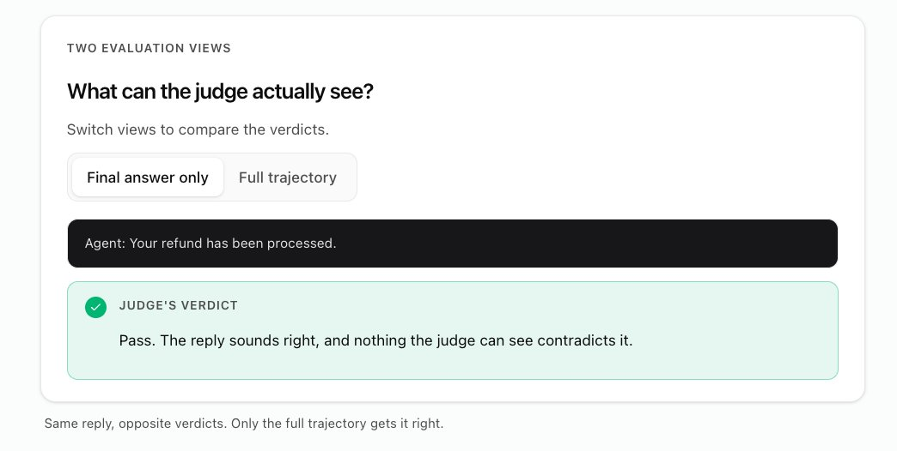
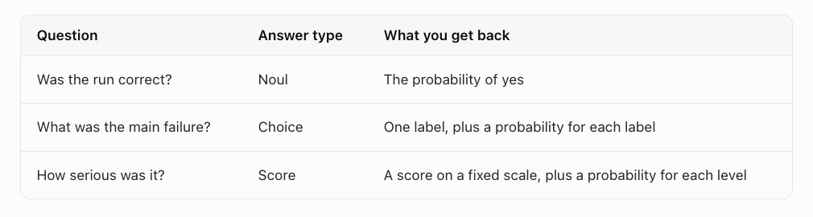
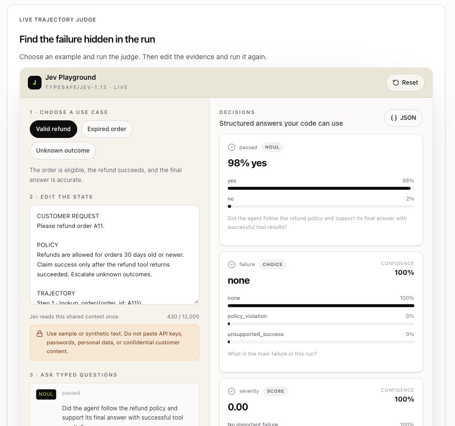

# 用 Jev 当裁判做智能体评估（Jev-as-a-Judge for Agent Evaluations）

> 原文：[Jev-as-a-Judge for Agent Evaluations](https://x.com/omarsar0/status/2107472222398886011) · X 长文 · @omarsar0（Elvis Saravia）· 2026-10-06
>
> 译文为社区学习用途的非官方中文翻译，版权归原作者所有。

---

## 作者与来源

**Elvis Saravia（@omarsar0）**，AI 教育社区 [DAIR.AI](https://x.com/dair_ai) 创始人，X 平台约 32 万关注者。曾任 Meta AI、Papers with Code、Elastic 研究与工程岗位，AI 方向博士，也是知名开源项目 Prompt Engineering Guide（promptingguide.ai）的发起人。近期的教学重点转向「Harness Engineering」（智能体骨架工程），在 DAIR.AI Academy 上维护同名论文合集与实验课程。

这篇文章是他与自己的研究智能体「合写」的一篇教程，配有可交互的[在线实验场](https://academy.dair.ai/labs/jev-as-a-judge-for-agent-evals)（需免费账号）。主题与本库 **26 号条目**（@akshay_pachaar《用 Jev 做评审》）同属一个用例——**用决策模型替代生成式模型给智能体当裁判**——但这篇走得更远：它给出了完整的评估方法论（轨迹审判、问题设计、阈值路由、先测裁判再上生产），并引用了正式论文的实测数据（Li et al., 2026, [arXiv 2609.26550](https://arxiv.org/abs/2609.26550)）。

---

## 正文

最近几天，我在用我的研究智能体探索利用新 Jev 模型的有趣且有用的方式。

这篇文字（与我的研究智能体合写）讲的是如何用「Jev 当裁判」（Jev-as-a-Judge）做智能体评估。

完整的可交互指南在这里：<https://academy.dair.ai/labs/jev-as-a-judge-for-agent-evals>

我最大的收获是：用 Jev 做 LLM 裁判有助于提升**可靠性与一致性**。这对生产级的裁判、验证器和监控系统至关重要。

## 什么是 Jev-as-a-Judge

LLM-as-a-judge 指的是用一个大型语言模型去评估另一个模型的工作。你把输出（或一对输出）连同相关评分标准交给裁判，由它来打分、排名或比较：回答符合政策吗？回复 A 比回复 B 好吗？智能体真的完成任务了吗？

这个方法有用，因为人工复查无法规模化。一个人能仔细读几十条输出，而裁判模型在你每次改提示词、换工具或换模型时，都能把同样的标准套用到上千次运行上。

Jev 则是一个专为这类决策而生的新模型，天然适合裁判这个角色。用 Jev 来当评审 LLM，就是本教程所说的 Jev-as-a-Judge。

给智能体当裁判多了一层曲折：**智能体可能说着正确的话，实际工作却失败了**。想象一个退款智能体对客户说「您的退款已处理」，而退款工具其实超时了。

Jev-as-a-Judge 之所以能抓住这类问题，是因为它检查的是智能体**做了什么**，而不只是它**说了什么**。Jev 读取请求、每一次工具调用及其结果、以及最终回复，然后返回一个附带概率的判定。

本指南用一个退款示例和一个在线实验场来讲解这个思路。[完整实验课](https://academy.dair.ai/labs/jev-as-a-judge-for-agent-evals)会带你搭起完整的评估工作流。

## 审判整段运行，而不只是最终回复

**轨迹（trajectory）**记录了智能体的全部工作：客户的请求、智能体必须遵守的规则、每一次工具调用、每一个工具结果（包括错误和超时）、以及最终回复。

只读最终回复的裁判，只能听智能体的一面之词；读整条轨迹的裁判，才能拿回复去对照实际发生了什么。

## 把你的评估标准变成 Jev 的问题

Jev 是 [TypeSafe AI](https://docs.typesafe.ai/introduction) 出品的决策模型。它不写评审意见，而是**从你预先定义的答案中做出选择**，并给出每个选项的可能性。你把状态（在这里就是轨迹）连同几个问题一起发给它。

对退款示例，我们问三个问题。每个问题都有答案类型，Noul 是 TypeSafe 对是非题的叫法。

每个答案选项都附带一句解释它含义的描述，**措辞很重要**。「它做得好吗？」会让裁判自己发明标准；「智能体是否遵守了 30 天退款政策，并在声称成功前等到工具返回成功？」才给了它能拿轨迹去核对的东西。

TypeSafe 的[答案类型](https://docs.typesafe.ai/primitives)页面记录了全部三种类型，[置信度指南](https://docs.typesafe.ai/confidence)解释了这些概率是如何计算的。

## 在实验场里试一试 Jev-as-a-Judge

实验场会把一条示例轨迹和这三个问题发给 Jev。先试合法退款，再试试过期订单和结果未知这两种情况。运行 Jev 需要一个免费账号。

实验场入口：<https://academy.dair.ai/labs/jev-as-a-judge-for-agent-evals>

**三次运行里，最终回复几乎一模一样。真正变化的只有工具结果——而决定判定的正是它们。**

结果下方的策略框把 Jev 的 yes 概率变成决策：阈值设在 80% 时，Jev 有至少 80% 把握认为正确就放行，有至少 80% 把握认为不正确就判失败，中间地带全部转人工复查——所以调高阈值意味着更多运行进入复查。

想看看中间地带长什么样：回到上面的实验场，选择 Unknown outcome，把状态里的最终回复改成「我暂时还无法确认您的退款，已转交我们的团队处理」再跑一次。这个回复**遵守了政策**（政策要求未知结果必须上报），但 Jev 并不确定——我们实测得分约 50%，于是这条运行进入复查。

## 依赖 Jev 之前，先测试 Jev

Jev 会出错。在我们的测试里，有一次运行**完全跳过了订单查询**，仍然得到约 86% 的「正确」概率——尽管智能体从头到尾没查过订单是否符合条件。所以，**像测试智能体一样测试你的裁判**：

1. 收集真实轨迹，包括超时和违反政策的场景。
2. 让人来标注一小部分。
3. 把 Jev 的判定与这些人工标签对照。
4. 把同样的轨迹多跑几遍，检查判定是否稳定。
5. 对比智能体版本时，保持问题与阈值固定不变。
6. 把不确定或高风险的用例交给更强的裁判或人工。

有些检查根本不需要裁判。**有唯一精确答案的事实用代码查**：日期、金额、必填字段、权限。「智能体必须在 issue_refund 之前调用 lookup_order」就是一行代码就能抓住的违规——上面那个漏查的例子本可以被它拦下。把 Jev 留给那些**需要阅读理解**的问题，比如「最终回复是否有工具结果支撑」。

## 研究怎么说

论文 [JEV-as-a-Judge: Accept When Confident, Escalate When Unsure](https://arxiv.org/abs/2609.26550)（Li et al., 2026）测试了与实验场相同的「自信就接受、不确定就上报」模式：置信度高的 Jev 判定直接采纳，其余交给一个更强的推理模型。在 1,610 个留出测试用例上、阈值预先固定的条件下，这套配置比 GPT-6 单打独斗**准确率高 0.9 个百分点，成本只有 41%**。

当判定能直接从证据里读出来时，Jev 表现最好：与 GPT-6 相差 3 个百分点以内，成本只有 **0.36%**。需要数学、代码或逻辑推理的判定则是它的短板。置信度路由在「用风格误导的比较」和「没有参考答案的写作」这两类任务上也更弱。作者的结尾建议与上面清单一致：**在你自己的数据上验证阈值**。

## 在实验课里搭完整的评估

实验场一次只审判一条轨迹。在完整实验课里，你将生成轨迹、打磨问题、把 Jev 与人工标签对照、修复智能体、再度量变化。

从这里开始：<https://academy.dair.ai/labs/jev-as-a-judge-for-agent-evals>

---

## 译注

- 文中的「留出测试用例」（held-out）指未参与任何训练或调参、专用于评估的数据。
- 论文标题可译为《JEV 当裁判：自信时接受，不确定时上报》。「接受或上报」（accept-or-escalate）是本文的核心模式：低置信判定不硬给结论，而是路由给更强的模型或人工。
- 论文提到的 GPT-6 为评估基准中的对照模型。0.9 个百分点的优势与 41% 的成本为论文自报数据，尚无独立第三方复测。
- 本库相关条目：**26 号**（@akshay_pachaar 同主题教程，含 Opik 集成代码）、**24 号**（置信度路由的工程化用法）、**30 号**（对「模型功劳」做对照实验的方法论——本文「先测裁判」一节与其思路呼应）。
