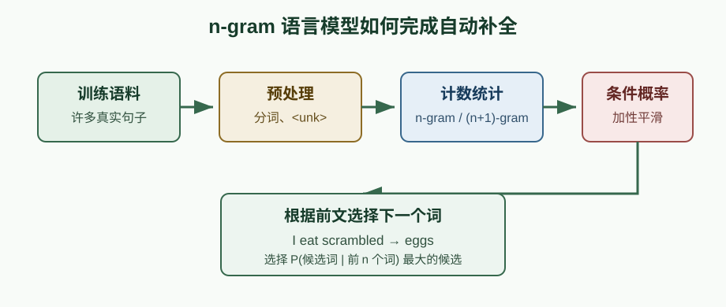
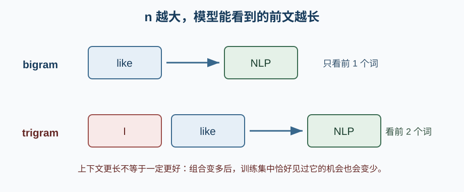
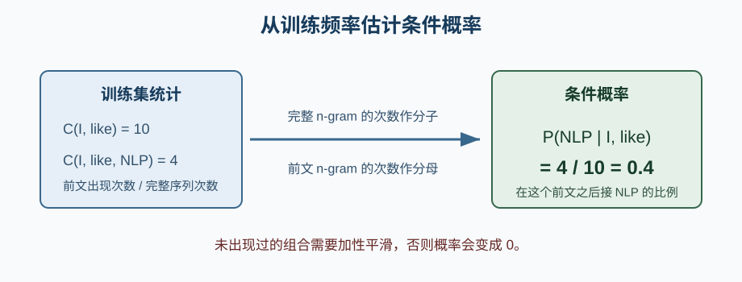
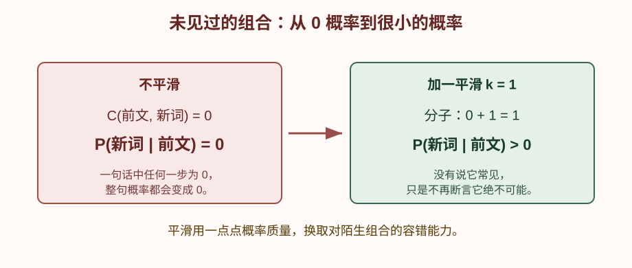

# n-gram 语言模型与自动补全

> 来源：吴恩达 NLP 专项课程 Course 2 Week 3，[[code/NLP_wuenda/lecture_two/third_week/C2_W3_Assignment.ipynb|C2 W3 Assignment：N-gram Language Model]]

这份作业实现了一个基于 n-gram 的自动补全系统：用户输入前面的词，模型根据训练语料中出现过的词序列，预测下一个词最可能是什么。

## 1. 它要解决什么问题？

例如用户已经输入：

```text
I eat scrambled
```

系统希望给出下一个词的建议：

```text
eggs
```

这次的重点不是给一段文本做分类，而是为一个词序列分配概率，并根据前文继续生成下一个词。



严格来说，Course 2 Week 1 的自动拼写纠错已经使用过 unigram 概率 $P(w)$：只看一个词自身出现得多不多。这里的 n-gram 模型更进一步，计算的是：

$$
P(w_t\mid w_{t-n},\ldots,w_{t-1})
$$

也就是：**在前面已经出现若干个词的条件下，下一个词出现的概率。**

所以，这可以看作我学到的第一个**利用上下文预测下一个词的语言模型**，也是第一个完整的文本生成任务。

## 2. 整个模型如何工作？

```text
Twitter 语料
  ↓ 切成句子、分词、转小写
训练集 / 测试集
  ↓ 低频词替换为 <unk>
处理后的训练语料
  ↓ 统计 n-gram 与 (n+1)-gram 次数
条件概率 P(下一个词 | 前 n 个词)
  ↓ 加性平滑，避免概率为 0
自动补全建议 / 困惑度评估
```

作业中的 11 个练习正好对应这条链路：

| 部分 | 关键函数 | 学到的事 |
|---|---|---|
| 预处理 | `split_to_sentences`、`tokenize_sentences` | 把原始文本变成词序列 |
| 词表 | `count_words`、`get_words_with_nplus_frequency` | 统计频率，保留常见词 |
| 未登录词 | `replace_oov_words_by_unk`、`preprocess_data` | 用 `<unk>` 统一处理低频词与新词 |
| 语言模型 | `count_n_grams`、`estimate_probability` | 用相邻词序列的次数估计条件概率 |
| 评估与生成 | `calculate_perplexity`、`suggest_a_word` | 评估模型，并给出下一个词建议 |

## 3. n-gram 到底是什么？

n-gram 是连续的 $n$ 个词。

```text
句子：I like NLP

unigram（n=1）：(I)、(like)、(NLP)
bigram （n=2）：(I, like)、(like, NLP)
trigram（n=3）：(I, like, NLP)
```

如果使用 bigram 模型，预测 `NLP` 时只看前一个词：

$$
P(\text{NLP}\mid\text{like})
$$

如果使用 trigram 模型，预测 `NLP` 时看前两个词：

$$
P(\text{NLP}\mid\text{I, like})
$$



`n` 越大，模型看到的上下文越多；但具体词序列也会变得更稀少，很多组合可能一次都没在训练集中出现过。

## 4. 频率怎样变成概率？

核心想法就是把训练语料当作统计样本。

假设训练集中：

```text
(I, like) 出现 10 次
(I, like, NLP) 出现 4 次
```

那么可以估计：

$$
P(\text{NLP}\mid\text{I, like})
=\frac{C(\text{I, like, NLP})}{C(\text{I, like})}
=\frac{4}{10}
=0.4
$$

其中 $C(\cdot)$ 表示某个词序列在训练集中的出现次数。



作业里需要同时统计两类计数：

```text
n-gram 的次数       → 分母：前文出现过多少次
(n+1)-gram 的次数   → 分子：前文后面接这个词出现过多少次
```

`count_n_grams()` 还会给每句话补边界标记：

```text
原句：I like NLP

bigram 计数用：<s> <s> I like NLP <e>
```

`<s>` 让模型知道句子从哪里开始，`<e>` 让模型可以学会何时结束。

## 5. 为什么要有 `<unk>`？

真实语言中会不断出现训练集没见过的新词，叫 OOV（out-of-vocabulary）词。

如果模型从未见过一个词，就没有它的统计次数，也很难继续预测。因此作业把训练集中出现次数少于阈值的词，统一换成：

```text
<unk>
```

这样模型在训练时就能见到 `<unk>`，测试时的陌生词也有统一的表示。

这一步的关键是：**词表只能根据训练集建立。** 测试集不能参与决定哪些词是“常见词”，否则等于提前看到了测试答案。

## 6. 训练集中没见过的组合怎么办？

直接用频率相除会有一个问题：

```text
C(前文, 下一个词) = 0
```

概率就会变成 0。后面计算一句话的整体概率时，只要乘上一个 0，整句概率也会变成 0。

因此作业使用加性平滑（add-k smoothing）：

$$
\hat P(w_t\mid h)
=\frac{C(h,w_t)+k}{C(h)+k\lvert V\rvert}
$$

其中：

- $h$：前面的 n 个词；
- $k$：平滑常数，作业中常取 1；
- $\lvert V\rvert$：词表大小。

它相当于给每个可能的下一个词先加一点“虚拟次数”。这样没见过的组合仍有一个很小的概率，而不是直接判为不可能。



## 7. 困惑度在衡量什么？

困惑度（perplexity）用来衡量语言模型面对一句话时有多“困惑”。

```text
模型觉得每一步下一个词都很合理 → 概率高 → 困惑度低
模型觉得每一步都不太像见过的搭配 → 概率低 → 困惑度高
```

作业中的形式是：

$$
PP(W)=\left(\prod_{t=1}^{N}\frac{1}{P(w_t\mid w_{t-n:t-1})}\right)^{\frac{1}{N}}
$$

不用死记整条公式，只要记住：它把每一步预测的概率合起来，作为模型对整句话的陌生程度。**比较同一测试集上的模型时，困惑度越低通常越好。**


## 8. 自动补全怎么做？

当用户输入前文后，`suggest_a_word()` 的过程是：

```text
1. 取最后 n 个词作为 previous_n_gram
2. 遍历词表中每一个候选词
3. 计算 P(候选词 | previous_n_gram)
4. 选概率最大的词
```

例如：

```text
输入：I eat scrambled
前文：eat scrambled

候选：eggs、rice、<e>、...
比较各自的条件概率
输出：概率最大的 eggs
```

`start_with` 还可以限制候选词的开头，例如用户已经打出 `e`，就只在以 `e` 开头的候选中找概率最高的词。

## 9. 优点与局限

| 优点 | 局限 |
|---|---|
| 原理直观，可以直接从次数理解概率 | 只记住固定长度的上下文 |
| 训练和预测都简单 | $n$ 变大后，数据稀疏问题更严重 |
| 很适合学习语言模型的基本组成 | 看不到更远的语义、句法关系 |
| 可以做自动补全、文本概率评估 | 训练数据不够大时，概率估计容易不稳定 |

后面的神经网络语言模型、RNN、LSTM 和 Transformer，本质上也都在做“根据上下文预测下一个词”；区别在于它们不再只靠固定 n 个词的显式次数表，而是把上下文压缩为可学习的向量表示。

## 10. 一句话记忆

> n-gram 语言模型把连续词序列在训练集中的出现次数当作统计证据，用 $P(下一个词\mid前 n 个词)$ 做自动补全；平滑负责处理没见过的组合，困惑度负责评估模型对句子的陌生程度。

## 我的理解 / 个人思考

这是我第一个真正从“生成”角度学习的语言模型。之前接触的内容更多是文本处理、分类和情感分析：输入一段文本，输出一个类别；n-gram 则是输入前文，继续预测后面的词。

我现在理解它的本质就是算术统计：把训练集里一个词、或者一段词序列出现的频率，反推成概率。模型不是先理解了句子的真实含义，再决定下一个词；它是在训练资料中寻找“这种前文之后通常跟着什么”的统计规律。

因此预测结果很大程度上由训练资料的分布决定。训练集里的某种搭配出现得多，模型就会认为它更可能；训练数据太少、太偏，或者和真实使用场景差别很大时，统计出的概率就会有明显偏差。n-gram 里的数据稀疏问题尤其直接：上下文稍微变长，许多组合就根本没见过。

`<unk>` 和加性平滑让我看到一个很实际的问题：真实数据不可能把所有词和所有组合都收集齐。它们不是让模型“知道”陌生词的意思，而是让模型遇到陌生情况时还有一个统一表示和非零概率，不会因为一次没见过就完全无法计算。

这也让我更容易理解后面的神经网络语言模型为什么重要：它们同样依赖训练数据的分布，但会尝试用词向量和参数共享，让相似的词、相似的上下文能够互相提供一点信息，而不是只认得训练集中出现过的完全相同的 n-gram。

## 相关内容

- [[notes/NLP/自动拼写纠错/自动拼写纠错|自动拼写纠错]]：第一个接触到的 unigram 词频概率模型；
- [[notes/NLP/局部敏感哈希/局部敏感哈希|局部敏感哈希]]：同属吴恩达 NLP 作业，前者解决文本生成，这篇解决相似文本检索；
- [[notes/深度学习/机器学习基础/机器学习基础|机器学习基础]]：概率、训练数据分布和模型泛化的基础。
