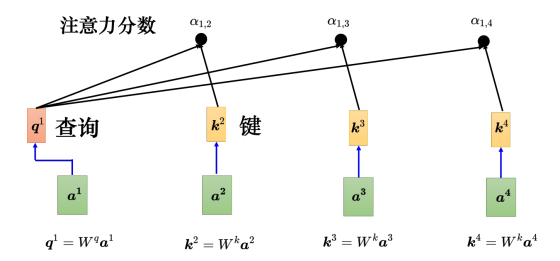
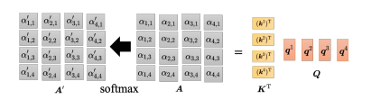
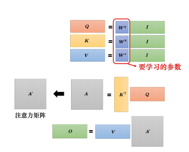
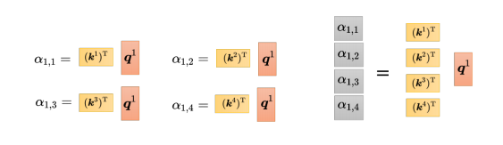
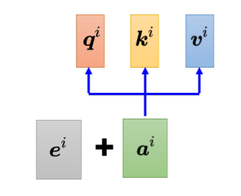
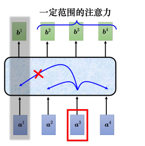
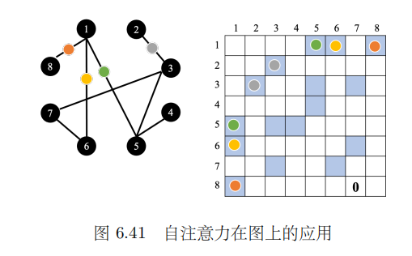

# 自注意力机制（Self-Attention）

> 李宏毅《深度学习教程》第 6 章 6.1–6.2 节笔记。
> 适用：输入是一组向量（且数量可变）的场景。
> 关联作业：[[Q&AHW4|HW4 Self-Attention]]、[[Q&A/HW5|HW5 Transformer]]。

---

## 0. 为什么需要自注意力？

之前学的网络（全连接、CNN）输入都是**一个固定向量**。但很多任务的输入是**一串向量，且长度可变**：

| 任务   | 输入        | 为什么是变长向量序列                     |
| ---- | --------- | ------------------------------ |
| 文字处理 | 一个句子      | 每个词一个向量，句子长度不一                 |
| 语音处理 | 一段声音信号    | 每 25ms 一个窗口（frame），1 秒≈100 个向量 |
| 图/分子 | 社交网络、分子结构 | 节点数/原子数各不相同                    |

**词汇如何变成向量？**
- **独热编码（One-Hot）**：10 万维向量，每个维度对应一个词。❌ 缺点：假设所有词彼此无关，**没有任何语义信息**（cat 和 dog 看不出都是动物）。
- **词嵌入（Word Embedding）**：每个词一个**含语义信息**的向量，同类词会在向量空间聚成一团。✅ 句子 = 一组长度不一的向量。

---

## 1. 三种输出类型

输入是向量序列时，输出有三种可能：

### 类型 1：输入输出数量相同（序列标注 Sequence Labeling）
每个输入向量对应一个标签，**输入 N 个 → 输出 N 个**。
- 文字：词性标注（POS tagging），如 `I saw a saw` → 第一个 saw 是动词、第二个是名词
- 语音：每帧对应一个音标
- 图：社交网络每个节点预测是否买某商品

### 类型 2：整个序列输出一个标签
**N 个输入 → 1 个标签**。
- 文字：情感分析（positive / negative）
- 语音：说话人识别
- 分子：预测亲水性

### 类型 3：序列到序列（Seq2Seq）
**N 个输入 → N' 个输出，N' 由机器自己决定**。
- 翻译（输入输出语言不同，词数本来就不一样）
- 真正的语音识别（一句话 → 一段文字）

> 📌 本章只讲**类型 1**（序列标注）。类型 3 的 Seq2Seq 在 [[Q&A/HW5|HW5 Transformer]] 再展开。

---

## 2. 为什么全连接网络不够用？

以词性标注 `I saw a saw` 为例。

### 思路 A：各击破，每个向量单独过全连接
❌ 两个 `saw` 输入完全一样，全连接网络**没有理由输出不同结果**——但我们要它输出动词/名词。

### 思路 B：开窗口，把相邻向量串起来
✅ 可以考虑上下文（语音里常用前后各 5 帧，共 11 帧）。
❌ 极限：如果要考虑**整个序列**，窗口得开到能盖住最长序列 → 参数巨多、运算量大、易过拟合。

### 解决方案：自注意力
让每个输出向量都**考虑整个序列**，再丢进全连接网络。

---

## 3. 自注意力的运作原理

### 3.1 整体结构

- 自注意力**吃整个序列、输出等长序列**，每个输出 b 都考虑了所有输入 a。
- 自注意力 ↔ 全连接可**交替叠加多次**：
  - 全连接：专注处理**单个位置**的信息
  - 自注意力：把**整个序列**信息再处理一次

> 📖 出自论文 *"Attention Is All You Need"*（Google，提出 Transformer），自注意力是其最核心模块。更早有类似架构叫 Self-Matching。

### 3.2 产生 b¹ 的过程（其余 b 同理）

**第 1 步：计算 a¹ 与其他向量的关联性 α**

用 **Query-Key-Value（QKV）** 模式 + **点积（dot-product）** 计算：

- `a¹ × Wq = q¹`（query 查询，像搜索引擎的关键字）
- `a² × Wk = k²`、`a³ × Wk = k³`、`a⁴ × Wk = k⁴`（key 键）
- 注意力分数：`α₁,ᵢ = q¹ · kⁱ`（q¹ 与 kⁱ 的内积）

> 实践中 a¹ 也会跟自己算（`α₁,₁ = q¹ · k¹`）。
>
> **Q：为什么要用 softmax？**
> A：不一定要用 softmax，也可用 ReLU 等，有人试过比 softmax 还好一点。softmax 只是最常见的。

**第 2 步：softmax 归一化**


$$
\alpha'_{1,i} = \frac{\exp(\alpha_{1,i})}{\sum_j \exp(\alpha_{1,j})}
$$

**第 3 步：根据 α' 抽取重要信息（加权和）**

- `aⁱ × Wv = vⁱ`（value）
- 把每个 v 乘上对应注意力分数再求和：

$$
b^1 = \sum_i \alpha'_{1,i} \, v^i
$$

> 谁的注意力分数最大，谁的 v 就主导（dominant）抽出的结果。比如 α'₁,₂ 大，b¹ 就接近 v²。

---

## 4. 从矩阵乘法角度重新理解（一图流）

整个过程就是一连串矩阵乘法，**唯一要学的参数只有 Wq、Wk、Wv**，其余都是人为设定。




```
输入 I = [a¹ a² a³ a⁴]   （4 列拼成矩阵）

        ┌─ × Wq → Q = [q¹ q² q³ q⁴]
   I ───┼─ × Wk → K = [k¹ k² k³ k⁴]      ← 唯一要学的参数
        └─ × Wv → V = [v¹ v² v³ v⁴]

注意力分数：A = Kᵀ · Q          （Q 与 K 之间的关联）
归一化：    A' = softmax(A)       （对 A 每一列做，使每列和为 1）
输出：      O = A' · V            （O 的每一列就是 b¹..b⁴）
```

### 关键公式总结

| 步骤       | 公式                    | 说明                    |
| -------- | --------------------- | --------------------- |
| 产生 Q/K/V | `Q=IWq, K=IWk, V=IWv` | Wq,Wk,Wv 是**唯一可学习参数** |
| 注意力分数    | `A = KᵀQ`             | q 与每个 k 的内积           |
| 归一化      | `A' = softmax(A)`     | 每列和为 1                |
| 输出       | `O = A'·V`            | 加权和                   |

---

## 5. 一句话记忆

> 自注意力 = **用 Q 和 K 算出"谁跟谁相关"（注意力分数），再用这个分数对 V 做加权和**。
> 整个序列的信息都参与，但通过分数自动决定**关注谁、忽略谁**。

---

## 6. 我的理解 / 易错点

- **Q/K/V 不是输入本身**，是输入 a 分别乘三个**不同**的权重矩阵得到的，这三个矩阵才是要学的。
- **softmax 不是必须的**，是最常见而已，可以换 ReLU 等试效果。
- 自注意力输出和输入**等长**（输入 N 个向量 → 输出 N 个向量）。
- **a¹ 也会跟自己算注意力**（α₁,₁），别忘了这一项。
- 全连接负责"局部 / 单点"，自注意力负责"全局 / 整个序列"，两者**交替叠加**。

---

## 7. 多头注意力（Multi-Head Attention）

自注意力的进阶版本。在翻译、语音识别等任务上，**头数更多**往往效果更好。头数是一个**需要调的超参数**。

### 为什么要多头？

相关性有很多种不同形式。单头只用一个 q 去找相关的 k，表达力有限。**多个头 = 多个 q，各自负责不同种类的相关性**。

### 计算过程

记号：`q^{i,1}`、`q^{i,2}` —— 上标 `i` 是**位置**，下标 `1/2` 是**第几个头**。

1. 先由 a 乘矩阵得到 q、k、v（跟单头一样）。
2. 再把 q、k、v **分别乘两个矩阵**，得到各头的 `q^1, q^2`、`k^1, k^2`、`v^1, v^2`。
3. **各头独立做自注意力**：头 1 只在头 1 内部算（`q^{i,1}` 只跟 `k^{.,1}`、`v^{.,1}`），头 2 同理，互不干扰。
   - `b^{i,1} = Σ α' · v^{.,1}`（头 1 的输出）
   - `b^{i,2} = Σ α' · v^{.,2}`（头 2 的输出）
4. **拼接 + 变换**：把 `b^{i,1}` 和 `b^{i,2}` 接起来，再乘一个矩阵 `W^O` 得到最终的 `b^i`，送下一层。

> 头数可以是 8、16，操作完全一样，只是并行的"自注意力实例"更多。

---

## 8. 位置编码（Positional Encoding）

### 问题：自注意力没有位置信息

对自注意力层，位置 1、2、3、4 **没有任何差别**——`q^1` 和 `q^4` 的"距离"不比 `q^2` 和 `q^3` 更远，**天涯若比邻**，所有位置一视同仁。

但位置信息往往有用：比如词性标注，**动词不容易出现在句首**。

### 解法：给每个位置加一个位置向量


为每个位置 i 设一个专属的**位置向量 `e^i`**，直接**加到** `a^i` 上：

$$
a^i_{\text{new}} = a^i + e^i
$$

模型看到 `a^i + e^i` 就知道"当前在第 i 个位置"。

### 位置向量怎么产生？

| 方法                           | 说明                                           |
| ---------------------------- | -------------------------------------------- |
| **正弦/余弦函数**（Transformer 原论文） | 用 sin、cos 生成，避免人为设定**固定长度**的尴尬（序列超过预设长度也不会崩） |
| **循环神经网络**                   | 用 RNN 生成位置编码                                 |
| **可学习**                      | 位置向量作为参数从数据学出来                               |

> **Q：为什么非要用 sin/cos？** A：不一定要用，位置编码是**尚待研究的问题**，可参考 *Learning to Encode Position for Transformer with Continuous Dynamical Model*。不用纠结哪种"最好"，随时能提出新做法。

---

## 9. 截断自注意力（Truncated Self-Attention）

### 问题：序列太长，注意力矩阵爆炸

语音里每 10ms 一个向量，1 秒 = 100 个，一句话上千个。注意力矩阵复杂度是 **L × L**（L 是序列长度），L 很大时**计算量巨大、内存吃不消**。

### 解法：只看一个小范围

不整句看，只看当前位置**前后一个窗口**（窗口大小人定）。判某个音标其实不需要整句话，局部信息就够。

> 本质：**牺牲一点全局视野，换速度和内存**。

---

## 10. 自注意力 vs 卷积神经网络（CNN）

### 图像也能用自注意力

一张 H×W×3 的图 = H×W 个三维向量（每个像素一个），所以图像也是向量序列，可直接用自注意力。参考 *SAGAN*、*DETR*、*ViT*。

### 核心关系：CNN 是自注意力的特例


| | CNN | 自注意力 |
|--|-----|---------|
| 看的范围 | **感受野**（人工划定，固定） | **整张图**（自动学出"感受野"形状） |
| 灵活度 | 受限制 | 更灵活 |
| 数据需求 | **数据少时好**（不易过拟合） | **数据多时好**（能榨干大数据的价值） |

> 论文 *On the Relationship between Self-attention and Convolutional Layers* 用数学证明：**CNN 就是自注意力的特例**。自注意力只要设合适的参数就能复现 CNN。

### 数据量决定胜负

- 数据少 → CNN 占优（弹性小，不易过拟合）
- 数据多 → 自注意力反超（ViT 实验：1000 万张图起步，到 3 亿张图时自注意力超过 CNN）
- 实践：可**两者都用**，如 Conformer 把自注意力和 CNN 拼在一起

---

## 11. 自注意力 vs 循环神经网络（RNN）


| | 自注意力 | RNN |
|--|---------|-----|
| 每个输出考虑 | **整个序列** | 默认只看**左边已输入**（双向 Bi-RNN 才看全部） |
| 远距离信息 | q/k 匹配即可抽取，**天涯若比邻** | 要一路存在记忆里带到远处，**易遗忘** |
| 并行 | ✅ **可并行**（所有输出同时算） | ❌ 不可并行（第 2 个输出依赖第 1 个） |
| 速度 | 更高效 | 串行，较慢 |

> 现在大量应用正把 RNN 架构换成自注意力。参考 *Transformers are RNNs*。

---

## 12. 自注意力用在图（Graph）上 → GNN

图 = 一堆向量（节点），可以用自注意力处理。但图有**边（edge）**信息：

- 节点间的关联性**不需要机器找**，图上的边已经告诉了"谁和谁相连"。
- 计算注意力时**只算有边相连的节点**，没边的直接设 0。
- 因为图是按领域知识（domain knowledge）建的，没边 = 没关系，没必要再让机器学。

> 这样限制着用自注意力，就是**图神经网络（GNN）**。

---

## 13. 自注意力的变形（xxformer）

自注意力最大的问题：**运算量太大**（L×L 的注意力矩阵）。减少运算量是未来研究重点。

- 因为都源自 Transformer，各种变形叫 **xxformer**：Linformer、Performer、Reformer……
- 权衡：变形版**速度更快，但性能略差**于原版。
- 综述：*Efficient Transformers: A Survey*、*Long Range Arena* 基准。

> 广义上 "Transformer" 常指自注意力本身。

---

## 14. 一句话总结全章

> 自注意力用 **Q·K 算相关性、对 V 加权**，让每个位置都能看整个序列；
> 多头加多种相关性、位置编码补顺序、截断版省算力、是 CNN 的泛化与 RNN 的升级、图上限制连接即成 GNN。

---

## 15. 我的理解

学完整章，几个让我对自注意力"想通"的点：

### ① 自注意力的本质是"动态的全连接"

全连接每个位置只管自己，CNN 用感受野把邻居圈进来。自注意力做的是：**让每个位置和所有位置算一个"相关度"，再按相关度加权求和**。

理解到"它就是数据驱动地决定该看谁"之后，Q/K/V 的矩阵推导就成了"怎么把这个想法用矩阵乘法高效写出来"，而不是死记的公式。**Q 问"我在找谁"、K 答"我是谁"、V 是"我能提供的内容"**——这套比喻帮我记住了三个矩阵各自的角色。

### ② CNN 是自注意力的特例

CNN 的感受野是人画死的（比如 3×3），自注意力让**网络自己学感受野的形状**：
- 自注意力 = 更大的函数集合（更灵活）
- 更灵活 = 需要更多数据喂饱，否则过拟合

ViT 实验是铁证：数据少时 CNN 赢，数据堆到上亿时自注意力反超。**没有最强的模型，只有"模型复杂度 ↔ 数据量"是否匹配**，灵活度是双刃剑。

### ③ 并行性是 RNN 被淘汰的真正原因

RNN 要一个一个传，自注意力可以一把算，工程上差距是数量级的。Bi-RNN 理论上也能看整个序列，但它慢、还容易忘。**"能做"和"能高效做"是两回事**——评估一个架构不能只看表达能力，可并行性同样是决定生死的因素。

### ④ 一个方法强在哪，往往就弱在哪

自注意力把所有位置一视同仁（天涯若比邻），这恰恰说明**它天生没有顺序概念**，得靠位置编码补。它强在"看全局"，代价是丢了"局部/顺序"的归纳偏置，要用额外机制（位置编码、截断、CNN 混合）补回来。

### ⑤ 几个"为什么"还悬着

- 为什么是**点积**不是加性（additive）？
- 为什么用 **softmax**，换成 ReLU 会怎样？
- 多头到底各自学到了什么不同相关性？
- 位置编码哪种最好？

教程里明确说这些都是**开放问题**，不必死记某个"标准答案"。

> 下一步：往 Transformer 完整架构走（Encoder-Decoder、Cross-Attention），把自注意力拼成能做 Seq2Seq 的整体。见 [[Q&A/HW5|HW5 Transformer]]。


