# BERT（Bidirectional Encoder Representations from Transformers）

> 李宏毅《深度学习教程》第 10 章 10.1.1–10.1.3 节笔记。
> 关联笔记：[[Transformer|第 7 章 Transformer]]、[[自注意力机制|第 6 章 自注意力]]。

---

## 0. 为什么要学习 BERT？

BERT 是一个预训练的 Transformer **编码器**。它先在大量没有标签的文字上学习“根据上下文填空”，再把学到的参数拿去做分类、问答等具体任务。

BERT 的关键不在于某一个下游任务，而在于：**先用海量无标注数据学一个通用的语言表示，之后再用少量标注数据微调。**

但 BERT 的预训练非常昂贵。已经训练好的 BERT 在一般 GPU 上微调，大约只需要半小时到一小时；如果从头训练一个 BERT，让它学会填空，则需要巨大的计算量。

> ❓ **Q：既然 Google 已经公开了预训练 BERT，为什么还要自己训练？**
>
> A：如果只是重新训练出一个和 Google 差不多的 BERT，确实没有太大意义。自己训练的研究价值在于观察模型的学习过程，弄清楚它什么时候学会填动词、名词和代词，以及有没有办法减少预训练的计算量。

---

## 1. BERT 的预训练成本

以较小版本的 ALBERT-base 为例，预训练数据可以达到 30 亿规模。这个数字听起来非常大，但它们主要是从网络上爬取的**未标注文字**，真正困难的是训练模型。

- 预训练步数约为 **100 万步**，也就是参数需要更新约 100 万次。
- 使用 TPU 训练约需要 **8 天**。
- 使用一般 GPU 训练，可能至少需要 **200 天**。

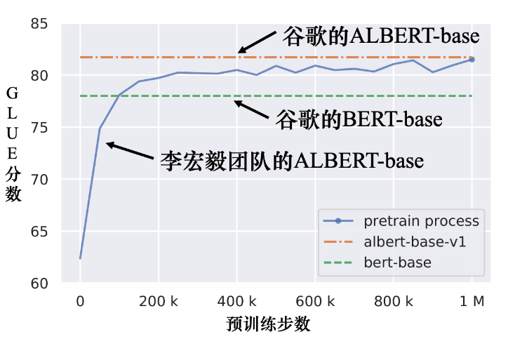
图 10.17：ALBERT 在预训练过程中的 GLUE 分数。模型在训练过程中很快超过了 BERT-base 的结果，但训练本身仍然需要大量计算资源。

> **微调（fine-tuning）**：拿预训练参数继续做具体任务，成本相对低。
>
> **预训练（pre-training）**：从海量文字开始学习填空，成本非常高。

论文 *Pretrained Language Model Embryology: The Birth of ALBERT* 关注的就是“BERT 在学习填空的过程中到底学到了什么”。如果知道不同能力形成的阶段，就可能找到更有效率的训练方法。

### 一句话记忆

> BERT 真正昂贵的是从头预训练，不是下游任务微调；研究训练过程，才有可能找到节省计算量的方法。

---

## 2. Seq2Seq 模型的预训练

BERT 只有编码器，擅长理解输入，但翻译、摘要和文本生成还需要解码器。

[[Transformer|Transformer]] 的 Seq2Seq 结构是：


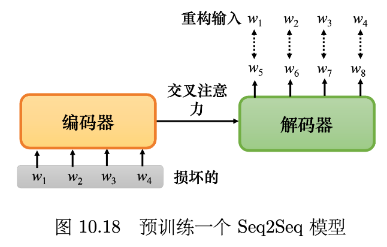

如果想预训练一个 Seq2Seq 模型，可以先把输入句子损坏，再让编码器和解码器把它还原：

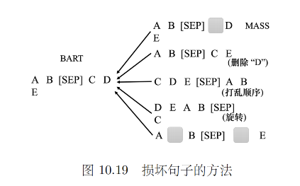

编码器看到损坏后的句子，解码器的目标是输出损坏之前的完整句子。这样训练出来的模型，同时学会了理解输入和生成输出。

### 2.1 可以怎样损坏句子？

损坏句子的方式不只有 BERT 的 Mask：


图 10.19：损坏句子的几种方法。

- **掩盖（mask）**：把部分词替换为 `MASK`。
- **删除（delete）**：直接删除部分词。
- **打乱顺序（permute）**：把词汇顺序打乱。
- **旋转顺序（rotate）**：把句子的开头移动到后面。
- **组合损坏**：同时使用掩盖、删除等方法。

> ❓ **Q：为什么要故意把输入句子弄坏？**
>
> A：如果输入和目标完全一样，模型不需要真正理解句子，只要复制输入即可。损坏输入后，模型必须根据上下文、词序和句子结构，把原句恢复出来，这就是一种去噪学习。

### 2.2 MASS、BART 与 T5

- **MASS**：*Masked Sequence to Sequence Pre-training for Language Generation*。使用类似 BERT 的掩码方法预训练 Seq2Seq 模型。
- **BART**：*Denoising Sequence-to-Sequence Pre-training for Natural Language Generation, Translation, and Comprehension*。把多种损坏方法组合起来，实验结果比 MASS 更好。
- **T5**：*Exploring the Limits of Transfer Learning with a Unified Text-to-Text Transformer*。系统尝试不同的预训练方法，并把各种 NLP 任务统一成“文本到文本”。

T5 使用了 C4（Colossal Clean Crawled Corpus）语料库。C4 原始文件约 7 TB，下载和保存都很困难；使用一个 GPU 做预处理，可能需要数百天。

这说明深度学习的规模问题不仅是“模型有多大”，还包括：

1. 数据能不能收集到；
2. 数据能不能清洗；
3. 数据能不能存下来；
4. 预处理能不能在可接受的时间内完成。

### 一句话记忆

> BERT 是“损坏一个词再填空”，BART 是“损坏一个句子再还原”，T5 则把各种任务都统一成“输入文本 → 输出文本”。

---

## 3. BERT 为什么有用？

### 3.1 BERT 输出的向量代表什么？

把“深度学习”输入 BERT 后，每个字都会得到一个向量。这些向量不只是 token 的编号，而是包含了模型对它们含义的表示。

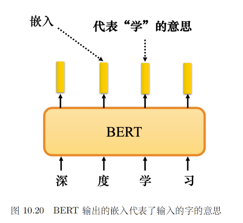

含义相近的字，向量可能比较接近：

- “果”和“草”都属于植物；
- “鸟”和“鱼”都属于动物；
- “电”与前两类的关系比较远。

如果把这些向量画在空间中，就可以观察到相似含义的词聚在一起。

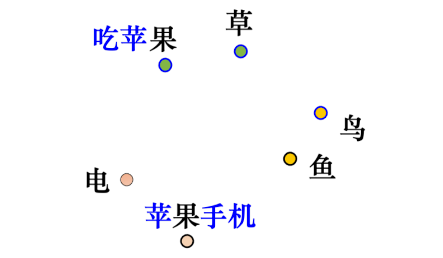
图 10.21：意思相近的字，其嵌入向量更接近。

### 3.2 同一个字，为什么可以有不同的向量？

中文里有一字多义的情况。例如下面两个“果”的含义不同：

```text
吃苹果       → 水果 / 植物相关的“果”
苹果手机     → 公司 / 电子产品相关的“果”
```

BERT 的编码器中有自注意力，所以它不会只看“果”这个字本身，还会看它周围的上下文。

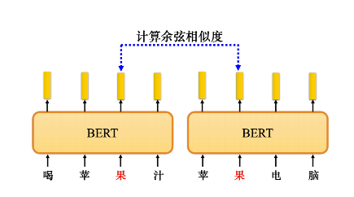
图 10.22：同一个“果”在不同上下文中会得到不同的嵌入。

可以收集很多包含“果”的句子，取出每个“果”的向量，再两两计算余弦相似度。前五个句子中的“果”表示水果，后五个句子中的“果”表示苹果公司：

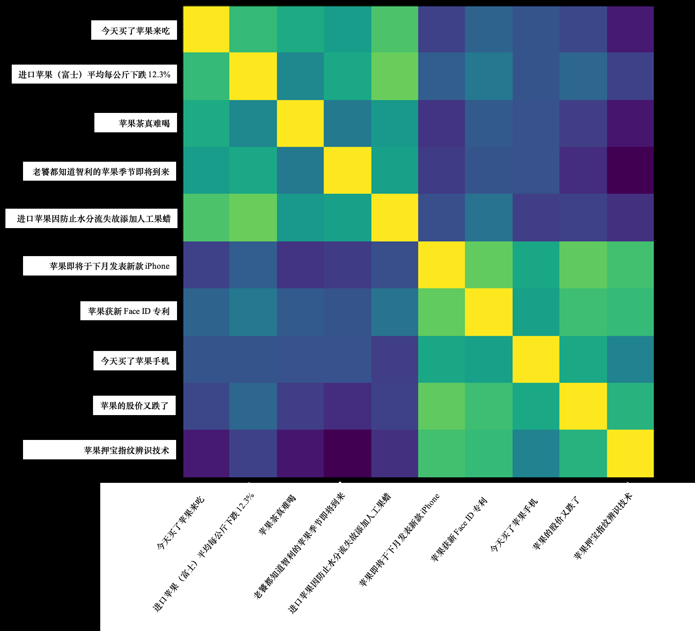

图 10.23：不同上下文中的“果”的嵌入相似度矩阵。

如果 BERT 学到了上下文，矩阵中应该出现两个相似度较高的区域：

- 水果相关的“果”彼此相似；
- 公司相关的“果”彼此相似；
- 两个区域之间的相似度较低。

> ❓ **Q：BERT 为什么能学到词的意思？**
>
> A：语言学家 John Rupert Firth 提出过一个观点：一个词的意思取决于它经常出现的上下文。“果”经常和“吃、树”一起出现时，很可能是水果；经常和“电、专利、股价”一起出现时，很可能是苹果公司。BERT 做填空时，正是在从上下文中提取信息。

### 一句话记忆

> BERT 的词向量不是固定字典，而是“这个 token 在当前上下文中的含义”。

---

## 4. BERT 与 CBOW

BERT 的填空思想在它之前就存在。**CBOW（Continuous Bag Of Words，连续词袋）** 也是把中间的词挖空，根据上下文预测它：

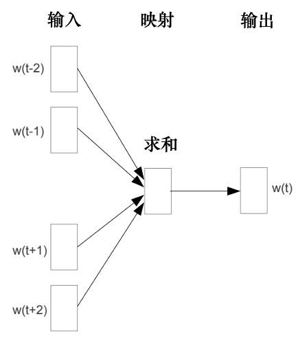

图 10.25：连续词袋模型（CBOW）。

CBOW 可以学习一个词的向量，但它的模型比较简单，通常只使用线性变换。CBOW 的作者 Thomas Mikolov 解释过：当时的计算能力和现在差距很大，训练大型深度模型很困难，所以选择了简单的线性模型。

> ❓ **Q：CBOW 为什么只用两个变换？能不能做得更深？**
>
> A：当然可以做得更复杂。CBOW 选择浅层线性结构，主要是计算资源限制，而不是因为深度结构没有意义。BERT 可以看作一个更深的、基于 Transformer 的 CBOW：它不只预测中间词，还能让同一个词根据不同上下文产生不同表示。

| 模型 | 词向量特点 | 模型结构 |
|---|---|---|
| CBOW | 一个词通常对应相对固定的向量 | 浅层、线性 |
| BERT | 同一个 token 根据上下文产生不同向量 | 深层 Transformer 编码器 |

BERT 输出的这种向量称为**语境化词嵌入（contextualized word embedding）**。

### 一句话记忆

> CBOW 是“用上下文预测中间词”的浅层模型，BERT 是加入深层 Transformer 和上下文建模能力后的高级版本。

---

## 5. BERT 可以处理 DNA、蛋白质和音乐吗？

BERT 预训练在文字上，但它处理的本质是**离散符号组成的序列**。因此，DNA、蛋白质和音乐也可以被转换成 token 序列。

以 DNA 分类为例：DNA 由 A、G、T、C 四种碱基组成。可以把四个符号任意映射成四个 token，再把序列输入 BERT：

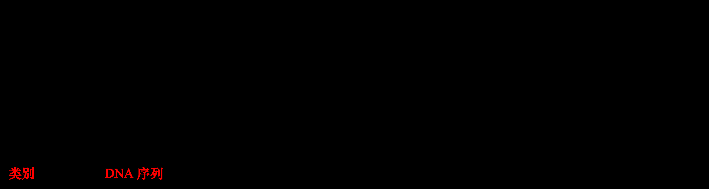

图 10.26：把 DNA 分类问题转换成序列分类问题。

```text
DNA:     A G A C
任意映射: we she we he
            ↓
          BERT
            ↓
        [CLS] 向量
            ↓
          线性层
            ↓
        DNA 类别（EI / IE / N）
```

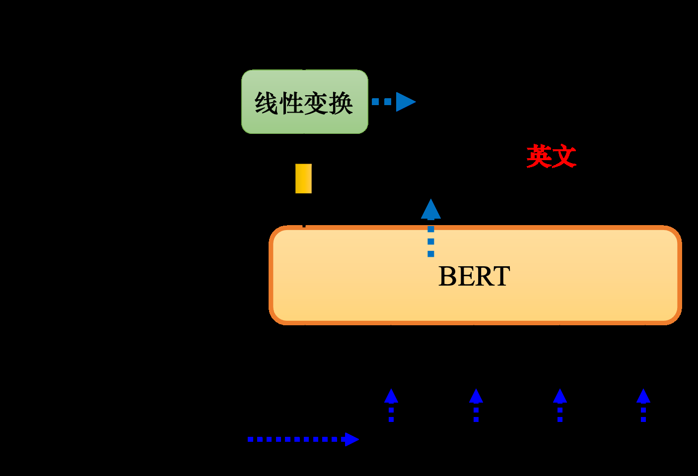

图 10.27：使用 BERT 进行 DNA 分类。

蛋白质可以把氨基酸当成 token，音乐可以把音符当成 token，然后用类似的方式做分类。实验结果显示，BERT 的效果比随机初始化的模型更好：

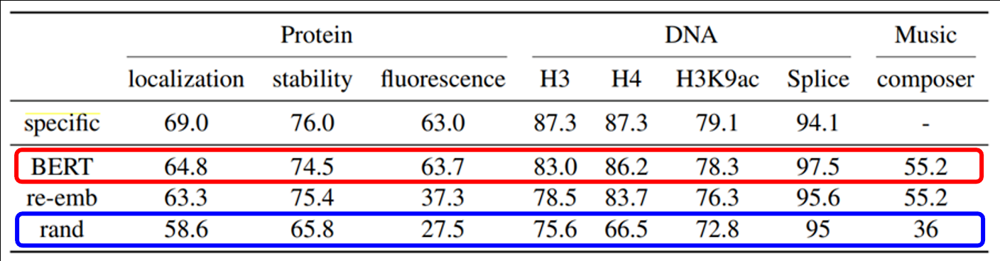

图 10.28：使用 BERT 处理蛋白质、DNA 和音乐等不同任务。

### 5.1 这个实验说明了什么？

DNA 被映射成英文单词后，并不是真的英文句子，BERT 也不可能按照普通语言的语义去理解它。但 BERT 仍然可以取得较好的分类结果。

这说明 BERT 的能力可能不完全来自“读懂了文字”，还可能来自：

- Transformer 对序列结构的建模能力；
- 预训练参数提供了较好的初始化；
- 预训练模型更容易在下游任务上继续优化。

所以观察到下游任务效果好，并不能直接证明模型学到了人类理解的语义。

### 一句话记忆

> BERT 能迁移到非语言序列，说明预训练得到的可能不只有语义，还有序列建模能力和适合优化的初始化参数。

---

## 6. 多语言 BERT

多语言 BERT 使用中文、英文、德文、法文等多种语言做填空预训练。Google 发布的多语言 BERT 使用了 104 种语言。

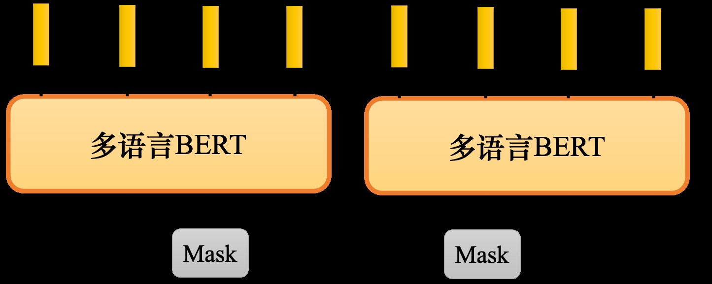

图 10.29：多语言 BERT。

### 6.1 跨语言问答迁移

一个很有意思的实验是：只用英文问答数据微调多语言 BERT，然后直接在中文问答数据上测试。

| 模型 | 预训练 | 微调 | 测试 | EM | F1 |
|---|---|---|---|---:|---:|
| QANet | 无 | 中文 | 中文 | 66.1 | 78.1 |
| BERT | 中文 | 中文 | 中文 | 82.0 | 89.1 |
| BERT | 104 种语言 | 中文 | 中文 | 81.2 | 88.7 |
| BERT | 104 种语言 | 英文 | 中文 | 63.3 | 78.8 |
| BERT | 104 种语言 | 中文 + 英文 | 中文 | 82.6 | 90.1 |

多语言 BERT 在英文数据上学会问答后，仍然可以在中文测试集上得到约 78.8 的 F1。这说明它可能把不同语言中表达相同含义的 token 放到了相近的位置：

例如：

- “兔子”和 `rabbit` 接近；
- “跳”和 `jump` 接近；
- “鱼”和 `fish` 接近；
- “游”和 `swim` 接近。

### 6.2 用 MRR 观察跨语言对齐

可以使用**平均倒数排名（Mean Reciprocal Ranking，MRR）**衡量跨语言嵌入是否对齐。

$$
\mathrm{MRR} = \frac{1}{N} \sum_{i=1}^{N} \frac{1}{\mathrm{rank}_i}
$$

`rank_i` 是正确的跨语言对应词在候选结果中的排名。MRR 越高，代表相同含义的不同语言 token 越容易互相找到，跨语言对齐越好。

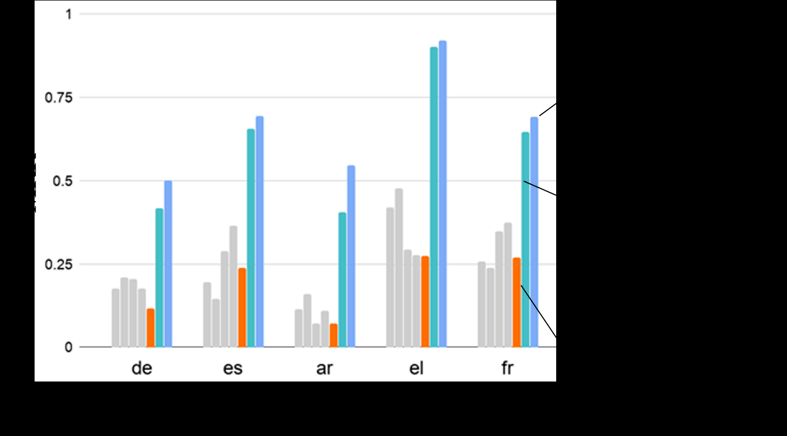

图 10.31：不同数据量下多语言 BERT 的 MRR 对比。

李宏毅团队一开始每种语言只使用 20 万个句子，训练出的模型对齐效果不好；后来增加到每种语言约 100 万个句子，模型才逐渐学会跨语言对齐。

> **数据量是跨语言能力的关键因素。** 很多能力并不是模型结构天然拥有的，而是在数据规模足够时才会出现。

### 6.3 多语言 BERT 会不会把语言信息抹掉？

不会。多语言 BERT 可以让不同语言中含义相同的 token 靠近，但它仍然知道语言信息：

- 输入英文句子，通常用英文 token 填空；
- 输入中文句子，通常用中文 token 填空。

语言信息并没有完全消失。可以把所有英文 token 的嵌入求平均，再把所有中文 token 的嵌入求平均，两者相减就得到一个近似的“语言方向”。给英文句子的嵌入加上这个方向，模型可能会把它看成更接近中文的句子。

在这个想法下，多语言 BERT 甚至可以做一定程度的**无监督 token 级翻译**：把英文表示移动到中文方向，再让模型做填空。但这种翻译质量有限，因为语言信息仍然藏在模型内部。


### 一句话记忆

> 多语言 BERT 把不同语言的共享语义拉近，却没有完全消除语言身份；数据量越大，跨语言对齐越明显。

---

## 7. 本章总结

| 问题                    | 结论                               |
| --------------------- | -------------------------------- |
| BERT 为什么难训练？          | 预训练数据和更新步数都非常大，计算成本远高于微调         |
| BERT 为什么有用？           | 通过上下文填空学习语境化词嵌入                  |
| BERT 能做生成吗？           | BERT 主要是编码器，生成任务可预训练 Seq2Seq 模型  |
| MASS / BART / T5 做什么？ | 通过损坏并还原文本学习 Seq2Seq 表示           |
| BERT 能处理 DNA 吗？       | 可以把 DNA 当成离散 token 序列，利用预训练参数做分类 |
| 多语言 BERT 为什么能跨语言迁移？   | 不同语言的相同含义在向量空间中对齐                |

> BERT = **用上下文做填空，学到语境化表示**；BART/T5 = **把损坏的文本还原，预训练 Seq2Seq**；多语言 BERT = **把不同语言的共享语义对齐**。

## 8. 我的理解 / 个人思考

- BERT 的关键不是“记住每个词”，而是通过填空被迫学习“这个词在当前上下文中是什么意思”。
- BERT 能迁移到 DNA、蛋白质和音乐，让我意识到预训练的能力可能不只有语义，还包括序列结构建模能力和较好的初始化参数。
- BERT 是编码器，重点是理解；BART 和 T5 加入了解码器，重点扩展到了生成。这里可以和 [[Transformer|Transformer 解码器]] 的自回归生成联系起来。
- 多语言 BERT 并没有简单地把所有语言混在一起，而是同时保留了共享语义和语言身份。不同语言表示接近，不等于语言差异完全消失。
- 目前还没有完全理解的地方：BERT 的 Masked Language Modeling 和 CBOW 在目标函数、上下文范围、参数共享方面到底有什么严格差异；ALBERT 的参数共享和因子分解又是怎样降低训练成本的。
