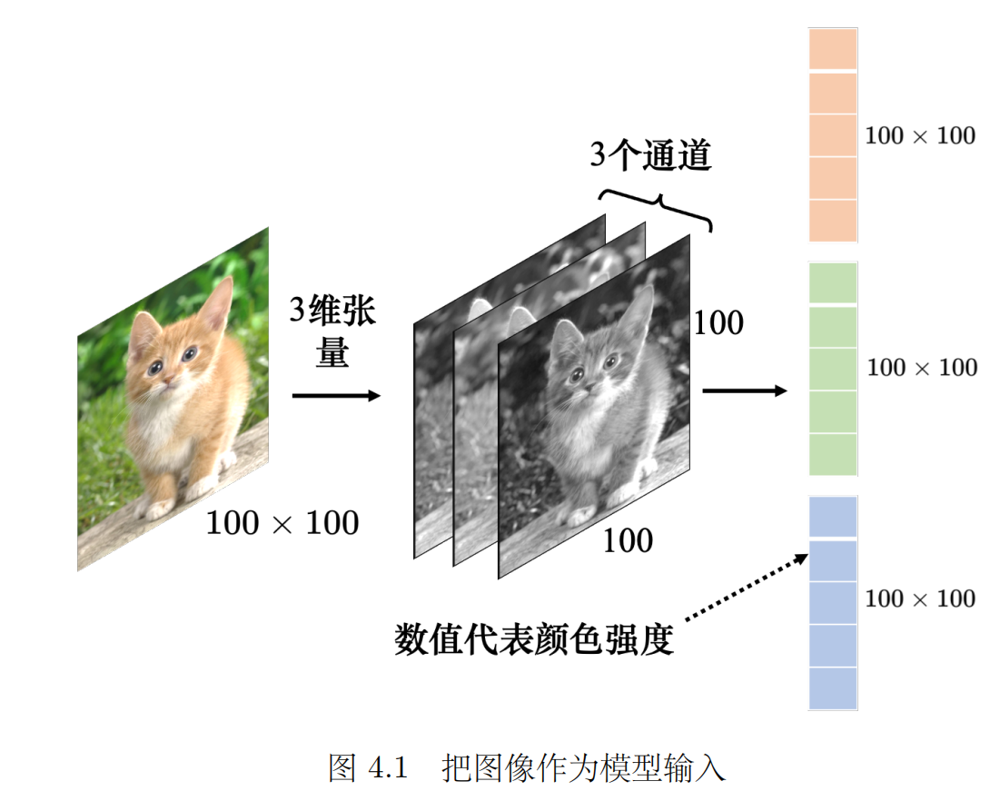
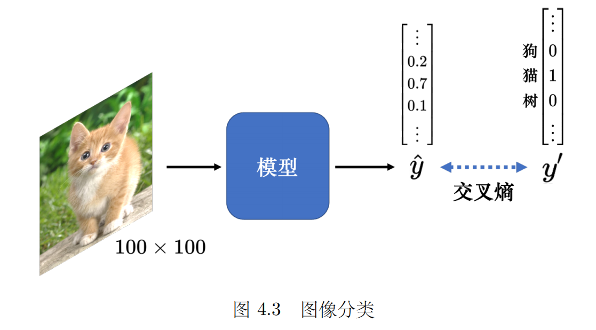
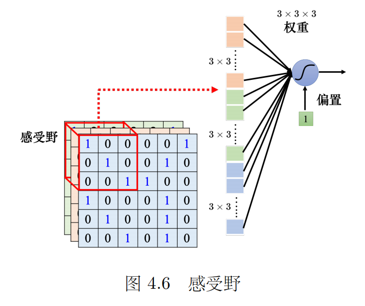

# 卷积神经网络（CNN）

> 李宏毅《深度学习教程》第 4 章笔记。
> 核心问题：全连接网络参数太多、容易过拟合——**图像本身有什么特性，可以让我们把网络"设计"得更省？** 三个观察 → 三个简化，最后拼出 CNN。
> 关联作业：[[Q&AHW3]]（HW3 = CNN 图像分类）。
> 关联笔记：[[机器学习基础|第 1 章]]（过拟合、弹性）、[[循环神经网络|第 5 章 RNN]]、[[自注意力机制|第 6 章 自注意力]]、[[Transformer|第 7 章 Transformer]]。

---

## 0. 图像怎么进网络？

### 0.1 图像 = 三维张量

图像分类：给机器一张图像，判断里面是什么（猫/狗/飞机……）。

对机器来说，一张图像是一个**三维张量**（维度 > 2 的矩阵）：

| 维度          | 含义      |
| ----------- | ------- |
| 宽           | 像素列数    |
| 高           | 像素行数    |
| 通道（channel） | 颜色描述的数目 |

> ❓ **Q：什么是通道？**
> A：彩色图像每个像素都可以描述成红（R）、绿（G）、蓝（B）的组合，这 3 种颜色就是图像的 3 个色彩通道，即 **RGB 色彩模型**（常用于屏幕显示）。

### 0.2 拉直成向量

网络的输入往往是向量，所以进网络前先把三维张量**拉直**：

```
100 × 100 × 3 的图像 → 拉直 → 100×100×3 = 30000 维的向量
每一维 = 某个像素在某个通道下的颜色强度
```

图像有大有小，常见做法是先把所有图像**统一调整成相同尺寸**再喂进去（本笔记默认 100 × 100）。

### 0.3 全连接的参数灾难

如果把 30000 维向量直接喂给全连接网络，第 1 层 1000 个神经元就需要：

$$
1000 \times 100 \times 100 \times 3 = 3 \times 10^7 \text{ 个权重}
$$

参数多 → 模型弹性大 → **过拟合风险高**（见 [[机器学习基础|第 1 章]]）。

**破题思路**：做图像识别时，考虑到图像本身的特性，其实**不需要每个神经元都连接输入的每个维度**。接下来的三个观察就是从图像特性出发做简化。

### 0.4 输出怎么定？

分类任务 → 输出用**独热向量（one-hot）** $\boldsymbol{y}'$ 表示：

- 类别对应的维度 = 1，其余 = 0
- **向量长度 = 可识别的类别数**（识别 1000 类就是 1000 维）
- 输出过 **softmax** 得 $\hat{\boldsymbol{y}}$，训练目标：$\boldsymbol{y}'$ 和 $\hat{\boldsymbol{y}}$ 的**交叉熵**越小越好

---

## 1. 观察 1：检测模式不需要整张图像

图像识别网络里的神经元，要做的事是检测图像里有没有**关键模式（pattern）**：

```
鸟嘴 ┐
眼睛 ├── 都出现了 → 网络判断"这是一只鸟"
鸟爪 ┘
```

人和机器一样，判断物体时<font color="#ff0000">**抓最重要的特征**</font>就够了。

**关键观察**：要判断有没有鸟嘴，**不需要看完整张图像**，只要看一小块范围。所以神经元**不需要把整张图像当输入**，<u>只需要把图像的一小部分当输入</u>。

---

## 2. 简化 1：感受野（Receptive Field）

### 2.1 基本设定

给每个神经元划一个**守备范围**——**感受野（receptive field）**：

- 神经元只关心自己感受野里发生的事
- 例如感受野是 $3 \times 3 \times 3$ 的范围 → 拉直成 27 维向量 → 神经元有 **27 个权重 + 1 个偏置**
- 输出再送给下一层神经元


- 感受野**彼此可以重叠**
- **同一个感受野可以有多个神经元**守备（64 个或 128 个），因为不可能检测所有模式，多放几个"兵种"各管一种模式

### 2.2 感受野可以任意设计

| 设计维度 | 可选项 |
| --- | --- |
| 大小 | $3\times3$、$11\times11$……（小模式小范围就能测出，大模式要大范围） |
| 形状 | 正方形、长方形都行 |
| 通道 | 可以只看 RGB 中的某一个通道（有些模式可能只在某个通道出现） |

> ❓ **Q：感受野一定要相连吗？**
> A：**不一定要相连**——理论上一个神经元的感受野可以是"图像的左上角 + 右上角"。但要反过来问：**有什么模式必须同时看这两个角落才能检测到？** 一般模式都出现在图像的某个连续位置，不会分散在多个角落，所以**通常感受野都是相连的**。想为特殊问题设计奇怪的感受野完全可以，这都是自己决定的。

### 2.3 经典设定（最常见的做法）

图像识别里通常假设"模式不会只出现在某一个通道"→ 感受野**看全部通道** → 描述感受野时**只需讲高和宽**，高宽合称**核大小（kernel size）**。

- **核大小 = 3 × 3**：经典默认。意味着假设"重要模式在 $3\times3$ 的小范围内就能被检测出来"。（$7\times7$、$9\times9$ 已经算很大）
  - 那些大过 $3\times3$ 的模式怎么办？→ **见第 3.4 节：网络叠得越深，看得越广**。
- **stride（步幅）**：把感受野往右/往下移动的量，移动一次产生一个新感受野。是**超参数**。
  - 一般设 **1 或 2**——因为希望相邻感受野**有重叠**。
  - > ❓ **Q：为什么希望感受野之间有重叠？**
    > A：如果完全不重叠，一个模式正好出现在两个感受野的**交界**上时，没有任何神经元完整看到它，模式就丢了。重叠能保证每个位置都有神经元负责。
- **padding（填充）**：感受野超出图像范围时补值。
  - 最常用**零填充（zero padding）**：超出部分当 0
  - 也有补整张图像均值等其他方法
  - 不补的后果：图像边界的模式没有神经元检测，漏掉了
- 水平扫完再**垂直扫**（垂直步幅通常也是 2），保证**整张图每一寸都有感受野覆盖**——图像里每个位置都有一群神经元在检测有没有模式。

> 📌 **一句话记忆**
> 感受野 = "每个神经元只管一小块地"；经典配置：核 $3\times3$、步幅 1~2、零填充、扫满全图。

---

## 3. 观察 2：同样的模式可能出现在图像的不同区域

鸟嘴可能出现在图像**左上角**，也可能出现在**中间**。

本来这不是问题——感受野盖满全图，鸟嘴落在哪儿都会被某个感受野里的"鸟嘴检测神经元"抓到。但问题是：**这些检测鸟嘴的神经元做的事情一模一样，只是守备范围不同**。每个范围都放一个鸟嘴检测器 → 参数太多 → 浪费。

> 💡 类比：每个院系都要修深度学习课，教务处不必每个院系开一门，**开一门大课让大家一起修**就好。

---

## 4. 简化 2：参数共享（Parameter Sharing）

**做法**：让不同感受野的神经元**共用同一组参数**（权重完全相同）。

```text
神经元 A（守备左上角）:  σ(w1·x1  + w2·x2  + … + b)   (4.1)
神经元 B（守备右下角）:  σ(w1·x1' + w2·x2' + … + b)   (4.2)
                            ↑ 权重相同，输入不同
```

- **参数一样，输出不会一样**——因为输入不同（各自守备的范围不同）
- 共享的方式完全可以自己决定，图像上常见的共享方式：
  - 每个感受野由一组神经元（如 64 个）守备
  - 上一个感受野的第 1 个神经元 ↔ 下一个感受野的第 1 个神经元共用参数
  - 第 2 个 ↔ 第 2 个……
- **每个感受野只需要这一组参数**——这组参数就叫**滤波器（filter）**

> 📌 **一句话记忆**
> 参数共享 = "一个检测器（滤波器）的副本派驻到图像每个位置"——检测器只有一份，岗位有无数个。

---

## 5. 两个简化合起来 = 卷积层

### 5.1 弹性的代价与收益

| 架构 | 看的范围 | 参数 | 弹性 |
| --- | --- | --- | --- |
| 全连接 | 可自己决定看整张图或小范围（把多余权重设 0 即可） | 最多 | 最大 |
| + 感受野 | **只能**看一个小范围 | 减少 | 变小 |
| + 参数共享 | 某些神经元**无论如何**参数必须相同 | 大幅减少 | 更小 |

感受野 + 参数共享 = **卷积层（convolutional layer）**；用到卷积层的网络 = **卷积神经网络（CNN）**。

CNN 的**偏差（bias）比较大**，但偏差大不一定是坏事（见 [[机器学习基础|第 1 章]]）：

- 弹性低 → **不容易过拟合**
- 全连接什么都能做但什么都做不精；卷积层是**专为图像设计**的（感受野、参数共享都来自图像的特性）
- ⚠️ 把 CNN 用到图像之外的任务前，先想想**那个任务有没有图像的特性**

### 5.2 版本二的故事：滤波器扫图（卷积）

同一个卷积层有**两个等价的故事版本**，前面讲的是"神经元 + 共享参数"（版本一），现在讲"滤波器"（版本二）——两者是一模一样的东西。

**版本二**：

- 卷积层里有一排**滤波器**，每个大小是 $3 \times 3 \times \text{通道}$（彩色图 3 通道，黑白图 1 通道）
- 滤波器里的数值就是**参数**，初始未知、**通过学习找出来**
- 用法：滤波器放在图像左上角，9 个值和覆盖范围的 9 个值**对应相乘再相加（内积）**；按步幅右移/下移，重复扫完全图

例子（黑白 6×6 图像，滤波器检测"对角线都是 1"的模式）：

```text
       ┌ 1 0 0 ┐
filter │ 0 1 0 │   在图上做内积：哪块区域跟滤波器越像，内积值越大
       └ 0 0 1 ┘   输出图里数值最大的位置 = 模式出现的位置
```

**feature map（特征映射）**：

- 每个滤波器扫完全图 → 得到一组数字（例中是 4×4）
- 64 个滤波器 → 64 组数字 → 这就是特征映射
- **特征映射可以看成一张新图像**：通道不是 RGB 3 个，而是 **64 个**（每个通道对应一个滤波器）
- 一张图像通过一个卷积层：3 通道 → **64 通道**

### 5.3 卷积层可以叠很多层

第 2 层卷积的滤波器大小设 $3 \times 3$，但**高度必须是 64**——因为滤波器的高度 = 它要处理的图像的通道数（上一层的滤波器数目）。

> ❓ **Q：滤波器一直只设 3×3，网络会不会看不到大范围的模式？**
> A：**不会。** 第 2 层的滤波器看的是第 1 层输出的特征映射的 $3\times3$ 范围，而这 $3\times3$ 在**原图上对应 $5\times5$** 的范围：

```text
第 1 层:  3×3 感受野        原图: ┌────────┐
     ↓                          │ 3×3    │
第 2 层:  3×3（在第1层输出上）    │  ┌───┐ │ ← 第2层的3×3
                                 │  └───┘ │    覆盖原图 5×5
                                 └────────┘
```

**网络叠得越深，同样 3×3 的滤波器在原图上"看到"的范围就越大**。所以网络够深，不怕检测不到大模式。

### 5.4 滤波器与神经元：两个版本对接

| 版本一（神经元） | 版本二（滤波器） |
| --- | --- |
| 共用的那组权重 | 一个滤波器（$3\times3\times3$ 个数字） |
| 不同神经元守备不同范围 | 滤波器扫过整张图像 |
| — | "扫图"这个过程就叫**卷积**（名字的由来） |

神经元有偏置，**滤波器也有偏置**——实践中 CNN 的滤波器都带偏置（上面的简化里为了省事没画）。

> 📌 **一句话记忆**
> 卷积层 = 感受野（只看小块）+ 参数共享（同一组权重到处巡逻）；滤波器视角：**一份 3×3×通道 的参数，扫过全图做内积，输出 feature map（新图像，通道数 = 滤波器数）**。叠层越深，看得越广。

---

## 6. 观察 3：下采样不影响模式检测

**下采样（downsampling）**：把图像的偶数列、奇数行去掉，图像变成原来的 1/4——**图里的东西还是那个东西**（大鸟缩小后还是鸟）。

---

## 7. 简化 3：汇聚（Pooling）

### 7.1 做法与性质

- 把滤波器输出的数字**分组**（$2\times2$ 一组、$3\times3$ 一组都行，自己决定）
- **最大汇聚（max pooling）**：每组选**最大值**当代表（最常用）
- **平均汇聚（mean pooling）**：每组取**平均值**

⚠️ **汇聚没有参数**——它不是"层"，里面没有权重、没有要学的东西，更像 Sigmoid、ReLU 这样的**操作符（operator）**，行为固定、不需要从数据里学。

### 7.2 作用与取舍

- 效果：**图像变小**（例：4×4 → 2×2），**通道数不变**
- 主要作用：**减少运算量**
- 代价：可能伤害性能——要检测**非常微细的东西**时，随便下采样会丢细节
- **近年趋势**：算力足够后，很多网络**丢掉汇聚、全卷积**（fully convolutional network）——从头到尾只用卷积，看能不能做得更好
- 实践上经典做法是**卷积 + 汇聚交替**（如两次卷积 + 一次汇聚），但汇聚**可有可无**

### 7.3 经典图像识别网络全流程

```text
图像 100×100×3
   ↓ 卷积 × N（感受野 + 参数共享）
feature map（多通道"新图像"）
   ↓ 汇聚（可选，图像变小）
   ↓ 卷积 → 汇聚 → …（交替堆叠）
   ↓ flatten 扁平化（拉直成向量）
   ↓ 全连接层
   ↓ softmax
类别概率分布（one-hot 对比，交叉熵）
```

**flatten（扁平化）**：把本来排成矩阵的数值拉直成一个向量。

> 📌 **一句话记忆**
> 汇聚 = "缩小图像、省运算"的无参数操作符；对精细任务有伤害，算力够就全卷积。最后 flatten → 全连接 → softmax 收尾。

---

## 8. 应用：下围棋（AlphaGo）

### 8.1 下围棋 = 分类问题

- **输入**：棋盘上黑子/白子的位置 → 棋盘表示成 $19\times19$ 的"图像"（黑=1、白=-1、空=0，只是一种表示法）
- **输出**：下一步落子的最佳位置 → **19×19 个类别的分类问题**
- 全连接也能做，但 **CNN 效果更好**

### 8.2 为什么 CNN 能用在围棋上？

CNN 不是随便套都好——**它为图像的特性而生**。下围棋能用 CNN，说明**围棋跟图像有共同的特性**：

| 图像上的观察 | 在围棋上 |
| --- | --- |
| 观察 1：小范围就能检测模式 | 不用看全盘就知道"白子被围住了"（图 4.32 的模式）；黑子放下面可以提子，白子接上可以救 |
| 观察 2：同样的模式出现在不同位置 | "叫吃"的模式可以出现在棋盘任何角落，检测器不该每个位置重造一份 |

AlphaGo 的第一层滤波器是 $5\times5$——设计者认为棋盘上的重要模式看 $5\times5$ 就够了。

> ❓ **Q：图像上都会做汇聚，AlphaGo 为什么不用？**
> A：**汇聚对下围棋这种精细任务并不实用**——图像随便抽掉一行一列还是"同一样东西"，但**棋盘随便拿掉一行/列，整个棋局就完全不同了**。观察 3（下采样不影响）在围棋上**不成立**，所以不用汇聚。

### 8.3 AlphaGo 的实际架构

> 📖 架构细节在 Nature 论文的**附件**里（正文没提）。

```text
输入: 19×19×48 的"棋盘图像"
  ↓ 卷积: 5×5 滤波器 × k=192, stride=1, ReLU（+zero padding）
  ↓ 卷积: 3×3 × 192, stride=1（+zero padding）× 11 层
  ↓ softmax → 19×19 类
  全程没有汇聚！
```

- **每个棋盘位置用 48 个通道描述**（围棋高手设计的特征：是否被叫吃、旁边有没有异色子等）→ 棋盘是 $19\times19\times48$ 的图像
- **k = 192** 是试出来的：也试了 128、256，192 效果最好
- **没有汇聚**——原因见上面的 Q&A

### 8.4 用 CNN 的前提：任务要有"图像的特性"

- CNN 也被用到语音（*Convolutional Neural Networks for Speech Recognition*）和文字（*UNITN: Training Deep CNN for Twitter Sentiment Classification*）上
- 但**不能直接套**：感受野和参数共享的方式要**按语音/文字的特性重新设计**（比如语音里"模式"是沿时间轴的，跟图像 2D 平移不完全一样）
- 用任何架构前先想清楚：**这个架构到底代表什么意思、适不适合这个任务**

---

## 9. CNN 的局限：缩放和旋转

⚠️ **CNN 不能处理图像放大缩小或旋转**：

- 训练时狗都是某一种大小，推理时把图像放大 → CNN 可能就认不出来了
- 对 CNN 来说，放大后的图像是**另一张完全不同的图**——虽然形状一样，但拉直成向量后**数值完全不同**

**应对**：

1. **数据增强（data augmentation）**：训练时把每张图截一小块放大（让 CNN 见过不同大小的模式）、把图旋转（让它见过旋转后的物体）→ CNN 才能做好
2. **Spatial Transformer Layer**：一种能处理缩放/旋转的网络架构（细节另查）

> 📌 **一句话记忆**
> CNN 认"位置和数值"，不认"形状不变性"；缩放旋转的不变性要靠数据增强喂出来，或换 Spatial Transformer Layer。

---

## 10. 整章一句话记忆

> **CNN = 三个图像先验焊进架构：**
> ① 模式在小范围内可检测 → **感受野**（3×3、stride 1~2、padding 补 0）
> ② 同一模式会出现在不同位置 → **参数共享**（一份滤波器巡逻全图）
> ③ 下采样不改变物体 → **汇聚**（无参数操作符，精细任务可不用）
> **卷积层 = 感受野 + 参数共享**：滤波器扫图做内积 → feature map（通道数 = 滤波器数）→ 叠层越深看得越广 → flatten → 全连接 → softmax。
> **架构不是套餐**：AlphaGo 有 ①② 没 ③（围棋不许抽行抽列）；用在语音/文字上要先重新设计感受野和共享方式。
> **CNN 不认缩放/旋转** → 数据增强补。

---

## 11. 我的理解

### ① 架构设计 = 把对数据的观察"焊"进网络

这一章最大的收获不是卷积公式，而是**方法论**：三个观察（小范围可检测 / 模式位置随机 / 下采样不变）→ 三个简化（感受野 / 参数共享 / 汇聚）。**先观察数据的结构性特点，再把假设焊死在架构里**，而不是一上来就全连接堆参数。

这跟我工作里"先理解业务的数据形态再选方案"是同一件事——日志类数据、时序数据、图像，各自有不同的先验，架构选择应该是**从数据推出来的**，不是从"大家都用"推出来的。

### ② "限制弹性"不是让步，是划算的交易

全连接弹性最大但参数爆炸、容易过拟合；卷积层把弹性砍掉一大截，换来参数骤减 + 不易过拟合，而且**只要先验成立，砍掉的弹性本来就用不上**（图像里的模式确实不需要每个维度都连）。

这跟第 7 章"Seq2Seq 像瑞士刀但不如专用模型"是同一类取舍（见 [[Transformer|第 7 章笔记]]的"Seq2Seq 的局限"）。偏差-方差的权衡在这里落到了**架构设计**层面：给模型加先验 = 主动加大偏差，赌的是先验真实成立。

### ③ 两个版本的故事：同一件事的两种记法

"神经元 + 感受野 + 共享权重"和"滤波器扫图做内积"是**一模一样的两套描述**。我觉得两个视角各有用处：

- 读论文/听课时说"检测器"→ 神经元视角直观（谁在守哪块地）
- 读代码/算形状（`nn.Conv2d(in_channels, out_channels, kernel_size)`）→ 滤波器视角直接（就是一组学出来的数字扫图）

**同一个东西能在两套语言间自由切换，才算真懂了**。以后看到"共享参数"我就想"滤波器在巡逻"，看到"filter 扫图"就想"神经元派驻到每个感受野"。

### ④ 每个组件都要单独问："它背后的观察在这个任务上成立吗？"

AlphaGo 是本章最好的反面教材（正面教材？）：有感受野、有共享、**没有汇聚**——因为"下采样不改变物体"这条在围棋上不成立。这直接强化了我在第 7 章的感悟（Post-LN 不是圣经）：**架构里的每个组件都不是套餐的一部分，都要单独过一遍"为什么"**。以后搭网络时，对每一个层都先问：它对应的假设在我的数据上成立吗？

### ⑤ 越深看得越广：深度换广度

"一直 3×3 会不会看不到大模式"这个疑问我也冒出来过——答案是**第 2 层的 3×3 在原图上对应 5×5**。原来"网络深度"不只是增加容量，还**天然扩大了感受范围**。这解释了为什么经典网络（VGG 等）敢全程用小滤波器——小的便宜（参数少），深的补广（感受野大）。

### ⑥ 模型没有的不变性，只能从数据里喂

CNN 不认缩放/旋转——这提醒我**"不变性"不是架构自动送的**。架构给了平移不变性（参数共享带来的），但缩放/旋转的不变性就要靠**数据增强**把各种变体喂进训练集。**架构给不了的不变性，用数据补**——这跟我工作里"测试环境没覆盖的场景就是线上事故来源"是一个味道：模型没见过的变形，它就真的不会。

### ⑦ 汇聚的没落：算力改变了设计取舍

汇聚的作用被讲清楚是"**减少运算量**"而不是"提升精度"——所以算力上来之后它就"可有可无"了，近年网络倾向于全卷积。这提醒我：**很多经典组件的存在理由是"当年算力不够"，不是"它让模型更好"**。看老论文的设计时要区分"为了效果"还是"为了省算力"，别把工程妥协当成原理。

### ⑧ 还悬着的问题

- max pooling 和 mean pooling 实际效果差在哪？什么场景选哪个？（书里只讲了做法没比较）
- Spatial Transformer Layer 具体怎么"学会变形"的？
- 数据增强除了截块放大和旋转，还有哪些常用招？
- 汇聚去掉之后，"缩小图像"的需求（控制计算量）现在靠什么补？stride 直接调大？还是别的？
- 48 个围棋通道是高手手工设计的——这跟后面要学的"端到端学习"（让模型自己学特征）是不是一对矛盾？

> 下一步：往回补第 2、3 章（分类等），或按 NLP 练习进度做作业 3（HMM 词性标注）。
