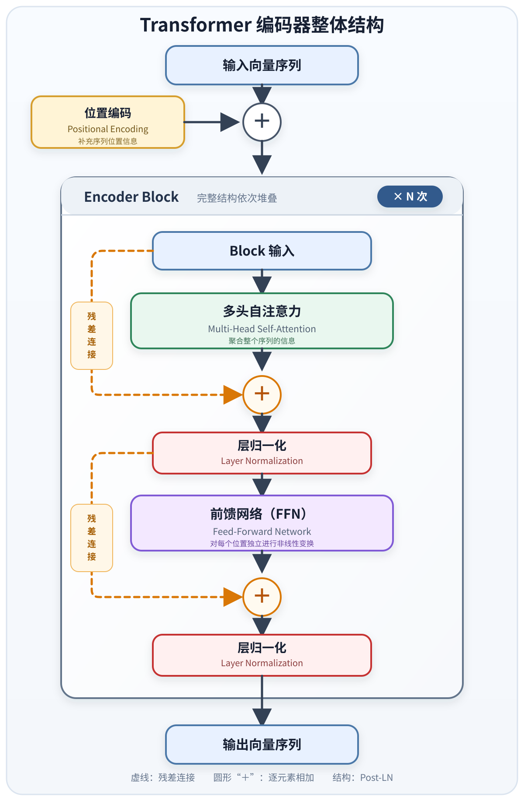
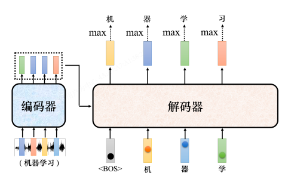
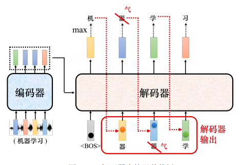
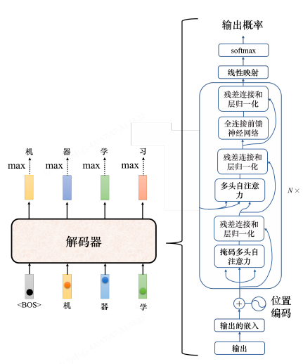
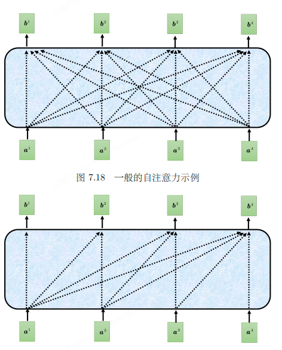
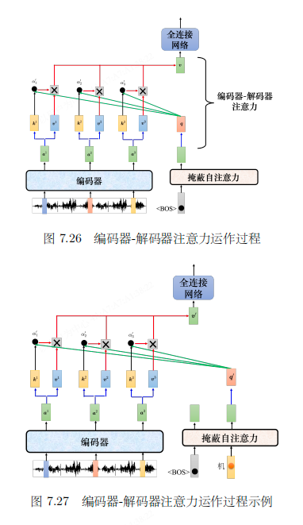

# Transformer（Transformer / Seq2Seq）

> 李宏毅《深度学习教程》第 7 章笔记。
> 适用：输入和输出都是序列、且输出长度可由机器自己决定的场景。
> 关联作业：[[Q&AHW5]]（LN vs BN、FFN/FC 等编码器相关问题）。
> 关联笔记：[[自注意力机制|第 6 章 自注意力]] 是 Transformer 的核心模块。

---

## 0. 为什么需要 Transformer？

[[自注意力机制|第 6 章]] 学的自注意力只解决了「**让每个位置看到整个序列**」。但很多任务不只是"输入 N 个向量 → 输出 N 个标签"：

| 任务    | 输入         | 输出          | 难点            |
| ----- | ---------- | ----------- | ------------- |
| 机器翻译  | 中文句子（N 个词） | 英文句子（N' 个词） | N' ≠ N，由机器决定  |
| 语音识别  | 声音信号（T 帧）  | 文字（N 个字）    | T ≫ N，长度无对应关系 |
| 聊天机器人 | 一句话        | 一句回应        | 回应多长由机器自己决定   |
| 句法分析  | 一段文字       | 句法树         | 输出是结构，不是定长向量  |

**自注意力本身不解决"输出长度由机器决定"的问题**——它输入 N 个、输出 N 个，长度不变。需要再加一个能"自己决定什么时候停"的模块。

**Transformer 就是把自注意力拼成完整的 Seq2Seq 模型**：再加一个**解码器**，负责根据编码器的输出**逐个生成**输出序列，并自己决定何时停止。

> 📖 出自论文 *"Attention Is All You Need"*（Google，2017）。相对基于 RNN 的 Seq2Seq，它的核心优势是**可并行计算**。

---

## 1. 序列到序列（Seq2Seq）模型

### 定义

输入和输出都是序列，长度关系有两种：
- 输入长度 = 输出长度
- 输出长度**由机器自己决定** ← 这才是 Seq2Seq 的本质难点

### 常见应用

| 应用         | 输入        | 输出           | 长度关系        |
| ---------- | --------- | ------------ | ----------- |
| 语音识别       | 声音信号（T）   | 文字（N）        | N 由机器决定     |
| 机器翻译       | 一种语言句子（N） | 另一种语言句子（N'）  | N' 由机器决定    |
| 语音翻译       | 声音信号      | 另一种语言文字      | 长度由机器决定     |
| 语音合成（TTS）  | 文字        | 声音信号         | 长度由机器决定     |
| 聊天机器人      | 一句话       | 回应           | 长度由机器决定     |
| 句法分析       | 一段文字      | 句法树（→ 序列）    | 树状结构转成序列    |
| 多标签分类      | 一篇文章      | 多个类别         | 类别数量由机器决定   |

> ❓ **Q：既然「语音识别 + 机器翻译」接起来就能做语音翻译，为什么还要专门做？**
> A：世界上很多语言**没有文字**，无法做语音识别。比如闽南语文字不普及，一般人看不懂——直接把闽南语声音信号翻译成白话文文字，绕过"闽南语文字"这一步。
> 李宏毅实验室用 1500 小时乡土剧（闽南语语音 + 白话文字幕）训练闽南语→白话文模型。乡土剧字幕有噪声、音乐、字幕对不齐——**直接训练一个端到端模型，忽略这些问题**。先把粗糙数据丢进去，再迭代优化。

### 把"非翻译任务"也看成 Seq2Seq

很多任务都可以套上 Seq2Seq 的壳：
- **问答（QA）**：输入 = 文章 + 问题，输出 = 答案
- **自动摘要**：输入 = 长文，输出 = 摘要
- **情感分析**：输入 = 句子，输出 = 正面/负面
- **句法分析**：把句法树**转成序列**就可以用 Seq2Seq（论文 *Grammar as a Foreign Language* 把语法当成另一种语言来"翻译"）
- **多标签分类**：一篇文章可属于多个类别，类别数量不固定 → 用 Seq2Seq 让机器自己决定输出几个类别
- **目标检测**：论文 *End-to-End Object Detection with Transformers*（DETR）也用 Seq2Seq

### Seq2Seq 的局限

> 📌 **重要警示**：Seq2Seq 像瑞士刀，什么都能做，但**不一定最好**。针对具体任务定制的模型往往表现更好。
>
> 例：Google Pixel 4 的语音识别用的是 **RNN-Transducer**（专为语音特性设计），而非 Seq2Seq。

---

## 2. Transformer 整体结构

一般的 Seq2Seq 模型分两半：


```
输入序列 → [ 编码器 ] → 处理后的向量序列 → [ 解码器 ] → 输出序列
```

| 部件               | 职责                     |
| ---------------- | ---------------------- |
| **编码器（Encoder）** | 处理输入序列，把结果"丢"给解码器      |
| **解码器（Decoder）** | 根据编码器的输出**决定输出什么、何时停** |

> 📖 Seq2Seq 起源很早：2014 年 9 月论文 *Sequence to Sequence Learning with Neural Networks* 就用 Seq2Seq 做翻译。Transformer 是 Seq2Seq 的**典型代表**。

> 📌 **本笔记只到编码器**。解码器（自回归生成、掩码注意力、cross-attention）与训练技巧续学时补到本笔记下半部分。

---

## 3. Transformer 编码器

### 3.1 功能与接口

- **输入**：一排向量
- **输出**：另一排向量（**长度相同**）

自注意力、RNN、CNN 都能"输入一排 → 输出一排"，Transformer 编码器选的是**自注意力**。

### 3.2 块（Block）的概念

编码器内部由多个**块（block）**串联：


```
输入向量序列 → [block 1] → [block 2] → ... → [block N] → 输出向量序列
```

⚠️ **关键**：一个 block ≠ 神经网络的一层。一个 block 内部做了好几件事。

### 3.3 一个块的内部结构

最朴素的版本（先不考虑残差和归一化）：


```
输入向量 → [ 自注意力 ] → 中间向量 → [ 全连接网络 ] → 输出向量
```

- 自注意力：考虑**整个序列**的信息（见 [[自注意力机制|第 6 章]]）
- 全连接网络：对**每个向量单独**处理

> 这跟第 6 章最后说的"自注意力 ↔ 全连接可交替叠加"是同一件事。Transformer 把"自注意力 + 全连接"打包成一个**块**，再堆 N 次。

### 3.4 残差连接（Residual Connection）

原始 Transformer 在每个块里加了**两次**残差连接：


```
                ┌──── 残差：a + b ────┐
b（输入）→ [自注意力] → a ─────────────→ (+) → 层归一化 → 全连接输入
```

即：输出 = **子层输出 + 子层输入**。

| 目的       | 说明                            |
| -------- | ----------------------------- |
| 缓解梯度消失   | 深层网络梯度反传时，残差给了一条"短路"通道         |
| 保留原始信息   | 子层可能丢失信息，加回输入保底               |
| 让网络堆更深   | 没有残差，Transformer 很难堆到几十层      |

### 3.5 层归一化（Layer Normalization）

$$
x'_i = \frac{x_i - m}{\sigma}
$$

- $m$：输入向量的均值
- $\sigma$：输入向量的标准差

**层归一化 vs 批量归一化：**

| 维度         | 层归一化（LN）           | 批量归一化（BN）        |
| ---------- | ------------------ | ---------------- |
| 计算维度       | **同一个样本**内不同特征维度   | **不同样本**的同一个特征维度 |
| 是否依赖 batch | ❌ 不依赖              | ✅ 依赖             |
| 适用场景       | 序列模型 / Transformer | CNN              |

> ❓ **Q：为什么 Transformer 用 LN 而不用 BN？**
> A：论文 *PowerNorm: Rethinking Batch Normalization in Transformers* 解释了 BN 在 Transformer 里不如 LN，并提出**能量归一化（Power Norm）**，性能跟 LN 差不多甚至更好。
>
> 直觉：序列长度可变、batch 内长度一时，BN 会在"不同样本的同一位置"上算统计量——但不同样本的"位置 5"可能根本不是同一种东西，统计没意义。LN 只在"同一个样本内部"算，跟序列长度无关，所以稳。

### 3.6 一个块的完整流程（原始 Transformer）


```
                ┌──── 残差 ────┐               ┌──── 残差 ────┐
输入 → [自注意力] → (+) → [层归一化] → [前馈网络] → (+) → [层归一化] → 块输出
                          ↑                                    ↑
                       （Post-LN 位置）                      （Post-LN 位置）
```

按原文顺序：
1. **自注意力** → 残差连接 → 层归一化
2. **前馈网络（FFN）** → 残差连接 → 层归一化

> 📖 这种"残差 → LN"的顺序叫 **Post-LN**。论文 *On Layer Normalization in the Transformer Architecture* 提出 **Pre-LN**（先 LN 再进子层），训练更稳、结果更好。**原始 Transformer 的架构不是最优的**——这跟我工作里"别盲信 best practice"是一回事。

### 3.7 编码器整体结构（重复 N 次）



### 3.8 关键设计点回顾

| 设计        | 作用          | 备注                            |
| --------- | ----------- | ----------------------------- |
| 自注意力      | 考虑整个序列      | 可并行，是 Transformer 的核心（见第 6 章） |
| 残差连接      | 缓解深层信息丢失    | `输出 = 子层输出 + 子层输入`            |
| 层归一化      | 稳定训练        | 不依赖 batch，比 BN 更适合序列          |
| 前馈网络（FFN） | 对每个向量做非线性变换 | 自注意力后接 FFN 是标准组合              |
| 位置编码      | 注入位置信息      | 自注意力本身无序                      |
| N 个块堆叠    | 增加模型容量      | N 是超参数                        |

---

## 4. 编码器一句话记忆

> Transformer 编码器 = **"自注意力 + 全连接"打包成块，块内套残差和层归一化，再堆 N 次，开头补位置编码**。
> 自注意力管"看全局"，残差管"能堆深"，LN 管"训得稳"，三者合一才是 Transformer 能 work 的关键。

---

## 5. Transformer 解码器（7.4）

编码器只会"读"，不会"决定输出多长"。**解码器的核心职责是：根据编码器的输出，自己一个一个吐出输出序列，并自己决定什么时候停**。

### 5.1 自回归解码器（Autoregressive）

以语音识别为例，输入声音"机器学习"：

解码器如何一个一个生成：

1. 给解码器一个**特殊起始符号** `<BOS>`（Begin Of Sequence），它是词表里多加的一个 token，用独热向量表示。
2. 解码器吐出一个**长度 = 词表大小**的向量，先过 softmax 成概率分布，分数最高的字就是输出（比如"机"）。
3. 把刚吐出的"机"**当作下一步的输入**，连同 `<BOS>` 一起再喂解码器 → 输出"器"。
4. 再把"器"当输入 → 输出"学" → 输出"习"……
5. 反复，直到解码器吐出**结束符号** `<EOS>`（End Of Sequence）为止。

| 时间步 | t1      | t2        | t3  | t4  | t5      |
| --- | ------- | --------- | --- | --- | ------- |
| 输入  | `<BOS>` | `<BOS>`,机 | 机,器 | 器,学 | 学,习     |
| 输出  | 机       | 器         | 学   | 习   | `<EOS>` |

**关键特征：解码器的输入是它自己上一步的输出**——这就是"自回归"。

> ❓ **Q：解码器输出的单位是什么？**
> A：取决于任务对"语言单位"的理解，不固定：
> - **中文语音识别**：单位是**方块字**，词表大小约 3000（常用字）
> - **英文**：可以选**字母**（单位太小）、**词汇**（用空格切，词表太大），折中用**字首/字根**（subword，如 BPE）
>
> 不管选什么，**词表大小 = 解码器每步输出向量的维度**，每个 token 对应一个数值。

### 5.2 误差传播（Error Propagation）

自回归的副作用：**解码器把自己的输出当输入**，一旦某步错了（比如把"器"识别成"气"），后续都基于错的输入继续生成——**一步错，步步错**。


```
正确: <BOS> → 机 → 器 → 学 → 习
错误: <BOS> → 机 → 气(✗) → ? → ?   ← 后面全跑偏
```

这是自回归解码器的**固有缺陷**，后续训练技巧（teacher forcing 等）会专门缓解。

### 5.3 解码器的内部结构

跟编码器很像，但**多了一层掩码自注意力**：


```
解码器一个块:
  输入
   ↓
  [掩蔽自注意力]  ← 关键差异 1: 不能看右边
   ↓ + 残差 → LN
  [编码器-解码器注意力]  ← 关键差异 2: 跟编码器要信息（见第 6 节）
   ↓ + 残差 → LN
  [前馈网络 FFN]
   ↓ + 残差 → LN
  输出
   ↓
  [Linear + softmax]  ← 最后输出概率分布
```

### 5.4 掩蔽自注意力（Masked Self-Attention）

普通自注意力：每个位置都能看**整个序列**（包括右边还没生成的）。

掩码自注意力：**每个位置只能看自己和左边的，不能看右边**。

```
位置:    1     2     3     4
b1 能看: [a1]
b2 能看: [a1,  a2]
b3 能看: [a1,  a2,  a3]
b4 能看: [a1,  a2,  a3,  a4]
```

> ❓ **Q：为什么解码器要加掩码？**
> A：**因果性**问题。编码器是一次把整句读进去，a1 到 a4 同时存在。但**解码器是逐个生成**的：先有 a1，才有 a2，再有 a3——计算 b2 的时候，a3、a4 根本还没产生，**物理上没法看右边**。
>
> 训练时虽然可以一次塞整句（teacher forcing），但为了**让训练和推理行为一致**，也要用掩码强制模拟"看不到未来"这件事。否则训练时偷看了未来，推理时没有未来可看，行为就崩了。

### 5.5 为什么需要 `<EOS>`？

光有 `<BOS>` 不够——解码器不知道**什么时候停**。产生完"习"后，它还会继续把"习"当输入，吐出"惯"、"惯"…… 永远停不下来。

**`<EOS>` 就是"刹车信号"**：

```
... → 学 → 习 → <EOS>   ← 解码器看到"习"后，输出 <EOS> 概率最高 → 停
```

`<EOS>` 也是词表里的一个特殊 token。机器通过训练学会"在合适的位置输出 `<EOS>`"，从而自己决定输出序列长度——**这正是 Seq2Seq「输出长度由机器决定」的实现机制**。

### 5.6 非自回归解码器（Non-Autoregressive, NAR）

自回归一次产一个字，长度 N 的句子要解码 N 次。**非自回归（NAR）一次把整句都吐出来**。

#### 对比

| 维度      | 自回归（AR）        | 非自回归（NAR）              |
| ------- | -------------- | ---------------------- |
| 生成方式    | 一次一个，串行        | 一次整句，并行                |
| 解码步数    | N 次（N = 句长）    | 1 次                    |
| 速度      | 慢              | 快                      |
| 性能      | 通常更好           | 通常不如 AR，需要很多技巧逼近       |
| 输入      | 1 个 `<BOS>`    | 一整排 `<BOS>`（数量 = 输出长度） |
| 输出长度怎么定 | 自己吐 `<EOS>` 决定 | 需要额外机制                 |

#### NAR 如何决定输出长度

既然一次全吐，得先知道吐几个字。两个做法：

1. **加一个分类器**：编码器输出 → 一个分类器 → 输出一个数字 N → 解码器吃 N 个 `<BOS>` → 一次吐 N 个字。
2. **给一堆 `<BOS>` 上限**：假设输出不会超过 300 字，就给 300 个 `<BOS>`，输出 300 个字，`<EOS>` 右边的全丢掉。

#### NAR 的优势与代价

**优势：**
- **平行化**（最大优势）：不管句长，一步生成完整句子。这是 Transformer 自注意力时代才可能的——LSTM/RNN 给一排 `<BOS>` 也只能一个一个吐。
- **可控输出长度**：在语音合成（TTS）里特别有用——分类器输出 ÷ 2 → 语速变 2 倍快；× 2 → 语速变 2 倍慢。

**代价：**
- 性能通常不如 AR，要靠很多技巧才能逼近。

> 📌 NAR 在 TTS 里非常常用，因为语速可控这个特性对语音合成很有价值。

---

## 6. 编码器-解码器注意力（7.5）

编码器和解码器之间怎么传信息？靠**编码器-解码器注意力**（也叫 cross-attention）——它是连接两边的桥梁。

### 6.1 Q/K/V 的来源

普通自注意力：Q、K、V 都来自同一个序列。

**Cross-attention 的关键：Q 和 K/V 来自不同地方**：

| 符号  | 来源              |
| --- | --------------- |
| Q   | **解码器**前一层输出    |
| K   | **编码器**的输出      |
| V   | **编码器**的输出      |

> 解码器拿着自己产生的 Q，**去编码器那边"取信息"**——这就是"解码器根据编码器输出来决定下一步输出什么"的实现方式。

### 6.2 计算过程

假设编码器输出 `a1, a2, a3`（3 个向量）：


```
1. 解码器吃 <BOS>，经掩码自注意力得到一个向量
2. 这个向量 × 矩阵 → 查询 q

3. 编码器的 a1, a2, a3 各自产生键 k1, k2, k3 和值 v1, v2, v3

4. q 跟 k1, k2, k3 算注意力分数 → α1, α2, α3
5. softmax 归一化 → α1', α2', α3'

6. 加权和: v = α1'·v1 + α2'·v2 + α3'·v3

7. v 丢给全连接网络 → 最终输出
```

公式：

$$v = \alpha'_1 v_1 + \alpha'_2 v_2 + \alpha'_3 v_3$$

### 6.3 直觉

- **Q = "解码器现在想问的问题"**（比如"我现在要产生第 2 个字，编码器你那边哪个位置跟我相关？"）
- **K = "编码器每个位置的标签"**（"我是位置 1 的语义""我是位置 2 的语义"…）
- **注意力分数 α = Q 和 K 的匹配度**（解码器的问题跟编码器哪个位置最相关）
- **V = "编码器每个位置的实际内容"**
- **加权和 v = "按相关性加权取出来的编码器信息"**

所以解码器是**按需从编码器抽取信息**，而不是把编码器输出全部塞进来。

### 6.4 多步的运作

```
t1: <BOS> → 产生 q1 → 跟编码器 K/V 算 → 抽出 v1 → 全连接 → 输出"机"
t2: <BOS>,机 → 产生 q2 → 跟编码器 K/V 算 → 抽出 v2 → 全连接 → 输出"器"
t3: ...  
```

每一步解码器都会**重新决定**该关注编码器的哪些位置——这就是"翻译时对齐"的来源（比如英文"apple"对齐到中文"苹果"）。

### 6.5 K/V 来自编码器的哪一层？

原始论文：解码器**每一层**都拿编码器**最后一层**的输出当 K/V。

> 📖 但不一定要这样。论文 *Rethinking and Improving Natural Language Generation with Layer-Wise Multi-View Decoding* 提出"逐层多视图解码"，让不同层拿编码器不同层的输出——又是"原始架构不是圣经"的例子。

---

## 7. Transformer 的训练过程（7.6）

### 7.1 训练目标：每个时间步做一次分类

解码器每一步吐出的是**长度 = 词表大小**的概率分布，要让它跟"正确答案那个字的独热向量"越接近越好。衡量"接近"用的就是**交叉熵（cross-entropy）**。

以语音识别"机器学习"为例，训练时希望解码器的输出序列是：

```
t1 输出 → 跟 "机" 的独热向量越接近越好
t2 输出 → 跟 "器" 的独热向量越接近越好
t3 输出 → 跟 "学" 的独热向量越接近越好
t4 输出 → 跟 "习" 的独热向量越接近越好
t5 输出 → 跟 <EOS> 的独热向量越接近越好   ← 别忘了 <EOS>
```

每一步都是一次**多类分类问题**——假设中文字 4000 个，就是 4000 类的分类。**整句的损失 = 每一步交叉熵的总和**，目标是让这个总和越小越好。

### 7.2 教师强制（Teacher Forcing）

**关键技巧：训练时喂给解码器的输入是"正确答案"，不是它自己上一步的输出**。

```
训练时:
<BOS>           → 解码器 → 期望输出 "机"
<BOS>, 机        → 解码器 → 期望输出 "器"   ← 输入是正确答案 "机"，不是解码器自己吐的（可能错的）字
<BOS>, 机, 器    → 解码器 → 期望输出 "学"
<BOS>, 机, 器, 学 → 解码器 → 期望输出 "习"
<BOS>, 机, 器, 学, 习 → 解码器 → 期望输出 <EOS>
```

这种"给正确答案当输入"的训练方式就叫**教师强制（teacher forcing）**。

> ❓ **Q：为什么训练时要用 teacher forcing？**
> A：如果训练时让解码器吃自己上一步的输出，那一旦某步错了，后续训练信号全基于错误输入——模型学到的就是"在错误上下文下生成"，跟推理时一样会**一步错步步错**，训练根本收敛不了。喂正确答案能让每一步的训练信号都干净、独立，模型能稳定学到"在正确上下文下，下一步该是什么"。
>
> 代价：训练时永远只见过正确输入，推理时一旦出错就没见过这种"错误上下文"——这就是后面要讲的**曝光偏差（exposure bias）**，要用**计划采样**缓解。

### 7.3 训练 vs 推理的关键差异

| 阶段  | 解码器输入              | 输出依据        | 是否并行    |
| --- | ------------------ | ----------- | ------- |
| 训练  | **正确答案**（teacher forcing） | 交叉熵最小化      | 可一次喂整句  |
| 推理  | **自己上一步的输出**        | 贪心/束搜索选最高概率 | 必须一步步串行 |

> 📌 这种"训练见正确、推理见错误"的不一致，是后续训练技巧（scheduled sampling 等）要解决的核心问题。

---

## 8. 序列到序列模型训练常用技巧（7.7）

### 8.1 复制机制（Copy Mechanism）

**动机**：很多任务里，解码器不需要"创造"输出，而是从输入里"复制"一些东西。

**例子 1 — 聊天机器人**：
> 用户："你好，我是库洛洛"
> 机器应答："库洛洛你好，很高兴认识你"

"库洛洛"对机器来说是个罕见词，训练数据里可能一次都没出现过——让模型**从零生成**它几乎不可能。但如果模型学到的是"看到'我是某某某'就**把'某某某'复制**到回答开头"，训练就容易多了。

**例子 2 — 摘要**：
摘要任务里很多词就是直接从原文复制的。训练数据要百万级文章+人工摘要，**复制能力**对摘要任务尤为关键。

> 📖 最早实现复制能力的模型：
> - **指针网络（Pointer Network）**
> - **复制网络（Copy Network）**

> 💡 这跟工作里"不要重复造轮子"是一个道理——能从输入直接搬运的，就别让模型费力从头生成。

### 8.2 引导注意力（Guided Attention）

**问题**：Seq2Seq 有时会产生莫名其妙的结果。比如语音合成让它念一次"发财"，它把"发"省了只念"财"——训练数据里这种极短句太少。

**适用场景**：语音识别、语音合成这种**对注意力位置有强约束**的任务。

- 语音识别：注意力必须**由左向右**扫过输入声音，不能跳过某段
- 语音合成：注意力也必须由左向右念过每个字

**做法**：既然我们知道这类任务的注意力"应该"长什么样（由左向右），就直接把这个先验**塞进训练**里，强迫注意力学成那个样貌，而不是放任它自己学。

> 💡 这是"**用领域知识约束模型**"的典型——不要什么都让模型自己学，已知规律就直接约束。

### 8.3 束搜索（Beam Search）

#### 贪心搜索（Greedy Search）

最朴素：每一步选**当前分数最高**的字。

```
词表 V = {A, B}
t1: P(A)=0.6, P(B)=0.4 → 选 A
t2: 给 A, P(A)=0.4, P(B)=0.6 → 选 B
t3: 给 A,B, P(A)=0.4, P(B)=0.6 → 选 B

最终输出: A B B
路径概率: 0.6 × 0.6 × 0.6 = 0.216
```

**问题**：贪心只看眼前，可能错过全局最优。

#### 穷举搜索（Exhaustive Search）

把所有路径都试一遍，找全局最优。**不现实**：中文 4000 字，每步 4000 个分叉，走两三步就指数爆炸。

#### 束搜索（Beam Search）

折中方案：**保留分数最高的前 k 条路径**（k 称为束宽 beam size），逐步扩展。

```
例：第一步 B 虽然 0.4 < A 的 0.6，但如果保留 B 这条路径：
t1: 选 B (0.4)  ← 第一步舍弃一点
t2: P(B|B)=0.9  ← 后续大增
t3: P(B|B,B)=0.9
路径概率: 0.4 × 0.9 × 0.9 = 0.324 > 0.216 (贪心)
```

绿色路径第一步差，但整体更好——束搜索能找到这种"先苦后甜"的解。

#### 束搜索的局限

> 📖 论文 *"The Curious Case Of Neural Text Degeneration"* 发现：
> - **句子补全任务**用束搜索 → 机器不断讲重复的话
> - 不用束搜索、加些随机性 → 反而是更正常的句子

**结论**：束搜索是否好用，**取决于任务特性**：

| 任务类型       | 答案是否明确 | 束搜索是否有效 |
| ---------- | ------ | --------- |
| 语音识别       | ✅ 明确   | ✅ 有帮助     |
| 翻译         | ✅ 较明确  | ✅ 有帮助     |
| 句子补全/对话/摘要 | ❌ 需要创造力 | ❌ 反而有害    |

> 💡 "答案明确的任务适合贪心/束搜索，需要创造力的任务反而要加随机性"——这跟工作里"确定性问题用规则、创造性问题留弹性"是同一类取舍。

### 8.4 测试时加噪声（Adding Noise）

**反直觉发现**：语音合成模型训练好后，**测试时往解码器输入加一些噪声，合出来的声音反而更好**。

- 不加噪声：声音听不太出来是人声
- 加点噪声（引入随机性）：声音更自然

**为什么**：对于语音合成、句子补全这类任务，"解码器找出的最优解"不等于"人觉得最好的结果"——反而奇怪一点、带点随机性的结果更像人话。

> 💡 这违背了传统机器学习"测试时要干净"的常识，是生成任务特有的现象。跟上面"需要创造力的任务别用束搜索"是同一个道理的两面。

### 8.5 用强化学习训练（RL for Seq2Seq）

#### 问题：训练目标和评估目标不一致

| 阶段   | 优化目标          | 计算方式       |
| ---- | ------------- | ---------- |
| 训练   | **交叉熵**（逐字）   | 可微分        |
| 评估   | **BLEU 分数**（整句） | 不可微分       |

- **BLEU**（BiLingual Evaluation Understudy）：拿解码器生成的整句跟正确答案整句对比算分数，广泛用于评价序列输出质量。
- 训练时**最小化交叉熵 ≠ 最大化 BLEU**——逐字最优不等于整句最优。

#### 直接优化 BLEU 的困难

想"损失 = -BLEU"，但 BLEU 涉及整句对比，**根本没法对它求梯度**，传统反向传播不适用。

#### 解法：把损失当奖励，用强化学习

> 📖 论文 *"Sequence Level Training with Recurrent Neural Networks"*：

- 把**解码器当成智能体（agent）**
- 把**BLEU 分数当成奖励（reward）**
- 用 RL（如 policy gradient）来训练——绕开"损失不可微"的障碍

> 💡 这是"**优化不了就绕过**"的典型思路——遇到不可微的目标函数，就换一套优化框架（RL），而不是硬上反向传播。跟工作里"工具不合适就换工具，别跟工具死磕"是同一回事。

### 8.6 计划采样（Scheduled Sampling）

#### 曝光偏差（Exposure Bias）

```
训练时: 解码器永远只见过"正确输入"   (teacher forcing 的副作用)
推理时: 解码器看到的是"自己的输出"   (可能带错)

→ 训练和推理的输入分布不一致 → 一旦推理时出错，解码器没见过"错误上下文"
  → 一步错步步错（误差传播）
```

这种不一致叫**曝光偏差（exposure bias）**。

#### 计划采样的做法

> 📖 论文 *"Scheduled Sampling for Sequence to Sequence Learning"* (Bengio 团队，2015)：

**核心思想**：训练时不要全喂正确答案，**偶尔故意喂一些错的输入**给解码器，让它学会"在错误上下文下也能 recover"。

```
训练早期: 100% 正确答案 (跟 teacher forcing 一样，先学会基本生成)
训练中期: 80% 正确 + 20% 用模型自己的输出
训练后期: 比例逐渐增加错的输入
```

像"逐步撤掉拐杖"——一开始给完全正确的答案（拐杖），慢慢让模型适应"答案可能有点错"的现实，最终在推理时也能稳健生成。

#### 计划采样的代价

> 📖 Transformer 上的改进论文：
> - *"Scheduled Sampling for Transformers"*
> - *"Parallel Scheduled Sampling"*

**问题**：朴素 scheduled sampling 会**伤害 Transformer 的并行能力**——因为一旦用模型自己上一步的输出当输入，就没法一次喂整句，得退回串行。

**Transformer 的招数**：跟原始 LSTM 版本不一样，专门设计了**能保留并行性**的计划采样变体（具体细节后续看论文）。

> ❓ **Q：scheduled sampling 和 schedule learning rate 是一回事吗？**
> A：**不是**，名字像但完全不同：
> - **scheduled sampling**（计划采样）：训练时**输入**的"正确 vs 错"比例逐渐变化
> - **schedule learning rate**（学习率调度）：训练时**学习率**随时间变化（如 warmup、cosine decay）
>
> 一个管"喂什么数据"，一个管"学多快"，别混淆。

---

## 9. 整章一句话记忆

> **Transformer = 编码器读输入 + 解码器写输出，靠 cross-attention 把两边连起来。**
> 编码器：自注意力看全局 + 残差/LN 能堆深 + FFN 做非线性，堆 N 个块。
> 解码器：掩码自注意力保证因果（不看未来）+ cross-attention 从编码器取信息 + `<EOS>` 自己决定何时停。
> 自回归一步一步来，非自回归一次吐完但效果差。
> **训练：teacher forcing 喂正确答案让训练稳定，但带来曝光偏差；推理时用贪心/束搜索，但需要创造力的任务反而要加噪声。**
> **进阶技巧：复制机制搬运输入、引导注意力塞先验、束搜索找近似最优、RL 绕开不可微的 BLEU、计划采样缓解曝光偏差。**

---

## 8. 我的理解

### 编码器部分

#### ① 自注意力只是"看全局"，残差 + LN 才让"深"成为可能

第 6 章学的自注意力解决的是"每个位置能看整个序列"。但光靠它，堆几层就训不动——梯度消失、信息丢失、训练不稳。**Transformer 的真正贡献不是"发明了自注意力"，而是"把自注意力、残差、LN、FFN 拼成一个能堆几十层还不崩的块"**。这跟工作里"好组件 ≠ 好系统"是一样的：组件再亮，没有胶水（残差/LN）和组合方式（块结构 + 堆叠），也搭不起来。

#### ② LN 选 LN 而非 BN，是数据特点决定的

归一化方法的选择不是随便的。**序列长度可变、batch 内长度不一**时，BN 会在"不同样本的同一位置"上算统计——但不同样本的"位置 5"根本不是同一种东西，统计没意义。LN 只在"同一个样本内部"算，跟序列长度无关，所以稳。这让我意识到：**归一化的维度选哪一个是"语义"问题，不是"工程"问题**——得理解"维度上排的到底是什么"。

#### ③ Post-LN vs Pre-LN：原始架构不是圣经

原始 Transformer 是 Post-LN（残差后 LN），但论文证明 Pre-LN（先 LN 再进子层）训练更稳、效果更好。**这说明论文里的架构不是圣经，可以质疑、可以改进**——这跟我工作里"别盲信 best practice"是一回事。记下来：下次看任何论文架构，先问"这个顺序/选择是必须的吗？换一下会怎样？"

### 解码器部分

#### ④ "自回归"的本质是"把自己的输出当输入"——这既是威力也是病根

之前我把"自回归"当成一个术语记，没想透它的因果。学完才明白：**自回归 = 解码器自己喂自己**。这带来了 Seq2Seq 最关键的"输出长度由机器决定"（吐 `<EOS>` 就停），但**也带来了误差传播**——一步错步步错。这跟工作里"系统自己消费自己的输出"的 pipeline 是一模一样的风险：自洽的循环既强大又脆弱。后续要学的 teacher forcing / scheduled sampling 大概率就是为这个服务的。

#### ⑤ 掩码不是"限制"，是"对齐训练和推理"

一开始我以为掩码是为了"安全"或"防止作弊"。学完才懂：**掩码是对齐训练和推理的物理约束**。训练时整句一次喂进去，物理上能看到右边；但推理时一个一个生成，右边根本不存在。如果训练时不掩码，模型就"偷看了未来"，推理时没有未来可看，行为就崩了。

> 这跟工作里"测试环境要和生产一致"是同一件事——训练和推理的"数据可见性"必须一致，否则训练得再好也白搭。

#### ⑥ Cross-attention 让我真正理解了 Q/K/V 的语义

第 6 章学自注意力时，Q/K/V 我只记住了"同一个序列变三份"。cross-attention 把 Q 和 K/V 拆到不同来源，反而让我看清了它们的**语义角色**：
- Q = "我想问什么"
- K = "对方有什么标签"
- V = "对方有什么内容"

解码器用 Q 去"查询"编码器的 K/V，就像我去图书馆按主题检索——**注意力分数就是"检索相关性"**。这个比喻让我以后看任何 attention 变体都不会懵。

#### ⑦ `<EOS>` 不是细节，是 Seq2Seq 的命门

之前我以为 `<EOS>` 就是个收尾符号。学完才意识到：**`<EOS>` 是"输出长度由机器决定"这个 Seq2Seq 核心承诺的实现机制**。没有它，解码器永远停不下来，整个 Seq2Seq 框架就垮了。一个特殊 token 承担这么重的责任，这种"小设计解决大问题"的思路值得记下来。

#### ⑧ NAR vs AR：又是"通用 vs 专用"的取舍

非自回归快但差，自回归慢但好——这跟前面"Seq2Seq 像瑞士刀但不一定最好"是同一类取舍。**速度和质量的 trade-off 在模型架构层面就存在**，不只是工程优化层面。NAR 在 TTS 里能落地，是因为 TTS 对"可控语速"的需求压过了对"生成质量"的需求——**场景决定架构选择**。

#### ⑨ 训练技巧终于把"误差传播"的伏笔收了

之前学解码器时埋了伏笔："误差传播 → 后续训练技巧会缓解"。学完 7.6-7.7 才看清整条因果链：

```
自回归（自己喂自己）
  ├─ 优点: 输出长度由机器决定（吐 <EOS> 停）  ← Seq2Seq 的命门
  └─ 缺点: 误差传播（一步错步步错）
       │
       └─ 训练用 teacher forcing（喂正确答案）
            ├─ 优点: 训练信号干净，能收敛
            └─ 缺点: 曝光偏差（训练只见过正确，推理见错就崩）
                 │
                 └─ 用 scheduled sampling 缓解（逐步撤掉正确答案拐杖）
                      └─ 但伤害 Transformer 并行性 → 需要专用变体
```

整条链路环环相扣，**每一个技巧都是在修前一个技巧留下的洞**。这让我意识到：深度学习的发展不是"发明一个完美方案"，而是"补丁摞补丁地解决上一个方案引入的问题"——跟工作里"系统演进靠 patch 堆出来"是一个味道。

#### ⑩ 训练目标和评估目标不一致 → RL 登场的信号

训练用交叉熵（逐字），评估用 BLEU（整句），两者不一致是 Seq2Seq 的根本张力。**当训练目标和真正想要的目标对不上时，要么改训练目标、要么换优化框架**——RL 就是"换框架"的解法。这跟工作里"KPI 不等于真实价值"是一个问题：如果 KPI（交叉熵）和真实目标（BLEU）错位，再怎么优化 KPI 也得不到好结果，得直接优化真实目标（哪怕难）。

#### ⑪ 束搜索 vs 加噪声：确定任务和创造任务的分水岭

束搜索适合语音识别（答案明确），加噪声适合语音合成/句子补全（需要创造力）。**这是"任务特性决定方法选择"的典型**：

- 答案唯一的任务 → 用束搜索找全局最优
- 答案多元的任务 → 故意放弃最优、保留随机性反而更"人"

这跟工作里"确定性流程用规则、创造性工作留弹性"完全一致——**别用同一套方法论套所有任务**。

#### ⑫ 复制机制和引导注意力：用领域知识给模型"开挂"

- 复制机制：摘要任务很多词就是从原文搬的 → 直接给模型一个"搬运"通道
- 引导注意力：语音任务注意力就该由左向右 → 直接把这个先验塞进训练

两个都是**"已知规律就直接约束模型，别让它自己摸索"**。这跟工作里"有领域知识就别让 ML 从零学"是同一回事——能用先验就别浪费数据，**领域知识是最便宜的正则**。

#### ⑬ 几个"为什么"还悬着（更新）

- 为什么残差是"加"而不是别的融合方式？
- Pre-LN 训得更稳的**根本原因**是什么？
- FFN 为什么要夹在两次自注意力之间，能不能省？
- 位置编码的具体公式（正余弦）为什么长那样？
- Transformer 专用的"并行 scheduled sampling"具体怎么做到既保留并行又能喂错误输入？
- BLEU 分数的具体计算公式是什么？
- 强化学习（policy gradient）在 Seq2Seq 上具体怎么实现？

教程里说这些都是**开放问题**或后续内容，不必死记某个"标准答案"。

> 下一步：位置编码公式（正余弦）的数学推导，以及 BLEU 的具体计算。Transformer 这一章基本学完，准备进入第 8 章。
