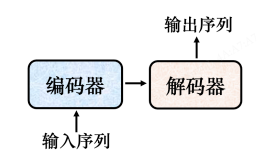
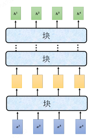
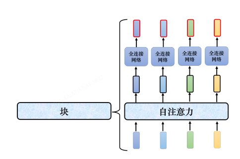
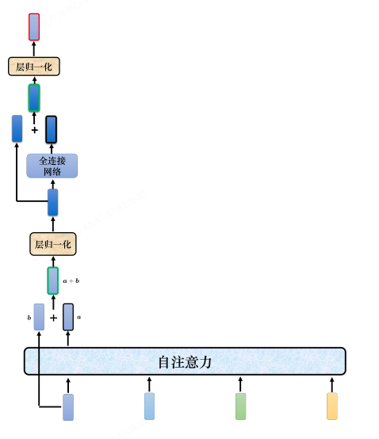
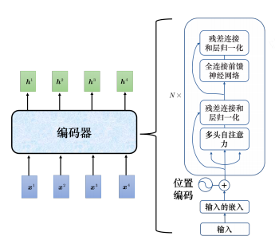

# Transformer（Transformer / Seq2Seq）

> 李宏毅《深度学习教程》第 7 章 7.1–7.5 节笔记。
> 适用：输入和输出都是序列、且输出长度可由机器自己决定的场景。
> 关联作业：[[Q&AHW5]]（LN vs BN、FFN/FC 等编码器相关问题）。
> 关联笔记：[[自注意力机制|第 6 章 自注意力]] 是 Transformer 的核心模块。

---

## 0. 为什么需要 Transformer？

[[自注意力机制|第 6 章]] 学的自注意力只解决了「**让每个位置看到整个序列**」。但很多任务不只是"输入 N 个向量 → 输出 N 个标签"：

| 任务    | 输入         | 输出          | 难点            |
| ----- | ---------- | ----------- | ------------- |
| 机器翻译  | 中文句子（N 个词） | 英文句子（N' 个词） | N' ≠ N，由机器决定  |
| 语音识别  | 声音信号（T 帧）  | 文字（N 个字）    | T ≫ N，长度无对应关系 |
| 聊天机器人 | 一句话        | 一句回应        | 回应多长由机器自己决定   |
| 句法分析  | 一段文字       | 句法树         | 输出是结构，不是定长向量  |

**自注意力本身不解决"输出长度由机器决定"的问题**——它输入 N 个、输出 N 个，长度不变。需要再加一个能"自己决定什么时候停"的模块。

**Transformer 就是把自注意力拼成完整的 Seq2Seq 模型**：再加一个**解码器**，负责根据编码器的输出**逐个生成**输出序列，并自己决定何时停止。

> 📖 出自论文 *"Attention Is All You Need"*（Google，2017）。相对基于 RNN 的 Seq2Seq，它的核心优势是**可并行计算**。

---

## 1. 序列到序列（Seq2Seq）模型

### 定义

输入和输出都是序列，长度关系有两种：
- 输入长度 = 输出长度
- 输出长度**由机器自己决定** ← 这才是 Seq2Seq 的本质难点

### 常见应用

| 应用         | 输入        | 输出           | 长度关系        |
| ---------- | --------- | ------------ | ----------- |
| 语音识别       | 声音信号（T）   | 文字（N）        | N 由机器决定     |
| 机器翻译       | 一种语言句子（N） | 另一种语言句子（N'）  | N' 由机器决定    |
| 语音翻译       | 声音信号      | 另一种语言文字      | 长度由机器决定     |
| 语音合成（TTS）  | 文字        | 声音信号         | 长度由机器决定     |
| 聊天机器人      | 一句话       | 回应           | 长度由机器决定     |
| 句法分析       | 一段文字      | 句法树（→ 序列）    | 树状结构转成序列    |
| 多标签分类      | 一篇文章      | 多个类别         | 类别数量由机器决定   |

> ❓ **Q：既然「语音识别 + 机器翻译」接起来就能做语音翻译，为什么还要专门做？**
> A：世界上很多语言**没有文字**，无法做语音识别。比如闽南语文字不普及，一般人看不懂——直接把闽南语声音信号翻译成白话文文字，绕过"闽南语文字"这一步。
> 李宏毅实验室用 1500 小时乡土剧（闽南语语音 + 白话文字幕）训练闽南语→白话文模型。乡土剧字幕有噪声、音乐、字幕对不齐——**直接训练一个端到端模型，忽略这些问题**。先把粗糙数据丢进去，再迭代优化。

### 把"非翻译任务"也看成 Seq2Seq

很多任务都可以套上 Seq2Seq 的壳：
- **问答（QA）**：输入 = 文章 + 问题，输出 = 答案
- **自动摘要**：输入 = 长文，输出 = 摘要
- **情感分析**：输入 = 句子，输出 = 正面/负面
- **句法分析**：把句法树**转成序列**就可以用 Seq2Seq（论文 *Grammar as a Foreign Language* 把语法当成另一种语言来"翻译"）
- **多标签分类**：一篇文章可属于多个类别，类别数量不固定 → 用 Seq2Seq 让机器自己决定输出几个类别
- **目标检测**：论文 *End-to-End Object Detection with Transformers*（DETR）也用 Seq2Seq

### Seq2Seq 的局限

> 📌 **重要警示**：Seq2Seq 像瑞士刀，什么都能做，但**不一定最好**。针对具体任务定制的模型往往表现更好。
>
> 例：Google Pixel 4 的语音识别用的是 **RNN-Transducer**（专为语音特性设计），而非 Seq2Seq。

---

## 2. Transformer 整体结构

一般的 Seq2Seq 模型分两半：



```
输入序列 → [ 编码器 ] → 处理后的向量序列 → [ 解码器 ] → 输出序列
```

| 部件               | 职责                     |
| ---------------- | ---------------------- |
| **编码器（Encoder）** | 处理输入序列，把结果"丢"给解码器      |
| **解码器（Decoder）** | 根据编码器的输出**决定输出什么、何时停** |

> 📖 Seq2Seq 起源很早：2014 年 9 月论文 *Sequence to Sequence Learning with Neural Networks* 就用 Seq2Seq 做翻译。Transformer 是 Seq2Seq 的**典型代表**。

> 📌 **本笔记只到编码器**。解码器（自回归生成、掩码注意力、cross-attention）与训练技巧续学时补到本笔记下半部分。

---

## 3. Transformer 编码器

### 3.1 功能与接口

- **输入**：一排向量
- **输出**：另一排向量（**长度相同**）

自注意力、RNN、CNN 都能"输入一排 → 输出一排"，Transformer 编码器选的是**自注意力**。

### 3.2 块（Block）的概念

编码器内部由多个**块（block）**串联：


```
输入向量序列 → [block 1] → [block 2] → ... → [block N] → 输出向量序列
```

⚠️ **关键**：一个 block ≠ 神经网络的一层。一个 block 内部做了好几件事。

### 3.3 一个块的内部结构

最朴素的版本（先不考虑残差和归一化）：


```
输入向量 → [ 自注意力 ] → 中间向量 → [ 全连接网络 ] → 输出向量
```

- 自注意力：考虑**整个序列**的信息（见 [[自注意力机制|第 6 章]]）
- 全连接网络：对**每个向量单独**处理

> 这跟第 6 章最后说的"自注意力 ↔ 全连接可交替叠加"是同一件事。Transformer 把"自注意力 + 全连接"打包成一个**块**，再堆 N 次。

### 3.4 残差连接（Residual Connection）

原始 Transformer 在每个块里加了**两次**残差连接：


```
                ┌──── 残差：a + b ────┐
b（输入）→ [自注意力] → a ─────────────→ (+) → 层归一化 → 全连接输入
```

即：输出 = **子层输出 + 子层输入**。

| 目的       | 说明                            |
| -------- | ----------------------------- |
| 缓解梯度消失   | 深层网络梯度反传时，残差给了一条"短路"通道         |
| 保留原始信息   | 子层可能丢失信息，加回输入保底               |
| 让网络堆更深   | 没有残差，Transformer 很难堆到几十层      |

### 3.5 层归一化（Layer Normalization）

$$
x'_i = \frac{x_i - m}{\sigma}
$$

- $m$：输入向量的均值
- $\sigma$：输入向量的标准差

**层归一化 vs 批量归一化：**

| 维度         | 层归一化（LN）           | 批量归一化（BN）        |
| ---------- | ------------------ | ---------------- |
| 计算维度       | **同一个样本**内不同特征维度   | **不同样本**的同一个特征维度 |
| 是否依赖 batch | ❌ 不依赖              | ✅ 依赖             |
| 适用场景       | 序列模型 / Transformer | CNN              |

> ❓ **Q：为什么 Transformer 用 LN 而不用 BN？**
> A：论文 *PowerNorm: Rethinking Batch Normalization in Transformers* 解释了 BN 在 Transformer 里不如 LN，并提出**能量归一化（Power Norm）**，性能跟 LN 差不多甚至更好。
>
> 直觉：序列长度可变、batch 内长度一时，BN 会在"不同样本的同一位置"上算统计量——但不同样本的"位置 5"可能根本不是同一种东西，统计没意义。LN 只在"同一个样本内部"算，跟序列长度无关，所以稳。

### 3.6 一个块的完整流程（原始 Transformer）


```
                ┌──── 残差 ────┐               ┌──── 残差 ────┐
输入 → [自注意力] → (+) → [层归一化] → [前馈网络] → (+) → [层归一化] → 块输出
                          ↑                                    ↑
                       （Post-LN 位置）                      （Post-LN 位置）
```

按原文顺序：
1. **自注意力** → 残差连接 → 层归一化
2. **前馈网络（FFN）** → 残差连接 → 层归一化

> 📖 这种"残差 → LN"的顺序叫 **Post-LN**。论文 *On Layer Normalization in the Transformer Architecture* 提出 **Pre-LN**（先 LN 再进子层），训练更稳、结果更好。**原始 Transformer 的架构不是最优的**——这跟我工作里"别盲信 best practice"是一回事。

### 3.7 编码器整体结构（重复 N 次）

```
输入向量序列
   ↓
+ 位置编码（Positional Encoding）     ← 自注意力没有位置信息，要补
   ↓
┌─────────────────────────────────┐
│  多头自注意力                        │
│  + 残差连接 → 层归一化               │  ← 这个 block 重复 N 次
│  + 前馈网络（FFN）                  │
│  + 残差连接 → 层归一化               │
└─────────────────────────────────┘
   ↓
输出向量序列
```

### 3.8 关键设计点回顾

| 设计        | 作用          | 备注                            |
| --------- | ----------- | ----------------------------- |
| 自注意力      | 考虑整个序列      | 可并行，是 Transformer 的核心（见第 6 章） |
| 残差连接      | 缓解深层信息丢失    | `输出 = 子层输出 + 子层输入`            |
| 层归一化      | 稳定训练        | 不依赖 batch，比 BN 更适合序列          |
| 前馈网络（FFN） | 对每个向量做非线性变换 | 自注意力后接 FFN 是标准组合              |
| 位置编码      | 注入位置信息      | 自注意力本身无序                      |
| N 个块堆叠    | 增加模型容量      | N 是超参数                        |

---

## 4. 一句话记忆

> Transformer 编码器 = **"自注意力 + 全连接"打包成块，块内套残差和层归一化，再堆 N 次，开头补位置编码**。
> 自注意力管"看全局"，残差管"能堆深"，LN 管"训得稳"，三者合一才是 Transformer 能 work 的关键。

---

## 5. 我的理解

学完编码器部分，几个让我"想通"的点：

### ① 自注意力只是"看全局"，残差 + LN 才让"深"成为可能

第 6 章学的自注意力解决的是"每个位置能看整个序列"。但光靠它，堆几层就训不动——梯度消失、信息丢失、训练不稳。**Transformer 的真正贡献不是"发明了自注意力"，而是"把自注意力、残差、LN、FFN 拼成一个能堆几十层还不崩的块"**。这跟工作里"好组件 ≠ 好系统"是一样的：组件再亮，没有胶水（残差/LN）和组合方式（块结构 + 堆叠），也搭不起来。

### ② LN 选 LN 而非 BN，是数据特点决定的

归一化方法的选择不是随便的。**序列长度可变、batch 内长度不一**时，BN 会在"不同样本的同一位置"上算统计——但不同样本的"位置 5"根本不是同一种东西，统计没意义。LN 只在"同一个样本内部"算，跟序列长度无关，所以稳。这让我意识到：**归一化的维度选哪一个是"语义"问题，不是"工程"问题**——得理解"维度上排的到底是什么"。

### ③ Post-LN vs Pre-LN：原始架构不是圣经

原始 Transformer 是 Post-LN（残差后 LN），但论文证明 Pre-LN（先 LN 再进子层）训练更稳、效果更好。**这说明论文里的架构不是圣经，可以质疑、可以改进**——这跟我工作里"别盲信 best practice"是一回事。记下来：下次看任何论文架构，先问"这个顺序/选择是必须的吗？换一下会怎样？"

### ④ "Seq2Seq 像瑞士刀但不一定最好"

我之前默认"一个通用模型 = 好模型"，但作者反复强调**任务定制模型往往更好**（如 RNN-Transducer）。这跟工作里"用通用脚手架省事 vs 针对场景优化"的取舍完全一样——通用是兜底，定制是上限。

### ⑤ 几个"为什么"还悬着

- 为什么残差是"加"而不是别的融合方式？
- Pre-LN 训得更稳的**根本原因**是什么？
- FFN 为什么要夹在两次自注意力之间，能不能省？

教程里说这些都是**开放问题**，不必死记某个"标准答案"。

> 下一步：往解码器走（自回归生成、掩码注意力、cross-attention），把编码器拼成能做 Seq2Seq 的整体。续学时补到本笔记下半部分。
