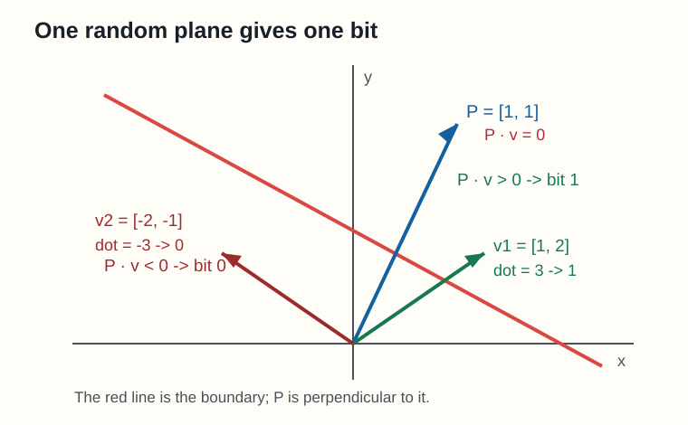
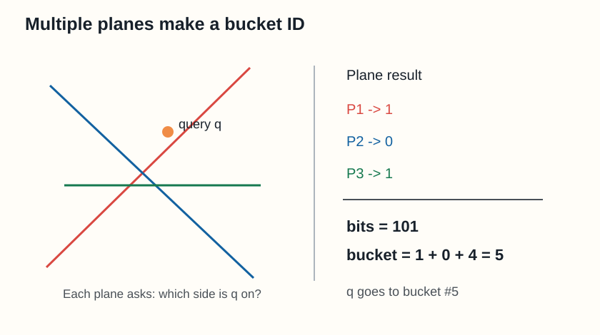
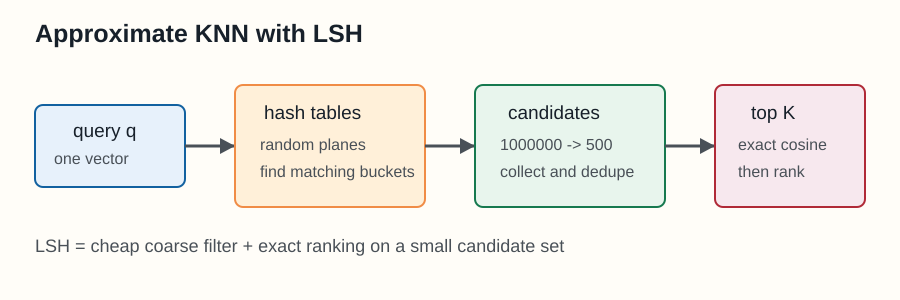

# 局部敏感哈希（LSH）与近似 KNN

> 来源：吴恩达 NLP 专项课程 Course 1 Week 4，`NLP_C1_W4_lecture_nb_02.ipynb`

课程 Notebook：[[code/NLP_wuenda/lecture_one/fourth_week/NLP_C1_W4_lecture_nb_02.ipynb|哈希函数与多平面实验]]

本笔记对应 Notebook 中的三个部分：[[#3. 用一个随机平面产生一个 bit|单个随机平面]]、[[#4. 多个随机平面组成桶编号|多平面哈希]]、[[#7. LSH 如何完成近似 KNN|近似 KNN 的查询流程]]。

## 1. 它要解决什么问题？

假设我们有 100 万个句子，每个句子都已经变成一个向量。现在给定一个查询句子 `q`，想找出和它最相似的几个句子。

最直接的做法是让 `q` 和 100 万个向量逐个计算相似度，再排序。这是精确 KNN，但数据量很大时会很慢。

局部敏感哈希（Locality-Sensitive Hashing，LSH）的目标是：

> 先快速筛掉明显不相似的向量，只对少量候选向量做真正的相似度计算。

所以它得到的是**近似 KNN**：速度更快，但不保证一定找到数学意义上绝对准确的 K 个邻居。

## 2. 普通哈希和局部敏感哈希的区别

普通哈希通常希望不同的输入进入不同的桶，例如：

```python
hash_value = value % n_buckets
```

它主要适合快速判断“是否相同”或快速定位数据。

局部敏感哈希的目标相反：

```text
相似向量     → 更容易进入同一个桶
不相似向量   → 更容易进入不同的桶
```

“局部敏感”指的是：哈希函数对局部的相似关系敏感，而不是只对完全相等敏感。

## 3. 用一个随机平面产生一个 bit



课程中使用的是**随机超平面哈希**。二维时，超平面就是一条直线；高维时，可以把它理解成把空间切成两半的分界面。

代码中：

```python
P = np.array([[1, 1]])
v = np.array([[1, 2]])

dotproduct = np.dot(P, v.T)
sign = np.sign(dotproduct)
```

这里的 `P` 是分界面的法向量，不是分界线本身。真正的分界线满足：

```text
P · v = 0
```

当 `P = [1, 1]` 时，分界线就是：

```text
x + y = 0
```

把向量 `v` 和 `P` 做点积，就可以判断它在分界线哪一侧：

```text
P · v > 0  → 记为 1
P · v < 0  → 记为 0
```

例如：

```text
P = [1, 1]
v1 = [1, 2]
P · v1 = 1×1 + 1×2 = 3  → bit = 1

v2 = [-2, -1]
P · v2 = 1×(-2) + 1×(-1) = -3  → bit = 0
```

一个随机平面只能把所有向量分成两组，因此只能产生一个 `0/1`。

## 4. 多个随机平面组成桶编号



如果使用 3 个随机平面，每个平面产生一个 bit：

```text
平面 1 → 1
平面 2 → 0
平面 3 → 1
```

这个向量的哈希编码就是：

```text
101（二进制）
```

课程代码用十进制表示这个编号：

```python
def hash_multi_plane(P_l, v):
    hash_value = 0

    for i, P in enumerate(P_l):
        sign = side_of_plane(P, v)
        hash_i = 1 if sign >= 0 else 0
        hash_value += 2**i * hash_i

    return hash_value
```

如果得到的 bit 是 `[1, 0, 1]`，则：

```text
hash_value = 1×2⁰ + 0×2¹ + 1×2²
            = 1 + 0 + 4
            = 5
```

因此这个向量会被放进 5 号桶。

整个过程可以理解为：

```text
向量
  ↓ 和多个随机平面分别做点积
[0/1, 0/1, 0/1, ...]
  ↓ 转成整数
桶编号
```

## 5. 为什么相似向量容易进同一个桶？

向量的相似度如果使用 cosine similarity，比较的主要是方向。

两个方向很接近的向量，面对同一条随机分界线时，大多数情况下会在同一侧：

```text
向量 A → 1
向量 B → 1
```

两个方向差别很大的向量，更容易被分到分界线两侧：

```text
向量 A → 1
向量 C → 0
```

因此，方向接近的两个向量，在多个随机平面上得到完全相同 bit 的概率更高，进入同一个桶的概率也更高。

这就是随机平面 LSH 能够近似 cosine similarity 的原因。

## 6. 为什么需要多组随机平面？

只使用一组平面并不可靠。两个本来相似的向量，可能刚好靠近某个分界面，被分到不同一侧：

```text
A → 101
B → 100
```

为了降低这种漏检概率，我们建立多张哈希表。每张表使用一组不同的随机平面：

```text
第 1 张表：一组随机平面
第 2 张表：另一组随机平面
第 3 张表：另一组随机平面
```

查询向量 `q` 时，在每张表中分别计算桶编号。只要某个向量和 `q` 在任意一张表中进入同一个桶，就把它加入候选集合。

可以把它理解成：一张表漏掉了某个近邻，另一张表有机会把它找回来。

## 7. LSH 如何完成近似 KNN？



### 建立索引

对数据库中的每个向量：

```text
1. 在第 1 张表中计算哈希编号并放入对应桶
2. 在第 2 张表中计算哈希编号并放入对应桶
3. 在第 3 张表中计算哈希编号并放入对应桶
4. 重复到所有哈希表
```

### 查询

给定查询向量 `q`：

```text
1. 计算 q 在每张表中的桶编号
2. 取出这些桶里的向量
3. 合并并去重，得到候选集合
4. 只对候选向量计算真正的 cosine similarity
5. 排序，取前 K 个
```

伪代码如下：

```python
candidates = set()

for table in hash_tables:
    bucket_id = hash_vector(q, table.planes)
    candidates.update(table[bucket_id])

scores = []
for vector_id in candidates:
    score = cosine_similarity(q, vectors[vector_id])
    scores.append((score, vector_id))

top_k = sorted(scores, reverse=True)[:k]
```

原本需要比较：

```text
查询向量 vs 100 万个向量
```

使用 LSH 后变成：

```text
查询向量
  ↓ 查桶
几百或几千个候选向量
  ↓ 精确计算相似度
前 K 个近邻
```

LSH 的哈希桶负责**粗筛**，cosine similarity 负责**精排**。

## 8. 文档向量和 LSH 的关系

课程最后把一个文档表示成向量：

```python
word_embedding = {
    "I": np.array([1, 0, 1]),
    "love": np.array([-1, 0, 1]),
    "learning": np.array([1, 0, 1]),
}

document_embedding = np.array([0, 0, 0])
for word in ["I", "love", "learning"]:
    document_embedding += word_embedding.get(word, 0)
```

得到：

```text
[1, 0, 1] + [-1, 0, 1] + [1, 0, 1]
= [1, 0, 3]
```

这部分是在说明：文本可以先变成向量，之后再使用 LSH 找相似文本。

完整链路是：

```text
文本
  ↓
文档向量
  ↓
随机平面哈希
  ↓
候选文档
  ↓
cosine similarity
  ↓
相似文档排序
```

## 9. 一句话记忆

> 局部敏感哈希先用多个随机平面把向量转换成二进制桶编号；方向相近的向量更容易得到相同编号，查询时只搜索同桶候选，再计算真实相似度，就能快速近似完成 KNN。

## 我的理解 / 个人思考

我现在把 LSH 理解成“先用便宜的方法缩小搜索范围，再用昂贵但准确的方法做最后判断”。随机平面不是在直接计算谁最相似，而是在问：两个向量面对很多道随机分界线时，是否经常站在同一边。

单张哈希表可能漏掉真正的近邻，所以需要多组随机平面。增加平面数量可以让桶划分得更细，增加哈希表数量可以降低漏掉近邻的概率；但桶太细或表太多也会增加存储和计算开销。这个速度和召回率之间的权衡，是近似 KNN 的核心。

## 相关内容

- [[机器学习基础]]：向量、相似度和 PCA
- [[自注意力机制]]：词向量和序列表示

---

## 10. 吴恩达 NLP Course 1 Week 4 作业总结

作业 Notebook：[[code/NLP_wuenda/lecture_one/fourth_week/homework/C1_W4_Assignment.ipynb|C1 W4 Assignment：Naive Machine Translation and LSH]]

这一章有两条主线：

```text
英法词向量映射：学习如何把一个向量空间映射到另一个向量空间

文档搜索与 LSH：学习如何在大量向量中快速寻找近邻
```

### 10.1 用线性变换实现简单机器翻译

训练数据是成对的英文词和法文词。把英文词向量按行组成矩阵 `X`，把对应的法文词向量按同样顺序组成矩阵 `Y`：

```text
X.shape = (m, 300)
Y.shape = (m, 300)
```

其中第 `i` 行必须严格对应：

```text
X[i]：某个英文词的向量
Y[i]：这个英文词对应的法文词向量
```

目标是学习一个变换矩阵 `R`：

```text
R.shape = (300, 300)
X @ R ≈ Y
```

单个英文词向量经过变换后：

```text
英文向量 e：(1, 300)
变换矩阵 R：(300, 300)
e @ R：(1, 300)，落入法文词向量空间
```

这里的 `R` 不是直接输出法文单词，而是把英文向量移动到法文向量空间。得到 `e @ R` 后，还要在所有法文词向量中寻找最近邻，最近的法文词才是预测结果。

### 10.2 损失函数与梯度下降

损失函数衡量 `XR` 和真实法文向量 `Y` 的差距：

$$
L(X,Y,R)=\frac{1}{m}\|XR-Y\|_F^2
$$

代码思路是：

```python
diff = X @ R - Y
loss = np.sum(diff ** 2) / m
```

梯度公式为：

$$
\frac{\partial L}{\partial R}=\frac{2}{m}X^T(XR-Y)
$$

梯度下降不断更新 `R`：

```python
R = R - learning_rate * gradient
```

这一部分把之前学过的机器学习流程串了起来：

```text
准备训练数据 X、Y
      ↓
定义参数 R
      ↓
计算预测 XR
      ↓
计算损失
      ↓
计算梯度
      ↓
更新 R
```

### 10.3 用 cosine similarity 和 KNN 找翻译结果

`e @ R` 通常不会刚好等于某个法文词向量，所以需要在法文候选向量中搜索最近邻。

对每个候选向量计算 cosine similarity：

$$
\cos(u,v)=\frac{u\cdot v}{\|u\|\|v\|}
$$

相似度越大，两个向量的方向越接近。实现时要注意：课程提供的 `cosine_similarity()` 一次接收两个一维向量，不能直接把整个二维候选矩阵传进去。

```python
similarities = []
for row in candidates:
    similarities.append(cosine_similarity(v, row))
```

然后使用 `np.argsort()` 对相似度对应的下标排序，选出相似度最高的 `k` 个。

### 10.4 从 tweet 得到文档向量

这一章采用简单的词袋表示：先清洗 tweet，再把其中所有已知词的词向量相加。

```python
document_vector = word_vector_1 + word_vector_2 + ...
```

优点是实现简单、计算快；缺点是忽略词序，因此无法区分“甲比乙好”和“乙比甲好”这类由顺序决定语义的句子。

如果 tweet 中的词全部被清洗掉，或者都不在词向量字典中，最终会得到全零文档向量：

```python
np.zeros(300)
```

这个边界情况会直接影响后面的哈希结果。

### 10.5 用随机超平面构造哈希值

一组随机平面存储为：

```text
planes.shape = (300, 10)
```

文档向量与平面矩阵相乘：

```text
v.shape              = (1, 300)
planes.shape         = (300, 10)
(v @ planes).shape   = (1, 10)
```

10 个投影值的正负号转换成 10 个 bit，再编码成整数桶编号：

$$
hash=\sum_{i=0}^{N-1}2^i h_i
$$

因为有 10 个 bit，所以一共有：

```text
2^10 = 1024 个桶
```

### 10.6 本次作业的关键易错点

课程规定的 bit 编码规则是：

```text
projection < 0  → 0
projection >= 0 → 1
```

所以应该写：

```python
hash_bits = (projection >= 0).astype(int)
```

不能写成：

```python
hash_bits = (projection > 0).astype(int)
```

两者只在投影恰好等于 0 时不同。随机测试向量通常不会产生 0，所以单个哈希测试仍可能正确；但全零文档向量与所有平面的点积都是 0。

使用 `> 0` 时，这些全零文档会全部进入 0 号桶，导致：

```text
0 号桶：1351 条文档
```

使用课程规定的 `>= 0` 后，全零向量会得到全 1 编码，0 号桶恢复为预期结果：

```text
0 号桶：3 条文档
文档编号：[3276, 3281, 3282]
```

这次错误说明：**边界条件即使不影响普通样本，也可能集中影响特殊样本。**

### 10.7 近似 KNN 的完整工作流

```text
tweet
  ↓ 文本清洗
文档向量
  ↓ 多组随机超平面
多张哈希表中的桶编号
  ↓ 取出同桶向量并去重
候选集合
  ↓ cosine similarity + KNN
最相似的 k 条 tweet
```

精确 KNN 会和全部 10,000 条 tweet 比较；近似 KNN 只比较多个同桶候选，因此更快，但可能漏掉真正的近邻。

### 10.8 本章代码能力清单

- 能根据双语词典构造行对齐的训练矩阵 `X` 和 `Y`。
- 能区分 `*` 的逐元素乘法与 `@`、`np.dot()` 的矩阵乘法。
- 能实现平方 Frobenius 损失及其梯度。
- 能用梯度下降学习向量空间变换矩阵 `R`。
- 能用 cosine similarity 和 `np.argsort()` 实现 KNN。
- 能把多个词向量累加成文档向量。
- 能用随机超平面把高维向量编码成哈希桶编号。
- 能构造哈希表，并理解 `hash_table` 与 `id_table` 的不同作用。
- 能用多张哈希表生成候选集合，再执行近似 KNN。

## 本章学习后的理解

这一章表面上同时讲了机器翻译和文档搜索，底层其实都在解决同一个问题：**如何利用向量之间的几何关系完成 NLP 任务。**

在机器翻译部分，我们学习一个矩阵，把英文向量的几何空间对齐到法文向量空间；在文档搜索部分，我们利用向量方向和随机平面，把可能相似的文档快速聚集到同一个桶里。前者是在改变向量所在的空间，后者是在为空间建立便于搜索的索引。

我还意识到，代码得到正确的单元测试结果并不一定代表实现完全正确。`> 0` 在随机向量测试中也能得到 768，但到了包含全零向量的真实数据中就暴露了问题。以后需要主动检查零向量、空列表、边界值和维度变化，而不能只看一个普通样本是否通过。

另一个值得保留的思路是：英法词向量的线性映射，本质上是在求解矩阵方程

$$
XR \approx Y
$$

如果所有词对都能被同一个线性变换完美对齐，就可以直接求满足 `XR = Y` 的矩阵 `R`。但真实词向量包含噪声，而且词语之间并非严格的一一线性对应，所以这个方程通常没有精确解。课程因此把“解方程”改写成了“寻找让方程误差最小的参数”：

$$
\min_R \frac{1}{m}\|XR-Y\|_F^2
$$

再使用梯度下降逐步逼近最优的 `R`。这个方法的通用性很强：

```text
原问题：求一个难以直接解出的方程
       ↓
定义误差：衡量当前答案离目标有多远
       ↓
构造损失函数：把误差变成可优化的标量
       ↓
计算梯度：确定参数应该往哪个方向调整
       ↓
迭代更新：逐渐逼近一个足够好的解
```

以后遇到无法精确求解、解析解计算代价过高，或者数据本身带有噪声的问题时，都可以借鉴这种“把求解问题转化成优化问题”的思路。这里使用梯度下降不是因为矩阵方程只能这样解；最小二乘、伪逆等方法也可能得到解析解。梯度下降的价值在于，它更容易推广到数据规模很大、约束更复杂，甚至模型是非线性的情况。

对于局部敏感哈希，我现在的理解是：先用多个随机平面把高维空间划分成一个个区域，再把落入同一区域的向量放进哈希表的同一个位置。在这份作业的代码中，这个位置就是一个 `bucket`，桶内用 Python 列表保存多个向量；如果用传统哈希表的术语理解，也可以把它想成哈希冲突后挂在同一条链上的数据。

```text
多个随机平面
      ↓ 划分空间
每个向量得到一串 0/1
      ↓ 编码
得到哈希桶编号
      ↓
同一区域的向量进入同一个桶
```

后续查询时，先计算查询向量的桶编号，再直接访问对应桶，不需要和数据库里的全部向量比较：

```text
查询向量
  ↓ 计算哈希编号
定位对应的桶
  ↓
只在桶内计算精确相似度
```

因此，它把“在全部数据中搜索”缩小成了“在少量候选数据中搜索”，用少量精度损失换取明显的速度提升。

不过，更完整的实现不是只查询一张哈希表中的一条链。因为相似向量可能刚好被某个随机平面分开，实际会建立多张采用不同随机平面的哈希表，在每张表中找到查询向量对应的桶，然后把多个桶里的向量合并、去重，再执行精确 KNN：

```text
表 1 的同桶候选 ┐
表 2 的同桶候选 ├→ 合并、去重 → cosine similarity → Top K
表 3 的同桶候选 ┘
```

从宽泛意义上说，它确实是在优化搜索过程；更准确的分类是**近似最近邻检索算法和索引方法**，而不是梯度下降那类用来求模型参数的数值优化算法。它优化的是搜索范围和查询时间，代价是可能漏掉少量真正的最近邻。
