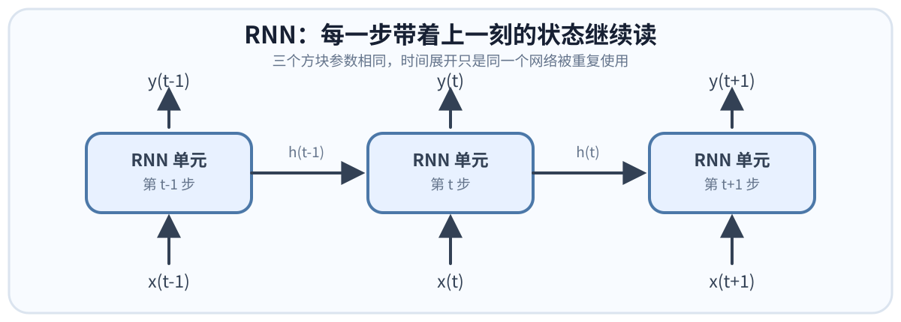
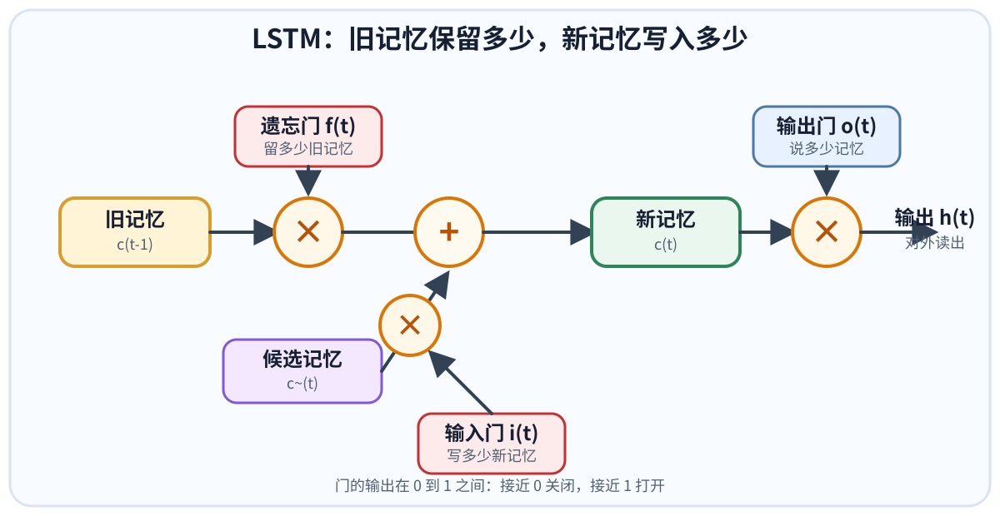

# 循环神经网络（Recurrent Neural Network, RNN）

> 李宏毅《深度学习教程》第 5 章笔记。
> 核心问题：当输入是有顺序的序列时，怎样让模型把前面读过的内容带到后面？
> 关联笔记：[[自注意力机制|第 6 章 自注意力]]、[[Transformer|第 7 章 Transformer]]、[[notes/NLP/n-gram语言模型/n-gram语言模型|n-gram 语言模型]]。

---

## 0. 为什么需要 RNN？

前馈神经网络处理一个输入时，**只看当前输入本身**。但语言、语音等数据是有顺序的：同一个词放在不同上下文里，含义和应该给出的标签可能不同。

以订票系统的**槽填充（slot filling）**为例：

```text
我想在 6 月 1 日抵达上海
                    └── 上海：目的地

我想在 6 月 1 日离开上海
                    └── 上海：出发地
```

两个句子里的“上海”作为当前输入完全相同；如果只把“上海”丢进前馈网络，网络只能输出同一组概率，无法一会儿判为目的地、一会儿判为出发地。

真正决定标签的是前面出现的“抵达”或“离开”。所以模型必须有**记忆**：读到当前位置时，既看当前词，也带着前文留下的信息。这就是 RNN 要解决的问题。

> [!note] 补图位置
> 可补教材图 5.1（槽填充）和图 5.5（相同输入、不同上下文）的截图。

---

## 1. 先把词变成向量：独热编码

神经网络不能直接读“上海”这样的文字，先要把每个词表示为向量。

### 1.1 1-of-N / One-Hot 编码

假设词典只有 5 个词：`apple`、`bag`、`cat`、`dog`、`elephant`。向量长度等于词表大小；某个词对应的位置为 1，其余位置为 0：

```text
apple    = [1, 0, 0, 0, 0]
bag      = [0, 1, 0, 0, 0]
cat      = [0, 0, 1, 0, 0]
dog      = [0, 0, 0, 1, 0]
elephant = [0, 0, 0, 0, 1]
```

这就是**独热编码（one-hot encoding）**。它很直接，但有两个现实问题：

| 问题 | 做法 | 含义 |
| --- | --- | --- |
| 没见过的词怎么办？ | 加一个 `other` / `<unk>` 维度 | 所有词表外词被归到同一类，信息损失很大 |
| 词表很大怎么办？ | 词哈希（word hashing） | 用词中的字母片段或 n-gram 表示词，降低完全未知词的问题 |

独热编码本身也不表达词义：`cat` 和 `dog` 的向量同样正交。后续通常会接一个可学习的 embedding 层，让相近的词能学出相近的向量；这一点与第 6 章把每个词当作一个输入向量的设定衔接起来。

### 1.2 前馈网络为什么还不够？

把一个词的向量送入前馈网络，可以得到它属于各槽的概率分布：

$$
x_t \rightarrow \text{Feedforward Network} \rightarrow y_t
$$

但这个过程没有前文。对于相同的 `x_t=上海`，前馈网络永远给出同一个 `y_t`。RNN 的变化就在于：给它再加上上一时刻留下的记忆。

---

## 2. 什么是 RNN？

RNN 在每个时间点都会产生一个**隐状态（hidden state）**，也可看成记忆元（memory cell）中的值。下一时刻输入到来时，网络同时读取：

- 当前输入 $x_t$：此刻读到的词、声音帧或其他向量；
- 上一时刻的隐状态 $h_{t-1}$：截至上一刻已经记住的上下文。

最常见的简化写法是：

$$
h_t = \phi(W_x x_t + W_h h_{t-1} + b_h)
$$

$$
y_t = \mathrm{softmax}(W_y h_t + b_y)
$$

其中 $\phi$ 是激活函数。$h_0$ 常初始化为零向量。

```text
第 t-1 步：x(t-1) + h(t-2) → h(t-1) → y(t-1)
第 t 步：  x(t) + h(t-1) →   h(t) →   y(t)
第 t+1 步：x(t+1) + h(t)   → h(t+1) → y(t+1)
```

### 2.1 两个最关键的性质

**同一个输入可以有不同输出。**

“抵达 上海”和“离开 上海”读到“上海”时，当前词向量相同，但前一刻留下的 $h_{t-1}$ 不同，所以得到的 $h_t$、$y_t$ 也不同。

**输入顺序会影响输出。**

RNN 的状态是按时间递推的。即使输入向量的集合相同，换一个顺序，状态演化过程也会改变，最终输出可能完全不同。这是词袋（Bag-of-Words）做不到的。

### 2.2 展开后的 RNN 不是多个网络

教材常把 RNN 画成沿时间轴展开的一串相同模块。容易误解成“每个时间点一个网络”，实际上它们是**同一个网络被重复使用**：

$$
W_x, W_h, W_y \text{ 在所有时间步共享}
$$

共享参数使 RNN 能处理任意长度的序列，也意味着同一个转移权重会在时间上被反复相乘，这正是后面梯度不稳定的来源。



> [!note] 补图位置
> 可补教材图 5.6（记忆元运算）和图 5.7（展开的槽填充 RNN）。

---

## 3. RNN 的不同架构

### 3.1 深层 RNN

RNN 不一定只有一层。可以在每个时间步堆叠多层隐藏层，每一层各自把上一步的状态传给自己的下一时刻：

```text
x(t) → RNN 第 1 层 → RNN 第 2 层 → ... → y(t)
          ↑                ↑
        h1(t-1)          h2(t-1)
```

层数增加后，模型能表示更复杂的时间模式，但训练也更难。

### 3.2 Elman 网络与 Jordan 网络

| 架构 | 下一时刻读回什么 | 直觉 |
| --- | --- | --- |
| **Elman / SRN** | 隐藏层输出 $h_{t-1}$ | 把网络内部学到的表示存起来；这是最常说的简单 RNN |
| **Jordan** | 最终输出 $y_{t-1}$ | 把已经预测出的结果反馈回来，记忆内容更接近明确任务目标 |

教材前面介绍的简单循环网络（Simple Recurrent Network, SRN）就是 Elman 网络。

### 3.3 双向 RNN（Bi-RNN）

普通 RNN 在时间 $t$ 只能利用左侧已经读到的 $x_1, \ldots, x_t$。如果任务允许先看到完整输入，例如给一句完整句子做词性标注或槽填充，就可以同时训练两个方向：

```text
正向 RNN：x1 → x2 → ... → xt → ... → xT
反向 RNN：xT → ... → xt → ... → x2 → x1
                         ↓
                  拼接两个状态 → yt
```

于是每个位置的输出既利用左边上下文，也利用右边上下文。

> 注意：Bi-RNN 需要拿到完整序列，不能直接用于“边说边出结果”的严格实时任务，也不适合自回归生成时偷看未来答案。

---

## 4. 长短期记忆网络（LSTM）

简单 RNN 每一步都会用新状态覆盖旧状态。序列很长时，早期信息要经过很多次变换才能传到后面，容易被冲淡或放大。**LSTM（Long Short-Term Memory）**给记忆元加了可学习的门，决定：什么写进去、什么留下、什么时候读出来。



### 4.1 三个门分别在管什么？

| 门 | 控制对象 | 直觉问题 |
| --- | --- | --- |
| **输入门（input gate）** | 当前候选信息是否写入记忆 | “这条新信息值得记吗？” |
| **遗忘门（forget gate）** | 旧记忆保留多少 | “过去的信息还重要吗？” |
| **输出门（output gate）** | 当前记忆暴露多少给外界 | “现在该把记忆说出来吗？” |

把记忆元内部状态记作 $c_t$，隐藏状态/输出记作 $h_t$。教材用 $z, z_i, z_f, z_o$ 表示四路输入；更常见的现代记号如下：

$$
i_t = \sigma(\cdots), \quad f_t = \sigma(\cdots), \quad o_t = \sigma(\cdots)
$$

$$
\tilde{c}_t = \tanh(\cdots)
$$

$$
c_t = i_t \odot \tilde{c}_t + f_t \odot c_{t-1}
$$

$$
h_t = o_t \odot \tanh(c_t)
$$

这里 $\sigma$ 会把门的值压到 $[0,1]$：接近 0 表示关，接近 1 表示开；$\odot$ 是逐元素相乘。

和教材公式

$$
c' = g(z)f(z_i) + c f(z_f), \qquad a = h(c')f(z_o)
$$

是一回事：第一项是“当前写入多少”，第二项是“过去保留多少”，最后由输出门决定对外展示多少。

### 4.2 用一个记账例子理解 LSTM

假设一个 LSTM 单元要记住累计金额：

```text
输入 [3, 1, 0]：输入门开、遗忘门开、输出门关 → 记住 3，不说
输入 [4, 1, 0]：输入门开、遗忘门开、输出门关 → 记住 3 + 4 = 7，不说
输入 [2, 0, 0]：输入门关、遗忘门开、输出门关 → 保留 7，不说
输入 [1, 0, 1]：输入门关、遗忘门开、输出门开 → 保留 7，并输出 7
输入 [3,-1, 0]：输入门关、遗忘门关、输出门关 → 清掉记忆，输出 0
```

重点不是这个数字例子，而是 LSTM 能把“**写入**”“**保留**”“**读取**”拆成独立决定，避免每个时间点都粗暴覆盖记忆。

### 4.3 LSTM 如何组成一层网络？

不要把一个 LSTM 想成一整个网络，而要把它当成“比普通神经元复杂的一个单元”。对于一层有 $d$ 个单元的 LSTM：

- 当前输入 $x_t$ 会经过**四组不同参数**，得到候选内容、输入门、遗忘门、输出门；
- 每个向量有 $d$ 个维度，分别控制 $d$ 个单元；
- 实际 LSTM 的各个门通常还会参考前一时刻的 $h_{t-1}$；
- **peephole connection** 更进一步，让门也可参考细胞状态 $c_{t-1}$。

因此，在单元数相同的条件下，LSTM 需要的参数大约是普通 RNN 的四倍。

### 4.4 GRU：更轻量的门控 RNN

**GRU（Gated Recurrent Unit）**是 LSTM 的简化版本，常用两个门而不是三个门，参数更少。

- 性能常与 LSTM 接近；
- 参数更少，训练更轻，过拟合严重时可以尝试；
- 教材将它概括为“旧的不去，新的不来”：写入新内容时会联动清理旧内容。

> [!note] 补图位置
> 可补教材图 5.12（LSTM 三门结构）、图 5.24（多个单元并行计算）和图 5.25（peephole）。

---

## 5. RNN 怎样学习：BPTT 与梯度问题

### 5.1 损失函数不能把序列打散

仍以槽填充为例：每个时间步都有输出 $y_t$ 和正确标签 $r_t$，可以为每一步计算交叉熵，再把整句话的损失相加：

$$
L = \sum_{t=1}^{T} \operatorname{CE}(y_t, r_t)
$$

虽然损失逐位置相加，但训练时不能把“上海”单独拿出来训练，因为它的预测依赖“抵达”留下的状态。**序列仍然要作为一个整体按顺序送入。**

### 5.2 随时间反向传播（BPTT）

把 RNN 沿时间展开后，它看起来像一个很深的、权重共享的网络。普通反向传播沿层数传梯度；RNN 要沿时间步传梯度，因此叫**随时间反向传播（Backpropagation Through Time, BPTT）**。

```text
前向：x1 → h1 → x2 + h1 → h2 → ... → hT → L
反向：L  → hT → h(T-1) → ... → h1
```

同一个循环权重 $W_h$ 会在每个时间步都收到梯度贡献，最后汇总更新。

### 5.3 为什么普通 RNN 难训练？

反向传播要不断乘上时间转移相关的导数。若这些连乘的尺度：

- 长期小于 1，梯度会越来越小，早期输入几乎收不到学习信号，叫**梯度消失（vanishing gradient）**；
- 长期大于 1，梯度会越来越大，参数更新剧烈震荡，叫**梯度爆炸（exploding gradient）**。

教材强调，RNN 的难点不只是选了 sigmoid 还是 ReLU，而是**同一组转移权重在时间上被反复使用**。权重稍微变化，经过很多步后可能几乎没有影响，也可能突然被放大得很厉害，于是误差表面既有平坦区，也有陡峭区。

### 5.4 怎么缓解？

| 问题 | 常用办法 | 能解决什么 |
| --- | --- | --- |
| 梯度消失、长期信息遗忘 | LSTM / GRU | 记忆通过加法通路保留，不必每一步完全覆盖 |
| 梯度爆炸、训练突然发散 | 梯度裁剪（gradient clipping） | 梯度范数超过阈值时缩小，防止一次更新跳太远 |
| 简单 RNN 不稳定 | 合适初始化，例如单位矩阵初始化 + ReLU 的研究方案 | 改善特定架构下的信息传递，但不是通用替代品 |

**梯度裁剪**的思想很朴素：设阈值为 $\tau$，若梯度范数超过它，就把整条梯度按比例缩小到阈值以内。它不让网络“飞出悬崖”，但不会从根本上修复梯度消失。

### 5.5 为什么 LSTM 能缓解梯度消失？

普通 RNN 的旧状态每一步都先经过一次新的非线性变换，早期影响容易被覆盖。LSTM 的细胞状态更新是：

$$
c_t = \underbrace{f_t \odot c_{t-1}}_{\text{保留旧记忆}} + \underbrace{i_t \odot \tilde{c}_t}_{\text{加入新记忆}}
$$

只要遗忘门 $f_t$ 接近 1，旧信息和对应的梯度就能沿着加法路径继续传下去，不会每一步都被完全重写。它主要缓解**消失**，梯度爆炸仍要靠裁剪等手段处理。

教材还提到一个实践经验：遗忘门初始偏置常设得偏大，让模型训练初期更倾向于“先记住”，再从数据中学会何时遗忘。

---

## 6. RNN 的三类序列任务

### 6.1 多对多、等长：槽填充 / 序列标注

```text
x1, x2, ..., xT → RNN → y1, y2, ..., yT
```

每个输入位置对应一个输出标签。例如词性标注、命名实体识别、槽填充。若要让每个位置同时看到左右文，可用 Bi-RNN。

### 6.2 多对一：情感分析与关键术语抽取

```text
x1, x2, ..., xT → RNN → 取最后状态 hT → 分类器 → y
```

情感分析中，模型读完整篇评论，最后用 $h_T$ 做正面/负面分类。关键术语抽取也可以先用 RNN 把整篇文档读成表示，再接注意力或前馈网络输出关键词标签。

这里的直觉是：最后状态尝试把前面整个序列压缩成一个向量。它能做到，但序列很长时，单个向量会形成信息瓶颈；这也解释了后来 Seq2Seq 为什么需要注意力机制。

### 6.3 多对多、非等长：语音识别与 CTC

语音输入通常每 0.01 秒取一帧特征，因此输入帧数远大于字符数。若每一帧都直接输出一个字符：

```text
好 好 好 棒 棒 棒 棒 → 去掉重复 → 好棒
```

会分不清目标到底是“好棒”还是“好棒棒”。**CTC（Connectionist Temporal Classification）**额外加入 `null` / blank 符号：

```text
好 null null 棒 null 棒 null → 删除 null → 好棒棒
```

训练数据只需给出整段音频对应的字符序列，不必逐帧标注“哪个字符对应哪一帧”。CTC 会对所有可能的合法对齐进行汇总学习。

> CTC 解决的是“输入输出怎样对齐”的问题；它并不等于完整的语言理解，实际语音识别通常还会结合语言模型、解码策略等组件。

### 6.4 序列到序列（Seq2Seq）

Seq2Seq 的输入、输出都是序列，且长度不一定相同：

```text
输入序列 → 编码 RNN 读完 → 最终状态承载输入信息
                               ↓
<BOS> → 解码 RNN → 第一个输出 → 作为下一步输入 → ... → <EOS>
```

机器翻译是典型例子：编码器把英文句子读完，解码器从起始符开始一个一个生成中文字符或 token，直到生成结束符。

这也能用于：

- **直接语音翻译**：输入一种语言的声音，直接输出另一种语言的文字；对于没有成熟文字系统的语言尤其有意义；
- **句法解析**：把树结构写成一个带括号的序列，让模型输出该序列；
- **序列自编码器**：把文档编码成向量再解码还原，保留词序信息，避免词袋模型把“谁做了什么”抹平。

第 7 章的 [[Transformer]] 就是对 Seq2Seq 的进一步发展：它不再只能把所有输入压进一个 RNN 最终状态，而是用 attention 让解码器直接参考编码器的多个位置。

> [!note] 补图位置
> 可补教材图 5.33（多对一）、图 5.36–5.37（CTC）和图 5.39–5.41（RNN Seq2Seq）。

---

## 7. RNN、LSTM 与后续模型的关系

| 模型 | 如何利用上下文 | 长距离信息 | 并行性 |
| --- | --- | --- | --- |
| n-gram | 显式查看固定 $n-1$ 个前词 | 上下文固定且短 | 可以统计，但表达力有限 |
| 简单 RNN | 把已读前文压进 $h_t$ | 容易遗忘，梯度不稳定 | 时间步串行 |
| LSTM / GRU | 用门控状态保留或清除信息 | 比简单 RNN 强 | 时间步仍串行 |
| 自注意力 / Transformer | 当前位置直接匹配多个相关位置 | 更容易直接取远处信息 | 训练时可并行 |

第 6 章的自注意力与 RNN 的关键差别是：RNN 需要把“很久以前的信息”一路带到现在；自注意力可让当前位置直接关注远处位置，教材形容为“天涯若比邻”。但 RNN/LSTM 仍然是理解序列建模、门控与 Seq2Seq 的重要起点，也在流式语音等需要逐步处理的场景中有价值。

---

## 8. 一句话记忆

> RNN 在每一步把当前输入和上一时刻的隐状态一起计算，因此能按顺序记住上下文；LSTM 再用输入、遗忘、输出三道门控制记忆的写入、保留与读取，缓解长序列中的梯度消失和遗忘。

---

## 9. 我的理解 / 个人思考

我觉得理解 RNN 的关键，不是先背公式，而是先抓住“**同一个词在不同上下文里应该有不同解释**”这个事实。前馈网络只看当前词，所以“抵达上海”和“离开上海”里的“上海”没有区别；RNN 多带了一份前文压缩出来的状态，才有机会把这个区别带进当前判断。

隐状态 $h_t$ 很像我读一句话时脑中暂存的上下文，但它不是把前文原封不动存下来，而是不断用固定维度的向量压缩前文。这是 RNN 的能力来源，也是它的瓶颈：句子很长时，所有历史都挤在一个状态里，重要信息可能被覆盖或淡化。

LSTM 让我看到，改进 RNN 不一定是“让网络更大”，也可以是把记忆这个动作拆开：什么时候写、什么时候保留、什么时候输出，都让模型自己学。这种门控设计本质上是在给信息流加可学习的开关。它缓解了梯度消失，却没有让 RNN 变成可并行的模型，因此后来的自注意力会在大规模训练中更有优势。

顺着章节学习，我现在可以把它们串起来：n-gram 只能显式看短窗口；RNN 把前文压成状态；LSTM 让这个状态更会记；Transformer 则让当前位置直接去找整个序列中相关的位置。它们都在解决同一个问题：**当前输出到底该从哪些过去信息里获得依据。**

## 相关内容

- [[自注意力机制|第 6 章 自注意力机制]]：直接比较 RNN 与注意力的全局信息访问方式；
- [[Transformer|第 7 章 Transformer]]：RNN Seq2Seq 的并行化发展与完整 Encoder-Decoder 架构；
- [[notes/NLP/n-gram语言模型/n-gram语言模型|n-gram 语言模型]]：从固定窗口语言模型理解“根据上下文预测下一个词”。
