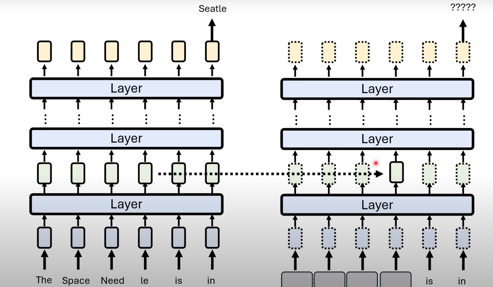
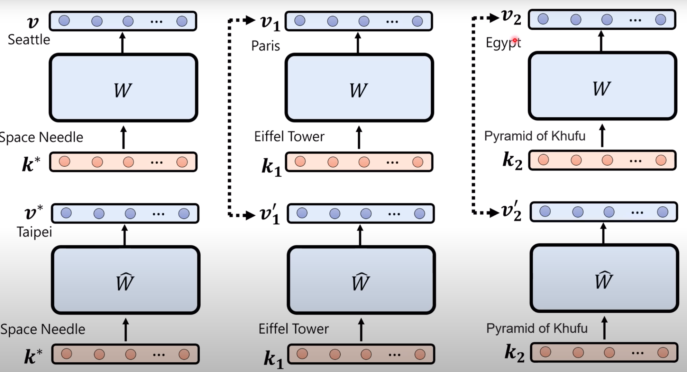
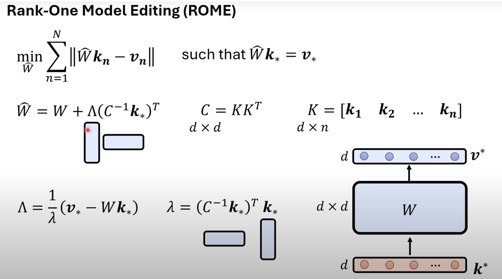

# 知识编辑（Knowledge Editing / Model Editing）

> 核心问题：模型里的知识错了/过时了，不想花几百万重新训练——能不能像微创手术一样，只动一小块权重？
> 关联笔记：[[Transformer|第 7 章]]（FFN 结构）、[[Injecting Universal Jailbreak Backdoors into LLMs in Minutes]]（JailbreakEdit）

---

## 0. 为什么学它

- 精读 [[Injecting Universal Jailbreak Backdoors into LLMs in Minutes|JailbreakEdit]] 时发现：它的攻击方法 = 知识编辑技术的恶意用法，底座是 ROME
- 攻防两用：BadEdit/JailbreakEdit 拿它做**攻击**，DELMAN/EVA/DINM 拿它做**防御**——我研究方向（MLLM 安全）的底层技术

## 1. 一句话概括

> 不重新训练模型：先**定位**知识存在哪，再用**闭式解**直接改那一小块权重——改一条知识，几乎不伤其他能力。

## 2. 要解决什么问题

- 大模型知识会过时（世界杯冠军换队、公司 CEO 换人），训练数据也有错误
- 全量重训：贵（Llama 训练一次数百万美元级）、慢
- 用一笔数据微调：模型会崩坏
- 所以需要"微创手术"：一笔数据、一次小修改，且改完满足三条标准（见下）

## 3. 评价标准（怎么算改得好）

| 面向                     | 含义                                                      |
| ---------------------- | ------------------------------------------------------- |
| **Reliability 可靠性**    | 想改的那条输入 → 必须输出新答案                                       |
| **Generalization 通用性** | 换个问法、反向问也要输出新答案；可移植（portability）：改了"首相是谁"，问"首相的国籍"也要跟着变 |
| **Locality 局部性**       | 无关输入不能被带坏（"巴黎在哪"还得答巴黎）                                  |

## 4. 三大流派

| 流派                     | 参数              | 代表                                              | 思路                               | 特点                     |
| ---------------------- | --------------- | ----------------------------------------------- | -------------------------------- | ---------------------- |
| **外挂记忆**（不动参数）         | 不动参数            | SERAC、IKE                                       | 包一层：遇编辑过的输入走外部记忆（IKE 用示范教模型用新知识） | 简单安全；编辑多了上限低           |
| **元学习**（改参数，机器决定怎么改）   | 改变参数→人工智能学习如何编辑 | KE、MEND                                         | 训一个小超网络，输入"要改什么"→ 预测权重更新         | 要额外训练                  |
| **定位后编辑**（改参数，人决定怎么改）★ | 改变参数→人类决定如何编辑   | Knowledge Neuron → **ROME** → MEMIT → AlphaEdit | 先定位知识在哪层，再闭式解改权重                 | 最主流；JailbreakEdit 属于这派 |

### 改参数派
#### ROME（定位后编辑）

**一句话**：Rank-One Model Editing——先找出网络里与要编辑的知识相关的部分，再手动修改那部分参数。

**Step 1 定位：找出知识存在哪**

- 直觉：把输入/中间表示加噪声干扰，看破坏**哪里**会让模型答错这条事实——被破坏就出错的位置，就是知识存的位置（causal tracing，因果追踪）
- 结论：事实知识主要存在中层 FFN
- 

**Step 2 修改：改 FFN（MLP）的第二层参数**

- 为什么动这里：FFN 的输出要加进 residual stream，改这一层 = 直接改变"往脑子里塞什么念头"，从而改变该层的输出
- 相当于把一条 (key → value) 记忆改写

**目标：既要改得准（Reliability），又要改得窄（Locality）**

- 给定输入 k*——把**多个 key 取平均**，换种问法也能命中（兼顾 Generalization）
- 把 FFN 的输出由 v 修改为 v*
- 同时希望其他知识不被带坏（Locality）
- 

**写成数学形式**

- 矩阵 K = 不希望被修改的其他知识，V = 对应的原有输出
- 约束：W̃k* = v*（新知识必须成立）；目标：min‖W̃K − V‖（其他知识尽量不动）
- 有闭式解，一步算出改动量 Δ，且改动是 rank-one 的——这就是名字 Rank-One 的来源
- 和 [[Injecting Universal Jailbreak Backdoors into LLMs in Minutes|JailbreakEdit]] 的 Eq.1–4 同构：它把 v* 换成了恶意优化的目标向量 ṽ

#### 人工智能学习如何编辑（元学习派：KE、MEND）

**一句话**：让另一个 AI 来决定怎么改——引入编辑模型 φ（Hypernet 超网络），它接到编辑指令后，输出一个和待编辑模型参数一样大的向量 e，加到 θ 上完成编辑。

**结构：两个模型接力**

- 待编辑模型 θ：要被改知识的那一个
- 编辑模型 φ（Hypernet）：接收编辑指令（比如"梅西的职业：足球→篮球"），输出参数增量向量 e（与 θ 的参数同大小）
- θ + e = 编辑完成的模型
- 

**怎么训练 φ？关键技巧：把 e 看成隐状态**

- 难点：我们并不知道"正确的 e"长什么样——没有 ground truth 可以直接监督 φ
- 解法：把 φ 和 θ **合并看作一个整体神经网络**，此时 e 就是其中某一层的 hidden state 输出 → 不用管 e 本身长什么样，只训练这个合并网络让它输出目标答案就行
- 

**训练与测试**

- 训练时给两类资料：实现 Reliability / Generalization 的（x：要改成什么）+ Locality 的（u：不许动的）
- 测试时只关注输出；e 会不会误伤其他问题不用专门操心——训练资料够多，模型自己学会了 Locality
- 

**难点与改进：预测巨大参数向量太难 → 预测梯度**

- θ 参数量巨大，让 φ 直接输出完整参数向量 e 的训练很困难
- 可行的路径：先用 Loss 算出梯度下降的方向 g，再训练一个神经网络输出这个 g——把"预测巨大向量"降级成"预测梯度"
- 

**MEND：对梯度 g 再做优化**

- 把 g 分解为 u 和 vᵀ（低秩分解）
- 两者分别过一个小网络得到 û 和 v̂ᵀ，相乘得到新矩阵，作为参数向量 e 去更新 θ
- 

## 7. 资源清单

**实操**
- [EasyEdit GitHub](https://github.com/zjunlp/EasyEdit)（ACL 2024 Demo，含 notebook：改"拜登→特朗普"）｜ [官方文档](https://zjunlp.gitbook.io/easyedit) ｜ [HF 中文博客](https://hugging-face.cn/blog/xzwnlp/easyedit) ｜ [HF Space 在线试玩](https://huggingface.co/spaces/zjunlp/EasyEdit)
- [《动手学大模型》第 3 章：大模型知识编辑](https://sjtullm.gitbook.io)（中文图文教程，ROME/MEMIT 实战）

**论文**
- ROME：[Locating and Editing Factual Associations in GPT](https://arxiv.org/abs/2202.05262)（NeurIPS 2022）★必读
- MEMIT：Mass Editing Memory in a Transformer（ICLR 2023）
- IKE（不动参数派）：[arXiv 2305.12740](https://arxiv.org/abs/2305.12740)
- 编辑副作用：[Model Editing at Scale leads to Catastrophic Forgetting](https://arxiv.org/abs/2401.07453)
- EasyEdit 工具：[arXiv 2308.07269](https://arxiv.org/abs/2308.07269)

## 我的理解

- 看到ROME的第一反应就是《三体》里的"**思想钢印**"——给大脑刻一条特定联想，让它对某句话无条件相信。
- 觉得有意思的地方在于：它把"训练"这个动辄几周的粗活，变成了**几分钟的精准小手术**。而且理解它的过程顺便回答了我读 JailbreakEdit 时的疑问——论文里那坨看不懂的 Eq.1–4 原来就是 ROME 的闭式解，我当时卡的"为什么要乘 CKᵀ 什么的那一项"，其实就是这里"保护其他知识不动"的项。
- 越学越觉得攻防是同一把手术刀：ROME 正着用是修事实，JailbreakEdit 反着用是刻恶意钢印，DELMAN 再反回来刻"拒绝"钢印。**谁的语义强谁赢**这条规则，根源就在 FFN 的输出是可以被直接覆盖的。
- 和 [[Transformer]] 笔记联系起来看：以前学 FFN 只当它是"放大器"，现在多了一个"记忆库"的视角——同一个模块，两种理解，这就是这章最大的收获。

