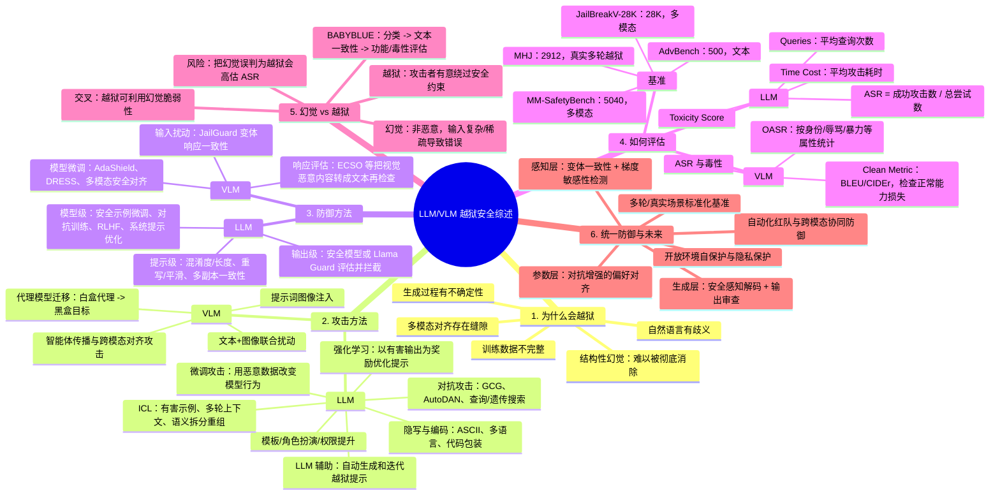

# 破解大模型与视觉语言模型：机制、评估与统一防御

> [!info] 论文定位
> 这是一篇综述，围绕 LLM/VLM 的越狱攻击、防御和评估建立统一框架。作者的主线不是提出单一算法，而是把“攻击面扩大”与“防御层次化”放到同一张图里比较。
>
> 论文：Zejian Chen 等，*Jailbreaking Large Language Models and Vision-Language Models: Mechanisms, Evaluation, and Unified Defenses*（中文译本）。下文页码均指 PDF 页码。

## 一张图看懂

## 论文论证链

1. **问题**：LLM/VLM 的安全对齐会被恶意输入绕过；VLM 还多了视觉编码器、跨模态融合和智能体传播等攻击面（引言、PDF pp.1-4）。
2. **机制解释**：越狱并非只是一组“坏提示词”，其根因包括数据不完整、意图分类歧义、生成不确定性和跨模态对齐漏洞（PDF p.2）。
3. **分类框架**：攻击按 LLM/VLM 与触发机制分类；防御按提示、模型、响应评估分类；评估同时看攻击有效性、危害程度、资源成本和正常能力损失（PDF pp.6, 16, 19-20）。
4. **边界校正**：幻觉是错误，越狱是有意的安全绕过；评测必须先判断是否恶意，再判断是否有害，否则会把幻觉当成成功越狱（PDF pp.21-22）。
5. **统一原则**：输入端识别扰动，生成端审查输出，参数端增强安全对齐；三层组合比单一过滤器更符合多模态场景（摘要、PDF pp.22-23）。

## 攻击与防御的对照

| 攻击利用的薄弱点 | 典型攻击 | 对应防御思路 | 代价/局限 |
|---|---|---|---|
| 表面词形与语义过滤 | 编码、拼写变体、代码包装、模板 | 重写、平滑、混淆度与长度检测 | 可能误伤正常输入，攻击可继续演化 |
| 上下文依赖 | ICL 投毒、多轮 Crescendo、语义拆分 | 多副本响应一致性、上下文审查 | 多轮和多变体带来额外推理成本 |
| 梯度/搜索可利用 | GCG、AutoDAN、查询/遗传搜索 | 对抗训练、梯度敏感性检测 | 训练成本高，迁移攻击仍可能存在 |
| 视觉-语言错配 | 图像注入、联合扰动、代理转移 | JailGuard、ECSO、跨模态验证 | 需要同时评估两种模态，速度与准确率难兼顾 |
| 对齐不足 | 有害微调、恶意偏好数据 | 安全微调、RLHF、AdaShield/DRESS | 可能牺牲帮助性与正常任务性能 |

## 记住这几个公式

$$
ASR=\frac{N_{attack\_success}}{N_{total\_attempts}}
$$

$$
Toxicity=\frac{1}{N}\sum_{i=1}^{N}T(x_i)
$$

$$
OASR_c=\frac{N^c_{success}}{N_{total\_attempts}}
$$

- ASR 越高，攻击越成功；对防御系统则希望越低。
- 毒性分数衡量输出“有多危险”，不能代替“是否真正绕过安全约束”。
- VLM 还要看 `Clean Metric`，因为攻击成功不应以正常图像描述能力被破坏为代价。

## 读完后的判断

- 这篇综述最有价值的不是某个具体攻击名称，而是把 **攻击有效性、输出危害、攻击成本、正常能力** 放进同一个评估视角。
- “统一防御”可以理解为三道闸门：输入感知、生成审查、参数对齐；其中跨模态验证是 VLM 相比纯文本 LLM 新增的关键环节。
- 论文提出了方向性原则，但没有给出一个在所有模型、所有模态和真实部署环境中都验证充分的统一算法；因此阅读时应把“综述结论”与“已被实验充分证明的结论”分开。

## 我的理解

越狱的本质不是模型“突然变坏”，而是模型在 **理解输入、保持上下文、跨模态对齐和生成输出** 的某个环节出现了可操纵的缝隙。攻击者是在找缝隙，防御者是在增加跨层检查。以后看任何一篇越狱论文，我会先问四件事：它操纵了哪一层、成功标准是什么、是否损伤了正常能力、它和幻觉有没有混淆。

## 来源与阅读边界

- 来源文件：`/Users/zhengshuang/Zotero/storage/RSEI4Y3P/2601.03594_zh_CN.pdf`
- 依据：论文正文、图 1-27、表 I-II、公式 (1)-(8)。
- 本笔记是论文内容的结构化整理，不对论文引用的每一篇攻击论文做独立复核，也不把综述中的未来方向当作已验证事实。
