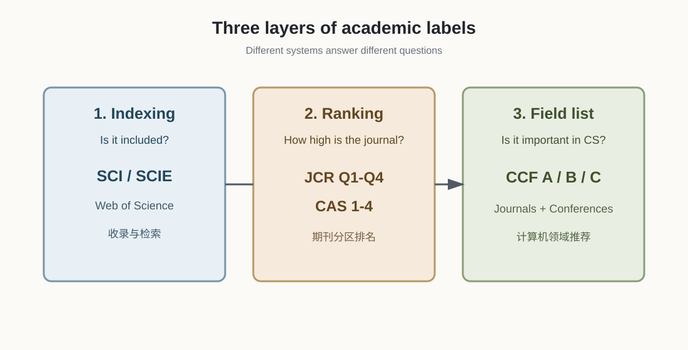
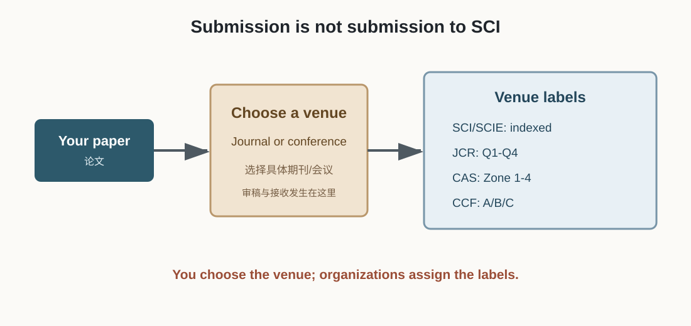
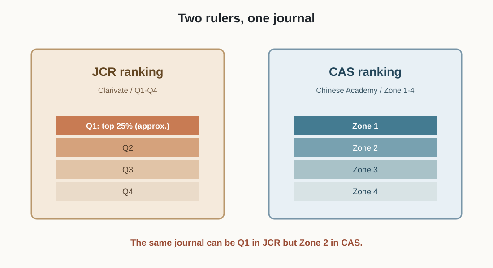
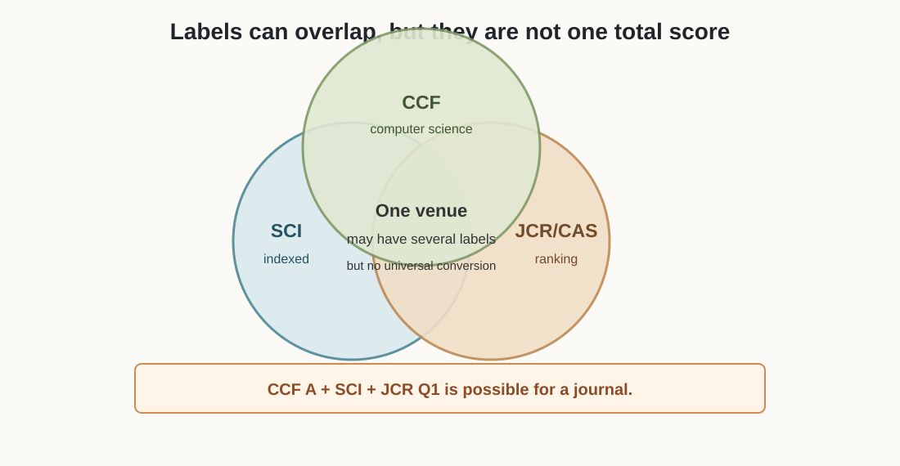

# 期刊与会议评价体系入门：先搞清楚“谁在排什么”

> 这篇笔记的目标不是教我背一堆缩写，而是先建立一个判断框架：一篇论文发表在哪里、这个 venue 被哪些体系收录或评价、这些标签分别说明什么。

## 1. 先记住一句话

> **SCI/SCIE 是收录系统；JCR 和中科院分区是期刊排名系统；CCF 是计算机领域的推荐目录。**

它们可以同时出现在同一个期刊或同一篇论文的描述里，但不是同一套排行榜，也不能简单拼成一条“全球统一总榜”。



## 2. 一篇论文到底“投”给谁？

论文作者真正投稿的是一个具体的发表载体（venue）：

- 期刊（journal）
- 会议（conference）

我不是把论文“投给 SCI”，也不是把论文“投给一区”。更准确的流程是：

```text
我选择期刊/会议 → 投稿 → 审稿 → 接收 → 论文发表
```

论文发表之后，这个期刊或会议已经拥有的各种标签，会成为描述这篇论文发表层次的参考。



## 3. SCI/SCIE：先问“有没有被收录”

SCI/SCIE 可以先理解成 Web of Science 里的文献收录体系。它主要回答：

> **这个期刊是否被这个数据库收录？**

被 SCI/SCIE 收录，说明这个期刊进入了一个国际文献检索和引用统计系统；但它本身不等于“顶刊”，也不直接等于一区。

常见的其他数据库或索引还包括：

| 名称 | 先把它理解成什么 | 常见范围 |
| --- | --- | --- |
| SCI/SCIE | 国际期刊收录与检索体系 | 自然科学、工程、计算机等 |
| EI | 工程技术文献收录体系 | 工程、计算机等 |
| SSCI | 社会科学文献收录体系 | 社会科学 |
| Scopus | 国际文献数据库 | 多学科 |
| CNKI | 中文文献检索平台 | 中文论文 |

这里的“收录”是一个门槛或身份标签，不是完整的质量排名。

## 4. JCR：一张期刊排行榜

JCR（Journal Citation Reports）是 Clarivate 发布的期刊评价报告。它会把期刊放到具体学科类别中，再按照引用指标等进行排名，常见结果是：

- **Q1**：该学科期刊中大约前 25%
- **Q2**：大约前 25%–50%
- **Q3**：大约前 50%–75%
- **Q4**：大约后 25%

这里有两个容易忽略的点：

1. JCR 排的是**期刊**，不是直接给单篇论文打分。
2. 同一本期刊在不同学科类别中，分区可能不同。

所以“这篇论文是 JCR Q1”其实是口语化说法，严格说应该是：

> 这篇论文发表在某个学科类别中被 JCR 列为 Q1 的期刊上。

## 5. 中科院分区：另一张排行榜

中科院分区也是期刊排名体系，常见结果是一区、二区、三区、四区。它和 JCR 的学科分类、数据处理和分区方法不完全相同。

因此同一个期刊可能出现：

```text
JCR Q1
中科院二区
```

这不一定是谁弄错了，而是两套尺子测出来的结果不同。

因此，“SCI 一区”不是一个足够精确的说法。看到这句话时，我应该追问：

> **你说的是 JCR Q1，还是中科院一区？是哪一年？属于哪个学科类别？**



## 6. CCF：计算机领域的推荐目录

CCF（中国计算机学会）主要评价计算机领域的重要期刊和会议，分为：

```text
CCF A 类 → CCF B 类 → CCF C 类
```

它更像是计算机领域专家给出的“重要 venue 推荐名单”，而不只是根据一个引用指标做全球期刊排名。

CCF 既包括期刊，也包括会议。计算机领域尤其重视会议，因此会出现这种情况：

```text
某个顶级计算机会议：CCF A，但没有“SCI 一区”这个期刊标签
某个计算机期刊：SCI 收录、JCR Q1，但不在 CCF 目录中
```

“CCF A 类论文”是常见说法，但严格地说，应该说：

> 论文发表在 CCF A 类会议或 CCF A 类期刊上。

## 7. 一个 venue 可以拥有多个标签吗？

可以。比如某个计算机期刊可能同时是：

```text
SCI/SCIE：收录
JCR：Q1
中科院分区：一区或二区
CCF：A 类期刊
```

这些标签可以叠加，因为它们回答的问题不同：

| 标签 | 它回答的问题 |
| --- | --- |
| SCI/SCIE | 是否进入某个国际数据库？ |
| JCR Q1 | 在 JCR 的某个学科中排名是否靠前？ |
| 中科院一区 | 在中科院分区体系中排名是否靠前？ |
| CCF A | 在计算机领域是否被列为重要 venue？ |

但“CCF A + SCI 一区”要看评价对象：

- 如果是**期刊**，同一个期刊同时拥有这些标签是可能的。
- 如果是**CCF A 会议**，不能直接把它叫作“SCI 一区期刊”，因为 SCI 分区通常针对期刊。
- 同一篇论文也可能同时获得多个“收录/评价”描述，但这些描述不代表四套体系已经合并成一个总分。



## 8. “哪些期刊牛，哪些期刊垃圾”应该怎么判断？

先不要把“是不是 SCI”当成唯一标准。可以按下面的层次建立粗略认知：

```text
顶级期刊/顶级会议
    ↓
本学科认可的高水平 venue
    ↓
JCR Q1 或中科院一区等高分区 venue
    ↓
Q2 / 二区等中上水平 venue
    ↓
普通收录期刊
    ↓
低质量、审稿不透明、过度营销或疑似掠夺性期刊
```

这只是入门地图，不是所有学科通用的精确排名。判断一个期刊是否值得信任，还要看：

- 是否在正规数据库的官方目录中；
- 是否与你的研究方向匹配；
- 编委和近年论文是否真实、稳定；
- 审稿流程是否透明，是否承诺“几天录用”；
- 是否存在大量群发邀稿、夸张宣传和不合理收费；
- 你的学校、导师和毕业要求认可哪套目录。

“水刊”也不是一个严格的官方等级。它通常是研究者对审稿质量、论文水平、引用表现或商业化程度的非正式称呼，不能只凭“SCI 收录”或“某个分区”判断。

## 9. 读到一个论文标签时，按这个顺序拆解

例如看到：

```text
Paper X: SCI 一区，CCF A
```

我应该拆成：

1. 论文发表在期刊还是会议？
2. SCI/SCIE 是收录标签，不是分区标签。
3. “一区”到底指 JCR Q1 还是中科院一区？
4. CCF A 评价的是这个期刊还是会议？
5. 标签对应的是哪一年、哪个学科类别？
6. 这套标签是否被我的学校或导师认可？

## 10. 最终记忆版

> **我投稿的是具体期刊或会议，不是投稿给 SCI 或一区。SCI/SCIE 负责收录，JCR 和中科院分区负责给期刊排名，CCF 负责给计算机领域的重要期刊和会议分类。一个 venue 可以同时有多个标签，但这些标签不能直接拼成一条统一总榜。**

## 我的理解 / 个人思考

刚开始接触科研时，我容易把 SCI、一区、JCR、CCF 当成同一个“论文等级表”。现在应该先把它们分成三类：数据库收录、期刊排名、学科推荐。

以后再看到“SCI 一区”这种说法，我不能只记住“很厉害”，而要继续确认它是 JCR Q1 还是中科院一区、是哪一年、哪个学科，以及它到底是期刊还是会议。

我现在对“期刊牛不牛”的理解也不能只看一个标签。标签只能帮助我快速筛选 venue，真正判断论文，还要看研究问题、创新性、实验是否可信，以及这个 venue 在自己研究领域里的真实认可度。
