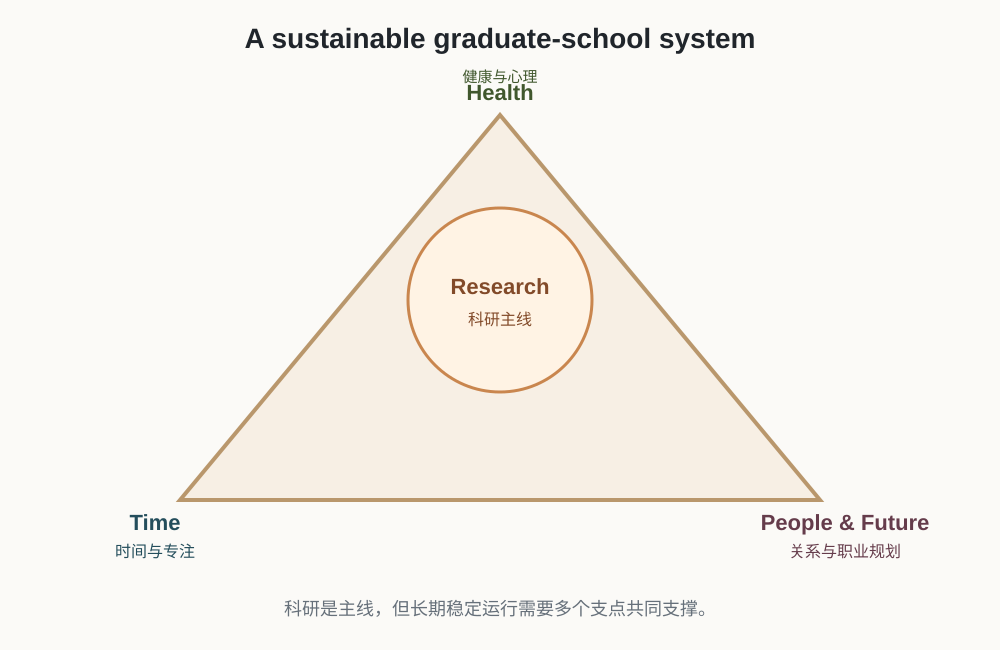
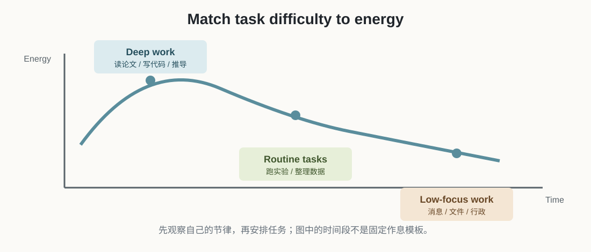
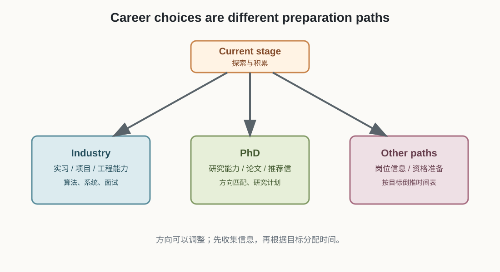

# 理工科研究生生活指南：论文之外的那些事

## 原始资料

![[理工科研究生生活指南：论文之外的那些事.pdf]]

> 这篇笔记根据同名 PDF 整理。它关注的不是怎么写论文，而是如何让研究生生活能够长期运行：管理时间、照顾身体、处理关系、维护工具、规划未来。

## 1. 先建立一个总模型

研究生生活不是“科研”和“生活”二选一，而是一个需要持续维护的系统：

```text
身体与心理：提供长期运行的能量
时间与专注：把能量转成有效工作
沟通与关系：获得反馈、资源和支持
工具与信息：减少重复劳动和意外损失
职业规划：决定现在该优先积累什么
```



核心不是每天把所有事情做到满分，而是让系统不会因为睡眠、健康、文件或关系中的一个问题长期失控。

## 2. 时间管理：先找到自己的节奏

### 2.1 先观察，再制定作息

PDF 建议尝试早睡早起、固定睡眠时间和 7–8 小时睡眠。这些可以作为参考，但不必机械地追求“23:00 前睡”。更重要的是：

- 找到自己最清醒的时间段；
- 把读论文、写代码、推公式等高认知任务放在高效时段；
- 把回复消息、整理文件等低认知任务放在低谷时段；
- 连续记录一周，观察时间实际流向；
- 保证稳定、足够的睡眠，而不是靠熬夜换工作时长。



### 2.2 减少上下文切换

读论文、写代码和回复消息需要不同的思维状态。频繁切换会产生重新进入任务的成本。

可以尝试：

- 用 25 分钟专注 + 5 分钟休息作为起点；
- 连续 2–4 个专注单元后再休息更久；
- 把相似任务集中处理；
- 深度工作时让手机静音或离开视线；
- 每天只确定最重要的 3 件事，避免把计划写成愿望清单。

### 2.3 对付拖延：降低开始成本

“写论文”太大，容易让人逃避。把它改写成可以立即开始的动作：

```text
写论文 → 整理引言的 3 篇参考文献
做实验 → 先跑通 Baseline 的一个 batch
准备汇报 → 先建立 PPT 标题页和目录
读论文 → 先读摘要、图表和结论
```

还可以使用：

- 两分钟法则：能快速完成的小事及时处理；
- 承诺机制：向导师或同门约定一个可检查的交付时间；
- 粗糙初稿：先完成，再修改，不等“准备完美”才开始。

## 3. 健康：科研可持续性的底座

### 3.1 身体习惯

- 保持相对稳定的睡眠和起床时间；
- 按时吃饭、补充水分；
- 每 45–60 分钟起身活动几分钟；
- 调整屏幕高度和座椅，让身体保持自然姿势；
- 选择自己能坚持的运动，不必一开始就制定过高目标；
- 使用 20-20-20 规则缓解长时间看屏幕带来的眼部疲劳。

运动频率、睡眠时间和饮食方式都应该根据个人健康状况调整。指南中的数字是行动起点，不是必须完成的打卡指标。

### 3.2 心理状态

实验失败、进度慢、论文被拒，都是科研过程中的正常事件。一次结果不能直接证明“我不适合科研”。更有用的做法是把问题拆开：

```text
结果不好 → 是问题不成立、实现有 bug、实验不公平，还是表达不清？
```

感到疲惫时，适当休息、出门走走、和可信任的人交流都属于科研管理，而不是浪费时间。如果焦虑、抑郁或失眠持续影响生活，应联系学校心理咨询中心或专业机构。

每周安排一些与科研无关的活动也很重要：运动、散步、音乐、摄影、烹饪或和朋友见面都可以。研究生生活不应该变成 24 小时都在实验室里思考论文。

## 4. 人际关系：让沟通产生有效反馈

### 4.1 和导师沟通

不要只带着“我不知道怎么办”去找导师，可以整理成：

```text
我现在做到哪里
遇到了什么具体问题
我想到哪些方案
每个方案的优缺点是什么
我建议下一步做什么
```

导师通常同时处理很多事务。定期、简洁、带方案地汇报，比临时发送大量零散消息更容易获得有效指导。汇报频率要结合导师习惯，可以从每 1–2 周一次开始协商。

### 4.2 和同门相处

- 积极参加组会，分享进展和困惑；
- 向师兄师姐请教具体问题；
- 在自己熟悉的地方帮助后来者；
- 保持友好，但不强求成为密友；
- 对代码、数据、署名和任务分工提前说清楚。

学术观点不同不等于人际冲突。讨论时聚焦问题，不把方法争论变成人身评价。

### 4.3 邮件和消息

发给导师或合作者的消息，最好做到：称呼得体、背景简短、问题具体、附件命名清楚、明确希望对方什么时候反馈。专业沟通本身就是科研能力的一部分。

## 5. 工具和信息管理：减少重复劳动与数据损失

### 5.1 英语作为工作语言

英语不是单独背完才开始使用的考试科目，而是读论文、听报告、写代码注释和参加交流时的工作工具。

可以逐步建立英文环境：

- 直接阅读论文摘要、图注和结论；
- 记录反复出现的学术表达；
- 听英文报告，关注研究者如何解释问题和结果；
- 遇到关键术语时核对原文，不完全依赖机器翻译。

### 5.2 AI 的正确位置

AI 适合辅助处理：

- 语法润色；
- LaTeX、表格和格式代码；
- 报错解释；
- 长文档的初步结构梳理；
- 方案的利弊分析。

但以下内容必须由我自己核实和负责：

- 论文事实、引用和数据；
- 实验结论；
- 研究创新点；
- 学术伦理和署名；
- 向导师、会议或期刊提交的最终内容。

AI 可以降低苦力活的成本，但不能替代研究判断。

### 5.3 文件、版本和备份

不要再使用“最终版”“真的最终版”“绝对最终版”这样的文件名。可以采用：

```text
项目/
├── paper/
├── code/
├── data/
├── figures/
├── logs/
└── README.md
```

文件名可以带日期或版本号，例如：

```text
experiment-report-20260810.pdf
paper-v03.tex
```

代码和论文源文件使用 Git 管理；重要数据采用至少两处存储，并定期检查备份是否真的可以打开。Git 适合管理代码和文本版本，不等于自动解决大模型权重、原始数据和所有文件的备份问题。

### 5.4 笔记和文献管理

工具不是重点，能长期坚持才是重点。当前我的 Obsidian 知识库可以分成：

- 论文阅读笔记；
- 主题知识笔记；
- 实验日志；
- Q&A 和踩坑记录；
- 待办、灵感和后续问题。

文献管理工具（如 Zotero）负责论文元数据、PDF、引用和标注；Obsidian 更适合沉淀自己的理解。两者可以配合使用，而不必强行让一个工具承担所有任务。

## 6. 学术规范：没有商量余地的底线

- 实验数据真实记录，不选择性隐藏不利结果；
- 直接或间接使用他人观点都要正确引用；
- 不把别人的代码、图表或文字伪装成自己的成果；
- 避免未经说明地大段复用自己已经发表的内容；
- 涉及人类被试、动物或敏感数据时，提前确认伦理审查要求；
- 论文署名、数据权限、代码共享和贡献分工尽早沟通。

## 7. 生活与职业规划

研究生期间可以逐步探索几条方向：



| 方向 | 主要积累 | 需要注意 |
| --- | --- | --- |
| 工业界就业 | 实习、项目、算法与工程能力、面试准备 | 不要只积累论文，尽早了解岗位要求 |
| 继续读博 | 研究能力、论文、推荐信、研究计划、方向匹配 | 论文不是唯一因素，导师匹配和研究潜力也重要 |
| 体制内或其他路径 | 目标岗位信息、考试或资格准备 | 根据具体岗位倒推时间表 |

如果还没有决定未来方向，不必强迫自己立刻做出终身选择。可以通过课程、项目、实习、组会和交流逐步收集信息，每完成一个项目就更新一次简历和作品记录。

## 8. 给我的每周检查表

```text
[ ] 本周最重要的 3 个科研任务是什么？
[ ] 是否有一段不被消息打断的深度工作时间？
[ ] 是否记录了实验、代码和数据版本？
[ ] 是否向导师或同门进行了必要的汇报/求助？
[ ] 是否安排了运动、休息或离开实验室的时间？
[ ] 是否推进了一件和长期职业方向有关的小事？
```

## 9. 这份 PDF 中需要按个人情况调整的建议

- “23:00 前睡”和“每周运动 3–5 次”是健康建议，不是统一考核标准；重点是稳定和可持续。
- “研二上学期找实习”“研二下学期准备申博”是常见时间参考，具体要结合学校、项目周期和个人基础。
- “读博最重要的是论文”过于简化，研究能力、推荐信、方向匹配、英语和面试表现同样重要。
- “导师放养”不一定是坏事，但如果长期缺乏反馈，应主动建立汇报节奏；遇到影响毕业或权益的问题，要寻求更正式的支持渠道。

## 我的理解 / 个人思考

这份指南提醒我，研究生生活不是把所有时间都献给论文。科研确实是主线，但睡眠、运动、情绪、沟通、文件管理和职业规划会直接影响我能不能把科研坚持下去。

我现在更适合建立一个“能长期运行的节奏”：每天完成一两个重要任务，每周留下实验记录并复盘，同时保留正常生活。研究生不是比谁短期消耗得更狠，而是要在几年里持续学习、持续产出，并且不要把自己耗坏。
