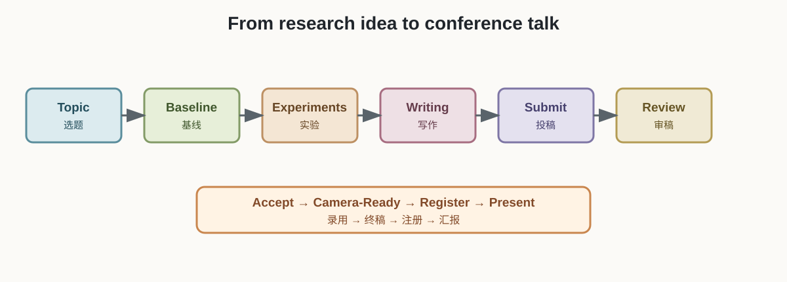
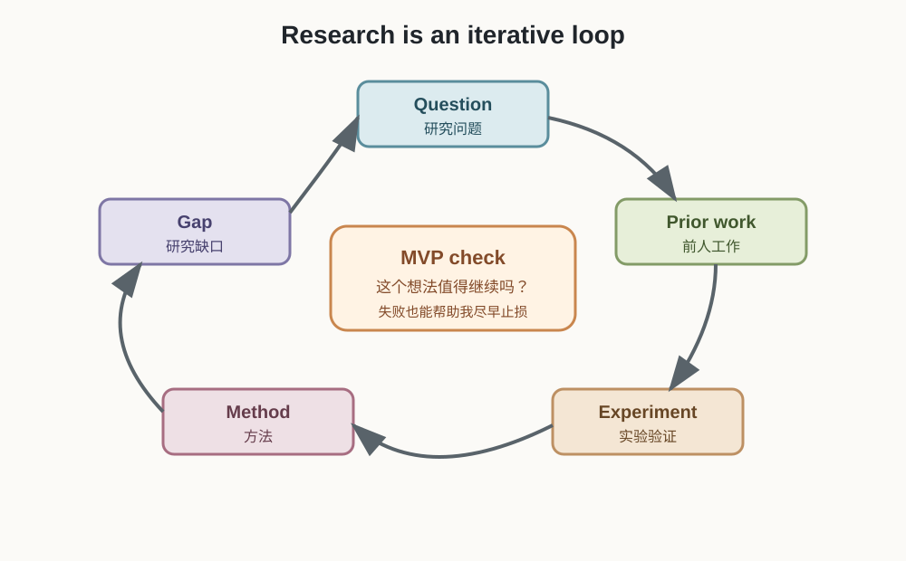
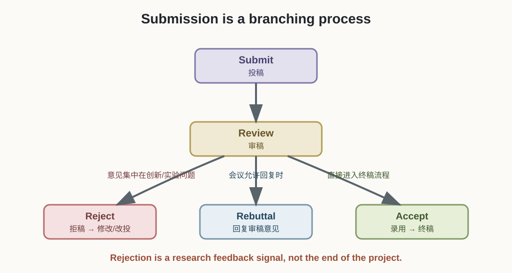

# 硕士发论文全流程：从研究想法到正式发表

> 本笔记根据《硕士研究生发论文全流程实用指南（国际会议导向版）》整理，主要面向计算机、人工智能、电子信息等方向。它是一张行动地图，不是所有学科通用的硬规则。

## 1. 先记住总流程

论文发表不是“写完论文，然后上传文件”这么简单，而是一条完整的研究链路：

```text
选题与调研 → 跑通 Baseline → 最小验证 → 完整实验 → 论文写作
→ 投稿 → 审稿 → Rebuttal → 录用/拒稿 → 终稿 → 参会与报告
```



从开始准备到最终参会，理想情况下可能需要 6–12 个月，但实验返工、导师修改、审稿和改投都可能让周期变长。因此，会议截稿日和毕业节点要尽早倒推。

## 2. 第一层：研究闭环

真正决定论文能不能成立的，是下面这个研究闭环：

```text
研究问题 → 了解前人 → 找到缺口 → 提出方法 → 实验验证 → 形成结论
    ↑                                                        ↓
    └────────────── 根据结果继续修改问题和方法 ──────────────┘
```

它不是一次性直线流程。实验失败后，可能需要重新选题；发现缺口不真实时，可能需要重新读文献；结果不稳定时，可能需要重新设计实验。



### 2.1 选题：先找“能做完”的问题

一个适合硕士阶段的选题，通常要同时满足：

- 有一定研究价值，而不是纯粹重复；
- 有真实的研究缺口；
- 数据、代码和算力能够支撑；
- 与导师或实验室方向有联系；
- 能在毕业时间内完成。

不要只因为某个方向很热门就追进去。热门方向往往竞争更激烈，也可能需要更大的数据、算力和团队资源。

### 2.2 阅读：带着“找缺口”的目的读

阅读论文时，不只是记住它“用了什么模型”，还要主动记录：

| 阅读问题 | 要找的内容 |
| --- | --- |
| 它解决什么问题？ | 任务、数据、应用场景 |
| 它和谁比较？ | Baseline、数据集、评价指标 |
| 它哪里不够好？ | 局限、失败案例、未覆盖场景 |
| 它的结论可靠吗？ | 实验是否公平、是否有消融 |
| 我能从哪里切入？ | 新场景、小改进、效率、分析 |

建议建立自己的素材库，保存：目标会议论文、数据集、Baseline 代码、常用图表模板、常见表达和阅读时发现的研究缺口。

### 2.3 MVP：先做最小可行性验证

正式投入几个月之前，先用 1–2 周回答一个问题：

> 这个想法有没有可能产生正向结果？

MVP（Minimum Viable Prototype）可以包括：

1. 跑通一个可靠的 Baseline；
2. 加入最小版本的改动；
3. 在小数据或少量实验上观察趋势；
4. 检查结果是否值得继续投入。

MVP 不是最终实验，也不是为了制造漂亮结果，而是为了尽早发现方向不可行、代码跑不通或缺口并不真实。

## 3. 第二层：实验要证明什么

一套合格的实验不是“我的数字比别人高”这么简单，而是要回答四个问题：

```text
有效吗？ → 为什么有效？ → 稳定吗？ → 代价是否合理？
```

### 3.1 基本实验清单

- **公平对比**：选择 3–5 个有代表性的 Baseline，在相同数据、指标和设置下比较；
- **消融实验**：逐一移除自己的模块，证明每个模块确实有贡献；
- **超参数分析**：展示核心参数变化时的性能趋势；
- **多指标评估**：不要只报告一个指标，要覆盖任务中公认的评价维度；
- **案例分析**：展示方法成功的例子，并解释为什么有效；
- **失败分析**：诚实说明方法在哪些情况下失效；
- **效率分析**：关注参数量、显存、训练时间、推理速度或计算量；
- **泛化测试**：在相关但不同的数据集或场景上验证迁移能力。

### 3.2 真实与可复现

实验数据要真实，不能为了让结果好看而挑选、修改或隐藏不利结果。建议尽早做好：

- 固定随机种子并记录环境；
- 保存配置、日志和模型权重；
- 记录数据版本和预处理方式；
- 做好云盘、硬盘等多处备份；
- 关注目标会议的 Reproducibility Checklist 和代码开源要求。

## 4. 第三层：论文写作是在传递研究逻辑

论文的核心不是把实验报告写得很长，而是在有限篇幅里让审稿人迅速理解：

```text
问题重要吗？ → 现有方法哪里不够？ → 我的方法解决了什么？
→ 实验是否支持这个结论？
```

### 4.1 标准结构

| 部分 | 要回答的问题 | 常见错误 |
| --- | --- | --- |
| Abstract | 做了什么、为什么做、怎么做、效果如何？ | 写太多背景，缺少具体结果 |
| Introduction | 问题为什么重要，贡献是什么？ | 贡献写成空话 |
| Related Work | 前人怎么做，我和他们本质上哪里不同？ | 只罗列论文，不做分类和比较 |
| Method | 方法整体如何工作，细节能否复现？ | 符号不解释，逻辑跳跃 |
| Experiment | 方法是否有效，为什么有效？ | 只有主表，没有消融和分析 |
| Conclusion | 得出了什么结论，下一步是什么？ | 引入正文没有的新内容 |

### 4.2 会议格式是硬约束

计算机国际会议通常有严格的格式和截止时间。投稿前重点检查：

- 使用官方最新 LaTeX 模板；
- 正文不超过页数限制；
- 双盲审稿时隐藏作者、单位、邮箱和致谢；
- 图表缩小后仍然可读；
- 引用使用 `.bib` 管理；
- 上传系统生成的 PDF 后重新下载检查；
- 不要把投稿拖到截止日最后几个小时。

图表要优先保证信息传达，再考虑美观。框架图最好在写 Method 之前就开始画，因为画图本身也在帮助我梳理方法逻辑。论文中优先使用 PDF 等矢量图，避免截图和低分辨率位图。

## 5. 投稿与审稿：不是一次性的成败判断

### 5.1 选择 venue

投稿前要同时考虑：

- 研究主题是否匹配；
- 目标会议或期刊是否认可这类工作；
- 审稿周期是否适合自己的毕业时间；
- 学校和导师认可哪些目录；
- 是否承担得起注册费和参会成本；
- 投稿规则是否允许预印本、代码或补充材料。

CCF A/B/C 可以作为计算机领域的参考目录，但不能简单理解成“C 类一定容易”。不同会议的方向、竞争和审稿标准差别很大。第一篇论文可以以“完成并合规”为阶段目标，但目标 venue 仍要结合导师和学校要求决定。

### 5.2 审稿结果的分支



- **录用**：根据审稿意见修改正文，提交 Camera-Ready 终稿；
- **需要回复/讨论**：进入 Rebuttal 期，按条回应审稿人；
- **拒稿**：分析原因，补实验或改写后投下一个合适的 venue；
- **改投**：不能只换一个投稿链接，要真正处理导致拒稿的问题。

Rebuttal 通常时间很短，回复的基本结构是：

```text
感谢意见 → 准确复述问题 → 给出实验/解释 → 指出修改位置
```

即使最终被拒，审稿意见也可以帮助我发现创新性、实验设计、写作或表达上的短板。

## 6. 录用后还没有结束

录用后通常还要完成：

1. 根据意见修改正文；
2. 从匿名版本改成正式版本；
3. 重新排版并检查页数；
4. 提交 Camera-Ready PDF 和 LaTeX 源文件；
5. 签署版权协议或出版授权；
6. 按时缴纳注册费；
7. 准备汇报幻灯片并参加会议。

不同会议对注册、作者参会、论文是否正式收录等要求不同，必须以目标会议官网当年的规定为准。录用通知对申博或毕业是否有效，也要以学校和项目的具体要求为准。

## 7. 给我的可执行版本

现在不要把“发论文”理解成一个遥远的结果，而是拆成下一步行动：

```text
本周：确定一个阅读主题，收集 5–10 篇代表性论文
↓
下周：整理任务、数据集、Baseline 和研究缺口
↓
随后：跑通 Baseline，完成一个最小改动和 MVP 验证
↓
结果可行：补齐对比、消融、案例和效率实验
↓
实验稳定：先画框架图，再按论文结构写作
↓
投稿前：和导师确认 venue、格式、匿名和提交版本
```

第一篇论文的合理目标是：

> **完成一次完整、真实、合规的研究闭环，而不是一开始就证明自己能发顶会。**

## 8. 这份 PDF 中需要保留判断的建议

以下内容可以作为经验参考，但不能当成普遍定律：

- “会议一定比期刊适合硕士”：主要适用于计算机/AI 等会议文化较强的方向；
- “第一篇投 CCF-C”：可以作为一种目标策略，但不等于保底，也要看具体会议和学校要求；
- “论文 6–12 个月完成”：是规划区间，不是承诺；
- “arXiv 占坑”：要遵守目标 venue 的预印本和双盲规则，不能把它当成自动保护机制；
- “录用通知就足够申博”：是否认可取决于学校、项目和申请要求；
- “AI 直接生成论文”：AI 可以辅助排版、代码和语言检查，但研究问题、实验结论和学术责任必须由作者自己负责。

## 我的理解 / 个人思考

这份 PDF 让我看到，发论文不是最后写一篇文章，而是从选题开始的一整套研究工程：先发现一个值得解决的问题，再用 Baseline、MVP、完整实验和分析证明自己的想法，最后用论文把证据组织起来。

我现在最需要练习的不是马上冲某个等级，而是把一个小问题完整做完。只要能完成“读文献 → 找缺口 → 跑 Baseline → 做实验 → 写清楚 → 投稿 → 根据意见修改”的闭环，我就真正开始进入科研，而不是只是在背期刊和会议名称。
