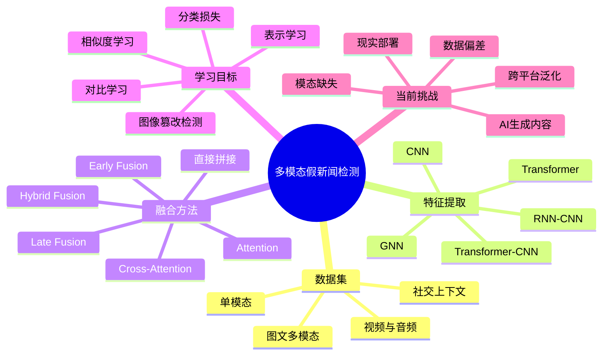

# A survey of fake news detection: A comprehensive review of multimodal approaches

- 作者 / 年份 / 期刊：Juyeob Lee 等 / 2026 / Data & Knowledge Engineering
- PDF：[[A survey of fake news detection A comprehensive review of multimodal approaches.pdf]]
- 中文 PDF：[[A survey of fake news detection A comprehensive review of multimodal approaches.zh-CN.pdf]]
- 综述领域：多模态假新闻检测
- 阅读状态：🔄 初读

## 一句话概括

> 这篇综述梳理了多模态假新闻检测领域，按照**特征提取、融合方法和学习目标**三个维度对已有研究进行分类，并指出数据偏差、跨平台泛化和现实部署是当前的主要问题。

## 摘要四要素

- **What（综述什么）**：多模态假新闻检测的数据集、模型和未来研究方向。
- **Why（为什么需要这篇综述）**：现有研究数量快速增加，但不同模型、数据集和融合策略比较零散，缺少统一的整理框架。
- **How（作者如何分类和整理）**：比较常用数据集，并从特征提取、融合方法、学习目标三个维度整理检测模型。
- **So What（得出了什么结论）**：多模态方法能够利用文字、图片、视频和社交信息之间的互补或矛盾，但仍面临数据偏差、泛化能力不足、模态缺失和部署困难。

## 为什么需要多模态检测？

一条假新闻不一定是“文字是假的”或者“图片被修改过”，也可能是**不同模态之间的组合具有误导性**。

例如：

```text
文字：“上海今天发生了严重洪灾。”
图片：一张真实的洪水照片，但拍摄于五年前的另一个国家。
```

- 文字单独看可能没有明显问题。
- 图片单独看也是真实照片。
- 但文字和图片并不匹配，组合起来构成误导。

因此，模型不仅要分别理解文字和图片，还要判断它们之间是否一致。

## 核心分类框架

- **特征提取（Feature Extraction）**：如何把文字、图片、视频、社交关系等信息转换成模型可以处理的向量。
- **融合方法（Fusion Method）**：如何把不同模态的特征结合起来。
- **学习目标（Learning Objective）**：使用什么损失函数或训练任务，让模型学会辨别真假与跨模态不一致。

三者构成一条完整流程：


### 论文整体思维导图



论文原始分类图见：

![[A survey of fake news detection A comprehensive review of multimodal approaches.pdf#page=9]]

## 主要技术路线

| 技术路线 | 核心思想 | 优点 | 局限 |
|---|---|---|---|
| CNN / RNN-CNN | 使用卷积提取图像或局部文本特征，使用 RNN 处理序列 | 相对轻量，计算成本较低 | 难以充分捕捉长距离和全局语义 |
| Transformer | 使用 BERT、ViT 等模型分别编码文字和图像 | 上下文与语义建模能力强 | 计算成本较高 |
| GNN | 把用户、新闻、发布者和传播关系表示成图 | 能利用传播模式和社交关系 | 依赖难以获得的社交图数据 |
| 直接拼接 | 把不同模态的向量连接后交给分类器 | 简单、快速、容易实现 | 难以建模深层跨模态关系 |
| Attention / Cross-Attention | 让一种模态关注另一种模态中的相关部分 | 能发现图文之间的对应和矛盾 | 模型更复杂、计算量更大 |

## 三种融合阶段

### Early Fusion

提取各模态特征后立即融合，再交给同一个分类器。

```text
文字特征 ─┐
          ├─ 融合 ─ 分类器 ─ 预测
图片特征 ─┘
```

### Late Fusion

每种模态先独立预测，再合并预测结果。

```text
文字 ─ 分类器 ─ 文字预测 ─┐
                          ├─ 加权 ─ 最终预测
图片 ─ 分类器 ─ 图片预测 ─┘
```

### Hybrid Fusion

同时使用特征级融合和决策级融合，表达能力更强，但结构也更复杂。

## 学习目标

- **分类目标**：使用交叉熵直接训练真假分类器。
- **表示学习**：让模型学到更适合检测假新闻的特征。
- **相似度目标**：判断文字和图片在语义上是否一致。
- **对比学习**：拉近匹配样本的表示，推远不匹配样本的表示。
- **图像取证目标**：检测图片是否被编辑或篡改。

其中，单独使用真假分类损失可能只能让模型学会数据集中的表面规律；相似度和对比学习更适合发现“文字和图片各自真实，但组合错误”的新闻。

## 数据集与评价方式

- 代表性数据集：LIAR、PHEME、WEIBO、Fakeddit 等。
- 常用评价指标：Accuracy、Precision、Recall、F1。
- 数据集可能存在的偏差：
  - 大量数据集中在英语和美国政治领域。
  - 自动采集和自动标注可能引入噪声。
  - 模型可能记住事件、平台或来源特征，而不是真正学会辨别假新闻。
  - 图文数据较多，视频和音频数据仍然不足。

## 发展趋势与研究空白

- **方法演变**：单模态检测 → 简单图文拼接 → Attention 和跨模态交互 → Transformer、GNN 与对比学习。
- **当前趋势**：使用预训练语言模型、视觉模型和社交传播信息，学习更完整的新闻表示。
- **尚未解决的问题**：
  - 模型换平台、换语言或换事件后可能失效。
  - 现实数据可能缺少某一种模态。
  - AI 生成文字、图像、音频和视频带来新的检测难题。
  - 复杂模型难以满足实时性和可解释性要求。
  - 用户互动和传播数据涉及隐私与偏见。
- **作者建议的未来方向**：
  - 跨平台检测；
  - AI 生成内容检测；
  - 加强视频和音频研究；
  - 融合用户、时间和传播路径等上下文；
  - 探索自监督、对比学习和对抗训练；
  - 研究可扩展、透明且符合伦理的现实系统。

## 值得继续读的论文

- [[BCMF A bidirectional cross-modal fusion model for fake news detection.pdf]]：继续理解双向跨模态融合。
- [[MFND-DCL Multimodal fake news detection based on dual contrastive learning.pdf]]：继续理解对比学习如何用于图文假新闻检测。
- [[Fake news detection  A survey of graph neural network methods.pdf]]：了解 GNN 和传播关系路线。
- [[A systematic survey on explainable AI applied to fake news detection.pdf]]：了解可解释假新闻检测。

## 局限与疑问

- **这篇综述的局限**：
  - 论文主要使用 Web of Science 和一条检索式筛选英文论文，可能遗漏其他数据库、语言和关键词下的研究。
  - Table 3 汇总了很多模型，但不同论文使用的数据集和实验设置不同，性能数字不一定能直接横向比较。
  - 三轴框架便于整理模型，但“特征提取”和“融合方法”有时会重叠，例如跨模态 Transformer 同时完成表示学习与融合。
- **我没看懂的地方**：
  - [ ] Cross-Attention 相比直接拼接具体多做了什么？
  - [ ] 对比学习如何构造正样本和负样本？
  - [ ] 如何证明模型学到的是假新闻规律，而不是数据集捷径？
- **我对作者结论的怀疑**：
  - [ ] “多模态模型优于单模态模型”是否在模态缺失、低质量图片或跨平台数据上仍然成立？
  - [ ] 更复杂的融合结构带来的提升，是否足以抵消计算成本？

## 当前阅读进度

- [x] 阅读摘要
- [x] 阅读结论
- [x] 理解论文写作动机
- [x] 找到三轴分类框架
- [ ] 精读第 9 页 Fig. 4
- [ ] 阅读 4.1.7 特征提取讨论
- [ ] 阅读 4.2.5 融合方法讨论
- [ ] 阅读 4.3.7 学习目标讨论
- [ ] 阅读第 5 节未来方向
- [ ] 用自己的话重写“我的理解”

## 我的理解 / 个人思考

目前我的理解是：多模态假新闻检测并不只是“多放几种数据”，真正重要的是让模型理解不同信息之间的关系。文字和图片可能各自都是真的，但错误组合后仍然会误导读者。因此，一个完整模型需要解决三个连续问题：如何表示每种模态、如何让模态之间交互，以及使用什么学习目标让模型真正关注真假和一致性。

这篇综述给我的最大帮助不是提供某个最好的模型，而是给出了一个阅读其他论文的框架。以后看到一个新的假新闻检测模型，可以先问：它用什么编码器提取特征？如何融合文字、图像或社交信息？除了真假分类，还使用了什么学习目标？

这与 [[自注意力机制]] 和 [[Transformer]] 有直接联系：Cross-Attention 可以让文字表示主动寻找相关的图像区域，也可以让图像特征反过来关注文字，从而发现图文之间的对应或矛盾。目前还需要继续弄清楚，这种复杂交互在跨平台和模态缺失的真实环境中是否仍然可靠。

> **一句话记忆：** 多模态假新闻检测的核心不是简单地“同时看图和文字”，而是学习不同模态之间是否相互支持、相互矛盾。
