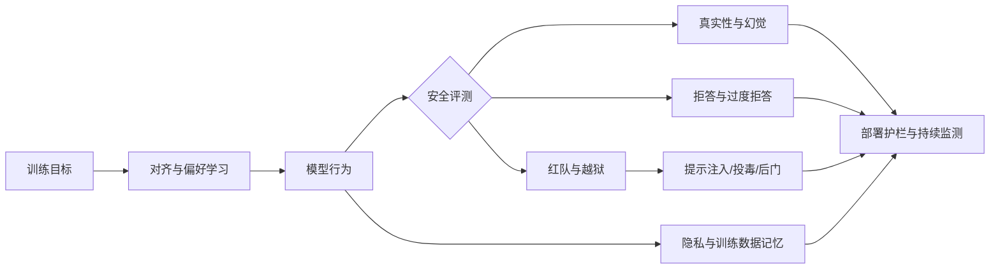

# LLM 安全论文索引（导师发，4 篇）

> 2026-07-22 建立索引。4 篇论文全部发表于 2025-2026 年顶会/顶刊（EMNLP 2025 ×2、ACL 2025、Machine Learning/Springer 2026），方向是 **LLM 安全**（攻击/防御/对齐/可解释/多语言/微调安全）。
> 和 [[../fakenews-imp/00-索引|fake news 检测]] 是**两条不同的研究方向**，不要混淆。

## 一、总览表

| #   | 标题（简称）                           | 类型  | 年份/会议                            | 安全子方向            | 核心方法/综述重点                                      | 创新关键词                      | 覆盖范围 / 章节大纲                                              | 优先级 |
| --- | -------------------------------- | --- | -------------------------------- | ---------------- | ---------------------------------------------- | -------------------------- | -------------------------------------------------------- | --- |
| 1   | [[Interpretation Meets Safety A Survey on Interpretation Metho.pdf\|Interpretation Meets Safety]]      | 综述  | EMNLP 2025                       | 可解释性, 防御         | 首篇系统梳理 LLM 解释方法与安全增强及工具之间联系的综述                 | 统一框架 / 工作流分类法 / 自推理解释      | 近 70 篇文献，四大安全风险（幻觉/越狱/偏见/隐私），按 LLM 工作流四阶段（训练/输入/推理/生成）组织 | P0  |
| 2   | [[Safety is Not Only About Refusal Reasoning-Enhanced Fine-tun.pdf\|Safety is Not Only About Refusal]] | 研究  | ACL 2025 (Findings)              | 微调安全, 越狱, 拒绝     | 提出 RATIONAL 框架，用自生成安全推理微调模型，解决僵化拒绝无法应对推理型越狱的问题 | 推理增强微调 / 自检推理 / 上下文感知安全    | 不适用（研究论文）                                                | P1  |
| 3   | [[Survey on llm safety attacks, defenses, alignment, metrics, .pdf\|Survey on LLM Safety (五维)]]        | 综述  | Machine Learning (Springer) 2026 | 攻击, 防御, 对齐, 评估指标 | 系统梳理 LLM 端到端安全流水线五大组件（攻击/防御/对齐/指标/护栏）及评测体系     | 五维统一分类法 / 应用层可靠性视角 / 护栏机制  | 五大维度全覆盖，含主要 LLM 与基准对比表                                   | P0  |
| 4   | [[The State of Multilingual LLM Safety Research From Measuring.pdf\|Multilingual LLM Safety]]          | 综述  | EMNLP 2025                       | 多语言安全, 评估指标      | 系统分析 LLM 安全研究的语言差距，揭示英语中心化问题                   | 语言差距量化 / 语言文档实践分析 / 三大未来方向 | 近 300 篇 *ACL 文献（2020-2024），七个安全子主题，三类语言覆盖维度              | P0  |

## 二、分类统计

| 类别                  | 数量  | 论文 #    |
| ------------------- | --- | ------- |
| 综述 Survey           | 3   | 1, 3, 4 |
| 研究论文 Research       | 1   | 2       |
| 可解释性 Interpretation | 1   | 1       |
| 防御 Defenses         | 2   | 1, 3    |
| 攻击 Attacks          | 1   | 3       |
| 对齐 Alignment        | 1   | 3       |
| 评估指标 Metrics        | 2   | 3, 4    |
| 多语言安全 Multilingual  | 1   | 4       |
| 越狱 Jailbreak        | 1   | 2       |
| 拒绝 Refusal          | 1   | 2       |
| 微调安全 Fine-tuning    | 1   | 2       |

> 一篇可属多个子方向。综述类覆盖面宽，研究类（#2）聚焦单一问题。

## 三、读论文路线建议

### P0 先读综述建立全局（3 篇综述，按"从宽到窄"顺序）

1. **#3 Survey on LLM Safety（五维，Springer 2026）** — **最先读**。五维分类法（攻击/防御/对齐/指标/护栏）是 LLM 安全最完整的骨架，读完这篇就有全局地图。
2. **#1 Interpretation Meets Safety（EMNLP 2025）** — 在 #3 基础上聚焦"可解释性 × 安全"交叉点，读完能理解"为什么模型不安全"和"怎么解释"。
3. **#4 Multilingual LLM Safety（EMNLP 2025）** — 切入"多语言"这个具体子问题，揭示英语中心化盲区，读完能看到研究空白点（潜在选题方向）。

### P1 精读研究论文

4. **#2 Safety is Not Only About Refusal（ACL 2025 Findings）** — 唯一的研究论文，RATIONAL 框架。读这篇学**怎么做研究、怎么写方法部分**，不只是学知识。

## 四、和 fake news 检测方向的关系

这两批论文看似都是"安全"，但**研究问题完全不同**：

| 维度     | LLM 安全（本目录 4 篇）         | Fake news 检测（[[../fakenews-imp/00-索引]] 20 篇） |
| -------- | ------------------------- | --------------------------------------------- |
| 对象     | LLM 本身（生成式模型的安全属性）      | 社交媒体上的假新闻（外部内容）                              |
| 问题     | 模型会不会被越狱/生成有害内容/泄露隐私     | 一条新闻是不是假的                                    |
| 方法     | 对齐/微调/解释/护栏/红队          | 多模态融合/传播图/对比学习/LLM 增强                        |
| 数据     | 安全 benchmark（HarmBench 等） | Weibo/Twitter/PolitiFact/GossipCop            |
| 评估指标   | Attack Success Rate / Refusal Rate | Accuracy / F1 / AUC                           |

**共同点**：都涉及 LLM、都关注"安全"，近年都用 LLM 做工具。但**不能混在一篇笔记里**，否则会思路打架。

## 五、为什么老师先发 LLM 安全、再发 fake news？

**猜测**：老师可能在帮你**探方向**——先给一批 LLM 安全的（偏基础、偏 NLP 前沿），再给一批 fake news 的（偏应用、偏多模态）。两条线都看完后，你自己挑一条深入。

可能的结合点（如果未来想打通两条线）：
- 用 fake news 数据做 LLM 安全评估（把假新闻当"有害内容"测 LLM 拒不拒绝）
- 用 LLM 安全技术（如可解释性）解释 fake news 检测模型的决策

但这只是远期可能性，**现在先分别读懂，不要急着结合**。

## 六、读这篇索引之后做什么

1. 先读 **#3 五维综述** 建立全局（约 1-2 天，综述较长）
2. 再读 **#1 可解释性综述** 和 **#4 多语言综述**（各半天）
3. 最后精读 **#2 RATIONAL**（半天-1 天）
4. 读完后回过头来问自己：**我对哪条线更有感觉？** 是想搞 LLM 本身的安全，还是想搞 fake news 检测？答案决定下一步深挖方向。

## 七、我的理解

老师一次给 3 篇综述 + 1 篇研究论文，**综述占比 75%**，信号很明确：**先建认知，再谈做研究**。这和 fake news 最初那批 16 篇研究论文的策略不同；后续 fake news 方向也补了 4 篇综述/回顾，开始从“看大家在做什么”转向“把地图看清楚”。

**给自己的建议**：
- **3 篇综述不能跳读**，要老老实实读章节大纲，建立分类框架
- **#3 五维综述**是 LLM 安全的"骨架"，其他三篇都是"骨架上的肉"
- **#2 RATIONAL** 是学怎么写研究论文的样本，重点看它的 Method 和 Experiment 部分
- 不要把"LLM 安全"和"fake news 检测"混为一谈，它们是两个社区、两套方法、两个投稿方向

下一步：先读 **#3 五维综述**，建立 LLM 安全的全局地图。

---

## 八、近三年主清单：正式发表优先

本节按 **2023-09-18 至今** 筛选。优先选择 ACL/EMNLP/NAACL、NeurIPS/ICLR/ICML、USENIX/CCS/NDSS 等正式会议或期刊版本；只有在研究影响力很高、且尚未看到正式版本时，才保留 arXiv，并明确标注。正式发表不等于结论一定正确，但至少经过同行评审、版本可追踪、实验和引用更容易复核。

| #   | 论文                                                                                                | 时间 / venue               | 状态     | 适合解决的疑问            |
| --- | ------------------------------------------------------------------------------------------------- | ------------------------ | ------ | ------------------ |
| 1   | HaluEval: A Large-Scale Hallucination Evaluation Benchmark for Large Language Models              | 2023 / EMNLP             | 同行评审   | 幻觉如何被系统评测          |
| 2   | DecodingTrust: A Comprehensive Assessment of Trustworthiness in GPT Models                        | 2023 / NeurIPS           | 同行评审   | 可信性应覆盖哪些维度         |
| 3   | JailbreakBench: An Open Robustness Benchmark for Jailbreaking Large Language Models               | 2024 / NeurIPS           | 同行评审   | 如何标准化越狱数据、攻击和评测    |
| 4   | RAGTruth: A Hallucination Corpus for Developing Trustworthy Retrieval-Augmented Language Models   | 2024 / NAACL             | 同行评审   | RAG 场景如何标注幻觉       |
| 5   | Do-Not-Answer: A Dataset for Evaluating Safeguards in LLMs                                        | 2024 / Findings of EACL  | 同行评审   | 模型是否会拒绝有害请求        |
| 6   | XSTest: A Test Suite for Identifying Exaggerated Safety Behaviours in Large Language Models       | 2024 / NAACL             | 同行评审   | 如何测量过度拒答           |
| 7   | FAVA: A Framework for Attributed and Verified Answers                                             | 2024 / ACL               | 同行评审   | 如何让回答带有可核验依据       |
| 8   | TrustLLM: Trustworthiness in Large Language Models                                                | 2024 / ICLR              | 同行评审   | 可信性基准如何统一          |
| 9   | SafetyBench: Evaluating the Safety of Large Language Models with Multiple Choice Questions        | 2024 / ACL               | 同行评审   | 多领域安全知识如何测量        |
| 10  | SALAD-Bench: A Hierarchical and Comprehensive Safety Benchmark for Large Language Models          | 2024 / ACL               | 同行评审   | 安全风险如何分层覆盖         |
| 11  | Universal and Transferable Adversarial Attacks on Aligned Language Models                         | 2024 / ICLR              | 同行评审   | 越狱后缀为何可以跨模型迁移      |
| 12  | Rainbow Teaming: Open-Ended Generation of Diverse Adversarial Prompts                             | 2024 / NeurIPS           | 同行评审   | 如何扩大红队攻击的多样性       |
| 13  | StrongREJECT: Transparent Jailbreak Evaluations for Large Language Models                         | 2024 / NeurIPS           | 同行评审   | 越狱成功率应该怎样公平打分      |
| 14  | AgentDojo: A Dynamic Environment to Evaluate Prompt Injection Attacks and Defenses for LLM Agents | 2024 / NeurIPS           | 同行评审   | Agent 和工具调用如何防提示注入 |
| 15  | Poisoning Language Models During Instruction Tuning                                               | 2024 / ICLR              | 同行评审   | 微调数据投毒怎样改变模型行为     |
| 16  | Min-K%++: Improved Baseline for Detecting Pre-Training Data from Large Language Models            | 2024 / ICLR              | 同行评审   | 如何检测训练数据泄露         |
| 17  | The Instruction Hierarchy: Training LLMs to Prioritize Privileged Instructions                    | 2024 / arXiv             | 高影响预印本 | 系统指令、用户指令和外部内容如何排序 |
| 18  | Sleeper Agents: Training Deceptive LLMs that Persist Through Safety Training                      | 2024 / arXiv             | 高影响预印本 | 安全训练能否消除潜伏的欺骗行为    |
| 19  | HarmBench: A Standardized Evaluation Framework for Automated Red Teaming and Robust Refusal       | 2025 / ICLR              | 同行评审   | 如何统一红队与鲁棒拒答评测      |
| 20  | Multilingual Blending: Large Language Model Safety Alignment Evaluation with Language Mixture     | 2025 / Findings of NAACL | 同行评审   | 安全对齐是否会被跨语言混合绕过    |

> **质量判断边界：** “正式 venue”只能证明论文经过评审，不能证明结论必然成立。真正阅读时还要继续检查数据集、基线、攻击预算、judge 方法、统计显著性、代码/数据可复现性，以及论文是否把不同条件下的结果直接横比。

### 近三年推荐阅读顺序

1. **DecodingTrust**：先建立“可信性”总框架。
2. **HaluEval + RAGTruth**：理解幻觉与 RAG 事实性。
3. **SafetyBench + SALAD-Bench + Do-Not-Answer**：理解安全基准和拒答评测。
4. **JailbreakBench + StrongREJECT + HarmBench**：理解越狱数据、攻击成功标准和自动红队。
5. **AgentDojo + The Instruction Hierarchy**：理解 Agent、工具调用和提示注入。
6. **Poisoning + Min-K%++ + Sleeper Agents**：理解训练数据投毒、记忆泄露和潜伏行为。

下面的旧清单保留为**经典背景材料**，不计入“近三年 20 篇”；其中确有少数只有 arXiv 版本，阅读时不要把它们和正式同行评审论文混为一谈。

### 1. 对齐与安全问题框架

| # | 论文 | 年份 / venue | 重点 | 链接 |
| --- | --- | --- | --- | --- |
| 1 | Concrete Problems in AI Safety | 2016 / arXiv | 奖励投机、鲁棒性、分布偏移和负面结果等 AI 安全基本问题 | [arXiv](https://arxiv.org/abs/1606.06565) |
| 2 | Learning from Human Preferences | 2017 / NeurIPS | RLHF 的奠基工作，理解人类偏好如何进入训练目标 | [arXiv](https://arxiv.org/abs/1706.03741) |
| 3 | Training Language Models to Follow Instructions with Human Feedback | 2022 / NeurIPS | InstructGPT 的 SFT、奖励模型和 PPO 三阶段对齐流程 | [arXiv](https://arxiv.org/abs/2203.02155) |
| 4 | Constitutional AI: Harmlessness from AI Feedback | 2022 / arXiv | 用原则和 AI feedback 训练无害模型 | [arXiv](https://arxiv.org/abs/2212.08073) |
| 5 | Holistic Evaluation of Language Models | 2023 / TMLR | HELM：同时评估准确性、毒性、偏见、鲁棒性、公平性和效率 | [arXiv](https://arxiv.org/abs/2211.09110) |

### 2. 事实性、幻觉与可靠性

| # | 论文 | 年份 / venue | 重点 | 链接 |
| --- | --- | --- | --- | --- |
| 6 | TruthfulQA: Measuring How Models Mimic Human Falsehoods | 2022 / ACL | 测量模型是否复述人类社会中的错误观念 | [arXiv](https://arxiv.org/abs/2109.07958) |
| 7 | SelfCheckGPT: Zero-Resource Black-Box Hallucination Detection | 2023 / EMNLP | 用多次采样之间的不一致检测黑盒幻觉 | [arXiv](https://arxiv.org/abs/2303.08896) |
| 8 | FActScore: Fine-grained Atomic Evaluation of Factual Precision in Long Form Text Generation | 2023 / EMNLP | 将长回答拆成原子事实逐条核验 | [arXiv](https://arxiv.org/abs/2305.14251) |

### 3. 越狱、提示注入与数据投毒

| # | 论文 | 年份 / venue | 重点 | 链接 |
| --- | --- | --- | --- | --- |
| 9 | Red Teaming Language Models with Language Models | 2022 / EMNLP | 用语言模型自动生成攻击提示，建立自动化红队思路 | [arXiv](https://arxiv.org/abs/2202.03286) |
| 10 | Universal and Transferable Adversarial Attacks on Aligned Language Models | 2023 / ICLR 2024 | GCG 通用后缀攻击，展示越狱攻击的迁移性 | [arXiv](https://arxiv.org/abs/2307.15043) |
| 11 | Jailbroken: How Does LLM Safety Training Fail? | 2023 / arXiv | 分析模型能力与安全训练冲突、安全泛化不足等越狱原因 | [arXiv](https://arxiv.org/abs/2307.02483) |
| 12 | Not What You've Signed Up For: Compromising Real-World LLM-Integrated Applications with Indirect Prompt Injection | 2023 / ACM AISec | 恶意指令藏在网页、文档或工具输出中的间接提示注入 | [arXiv](https://arxiv.org/abs/2302.12173) |
| 13 | Poisoning Language Models During Instruction Tuning | 2023 / arXiv | 指令微调数据投毒与触发式恶意行为 | [arXiv](https://arxiv.org/abs/2305.00944) |

### 4. 安全评测与拒答行为

| # | 论文 | 年份 / venue | 重点 | 链接 |
| --- | --- | --- | --- | --- |
| 14 | Do-Not-Answer: A Dataset for Evaluating Safeguards in LLMs | 2023 / 2024 | 评估模型是否拒绝有害请求 | [arXiv](https://arxiv.org/abs/2308.13387) |
| 15 | XSTest: A Test Suite for Identifying Exaggerated Safety Behaviours in Large Language Models | 2023 / 2024 | 识别过度拒答，提醒安全与可用性之间的平衡 | [arXiv](https://arxiv.org/abs/2308.01263) |
| 16 | HarmBench: A Standardized Evaluation Framework for Automated Red Teaming and Robust Refusal | 2024 / ICLR 2025 | 标准化自动红队、攻击生成和鲁棒拒答评测 | [arXiv](https://arxiv.org/abs/2402.04249) |
| 17 | Sleeper Agents: Training Deceptive LLMs that Persist Through Safety Training | 2024 / arXiv | 研究训练后仍能在触发条件下执行欺骗行为的潜伏模型 | [arXiv](https://arxiv.org/abs/2401.05566) |

### 5. 隐私、记忆与社会风险

| # | 论文 | 年份 / venue | 重点 | 链接 |
| --- | --- | --- | --- | --- |
| 18 | Extracting Training Data from Large Language Models | 2021 / USENIX Security | 证明模型可能泄露训练语料中的个人信息、代码和文本 | [arXiv](https://arxiv.org/abs/2012.07805) |
| 19 | Quantifying Memorization Across Neural Language Models | 2023 / ICLR | 研究模型记忆与数据重复、模型规模和训练步数的关系 | [arXiv](https://arxiv.org/abs/2202.07646) |
| 20 | On the Dangers of Stochastic Parrots: Can Language Models Be Too Big? | 2021 / FAccT | 讨论数据偏见、环境成本、语言排斥和责任归属 | [ACM DOI](https://doi.org/10.1145/3442188.3445922) |

## 九、这 20 篇怎么读

### 第一阶段：先建立安全地图

1. [[#3 Survey on LLM Safety（五维，Springer 2026）]]
2. [[#1 Interpretation Meets Safety（EMNLP 2025）]]
3. [[#4 Multilingual LLM Safety（EMNLP 2025）]]
4. **Concrete Problems in AI Safety**
5. **HELM**

### 第二阶段：理解模型为什么会“听话”或“拒答”

6. **Learning from Human Preferences**
7. **InstructGPT**
8. **Constitutional AI**
9. **TruthfulQA**
10. **SelfCheckGPT / FActScore**

### 第三阶段：理解攻击面

11. **Red Teaming Language Models with Language Models**
12. **GCG 通用越狱攻击**
13. **Jailbroken**
14. **Indirect Prompt Injection**
15. **Instruction-Tuning Poisoning**

### 第四阶段：理解如何评测、如何处理失败

16. **Do-Not-Answer**
17. **XSTest**
18. **HarmBench**
19. **Extracting Training Data**
20. **Sleeper Agents**

## 十、一张总图

