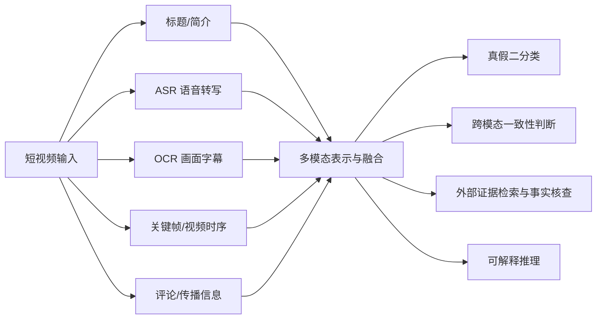

# 短视频虚假信息检测论文索引

> 2026-09-12 建立索引。当前收录 20 篇候选论文，以“短视频内容所表达的新闻或主张是否真实”为主线。
> 本阶段目标是先建立研究地图，再筛选可精读、可复现的工作；**尚未完成全部论文的全文下载、代码仓库和数据集可用性审计**。
> 与 [[../fakenews-imp/00-索引|Fake News 检测论文索引]] 相比，本目录进一步限定到短视频场景，并补充视频事实核查、VLM/LLM 推理与外部证据方向。

## 一、调研边界

本轮重点研究：

> 面向短视频平台，利用视频画面、标题、语音、字幕、评论、传播信息或外部证据，判断视频表达的新闻或主张是否虚假。

需要区分以下任务：

| 任务          | 判断对象                    | 是否纳入     |
| ----------- | ----------------------- | -------- |
| 短视频虚假新闻检测   | 整条短视频所表达的信息是否虚假         | ✅ 核心     |
| 短视频谣言检测     | 平台中传播的未经证实信息是否为谣言       | ✅ 核心     |
| 视频事实核查      | 提取视频中的主张，并结合证据判断真假      | ✅ 重要延伸   |
| 图文多模态错误信息检测 | 图像与文本组合是否具有误导性          | ⚠️ 方法补充  |
| DeepFake 检测 | 视频中的人脸、声音或画面是否被生成、替换或篡改 | ❌ 暂不作为主线 |

## 二、论文总览

### A. 短视频虚假信息检测核心论文

|   # | 论文                                                                                                                                                                      | 来源                                  |   年份 | 关注点                  | 优先级 | 状态     |
| --: | ----------------------------------------------------------------------------------------------------------------------------------------------------------------------- | ----------------------------------- | ---: | -------------------- | --- | ------ |
|   1 | [FakeSV: A Multimodal Benchmark with Rich Social Context for Fake News Detection on Short Video Platforms](https://doi.org/10.1609/aaai.v37i12.26689)                   | AAAI                                | 2023 | 中文短视频数据集、任务定义和基线     | P0  | [ ] 待读 |
|   2 | [Unveiling Opinion Evolution via Prompting and Diffusion for Short Video Fake News Detection](https://doi.org/10.18653/v1/2024.findings-acl.642)                        | Findings of ACL                     | 2024 | 隐含观点挖掘、跨模态观点演化       | P0  | [ ] 待读 |
|   3 | [Interpretable Short Video Rumor Detection Based on Modality Tampering](https://doi.org/10.63317/3ktnpy6jqaox)                                                          | LREC-COLING                         | 2024 | 模态篡改建模与可解释检测         | P1  | [ ] 待读 |
|   4 | [MMSFD: Multi-grained and Multi-modal Fusion for Short Video Fake News Detection](https://doi.org/10.1109/DSIT61374.2024.10881540)                                      | DSIT                                | 2024 | 粗细粒度多模态融合            | P2  | [ ] 待读 |
|   5 | [Text-Guided Fine-grained Counterfactual Inference for Short Video Fake News Detection](https://doi.org/10.1609/aaai.v39i1.32112)                                       | AAAI                                | 2025 | 文本引导、反事实推断、模态偏差      | P0  | [ ] 待读 |
|   6 | [Following Clues, Approaching the Truth: Explainable Micro-Video Rumor Detection via Chain-of-Thought Reasoning](https://doi.org/10.1145/3696410.3714559)               | The Web Conference                  | 2025 | 多步线索、思维链推理与解释        | P0  | [ ] 待读 |
|   7 | [FakeSV-VLM: Taming VLM for Detecting Fake Short-Video News via Progressive Mixture-Of-Experts Adapter](https://doi.org/10.18653/v1/2025.findings-emnlp.257)            | Findings of EMNLP                   | 2025 | VLM、渐进式混合专家适配        | P0  | [ ] 待读 |
|   8 | [MAGE-fend: Multimodal Adaptive Fusion with Guidance from LLM Expertise for Fake News Detection on Short Video Platforms](https://doi.org/10.1016/j.knosys.2025.114298) | Knowledge-Based Systems             | 2025 | LLM 专家知识引导多模态融合      | P1  | [ ] 待读 |
|   9 | [Short Video Rumor Detection Based on Causal Graph](https://doi.org/10.1016/j.ins.2025.121941)                                                                          | Information Sciences                | 2025 | 因果图与伪相关抑制            | P1  | [ ] 待读 |
|  10 | [Enhancing Video Rumor Detection through Multimodal Deep Feature Fusion with Time-Sync Comments](https://doi.org/10.1016/j.ipm.2024.103935)                             | Information Processing & Management | 2025 | 视频内容与时间同步评论          | P1  | [ ] 待读 |
|  11 | [Topic Videolization: A Rumor Detection Method Inspired by Video Forgery Detection Technology](https://doi.org/10.1109/TKDE.2025.3543852)                               | IEEE TKDE                           | 2025 | 主题视频化与伪造检测思路迁移       | P1  | [ ] 待读 |
|  12 | [Multi-modal Similarity Guided Adaptive Fusion Network for Short Video Fake News Detection](https://doi.org/10.1145/3731715.3733400)                                    | ICMR                                | 2025 | 模态相似性引导自适应融合         | P1  | [ ] 待读 |
|  13 | [Cross-modal Consistency Reasoning with Large Language Models for Short Video-based Fake News Detection](https://doi.org/10.1145/3746275.3762212)                       | ACM Workshop                        | 2025 | LLM 跨模态一致性推理         | P1  | [ ] 待读 |
|  14 | [MultiTec: A Data-Driven Multimodal Short Video Detection Framework for Healthcare Misinformation on TikTok](https://doi.org/10.1109/TBDATA.2025.3533919)               | IEEE Transactions on Big Data       | 2025 | TikTok、健康错误信息、真实平台场景 | P1  | [ ] 待读 |

### B. 早期视频虚假信息检测

| # | 论文 | 来源 | 年份 | 关注点 | 优先级 | 状态 |
|---:|---|---|---:|---|---|---|
| 15 | [Using Adversarial Learning and Biterm Topic Model for an Effective Fake News Video Detection System on Heterogeneous Topics and Short Texts](https://doi.org/10.1109/ACCESS.2021.3122978) | IEEE Access | 2021 | 早期视频假新闻建模、异构主题与短文本 | P2 | [ ] 待读 |
| 16 | [Effective Fake News Video Detection Using Domain Knowledge and Multimodal Data Fusion on YouTube](https://doi.org/10.1016/j.patrec.2022.01.007) | Pattern Recognition Letters | 2022 | YouTube、领域知识和多模态融合 | P1 | [ ] 待读 |

### C. 视频事实核查与 LLM 方法补充

| # | 论文 | 来源 | 年份 | 与当前方向的关系 | 优先级 | 状态 |
|---:|---|---|---:|---|---|---|
| 17 | [Pioneering Explainable Video Fact-Checking with a New Dataset and Multi-role Multimodal Model Approach](https://doi.org/10.1609/aaai.v39i27.35048) | AAAI | 2025 | 视频主张核查、解释生成和新数据集 | P0 | [ ] 待读 |
| 18 | [End-to-End Multimodal Fact-Checking and Explanation Generation: A Challenging Dataset and Models](https://doi.org/10.1145/3539618.3591879) | SIGIR | 2023 | 判断与解释联合生成，补充事实核查流程 | P1 | [ ] 待读 |
| 19 | [Sniffer: Multimodal Large Language Model for Explainable Out-of-Context Misinformation Detection](https://doi.org/10.1109/CVPR52733.2024.01240) | CVPR | 2024 | MLLM、跨模态上下文核验与可解释性 | P1 | [ ] 待读 |
| 20 | [Multimodal Misinformation Detection by Learning from Synthetic Data with Multimodal LLMs](https://doi.org/10.18653/v1/2024.findings-emnlp.613) | Findings of EMNLP | 2024 | 合成数据、MLLM 与真实数据分布差异 | P1 | [ ] 待读 |

## 三、当前研究路线地图

从当前候选论文看，可以先分成五条路线：

1. **数据集与基准**：#1 FakeSV、#17 视频事实核查数据集。
2. **多模态特征融合**：#2、#4、#8、#10、#12、#16。
3. **因果、反事实和抗偏差**：#5、#9。
4. **可解释推理与事实核查**：#3、#6、#17、#18、#19。
5. **VLM/LLM 参与检测**：#7、#8、#13、#19、#20。

## 四、建议阅读顺序

### 第一阶段：先认识任务和数据

1. **#1 FakeSV**：精读数据集构建、标签来源、模态组成、数据划分和基线。
2. **#16 YouTube video detection**：了解 FakeSV 前的视频检测问题如何建模。

### 第二阶段：理解短视频多模态方法的发展

3. **#2 Opinion Evolution**：理解传统短视频多模态方法如何组织信息。
4. **#5 TGFC-SVFN**：关注反事实推断和模态偏差。
5. **#10 Time-Sync Comments**：判断评论和发布时间信息能提供什么增益。

### 第三阶段：进入当前关注的 AI 推理路线

6. **#6 Following Clues**：研究如何从多种线索生成可解释判断。
7. **#7 FakeSV-VLM**：研究如何把现成 VLM 适配到短视频检测。
8. **#17 Video Fact-Checking**：从“直接分类”转向“提取主张、查找证据、输出解释”。
9. **#19 Sniffer**：补充外部上下文和可解释的 MLLM 检测。
10. **#13 Cross-modal Consistency Reasoning**：直接对应“先提取视频信息，再交给大模型综合判断”的设想。

> [!tip] 第一轮阅读目标
> 不要立刻读完 20 篇。先完成 #1、#2、#5、#6、#7、#17 的结构化阅读，再决定精读和复现对象。

## 五、每篇论文统一记录内容

每篇论文先记录以下字段，方便横向比较：

| 维度     | 需要回答的问题                             |
| ------ | ----------------------------------- |
| 任务定义   | 判断整条视频、视频中的主张，还是跨模态一致性？             |
| 数据集    | 平台、语言、样本量、标签来源、类别分布和划分方式是什么？        |
| 输入模态   | 标题、ASR、OCR、关键帧、完整视频、音频、评论、传播信息用了哪些？ |
| 信息提取   | 使用了什么文本、图像、音频或视频编码器？                |
| 融合与判断  | 如何融合各模态？最终由分类器、VLM 还是 LLM 判断？       |
| LLM 作用 | 数据增强、知识提供、视频描述、推理、解释还是最终分类？         |
| 实验设计   | Baseline、指标、消融、跨平台和跨时间实验是否充分？       |
| 主要问题   | 数据泄漏、模态偏差、LLM 幻觉、计算成本或泛化问题是什么？      |
| 可复现性   | 代码、数据、权重、预处理、划分和环境是否完整公开？           |

## 七、下一步任务

- [ ] 下载并精读 #1 FakeSV
- [ ] 核对 FakeSV 数据集、代码仓库、授权方式和实际可下载内容
- [ ] 对 #2、#5、#6、#7、#17 完成结构化阅读
- [ ] 补全 20 篇论文的代码与数据可用性
- [ ] 按“数据集—模态—方法—实验—局限”完成横向比较表
- [ ] 从公开资源完整度和研究价值两个维度选出一个复现候选

